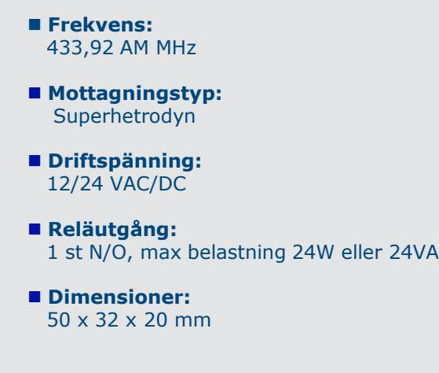
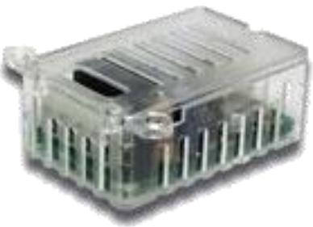
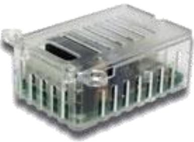

# **RRA85-1NN** Radiomottagare

#### **Märke : ERONE**

## **Radiomottagare med en reläutgång**

**RRA85-1NN är en liten radiomottagare med 85 kodplatser. Passar utmärkt för att styra portar, dörrar eller andra elektriskt styrda funktioner.**

Radiomottagaren RRA85-1NN är en superheterodyn mottagare med integrerad avkodning av typ "rolling code" från Keeloq® med 264 bitars kryptering. En intern algoritm ser till att mottagare och sändare hela tiden är synkroniserade med varandra.

RRA85-1NN kan programmeras antingen trådlöst genom sändaren eller med en knapp på mottagaren. Reläet har pulsfunktion (monostabil) vilket betyder att reläet är draget så länge man håller sändarknappen intryckt.

### **Klassificeringar:**

| CE Godkänd  |
|-------------|
| -20 - +70°C |
| IP2X        |

### **Produktfördelar**

- **85 kodplatser**
- **En reläutgång, N/O**
- **Enkel installation**
- **Reläutgång med pulsfunktion (monostabil)**
- **Max belastning 24W/24VA**
- **Programmering av nya sändare kan ske trådlöst**

**CDVI Sweden AB Box 9011 400 91 Göteborg T: +46 31 760 19 30 F: +46 31 748 09 30 www.cdvi.se, info@cdvi.se**

# **RRA85-1NNV** Radiomottagare

#### **Märke : ERONE**

## **Radiomottagare med en reläutgång**

**RRA85-1NNV är en liten radiomottagare med 85 kodplatser. Passar utmärkt för att styra portar, grindar, belysning, larm eller andra elektriskt styrda funktioner.**

Radiomottagaren RRA85-1NNV är en superheterodyn mottagare med integrerad avkodning av typ "rolling code" från Keeloq® med 264 bitars kryptering. En intern algoritm ser till att mottagare och sändare hela tiden är synkroniserade med varandra.

RRA85-1NNV kan programmeras antingen trådlöst genom sändaren eller med en knapp på mottagaren. Reläet kan ställas in på pulsfunktion (monostabil) vilket betyder att reläet är draget så länge man håller sändarknappen intryckt eller ON/OFF – funktion (bistabil).

- **Frekvens:** 433,92 AM MHz **Mottagningstyp:** Superhetrodyn **Driftspänning:** 230 VAC **Reläutgång:** 1 st N/O, max belastning 500W **Dimensioner:** 50 x 32 x 20 mm

### **Klassificeringar:**

| CE Godkänd  |
|-------------|
| -20 - +70°C |
| IP2X        |

### **Produktfördelar**

- **85 kodplatser**
- **En reläutgång, N/O**
- **Enkel installation**
- **Reläutgång med pulsfunktion (monostabil) eller on/off-funktion (bistabil)**
- **Max belastning 500W**
- **Programmering och radering av nya sändare kan ske trådlöst**

**CDVI Sweden AB Box 9011 400 91 Göteborg T: +46 31 760 19 30 F: +46 31 748 09 30 www.cdvi.se, info@cdvi.se**

