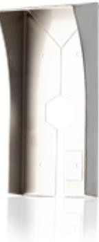

## RS-509 S. REGNSKYDD (ROSTFRITT)

Artikelnummer: 20150228, E-nummer: 5871405

Vårt nya regnskydd är framtaget för att skydda läsare som utsätts för väder och vind. Vi rekommenderar detta komplement till 509-läsare.

- •Rostfritt
- •Förlänger livslängden
- •Skyddar mot väder och vind

Detta regnskydd är till viss del stöttåligt men för mer utsatta läsare rekommenderar vi främst våra vandalsydd som är framtagna för detta ändamål. Denna produkt är avsedd att användas ihop med läsarna MIF-509, PROX/MIF-509.

Utförande:

Rostfritt stål (1mm)

Mått (BxHxD): 100 x 215 x 65