# ReX User manual

Updated November 19, 2021

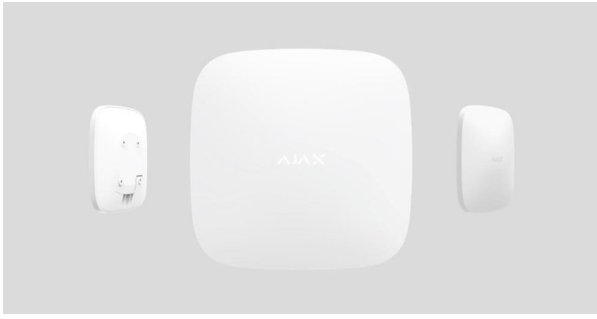

**ReX** is a range extender of communication signals that expands the radio communication range of Ajax devices fitted with a hub up to 2-fold. Developed only for indoor use. It has a built-in tamper resistance and is equipped with a battery that provides up to 35 hours of operation without external power.

The device is configured via the for iOS and Android smartphones. Push-notifications, SMS messages and calls (if enabled) notify ReX user about all events. mobile application

The Ajax security system can be used for independent monitoring of the site and can be connected to the Central Monitoring Station of the security company.

## Functional elements

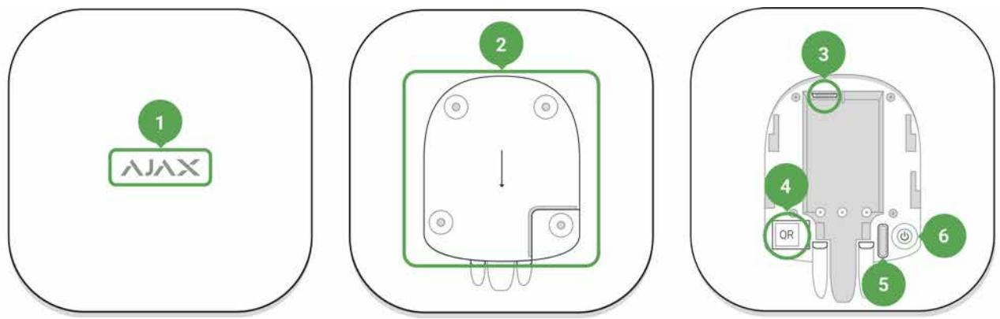

- **1.** Logo with light indicator
- **2.** SmartBracket attachment panel (perforated section is necessary to trigger the tamper during an attempt to lift the fixed ReX from the surface)
- **3.** Power connector
- **4.** QR-code
- **5.** Tamper button
- **6.** Power button

## Principle of operation

ReX expands the radio communication range of the security system allowing installation of Ajax devices at a greater distance away from the hub.

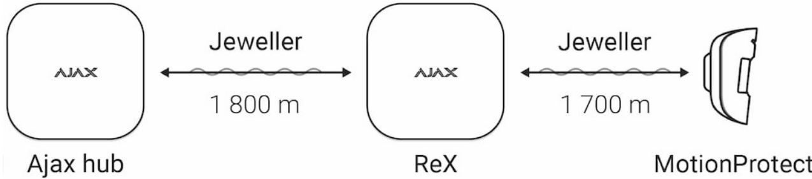

The communication range between ReX and the device is limited by the radio signal range of the device (indicated in the device specifications on the and in the User Manual). website

ReX receives hub signals and transmits them to the devices connected to ReX, and transmits signals from the devices to the hub. The hub polls the extender every 12~300 seconds (by default: 36 seconds) while the alarms are communicated within 0.3 seconds.

## The number of connected ReX

Depending on the hub model, the following number of range extenders can be connected to the hub:

| Hub        | 1 ReX       |
|------------|-------------|
| Hub Plus   | up to 5 ReX |
| Hub 2      | up to 5 ReX |
| Hub 2 Plus | up to 5 ReX |

Connecting multiple ReX to the hub is supported by devices with OS Malevich 2.8 and later. At the same time, ReX can only be connected directly to the hub and connecting one range extender to another is not supported.

#### Connection of ReX to the hub

### **Prior to initiating the connection:**

- **1.** Install the onto your smartphone following the instructions of the hub guide. Ajax application
- **2.** Create user account, add the hub to the application, and create at least one room.
- **3.** Open the **Ajax application**.
- **4.** Turn on the hub and check the Internet connection.
- **5.** Ensure that the hub is disarmed and is not updating by checking its status in the mobile application.
- **6.** Connect ReX to external power.

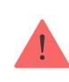

Only users with administrator rights can add a device to the hub.

## Connecting ReX to the hub:

- **1.** Click **Add Device** in the Ajax application.
- **2.** Name the extender, scan or manually enter the **QR-code** (located on the lid and package), and select the room where the device is located.

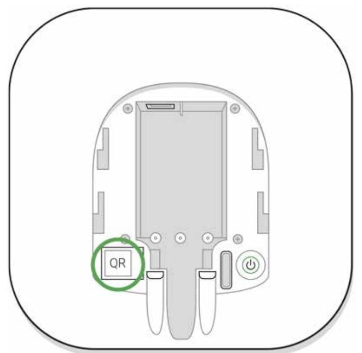

- **3.** Click **Add** the countdown begins.
- **4.** Turn on ReX by pressing the power button for 3 seconds shortly after connecting to the hub the logo will change its color from red to white within 30 seconds after ReX is switched on.

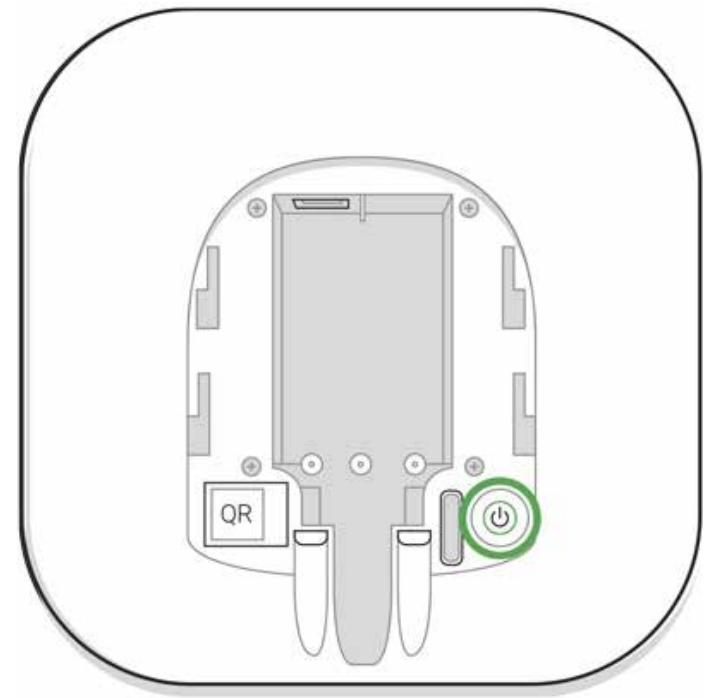

In order for detection and interfacing to occur, ReX must be located within radio communication range of the hub (on the same guarded facility).

The request for connection to the hub is transmitted for a short time at the time of switching on the device. If the connection to the hub fails, turn off the extender by pressing the power button for 3 seconds and retry the connection procedure after 5 seconds.

The extender connected to the hub will appear in the list of hub devices in the application. The updating of device statuses in the list depends on the polling time set in the hub settings; the default value is 36 seconds.

## Choosing devices for operation via ReX

## In order to assign a device to the extender:

**1.** Go to the ReX settings (Devices → ReX → Settings ).

- **2.** Press **Pair with device**.
- **3.** Choose the devices that should operate via the extender.
- **4.** Go back to the ReX settings menu.

Once the connection is established, the selected devices will be marked with the icon in the mobile application.

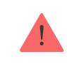

ReX does not support pairing with motion detector with visual alarm verification since the latter uses additional Wings radio protocol. MotionCam

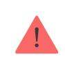

A device can only be paired with one ReX. When a device is assigned to a range extender it is automatically disconnected from another connected range extender.

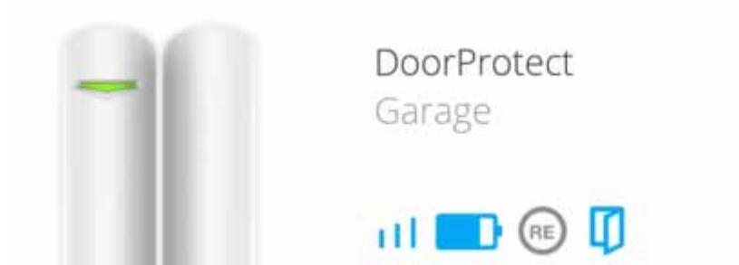

## In order to assign a device to the hub:

- **1.** Go to the ReX settings (Devices → ReX → Settings ).
- **2.** Press **Pair with device**.
- **3.** Uncheck the devices that need to be connected to the hub directly.
- **4.** Go back to the ReX settings menu.

## ReX states

- **2.** ReX

| Parameter                | Value                                                                                                                                                             |
|--------------------------|-------------------------------------------------------------------------------------------------------------------------------------------------------------------|
| Jeweller Signal Strength | Signal strength between the hub and ReX                                                                                                                           |
| Connection               | Connection status between the hub and the extender                                                                                                             |
| Battery Charge           | Battery level of the device. Displayed as a percentage                                                                                                         |
|                          | How battery charge is displayed in                                                                                                                                |
|                          | Ajax apps                                                                                                                                                         |
| Lid                      | Tamper mode that reacts to an attempt to detach or violate the integrity of the extender body                                                               |
| External power           | Availability of external power                                                                                                                                    |
| Temporary Deactivation   | Shows the status of the device: active, completely disabled by the user, or only notifications about triggering of the device tamper button are disabled |
| Firmware                 | ReX firmware version                                                                                                                                              |
| Device ID                | Identifier of the device                                                                                                                                          |

## ReX settings

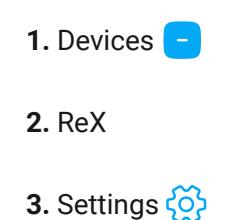

| Item                          | Value                                                         |
|-------------------------------|---------------------------------------------------------------|
| First field                   | Device name, can be edited                                    |
| Room                          | Selection of a virtual room that the device is assigned to |
| LED Brightness                | Adjusts the brightness of the logo light                      |
| Pair with device              | Assignment of devices for the extender                        |
| Jeweller Signal Strength Test | Signal strength test between the extender and the hub      |

| Temporary Deactivation | Allows the user to disconnect the device without removing it from the system.                                                                                         |
|------------------------|--------------------------------------------------------------------------------------------------------------------------------------------------------------------------|
|                        | Two options are available:                                                                                                                                               |
|                        | Entirely — the device will not execute system commands or participate in automation scenarios, and the system will ignore device alarms and other notifications |
|                        | Lid only — the system will ignore only notifications about the triggering of the device tamper button                                                              |
|                        | Learn more about temporary                                                                                                                                               |
|                        | deactivation of devices                                                                                                                                                  |
|                        | Note that the system will ignore only the disabled device. Devices connected via ReX will continue operating normally                                              |
| User Guide             | Opening ReX User Manual                                                                                                                                                  |
| Unpair device          | Disconnecting the extender from the hub and deleting its settings                                                                                                     |

## Indication

The ReX LED indicator may light red or white depending on the state of the device.

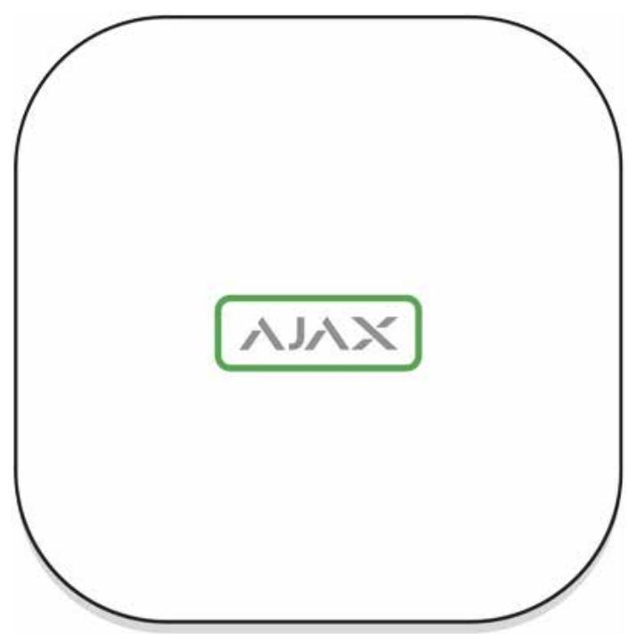

| Event                               | State of logo with LED indicator |
|-------------------------------------|----------------------------------|
| Device is connected to the hub      | Constantly lights white          |
| Device lost connection with the hub | Constantly lights red            |
| No external power                   | Blinks every 10 seconds          |

## Functionality testing

The functionality testing of the associated to ReX devices will be added to the next updates of OS Malevich.

The Ajax security system allows conducting tests for checking the functionality of connected devices.

The tests do not start straight away but within a period of 36 seconds when using the standard settings. The test time start depends on the settings of the detector scanning period (the paragraph on "**Jeweller**" in hub settings).

You can test the Jeweller signal strength between the range extender and the hub, as well as between the range extender and the device connected to it.

To check the Jeweller signal strength between the range extender and the hub, go to the ReX settings and select **Jeweller Signal Strength Test**.

To check the Jeweller signal strength between the range extender and device, go to the settings of the device connected to ReX, and select **Jeweller Signal Strength Test**.

Jeweller Signal Strength Test

#### Device installation

#### Selection of the installation site

The location of ReX determines its distance from the hub, the devices connected to the extender, and the presence of obstacles preventing the passage of the radio signal: walls, interfloor bridgings, and large objects located in the facility.

The device developed only for indoor use.

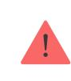

Check the signal strength at the installation site!

If the signal strength reaches just one bar on the indicator, the stable operation of the security system can not be guaranteed. Take whatever action is necessary to improve the quality of the signal! At the very least, move ReX or hub — relocation even by 20 cm can significantly improve the reception quality.

## Installation procedure

Before installing ReX, be sure to choose the best location that meets the requirements of this guide! It is desirable for the extender to be hidden from direct view.

During mounting and operating, follow the general electrical safety rules when using electrical appliances as well as the requirements of electrical safety laws and regulations.

#### Device mounting

- **1.** Fix the SmartBracket attachment panel with the bundled screws. If you choose to use other fasteners, make sure that they do not damage or deform the panel.
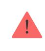

It is not recommended to use double-sided adhesive tape for installation. This can result in ReX falling that can lead to malfunctioning of the device.

- **2.** Slide ReX onto the attachment panel. After installation, check the tamper status in the Ajax application and then the panel tightness.
- **3.** In order to ensure higher reliability, fix ReX to the SmartBracket panel with the bundled screws.

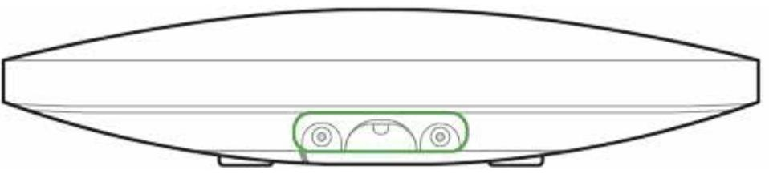

Do not flip the range extender when attaching vertically (for instance, on a wall). When properly fixed, the Ajax logo can be read horizontally.

You will receive a notification if an attempt to detach the extender from the surface or remove it from the attachment panel is detected.

> It is strictly forbidden to disassemble the device connected to the power supply! Do not use the device with a damaged power cable. Do not disassemble or modify ReX or its individual parts — this may interfere with the normal operation of the device or lead to its failure.

#### **Don't place ReX:**

- **1.** Outside the room (outdoors).
- **2.** Near metal objects and mirrors that cause attenuation or screening of radio signals.
- **3.** In rooms characterized by humidity and temperature levels beyond the permissible limits.
- **4.** Close to radio interference sources: less than 1 meter from the router and power cables.

#### Maintenance of the device

Check the functionality of the Ajax security system regularly.

Clean the body from dust, cobwebs, and other contaminants as they emerge. Use soft dry napkin suitable for equipment maintenance.

Do not use substances that contain alcohol, acetone, gasoline or other active solvents to clean the extender.

#### How to replace ReX radio signal range extender battery

### Tech specs

| The maximum number of devices connected to ReX | When using with Hub — 99, Hub 2— 99, Hub Plus — 149, Hub 2 Plus — 199                                                                                      |
|---------------------------------------------------|---------------------------------------------------------------------------------------------------------------------------------------------------------------|
| Max number of connected ReX per hub               | Hub — 1, Hub 2 — 5, Hub Plus — 5, Hub 2 Plus — 5                                                                                                           |
| Power supply                                      | 110~240 V AC, 50 / 60 Hz                                                                                                                                      |
| Backup battery                                    | Li-Ion 2 A⋅h (up to 35 hours of autonomous operation)                                                                                                      |
| Tamper protection                                 | Available                                                                                                                                                     |
| Radio communication protocol with Ajax devices | Jeweller Learn more                                                                                                                                        |
| Radio frequency band                              | 866.0 – 866.5 MHz 868.0 – 868.6 MHz 868.7 – 869.2 MHz 905.0 – 926.5 MHz 915.85 – 926.5 MHz 921.0 – 922.0 MHz Depends on the region of sale. |
| Compatibility                                     | Ajax hubs Operates only with featuring OS Malevich 2.7.1 and later Doesn't support MotionCam                                                      |
| Maximum radio signal power                        | Up to 25 mW                                                                                                                                                   |
| Radio signal modulation                           | GFSK                                                                                                                                                          |
| Radio signal range                                | Up to 1,800 m (any obstacles absence)                                                                                                                         |
|                                                   | Learn more                                                                                                                                                    |

| Installation method         | Indoors             |
|-----------------------------|---------------------|
| Operating temperature range | From -10°С to +40°С |
| Operating humidity          | Up to 75%           |
| Overall dimensions          | 163 × 163 × 36 mm   |
| Weight                      | 330 g               |
| Service life                | 10 years            |

#### Compliance with standards

## Complete set

- **1.** ReX
- **2.** SmartBracket mounting panel
- **3.** Power cable
- **4.** Installation kit
- **5.** Quick Start Guide

## Warranty

Warranty for the "AJAX SYSTEMS MANUFACTURING" LIMITED LIABILITY COMPANY products is valid for 2 years after the purchase and does not apply to the pre-installed accumulator.

If the device does not work correctly, contact the support service first technical issues can be resolved remotely in half of the cases!

The full text of the warranty

User Agreement

Technical support: support@ajax.systems