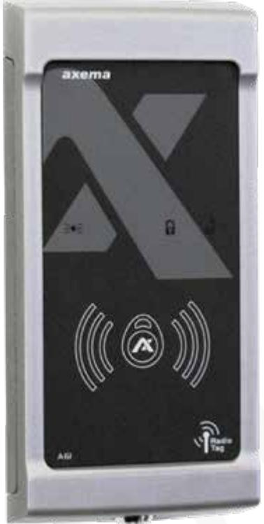
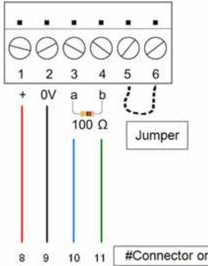
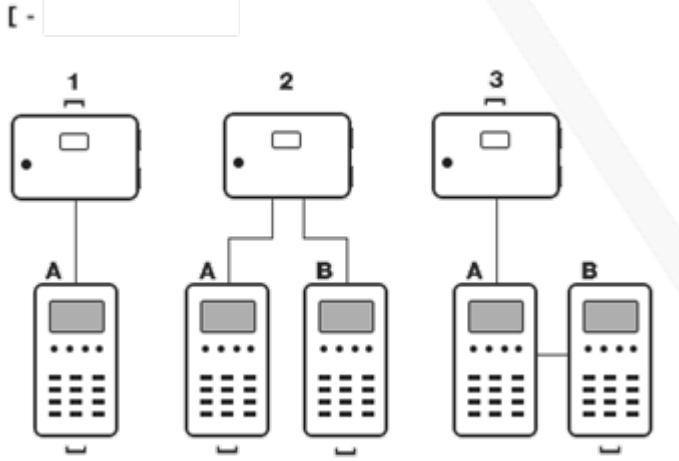
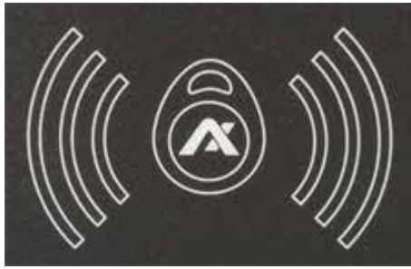
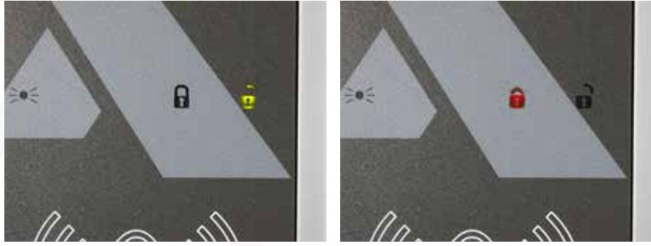

Manual

Updated 11/20/2020

# **Reader VAKA A61**

A61 is an EM- and MIFARE proximity reader for Axema VAKA

# Reader VAKA A61

| Screw connectors           | 3 |
|----------------------------|---|
| Termination and addressing | 4 |
| Cable                      | 5 |
| Reading                    | 6 |
| Radio                      | 6 |
| Technical data             | 7 |

# Screw connectors

| Connector Function |                                                                       | B17/B27B28 | B18 |
|--------------------|-----------------------------------------------------------------------|------------|-----|
| 1-2                | Power supply (connector 1 is positive (+))                            | 8-9        | 1-2 |
| 3-4                | Communication, termination (100Ω)                                     | 10-11      | 3-4 |
| 5-6                | If the reader is used for exit, the connectors are short cir cuit. |            |     |

# Termination and addressing

| Unit                                | A61 & A63                                      | B17, B27 and B28              | B18                                            |
|-------------------------------------|------------------------------------------------|----------------------------------|------------------------------------------------|
| Termination                         | Install the 100 Ω resistor between 3 and 4. | Mount the ter mination jumper | Install the 100 Ω resistor between 3 and 4. |
| Address a B unit (inside reader) | Install a jumper between 5 and 6.           |                                  |                                                |

The unit is named in the VAKA software.

## Cable

| Cable type  |      | Maximum cable length at 24V |  |
|-------------|------|-----------------------------|--|
| 1 x 4 x 0,5 | 150m |                             |  |
| Cat 5/6     | 200m |                             |  |
|             |      |                             |  |
|             |      |                             |  |
|             |      |                             |  |
|             |      |                             |  |

How a UTP Cat 5 should be connected for maximum length.

Maximum cable length between B16/B26 and the reader is 10m. No termination resistor should be used.

### Reading

Present the credential against the symbol on the lower half of the reader

A successful reading is indicated by a green or red padlock depending on if the credential do have access or not.

If a reading not is indicated, the credential lacks compatibility, or that the MIFARE or EM reading has been disabled. This is set in the in the VAKA software under Settings, Card/Code, Cards.

#### **Radio**

For best coverage, the reader should be mounted with the front facing the reading area. As the reading is affected by the installation environment, the reading distance can vary between 5 and 50 meters. i.e. wall materials, vehicle bodies and electrical equipment. Before the permanent fixation, it's recommended to test the coverage using a RN-18 radio key. Significant improvements can be achieved by moving and/or turning the reader.

Only RN18 radio keys can be used for "radio reading".

# Technical data

| Attribute                                | A61                                                |  |  |
|------------------------------------------|----------------------------------------------------|--|--|
| Reading distans in optimal conditions | 7 cm with EM, 3 cm with MIFARE and 50 m with radio |  |  |
| Power supply                             | From door controller                               |  |  |
| IP-rating                                | IP55                                               |  |  |
| IP rating                                | IK08                                               |  |  |
| Temperature range                        | -30° to +55C°                                      |  |  |