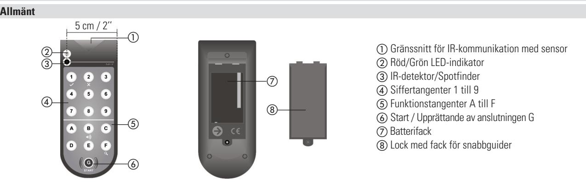
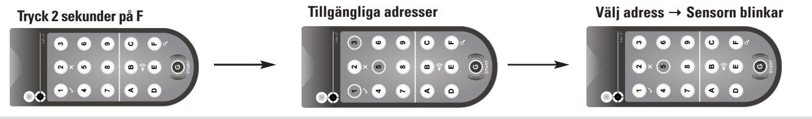
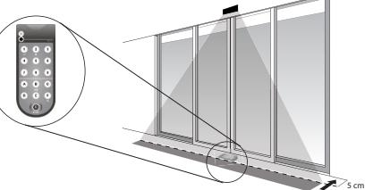

# **RegloBeam 2**

Tvåriktnings-fjärrkontroll/IR-indikator för inställning av sensorer

**Översättning av originalbruksanvisning**

09/18

Spara för senare användning!

# **1 Säkerhetsanvisningar**

**Se upp:** Infraröd strålning får inte riktas mot ögonen! Följ de nationella och internationella föreskrifterna om dörrsäkerhet. Monteringen och idrifttagningen av sensorer får endast utföras av utbildad fackpersonal. Ingrepp och reparationer på enheten får endast utföras genom av tillverkare. Ta alltid helheten och inte bara en enskild anläggningsdel i betraktande när du tittar på säkerhetsfunktionen hos din applikation. Riskbedömningen och sensorernas och dörranläggningarnas korrekta installation faller under installatörens ansvar.

#### **Idrifttagning 2**

**4**

**5**

**6**

| Idrifttagning   |                      |                      | 3 | Driftslägen |                        |                          |  |
|-----------------|----------------------|----------------------|---|-------------|------------------------|--------------------------|--|
| Funktion        | Koppla till          | Koppla från*         |   | Från        |                        | Till                     |  |
| Fjärrkontroll   | Tryck på i 2 sek. | Tryck på i 2 sek. |   | –           | lyser grönt eller rött | blinkar grönt eller rött |  |
| Akustisk signal | Tryck på i 2 sek. | Tryck på i 2 sek. |   | –           | Batteri fulladdat      | Batteri urladdat         |  |
|                 |                      |                      |   |             |                        |                          |  |

* Efter två minuter stängs enheten automatiskt av om ingen knapp aktiveras.

#### **Upprättande av anslutningen**

Fjärrkontrollen för sensorn fungerar i två riktningar. Fördel: Sensorn bekräftar ändringar på sina inställningar direkt tillbaka till fjärrkontrollen som visar inställt värde med fast sken på knappsatsen. Sensorn har i regel några förkonfigurerade snabbval för vanliga användningar som nås enkelt med fjärrkontrollen.

**OBS:** Anslutningen mellan fjärrkontrollen RegloBeam 2 och sensorn kan endast upprättas när sensorn är i konfigurationsläge. När sensorn har kopplats in är konfigurationsläget aktiverat. Av säkerhetsskäl lämnas konfigurationsläget automatiskt 30 minuter efter den senaste inställningen och anslutningen mellan fjärrkontrollen och sensorn avbryts. Anslutningen

kan återupprättas genom att man trycker kort på en manöverknapp på sensorn eller genom att man kort bryter sensorns strömförsörjning. Vid några sensormodeller kan anslutningen även återupprättas med fjärrkontrollen med hjälp av funktionen "Åtkomstkod". Vänligen följ driftmanualen till den använda sensorn när det gäller inställningar och korrekt manövrering.

# **Sensor-sökläge**

# **IR-indikator - Spotfinder**

| Läge                   | LED - indikering | Akustisk signalfunktion (om inkopplad, se «2. Idrifttagning») |
|------------------------|---------------------|------------------------------------------------------------------|
| Inget IR-fält upptäckt | grön                | ingen akustisk signal                                            |
| IR-fält upptäckt       | röd                 | konstant akustisk signal                                         |

## **Tekniska data**

**Driftstemperatur** -20°C till 40°C **Max. luftfuktighet** 90 %, ej kondensbildande

**Batterier** 3 batterier, typ Micro/AAA 1,5 V **Teknologi** Aktiv infraröd, 40 kHz

# **7 EU-försäkran om överensstämmelse**

Se bilaga

# **8 WEEE**

Apparater med denna symbol måste hanteras separat vid återvinningen. Detta ska göras i enlighet med respektive nationella lagar om miljövänlig avfallssortering, bearbetning och återvinning av elektriska och elektroniska apparater.

## **9 Kontakt**

**BBC Bircher Smart Access,** BBC Bircher AG, Wiesengasse 20, CH-8222 Beringen, www.bircher.com Designed in Switzerland / Made in China