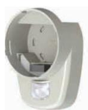
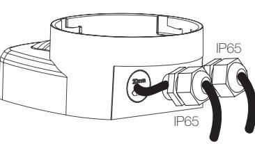
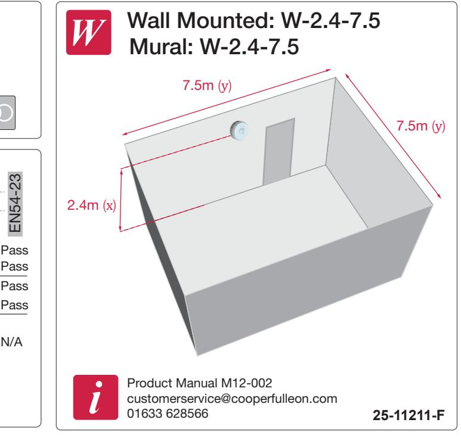
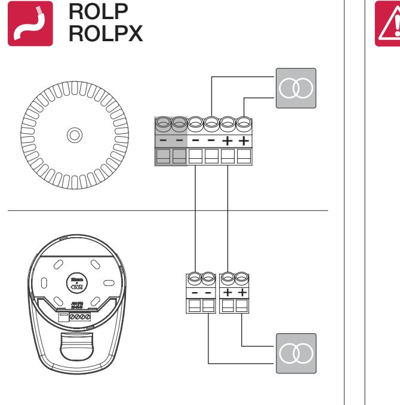
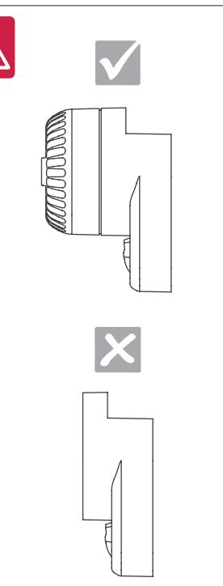
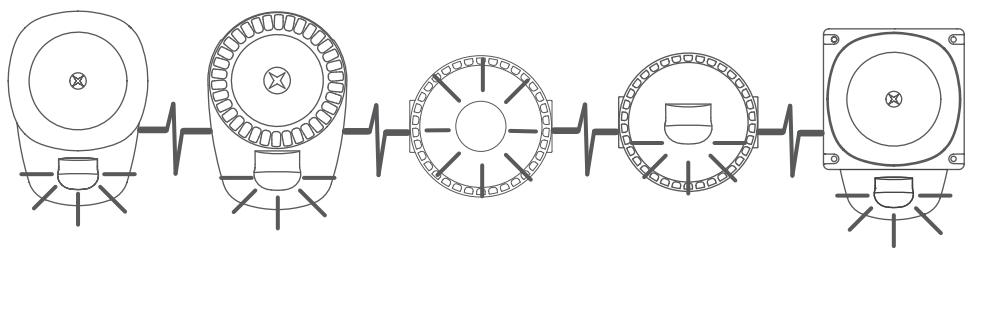

## RoLP LX Wall Base

EN54-23 Fire Alarm Devices Visual Alarm Device for use in & around buildings

Dispositifs incendie EN54-23 Dispositifs Visuels Alarme Feu pour utilisation à l'intérieur et autour des bâtiments

EN54-23 Feuermeldevorrichtung Optischer Signalgeber zur Innenund Aussenmontage

DOP No.: 0333-CPD-075444

| V                         | 9-60VDC                                                          |                           |                      |                                   |                     |  |
|---------------------------|------------------------------------------------------------------|---------------------------|----------------------|-----------------------------------|---------------------|--|
| W                         | 1.5W (max)                                                       |                           |                      |                                   |                     |  |
| 3m                        | 2.4m (max)                                                       |                           |                      |                                   |                     |  |
|                           |                                                                  | 1 Hz                      | High Power 0.5Hz  | Low Power 1 Hz 0.5Hz        |                     |  |
|                           |                                                                  | W-2.4-7.5 7.5m (135m³) |                      | W-2.2-2.3 White 2.5m (15m³) |                     |  |
|                           |                                                                  |                           |                      | W-2.1-2.2 Red 2.5m (15m³)   |                     |  |
| I                         | Weisser Blitz 12V White Flash Flash Blanc 24V 48V | 51mA 25mA 18mA      | 27mA 16mA 11mA | 35mA 16mA 11mA              | 19mA 10mA 9mA |  |
| I                         | 12V Flash Rouge Red Flash roter Blitz 24V 48V     | 51mA 25mA 18mA      | 27mA 16mA 11mA | 35mA 16mA 11mA              | 19mA 10mA 9mA |  |
|                           | < 120% for 10mS                                                  |                           |                      |                                   |                     |  |
|                           | 100mS ON / 900mS OFF 50mS ON / 950mS OFF                      |                           |                      |                                   |                     |  |
|                           | 0.5mm² - 2.5mm²                                                  |                           |                      |                                   |                     |  |
| ˚C                        | -25°C ~ 70°C                                                     |                           |                      |                                   |                     |  |
| H Be Li Na Mg | FR ABS & Polycarbonate                                           |                           |                      |                                   |                     |  |
|                           | Type A & B IP65                                               |                           |                      |                                   |                     |  |

95mm

2 x Ø20mm

95mm

60mm

50mm

50mm

135mm

0333

(13)

2 31

• Drilling diameter must be adjusted to the diameter of the cable glands. • Le diamètre de perçage doit être adapté au diamètre des presses-étoupes. • Bohrdurchmesser muss dem Kabeldurchmesser angepasst sein.

• Cable Glands must be compatible with declared cable size. • Les presses-étoupes doivent être adaptés à la section des câbles déclarée. • Kabeldurchfuehrungen muessen mit den angegebenen Kabelabmessungen kompatibel sein.

• Please use gasket on both sides. • Un joint torique dolt être utllsé de chaque côté.

IP65

ON

- -

0 1

0.5Hz 1Hz

P

**R G B**

White

Low Power High Power

0 1 +

+

1 2 3

0 1

- An jeder Selte muss eln dichtungsring angebracht werden.

| Essential Characteristics / Caractéristiques                                                                 |                         |  |  |  |  |
|--------------------------------------------------------------------------------------------------------------|-------------------------|--|--|--|--|
| Operational Reliability / Fiabilité de Fonctionnement                                                        |                         |  |  |  |  |
| Duration of operation / Durée de fonctionnement                                                              | PASS/CONFORME           |  |  |  |  |
| Provision for external conductors / Disposition pour conducteurs extérieurs                                  | PASS/CONFORME           |  |  |  |  |
| Flammability of materials / Inflammabilitité des materiaux                                                   | PASS/CONFORME           |  |  |  |  |
| Enclosure protection / Indice de protection                                                                  | PASS/CONFORME           |  |  |  |  |
| Access / Accès                                                                                               | PASS/CONFORME           |  |  |  |  |
| Manufacturer's adjustments / Réglages du fabricant                                                           | PASS/CONFORME           |  |  |  |  |
| On-site adjustment of behaviour / Réglages du site                                                           | PASS/CONFORME           |  |  |  |  |
| Requirements for software controlled devices / Exigences relatives aux dispositifs contrôlés par logiciel | PASS/CONFORME           |  |  |  |  |
| Performance parameters under fire condition / Paramètres de performance en cas d'incendie                    |                         |  |  |  |  |
| Coverage Volume / Volume de couverture                                                                       | PASS/CONFORME           |  |  |  |  |
| Variation of light output / Variance de la puissance lumineuse                                               | PASS/CONFORME           |  |  |  |  |
| Minimum/maximum light intensity / Intensité lumineuse minimale/maximale                                      | PASS/CONFORME           |  |  |  |  |
| Light colour / Couleur de la lumière                                                                         | WHITE/RED / BLANC/ROUGE |  |  |  |  |
| Light pattern & frequency of flashing / Effets temporels lumineux et fréquence de clignotement du flash   | 0.5/1Hz                 |  |  |  |  |
| Marking & Data / Marquage et données techniques                                                              | PASS/CONFORME           |  |  |  |  |
| Synchronisation                                                                                              | PASS/CONFORME           |  |  |  |  |
| Temperature Resistance / Résistance à la temperature                                                         |                         |  |  |  |  |
| Dry heat (operational) / Chaleur sèche (fonctionnel)                                                         | PASS/CONFORME           |  |  |  |  |
| Dry heat (endurance) / Chaleur sèche (endurance)                                                             | PASS/CONFORME           |  |  |  |  |
| Cold (operational) / Froid (fonctionnel)                                                                     | PASS/CONFORME           |  |  |  |  |
| Humidity Resistance / Résistance à l'humidité                                                                |                         |  |  |  |  |
| Damp heat, cyclic (operational) / Chaleur humide, cyclique (fonctionnel)                                     | PASS/CONFORME           |  |  |  |  |
| Damp heat, steady state (endurance) / Chaleur humide, continue (endurance)                                   | PASS/CONFORME           |  |  |  |  |
| Damp heat, cyclic (endurance) / Chaleur humide, cyclique (endurance)                                         | PASS/CONFORME           |  |  |  |  |
| Shock & Vibration & Resistance / Choc & Vibration & Resistance                                               |                         |  |  |  |  |
| Shock (operational) / Choc mécanique (fonctionnel)                                                           | PASS/CONFORME           |  |  |  |  |
| Impact (operational) / Impact (fonctionnel)                                                                  | PASS/CONFORME           |  |  |  |  |
| Vibration (operational) / Vibration (fonctionnel)                                                            | PASS/CONFORME           |  |  |  |  |
| Vibration (endurance)                                                                                        | PASS/CONFORME           |  |  |  |  |
| Corrosion Resistance / Résistance à la corrosion                                                             |                         |  |  |  |  |
| SO2 corrosion (endurance) / Corrosion par le SO2                                                             | PASS/CONFORME           |  |  |  |  |
| Electrical Stability / Stabilité électrique                                                                  |                         |  |  |  |  |
| EMC immunity (operational) / CEM Immunité (fonctionnel)                                                   | PASS/CONFORME           |  |  |  |  |

Synchronisation Synchronisierung

**25-11211-F**

Cooper Fulleon, Llantarnam Park Cwmbran, NP44 3AW www.cooperfulleon.com