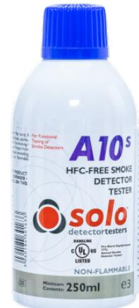

# SC010

Produktblad

Aerosol testspray för rökdetektorer, HFC-fri, icke brandfarlig

## Allmänt

SC010 är en HFC fri, icke brandfarlig och ren syntetisk aerosol som levererar partiklar som replikerar de som finns i verklig rök. Denna aerosol-testspray har utvecklats speciellt för att ge maximal testningseffektivitet med minst störning på rökdetektorn och miljön. SC010-testsprayen som levereras i en 250 ml flaska har optimal prestanda när den används tillsammans med testutrustningen TR010 för rökdetektorer.

#### Standardprestanda

- EMinimal påverkan på hälsa, säkerhet och miljö - HFC-fri
- EIcke brandfarlig
- ESnabb svarstid och snabb utvädring ur rökkammaren
- ELämnar inga rester
- EOljefri

- EGer inga skador på detektorns plast eller komponenter
- EDesignad för att användas tillsammans med
	- rökdetektortestaren TR010
- EUL-listad

## SC010

Aerosol testspray för rökdetektorer, HFC-fri, icke brandfarlig

## Tekniska data

| Fysiskt              |                    |
|----------------------|--------------------|
| Fysisk dimension     | 250 ml behållare   |
| Nettovikt            | 352 g              |
| Miljö                |                    |
| Förvaringstemperatur | Upp till 50 °C max |
|                      |                    |

Övrigt Order data

Artikelnummer Beskrivning

SC010

Aerosol testspray för rökdetektorer, HFC-fri, icke brandfarlig

