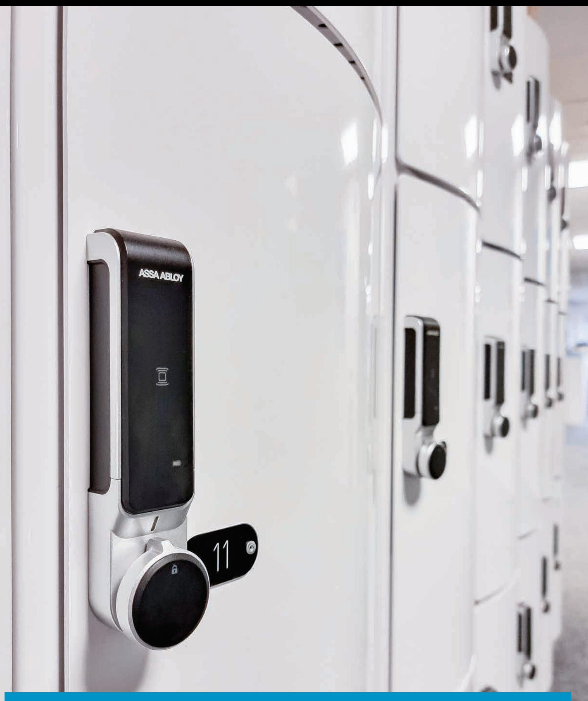

# SENSE+

Programming Example Guide

### Table of content

| 2  |  |
|----|--|
| 7  |  |
| 12 |  |

## LOCKS IN HEALTHCARE SECTOR (PRIVATE MODE)

### MANY USERS TO ONE OR SEVERAL LOCKERS

In the healthcare sector, medicine lockers are common. The medicine lockers should be set into private mode so that only pre-registered cards can open the locker and so that it automatically locks when turning the handle to closed position.

ln many cases it would be convenient to use the employee cards as the registered user cards. In many cases there will also be several lockers that should have the same users registered.

In this example for medicine cabinets in a hospital, SENSE+ is a far better product that standard SENSE locks based on 2 factors:

- 1. Possibility to get event log for each locker.
- 2. Possibility to individually unregister lost cards.

In a hypothetical case, one registered user card is lost. If standard SENSE locks are used, the only way to unregister a lost user card is to unregister all user cards, and then re-register the other user cards back again. If this happens in a hospital, it is a cumbersome work to collect all nurses' cards in order to do perform this programming. Especially since it is common that nurses work in different shifts.

#### EXAMPLE OF OTHER APPLICATIONS.

The many users to several lockers case could also be lockers for tools in an industry or utilities in a school where all workers/teachers should have access.

# EXAMPLE 1 - SETUP OF MEDICINE CABINETS

- Each lock should have 3 master cards and the same 15 users cards. ●
- It's advised to read through the whole example before using together ● with the software.

#### STEP 1. Login.

- 1. Enter the admin ID and PW ( By default both are set to admin)
- 2. Click on the Login-button to log in
- Click on the System Management 3. Button to move into the main window.

#### STEP 2. Create a system.

- 1. Go to the System Menu and select New System
- In the New Systems Window, enter a 2. system name.
- Create one lock ( or lock setting) as all 3. locks should be identical.
- 4. Type in 3 for the numbers of Master Cards.
- Type in 15 for the number of User Cards. 5.
- 6. Click the Create-button to generate the system.

Note: More cards can be added later if needed.

| Deleta Row |
|---------------|
|               |
|               |
|               |
|               |
|               |
|               |
|               |
|               |
|               |
|               |
|               |
|               |
|               |
|               |
|               |
|               |

#### STEP 3. Modify the Lock Settings.

The system has now generated one lock setting for locks to be setup into private mode.

- 1. Give the lock setting a name.
- 2. Select Sound On/Off.
- Once the settings are done, click Save 3. Modified.

NOTE: LED Signal and Auto Unlock Time only applies to locks in public mode

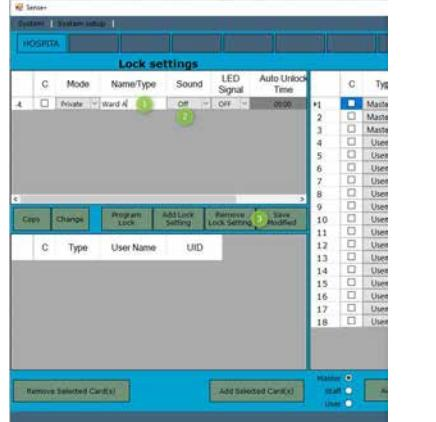

#### STEP 4. Name the cards.

- 1. Type in the name that each card should be connected to. This is useful when working with the event log.
- 2. If more cards are needed, they can be added by the Add Card button. Select the type of card that you want to add and click the button. For this example, all cards needed was created upon setting up the system.
- 3. Once the settings are done, click Save Modified.

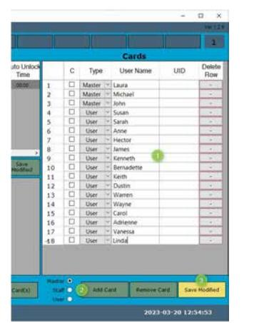

#### STEP 5. Connect a lock.

Connect the lock to the computer by the connecting cable.

- Go to the System Setup menu and 1. select Connect to Lock
- 2. In the lock Connection Window, select the COM-port used. If you don't know which port is used this can be identified in the device manager but it is also to possible to use trial and error.
- 3. Enter Master Key. In the case that the lock is in factory mode (as it is delivered) this field is left empty.
- 4. Click Connect
- 5. A message at the bottom left will show that the lock was successfully connected. The internal clock of the lock is automatically set to the current time.

#### STEP 6. Read the UID-numbers of the cards.

Once connected, the lock will operate as a card reader. The card UID-numbers can now be read and assigned to the cards in the system.

NOTE: If cards are unmarked or do not have personal details, it is important to keep track of which card that is connected to each name.

- 1. Click on the first line and present a card to the lock. The UID-number of the card will now be registered. The system now automatically moves to the next line.
- 2. Present the remaining cards.
- 3. Once done, click Save Modified.

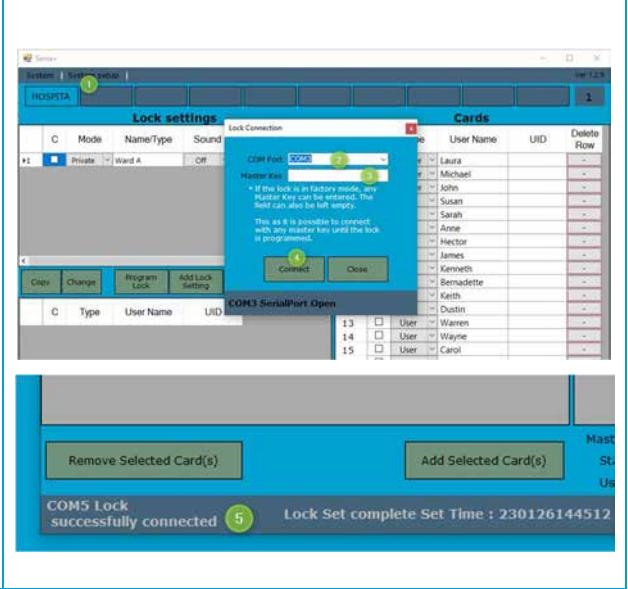

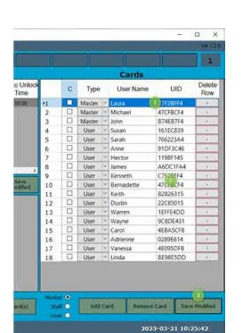

#### STEP 7. Assign cards to the lock setting.

- 1. Select the cards to be added, in this example all cards. (To select all the C can also be pushed).
- 2. Select the lock setting to which the card should be added.
- 3. Click Add Selected Card(s)
- 4. Once added, the cards will show up in the lower left window.

Note: If more than one lock setting is used, it is possible to check which cards that is added into each setting by clicking that line in the lock settings window.

| 12 Sense |                      |                |                     |                          |                     |          |         |           |                  |           | ロ ×        |
|----------|----------------------|----------------|---------------------|--------------------------|---------------------|----------|---------|-----------|------------------|-----------|---------------|
|          | Bether System and at |                |                     |                          |                     |          |         |           |                  |           | other 12.     |
| HOSPILA  |                      |                |                     |                          |                     |          |         |           |                  |           | 2             |
|          |                      | Lock settings  |                     |                          |                     |          |         |           | Cards            |           |               |
| C        | Mode                 | Name/Type      | Sound               | LED Signal            | Auto Uniock Timo |          | C       | Type      | User Name        | UID       | Deloto Row |
| 0 =1  | Private W            | Ward A         | CH                  | (4) OFF TH               | CALLERY             | =        | 2       | Master In | Laura            | CTF2BFF4  | 411           |
|          |                      |                |                     |                          |                     | 2        | 1       | Master -  | Michael          | 47CFBCF4  | 95            |
|          |                      |                |                     |                          |                     | 3        | D       | Masher    | lows             | B74E87F4  | +             |
|          |                      |                |                     |                          |                     | 4        | ನ್ನ     | Uper 2    | Susan            | 161EC839  | 4             |
|          |                      |                |                     |                          |                     | 5        | ದ       | User      | Satals 1      | 76622344  | 97            |
|          |                      |                |                     |                          |                     | 6        | 22      | USE       | Arre 0        | 91DF3C46  | 41            |
|          |                      |                |                     |                          |                     | 7        | ದ       | ULET      | State Siste 0 | 11988145  | 12            |
|          |                      |                |                     |                          |                     | B        | ನಿ      | User      | lames            | ABDC 1EAA | 6             |
|          |                      |                |                     |                          |                     | 9        | 2       | UGME      | Kenneth 1     | 67668761  |               |
| Copy     | Childrigo            | PEGENT CACC | 405 1509 Setting | Editogram Lock Seming | SAVE Mochood     | 10       | ದಿ      | પ્રમ્ય    | Bechadette       | 5665CC34  | 4             |
|          |                      |                |                     |                          |                     | 11       | 2       | ાધ્ય      | Keith            | 82826315  | 1.5           |
| C        | Type                 | User Name      | UID                 |                          |                     | 12       | ಹಿ      | Uper      | Distin 1      | 22CB5015  | N             |
|          |                      |                |                     |                          |                     | 13       | 0       | Cher      | Watten           | IEFFE4DD  |               |
| = 0   | Macter     Laura     |                | CTF20FF4            |                          |                     | 14       | 0       | ાં જિલ્લ  | Wayne 100     | 96806431  | 11            |
| 2        | 144.941 14        | Mordel         | 47C16C34            |                          |                     | 15       | ਨ       | Uner      | Carol            | 4EBASCHB  |               |
| D >   | Santar 14         | lon            | 07419754            |                          |                     | 16       | රි      | User      | Adrienta 10   | 0289E614  |               |
| 0 4   | Uter 19           | Sucine         | 1618C839            |                          |                     | 17       | ನಿಗ     | User      | Vanessa 1     | 4E095OF8  | 4-1           |
| D 5   | User 2            | Taxable        | 766323A4            |                          |                     | 18       | Si      | UKA       | Linda            | RESESDO   | 16            |
| 6        | Utar V            | Arria          | 010FICAL            |                          |                     |          |         |           |                  |           |               |
|          | User                 | Cities Ma      | 1130/149            |                          |                     |          |         |           |                  |           |               |
|          | UHFF                 | NIJames        | ABCC SFAA           |                          |                     |          |         |           |                  |           |               |
|          |                      |                | *******             |                          |                     | Master O |         |           |                  |           |               |
|          |                      |                |                     |                          |                     |          | SURE OF | add Card  | BARRAN Card      |           | Sain Morbiad  |

#### STEP 8. Program Lock.

- Select the lock setting that is 1. to be programmed to the lock (in this example we only have one setting) 2. Go to the system Setup Menu and select Program Lock and press OK. If successfully programmed, a 3. confirmation window is shown. To use the lock, go to System 4. Setup and click Disconnect and then remove the cable. The lock will now reboot into working mode.
It is now possible to program remaining locks by 1 of 2 methods:

- 1. Connecting each lock (Step 5) and program (Step 8).
- 2. Use the Copying Card. This is recommended for larger installations as the installer only needs to go around the facility with the copy card instead of the computer. See instruction for Copying Card, example 2A and perform step B and C.

# LOCKS IN A SCHOOL / OFFICE (PRIVATE MODE)

### ONE USER TO ONE LOCKER

In the education sector, student lockers are common. For each student locker, normally only one student should have access.

### EXAMPLE OF OTHER APPLICATIONS.

This setup is also common in offices and workspaces for the employees' personal lockers.

# EXAMPLE 2 – SETUP OF 10 STUDENT LOCKERS

- Each lock should have 2 master cards and 1 unique user card. ●
- It's advised to read through the whole example before using together ● with the software.

#### STEP 1. Login.

- 1. Enter the admin ID and PW ( By default both are set to admin).
- 2. Click on the Login-button to log in.
- 3. Click the System Management Button to move into the main window.

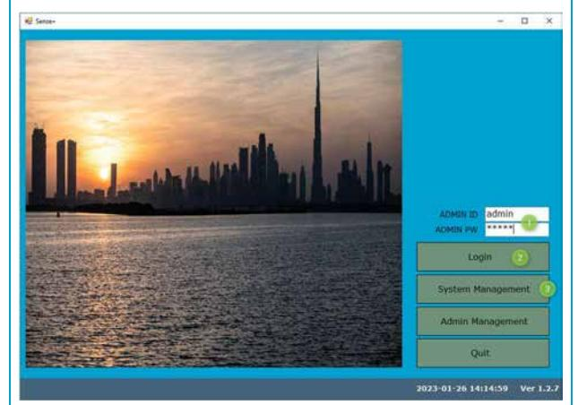

#### STEP 2. Create a system.

- Go to the System Menu and select New 1. System.
- In the New Systems Window, enter a 2. system name.
- We will create 10 lock settings as there 3. will be a different user cards for each lock.
- Type in 2 for the numbers of Master 4. Cards.
- 5. Type in 10 for the numbers of User Cards.
- ર. Click the Create-button to generate the system.

Note: More cards can be added later if needed.

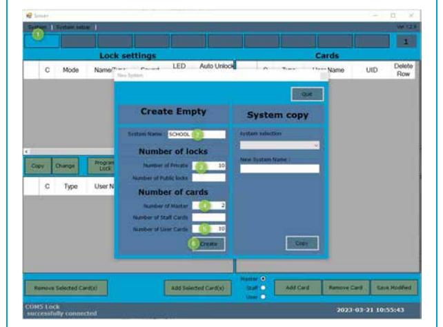

#### STEP 3. Modify the Lock Settings.

The system has now generated 10 lock settings for locks to be setup into private mode.

- 1. Give each lock setting a name.
- 2. Select Sound On/Off.
- Once the settings are done, click Save 3. Modified.

NOTE: LED Signal and Auto Unlock Time only applies to locks in public mode

| Lock settings LED C Mode Name/Type Sound 2        |                     |
|------------------------------------------------------------------|---------------------|
|                                                                  |                     |
| Signal                                                           | Auto Unic ^ Time |
| 13 Private 4 Daniels Locker OH OFF > > > | 00:00               |
| ಿದ < > OH 5 Private Ericas Locker > OFF  | 00:00               |
| Private e Freds Locker ીમાં OFF V > >       | 00:00               |
| > 7 : Off OFF Private > Georges Locker > | 00:00               |
| 8 Private Hannahs Locker Off OFF V >           | 00:00               |
| > ির 9 Private Ivonas Lockes OH OFF > >  | 00:00               |
| Private Off ▶10 James Locker OFF V >           | 00:00               |
|                                                                  | >                   |

#### STEP 4. Name the cards.

- 1. Type in the Names that each card should be connected to. This is useful when working with the event log.
- 2. If more cards are needed, they are added by the Add Card button. Select the type of card that you want to add and click the button. For this example, all cards needed was created upon setting up the system.
- 3. O Once the settings are done, click Save Modified.

| 1 2   |         |                | Type | User Name      | UID | Delete Row   |
|----------|---------|----------------|------|----------------|-----|-----------------|
|          |         | Master         |      | Janitor Steven |     |                 |
|          | 1       | Master         |      | Teacher Mary   |     |                 |
| 3        | D       | User           |      | Anna           |     |                 |
| 4        |         | User           |      | Brett          |     |                 |
| 5        |         | User           |      | Carol          |     |                 |
| 6        |         | User           |      | Daniel         |     | . 00            |
| 7        |         | User           |      | Erica          |     |                 |
| 8        | 口       | User           |      | Fred           |     |                 |
| 9        |         | User           |      | George         |     |                 |
| 10       | 0       | User           |      | Hannah         |     |                 |
| 11       | 【       | User           |      | Ivona          |     |                 |
| 12       |         | User           |      | ~ James        |     |                 |
| Master O |         |                |      |                |     |                 |
|          | Staff ® | Add Card 22 |      | Remove Card    |     | 3 Save Modified |

#### STEP 5. Connect a lock.

Connect the lock to the computer by the connecting cable.

- Go to the System Setup menu and 1. select Connect to Lock
- 2. In the lock Connection Window, select the COM-port used. If you don't know which port is used this can be identified in the device manager but it is also to possible to use trial and error.
- 3. Enter Master Key. In the case that the lock is in factory mode (as it is delivered) this field is left empty.
- Click Connect 4.
- 5. A message at the bottom left will show that the lock was successfully connected. The internal clock of the lock is automatically set to the current time.

#### STEP 6. Read the UID-numbers of the cards.

Once connected, the lock will operate as a card reader. The card UID-numbers can now be read and assigned to the cards in the system.

NOTE: If cards are unmarked or do not have personal details, it is important to keep track of which card that is connected to each name.

- 1. Click on the first line and present a card to the lock. The UID-number of the card will now be registered. The system now automatically moves to the next line.
- Present the remaining cards. 2.
- 3. Once done, click Save Modified.

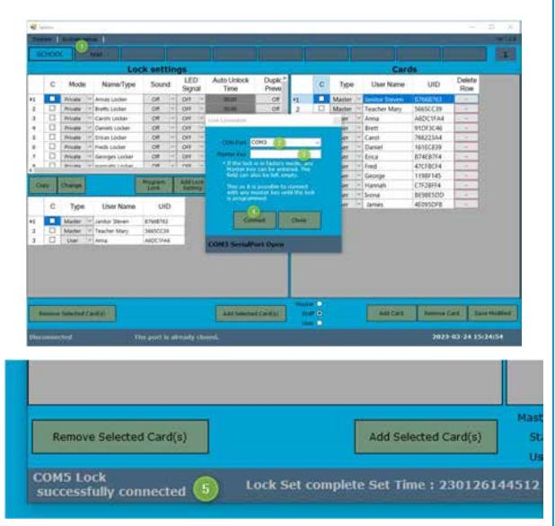

|    | C       | Type   |   | User Name      | UID      | Delete Row |
|----|---------|--------|---|----------------|----------|---------------|
| 1  |         | Master |   | Janitor Steven | B766B763 |               |
| 2  | 0       | Master |   | Teacher Mary   | 5665CC39 |               |
| 3  |         | User   |   | Anna           | A6DC1FA4 |               |
| 4  |         | User   | > | Brett          | 91DF3C46 |               |
| 5  |         | User   | > | Carol          | 766223A4 |               |
| 6  | 0000000 | User   | < | Daniel         | 161EC839 |               |
| 7  |         | User   | > | Erica          | B74EB A  |               |
| 8  |         | User   | > | Fred           | 47CFBCF4 | -             |
| ਰੇ |         | User   | > | George         | 119BF145 |               |
| 10 | D       | User   | < | Hannah         | C7F2BFF4 |               |
| 11 | 13      | User   | < | Ivona          | BE98E5DD |               |
| 12 | E       | User   | > | James          | 4E095DFB |               |
|    |         |        |   |                |          |               |

#### STEP 7. Assign cards to the lock settings.

- Select the cards to be added, in this 1. example all lockers should have the same 2 master cards and one different user card.
- Select the lock setting to which the 2. cards should be added.
- 3. Click Add Selected Card(s)
- Once added, the cards will show up in 4. the lower left window for the selected lock setting.

If more than one lock setting is used, it is possible to check which cards that is added into each setting by clicking that line in the lock settings window. In this case for Annas Locker, both master cards and user card Anna should be added.

Repeat this step for all other lock settings but with different user cards.

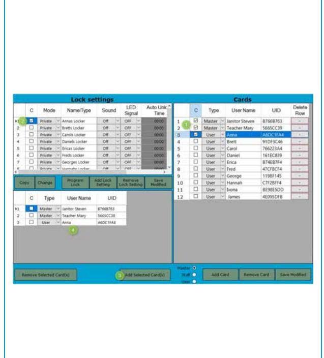

#### STEP 8. Program Lock.

- 1. Select the lock setting that is to be programmed to the lock.
- 2. Go to the system Setup Menu and select Program Lock and press OK.
- If successfully programmed, a 3. confirmation window is shown.
- To use the lock, go to System Setup and 4. click Disconnect and then remove the cable. The lock will now reboot into working mode.

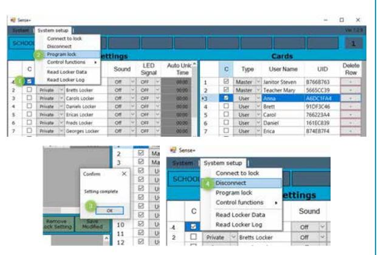

lt is now possible to program remaining 9 locks by 1 of 2 methods:

- Connecting each lock (Step 5) and program (Step 8) but with the lock setting to be used for this 1. lock. This is recommended as all user cards already is registered in the system.
- 2. Use the copying card. This will setup the locks with the master card data. But the data for user cards still needs to be individually setup at each lock. See instruction for Copying Card, example 1A and perform step B, C and D. If this option is used, it is important that the cards still are registered in the system if the log should be correct.

# LOCKS IN A GYM/SWIMMING/OFFICE AREA (PUBLIC MODE)

### ANY USER TO ANY LOCKER

ln areas such as gyms, swimming areas and other public spaces there is often a need for lockers that can be used by the guest without any prior registration.

Unless each guest is assigned their own locker, such as in some private clubs, the locks should be setup into public mode. When the lock is set into public mode the guest can freely choose any unoccupied locker.

Once the belongings are stored in the locker, the guest closes the lock and present a compatible card|wristlet etc. The lock will now register this card as the user card and lock. It is not possible for any other user to open the lock.

When the guest return. he/she then presents the card again to the lock to open. The lock will now unregister this card as a user card and the lock is yet again free to use for anyone.

All locks also need to have at least 1 master card registered. The master card(s) can always open the lock, even if it's locked by a user. When opening with a master card that is currently registered to the lock will be unregistered.

In addition to the master card, a number of staff cards can also be registered to the lock. Just like with the master cards, staff cards can also open locks that is closed by the user. But the difference when opening with a staff cards, is that the registered user card will not be unregistered. Once the handle is returned to closed position, the lock will automatically re-lock.

As an example, the staff card is useful if a guest has lost their cards and want to get help to open the locker. If a master card is used and it turns out that it was the wrong locker, the problem is now that the User Card of the correct guest will be unregistered. But with the staff card, the locker can be closed again with the user card still registered.

# EXAMPLE 3 - SETUP OF LOCKERS FOR A SWIMMINGA AREA

- Each lock should have 3 master cards and 2 staff cards. ●
- It's advised to read through the whole example before using together ● with the software.

#### STEP 1. Login.

- Enter the admin ID and PW (By default 1. both are set to admin)
- 2. Click on the Login-button to log in
- Click on the System Management 3. Button to move into the main window.

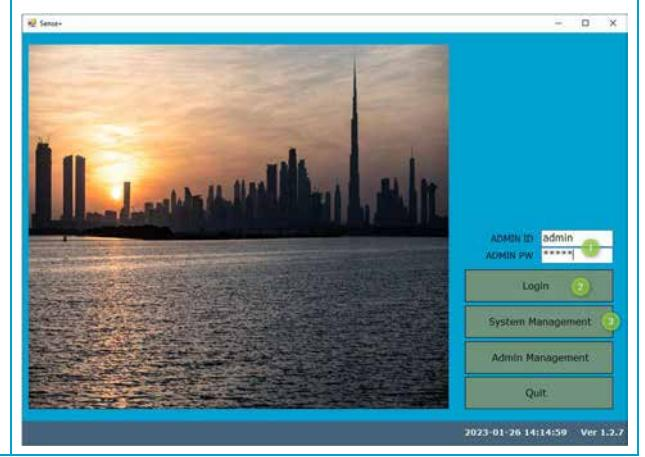

#### STEP 2. Create a system

- Go to the System Menu and select New 1. System.
- In the New Systems Window, enter a 2. system name.
- Create one lock (or lock setting) as all 3. locks should be identical.
- 4. Type in 3 for the numbers of Master Cards.
- Type in 2 for the number of Staff Cards. 5.
- 6. Click the Create-button to generate the system.

Note: More cards can be added later if needed.

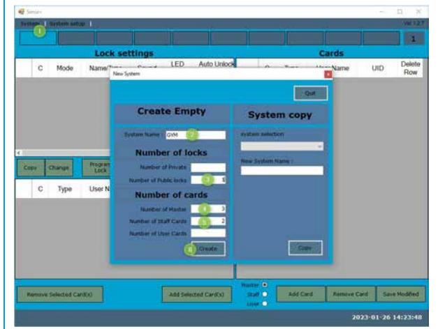

#### STEP 3. Modify the Lock Settings.

The system has now generated one lock setting.

- 1. Give the lock setting a name
- 2. Select Sound On/Off.
- Select if the lock should indicate that it 3. is occupied by red flashes that occurs every 6th second. If turned off, it will increase the battery life length.
- Select if the lock should automatically 4. open after a certain time after being closed. If set to 00:00, the function is disabled.
- 5. Once the settings are done, click Save Modified.

|    |     | System   System setup |                  |          |               |                     |
|----|-----|-----------------------|------------------|----------|---------------|---------------------|
|    | GYM |                       |                  |          |               |                     |
|    |     |                       | Lock settings    |          |               |                     |
|    | C   | Mode                  | Name/Type        | Sound    | LED Signal | Auto Unlock Time |
| >1 | 2   | Public                | Womens Lockerroo | Off > | ON >       | 00:00               |
|    |     |                       |                  |          |               |                     |
|    |     |                       |                  | 20       | 3             | 4                   |
|    |     |                       |                  |          |               |                     |

#### STEP 4. Name the cards.

- Type in the names that each card should 1. be connected to. This is useful when working with the event log.
- 2. If more cards are needed, they can be added by the Add Card button. Select the type of card that you want to add and click the button. For this example, all cards needed was created upon setting up the system.
- Once the settings are done, click Save 3. Modified.

#### STEP 5. Connect a lock.

Connect the lock to the computer by the connecting cable.

- Go to the System Setup menu and 1. select Connect to Lock
- In the lock Connection Window, select 2. the COM-port used. If you don't know which port is used this can be identified in the device manager but it is also to possible to use trial and error.
- 3. Enter Master Key. In the case that the lock is in factory mode (as it is delivered) this field is left empty.
- Click Connect 4.
- 5. A message at the bottom left will show that the lock was successfully connected. The internal clock of the lock is automatically set to the current time.

|    | GYM |            |                         |           |                 |                      |     |   |           |                                     |     |        |
|----|-----|------------|-------------------------|-----------|-----------------|----------------------|-----|---|-----------|-------------------------------------|-----|--------|
|    |     |            | Lock settings           |           |                 |                      |     |   |           | Cards                               |     | Deleto |
|    | C   | Mode       | Name/Type               | Sound     | LED Signal   | Auto Unlock Time  |     | 0 | Type      | User Name                           | UID | Row    |
| 12 | E   | Public   + | Wamens Lockerroo.       | Out 16 | 04 11           | 0000                 | . . | 0 | Master -  | Steve                               |     |        |
|    |     |            |                         |           |                 |                      | 2   | 口 | Master 14 | Mary                                |     |        |
|    |     |            |                         |           |                 |                      | 3   | 0 | Master    | Helen                               |     | 3      |
|    |     |            |                         |           | Lisck Cannerhan |                      |     |   | 100       | 1 John SIT ------------------ |     |        |
|    |     |            |                         |           | COM Fart        | CONS                 |     |   |           |                                     |     |        |
|    |     |            |                         |           |                 | CONS SerialPort Open |     |   |           |                                     |     |        |
|    |     |            |                         |           |                 |                      |     |   |           |                                     |     |        |
|    |     |            |                         |           |                 |                      |     |   |           |                                     |     |        |
|    |     |            |                         |           |                 |                      |     |   |           |                                     |     |        |
|    |     |            |                         |           |                 |                      |     |   |           |                                     |     |        |
|    |     |            |                         |           |                 |                      |     |   |           |                                     |     | Mast   |
|    |     |            | Remove Selected Card(s) |           |                 |                      |     |   |           | Add Selected Card(s)                |     |        |

#### STEP 6. Read the UID-numbers of the cards.

Once connected, the lock will work as a card reader. The card UID-numbers can now be assigned to the cards in the system.

NOTE: If cards are unmarked or do not have personal details, it is important to keep track of which card that is connected to each name.

- 1. Click on the first line and present a card to the lock. The UID-number of the card will now be registered. The system now automatically moves to the next line.
- Present the remaining cards. 2.
- 3. Once done, click Save Modified.

|     |   |        |   | cards     |          |               |
|-----|---|--------|---|-----------|----------|---------------|
|     | C | Type   |   | User Name | UID      | Delete Row |
| 1   | 0 | Master |   | Steve     | C7F2BFF4 |               |
| ▶2  | ■ | Master |   | Mary      |          | -             |
| 3   |   | Master |   | Helen     |          | -             |
|     |   | Staff  |   | John      |          |               |
| 4 5 | ា | Staff  | 2 | Kim       |          |               |

#### STEP 7. Assign cards to the lock settings.

- 1. Select the cards to be added, in this example all cards. (To select all the C can also be pushed).
- 2. Select the lock setting to which the card should be added.
- 3. Click Add Selected Card(s)

If more than one lock setting is used, it is possible to check which cards that is added into each setting by clicking that line.

| Mode Addia   Wilmers Cockerspo | Name Type South | LED Samal Co = = Car In | Auto Uniock Time දෙදෙන | 1 2      | 0 3                                           | Type                                                                                                                                                                                                                                  |            |                                                                    | Dolote                      |
|-----------------------------------|--------------------|-------------------------------|------------------------------|-------------|--------------------------------------------------|---------------------------------------------------------------------------------------------------------------------------------------------------------------------------------------------------------------------------------------|------------|--------------------------------------------------------------------|-----------------------------|
|                                   |                    |                               |                              | C 4 5 | ಲಾ Majter ്രി Maches 6 SAME 01 | 1221261 State Mary Halan 1 2000 19 State - 1 - 1 - 1 - 1 - 1 - 1 - 1 - 1 - 1 - 1 - 1 - 1 - 1 - 1 - 1 - 1 - 1 - 1 - 1 - 1 - 1 - 1 - 1 - 1 - 1 - 1 - 1 - 1 - 1 - 1 - 1 - 1 - 1 - 1 - 1 - 1 - 1 - 1 - 1 - 1 - 1 - 1 | Jiped Name | UID CTV28FF4 EQUIl E-IDO 16116833 B74EB764 ETCHOCHA | Row 4                    |
| C Mode                         | Name/Type          | Sound                         | LED                          |             | Auto Unlock Time                              |                                                                                                                                                                                                                                       |            | Type                                                               | User Na                     |
| Public 0                       |                    | OH O                          |                              |             | 00:00                                            | . 1                                                                                                                                                                                                                                   | 3          |                                                                    |                             |
|                                   |                    |                               |                              |             |                                                  | 2                                                                                                                                                                                                                                     | 2          | Master                                                             | 14 Mary                  |
|                                   |                    |                               |                              |             |                                                  | 3                                                                                                                                                                                                                                     |            |                                                                    | Helen                       |
|                                   |                    |                               |                              |             |                                                  |                                                                                                                                                                                                                                       |            |                                                                    |                             |
|                                   |                    |                               |                              |             |                                                  | 4 5                                                                                                                                                                                                                                | ਨ ਨ     | Staff Staff                                                     | 4 John - Kim             |
| change                            | Trogram  Lock      | AGSLOCK Setting            | Parnava Lock Setting      |             | 12                                               | >                                                                                                                                                                                                                                     |            |                                                                    |                             |
| C Type                         | User Name          | UID                           |                              |             |                                                  |                                                                                                                                                                                                                                       |            |                                                                    |                             |
| Master                            | Steve              | C7928FF4                      |                              |             |                                                  |                                                                                                                                                                                                                                       |            |                                                                    |                             |
| 1 Mather 1                  | Naty               | EEFFECTO                      | 4                            |             |                                                  |                                                                                                                                                                                                                                       |            |                                                                    |                             |
| 1 > Master                  | Melen              | 163EC639                      |                              |             |                                                  |                                                                                                                                                                                                                                       |            |                                                                    |                             |
| 1 234 2 िक्स Statt .  | Schart - Kies   | 074ESTF4 47CFBCF4          |                              |             |                                                  |                                                                                                                                                                                                                                       |            |                                                                    |                             |
|                                   |                    |                               | Womens Lockerroo.            |             | Signal 011 4                                  |                                                                                                                                                                                                                                       |            | C                                                                  | Master Steve ದ Master |

#### STEP 8. Program Lock.

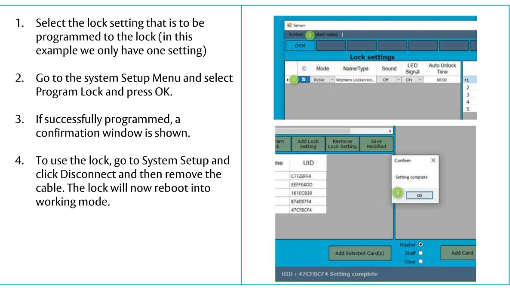

It is now possible to program remaining locks by 2 methods:

- 1. Connecting each lock (Step 5) and program (Step 8).
- 2. Use the Copying Card. This is recommended for larger installations as the installer only needs to go around the facility with the copy card instead of the computer. See instruction for Copying Card, example 3A and perform step B and C.

ASSA ABLOY Opening Solutions Sweden P.O. Box 371 SE-631 05 Eskilstuna Sweden Phone +46 (0)16 17 70 00 Customer support: Phone intl. +46 16 17 71 00 Phone nat. 0771 640 640 helpdesk.se.openingsolutions@assaabloy.com assaabloy.com