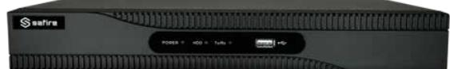

## **SF-NVR6108-4K-VS2**

NVR for IP cameras 8 CH video Compression H.265+ Maximum resolution 8Mpx

Bandwidth 80 Mbps

Outputs 4K HDMI & VGA

Supports 1 hard disk

Safire NVR for IP cameras 8 CH 80 Mbps bandwidth supported Maximum resolution 8 Megapixel Compression H.265+ / H.265 / H.264+ / H.264 ANR (Automatic Network Replenishment) VGA and HDMI 4K output IP Dual Stream Access Mouse Space for 1 HDD WEB,(SCC) and Smartphone interface ONVIF Compatible

## Specifications

| Brand                      | Safire                                                              |
|----------------------------|---------------------------------------------------------------------|
| Inputs for IP cameras      | LAN port up to 8 channels                                           |
| Power over Ethernet        | No                                                                  |
| IP compatible cameras      | SAFIRE (native protocol), ONVIF                                     |
| Bidirectional audio        | 1 input / 1 RCA output                                              |
| Video outputs              | 1 HDMI 4K, 1 VGA                                                    |
| Video compression format   | H.265+ / H.265 / H.264+ / H.264                                     |
| Display resolution         | 3840x2160, 2560x1440, 1920x1080, 1280x1024, 1280x720, 1024x768      |
| Total bandwidth            | 80 Mbps downstream / 80 Mbps upstream                               |
| Main Stream recording      | 8MP/6MP/5MP/3MP/1080P /UXGA /720P /VGA /4CIF /DCIF /2CIF /CIF /QCIF |
| Simultaneous multifunction | Pentaplex: Live, Recording, Playback, Backup and Remote Access      |
| Alarms                     | No                                                                  |
| Recording method           | Manual, programmed, motion detection, alarm                         |
| External Backup            | USB memory / HDD USB / CD-RW USB / DVR-RW USB                       |
| Internal memory            | 1 SATA HDD 3.5" of up to 6 TB (not included)                        |
| Communication              | 2 x USB 2.0 / 1 x RJ45 (Ethernet)                                   |
| Remote access              | Web browser, Safire Control Center Smartphone App and PC Software   |
| Power                      | DC 12 V / 850 mA (maximum)                                          |
| Dimensions / Weight        | 48 (H) x 260 (W) x 225 (D) mm / 1.0 Kg (without HDD)                |