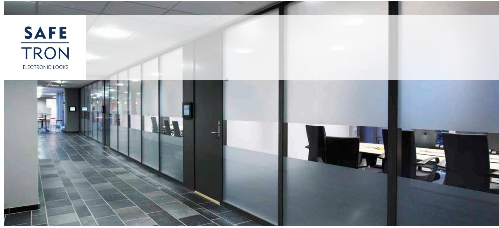
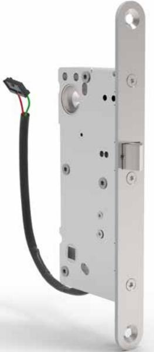
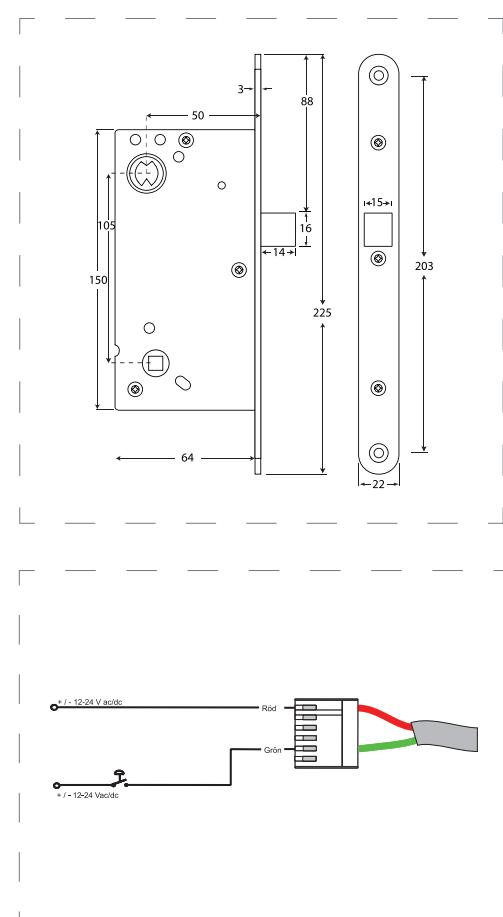

# E LT R Y C K E S L Å S SL 504 SL 506

# Förenklat eltryckeslås för högtrafikerade dörrar

SAFETRON SL 504 och SL 506 är elektromekaniskt styrda tryckesfunktionslås utan förregling i modulutförande. SL 504 är av typen enkel och SL 506 har split funktion.

Typiska användningsområden är intern låsning inom äldrevården tack vare den lätta tryckesrörelsen. Även lämplig som enklare daglåsning inom handel, kontor och industri eller entréer och andra allmänna utrymmen i flerbostadshus.

SL 504 och SL 506 har rättvänd funktion vilket betyder låst i strömlöst läge.

### Ingen förregling

Dessa lås saknar förreglingskolv och lämpar sig därför för överfalsade dörrar eller dörrar med lågt ställda krav på säkerhet.

#### Split funktion

SL 506 har split funktion vilket möjliggör mekanisk utpassering och elektrisk inpassering genom en delad tryckespinne.

## Låg tryckeskraft

Tryckeskraften som krävs för att manövrera låset är väldigt låg, därför lämpar sig låset för användning inom t.ex. äldrevården där denna faktor har betydelse.

Låg strömförbrukning Endast 65mA @ 24 VDC.

# EGENSKAPER

- Dorndjup 50 mm
- Rättvänd funktion: SL 504 / SL 506
- Omvänd funktion: SL 505 / SL 507
- Enkel funktion: Endast SL 504 / SL 506
- Split funktion: Endast SL 506 / SL 507
- Omställbar höger eller vänster
- Fallutsprång 14 mm
- Kolvplacering enligt klassisk standard

#### TEKNISKA DATA

- Multispänning 12 VDC / 24 VDC +/- 15%
- Strömförbrukning: 12 VDC: 130 mA, 24 VDC: 65 mA
- Arbetstemperatur -20°C till +40°C

#### BENÄMNING ART NR

# SL 504 Låshus, rättvänd funktion 202 144 599 SL 505 Låshus, omvänd funktion 202 144 600 SL 506 H Låshus, rättvänd funktion 202 144 601 SL 507 H Låshus, omvänd funktion 202 144 603 SL 506 V Låshus, rättvänd funktion 202 144 602 SL 507 V Låshus, omvänd funktion 202 144 604

| BENÄMNING | FUNKTION          | ART NR      | E-NUMMER |
|-----------|-------------------|-------------|----------|
| SL 504    | Rättvänd funktion | 202 144 599 | 5866872  |
| SL 505    | Omvänd funktion   | 202 144 600 | 5866873  |
| SL 506 H  | Rättvänd funktion | 202 144 601 | 5866874  |
| SL 506 V  | Rättvänd funktion | 202 144 603 | 5866875  |
| SL 507 H  | Omvänd funktion   | 202 144 602 | 5866876  |
| SL 507 V  | Omvänd funktion   | 202 144 604 | 5866877  |