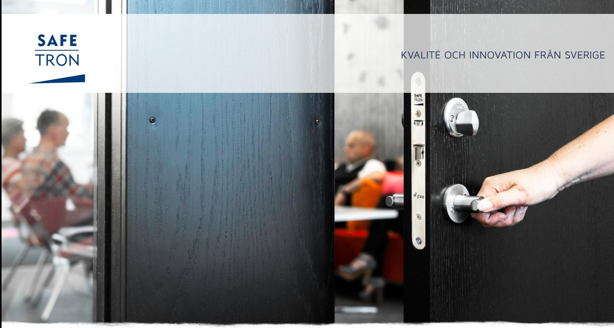
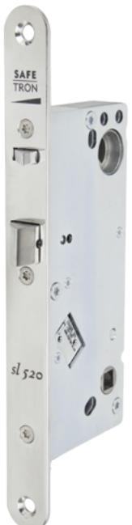
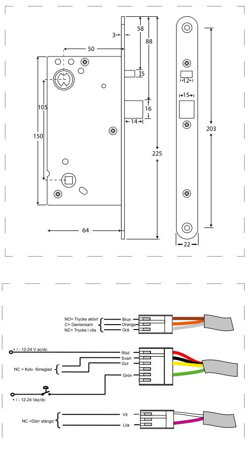

### E LT R Y C K E S L Å S SL 520

# Eltryckeslås med split funktion för högtrafikerade dörrar

Safetron SL 520 är ett elektromekaniskt styrt tryckesfunktionslås med s.k. split funktion i modulutförande.

Typiska användningsområden är daglåsning och intern låsning av högtrafikerade dörrar inom handel, kontor och industri eller entréer och andra allmänna utrymmen i flerbostadshus.

SL 520 har rättvänd funktion vilket betyder låst i strömlöst läge.

### Split funktion

Split funktionen möjliggör mekanisk utpassering och elektrisk inpassering genom en delad tryckespinne.

#### Brandklassad

SL 520 uppfyller kraven för brandcellsgränser: E120, A120, EI120

Strömsnål Endast 65mA @ 24 VDC.

#### Inbyggd dörrstatusgivare

SL 520 levereras standard med dörrstatusgivare vilken nyttjas genom montering av magnet i slutbleck eller karm.

## E LT R Y C K E S L Å S SL 520

### EGENSKAPER

Split funktionen möjliggör mekanisk utpassering vilket förenklar användningen i högtrafikerade dörrar.

- Uppfyller kraven för brandcellsgränser: E120, A120, EI120
- Split funktion
- Dorndjup 50 mm
- Rättvänd funktion: SL 520
- Omvänd funktion: SL 521
- Omställbar höger eller vänster
- Tryckesrörelseindikering
- Förreglingsindikering
- Dörrstatusindikering vid användande av magnet i slutbleck
- Fallutsprång 14 mm
- Kolvplacering enligt klassisk standard

#### TEKNISKA DATA

- Multispänning 12 VDC / 24 VDC +/- 15%
- Strömförbrukning: 12 VDC: 130 mA, 24 VDC: 65 mA
- Arbetstemperatur -20°C till +40°C

#### BENÄMNING ART NR

- SL 520 H Låshus, rättvänd funktion 202 144 361 SL 521 H Låshus, omvänd funktion 202 144 363 SL 520 V Låshus, rättvänd funktion 202 144 362 SL 521 V Låshus, omvänd funktion 202 144 364 SL 520 H Sats, rättvänd funktion (låshus, kabel, slutbleck) 202 144 483 SL 521 H Sats, omvänd funktion (låshus, kabel, slutbleck) 202 144 485 SL 520 V Sats, rättvänd funktion (låshus, kabel, slutbleck) 202 144 484 SL 521 V Sats, omvänd funktion (låshus, kabel, slutbleck) 202 144 486
#### **SAFETRON AB**

Säterivägen 18 P.O. Box 2096 65002 Karlstad Sweden

Tel: +46 54 19 02 45 Email: info@safetron.com

Du hittar alltid det senaste på safetron.com