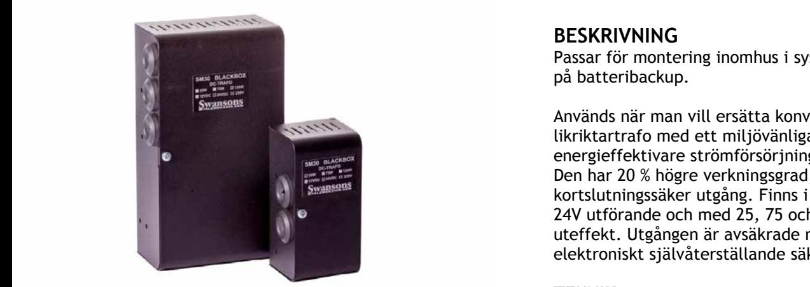
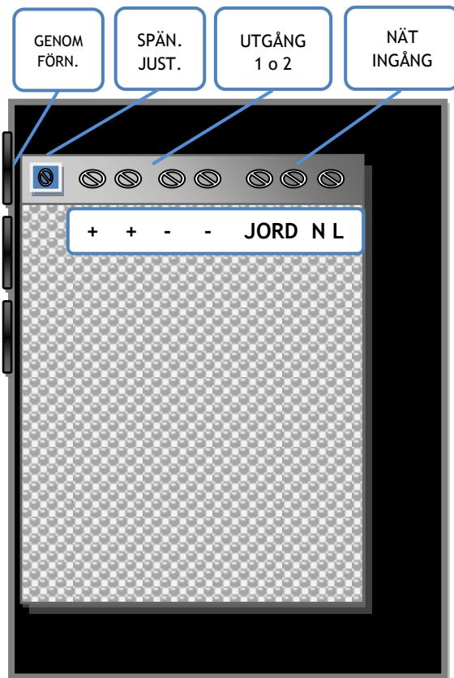

**Skydd:** Aggregatet är skyddad mot överbelastning och kortslutning. Nät skyddas av inbyggd säkring. Last skyddas av kortslutningsskydd. På 120W modellen finns även självåterställande termisk säkring av polymertyp på utgången.

 **SM40** 

### **TEKNISKA DATA**

| Inspänning | 230VAC +/- 15% |  |  |
|------------|----------------|--|--|
|            | 1 fas 50-60Hz  |  |  |
| Reglering  | max 0,6 %      |  |  |
| Rippelsp.  | max 0,5 % av   |  |  |
|            | utspänningen   |  |  |
| Temp.omr-  | -10 – 40 C     |  |  |

CE-märkt enligt EN61000-6-3: 2001 EN61000-6-2: 2005, EN61000-4-2,-3,-4, -5,-6, -11

### **BESKRIVNING**

Passar för montering inomhus i system utan krav på batteribackup.

Används när man vill ersätta konventionell likriktartrafo med ett miljövänligare och mer energieffektivare strömförsörjnings alternativ. Den har 20 % högre verkningsgrad, stabil och kortslutningssäker utgång. Finns i både 12V och 24V utförande och med 25, 75 och 120W uteffekt. Utgången är avsäkrade med elektroniskt självåterställande säkring.

#### **TEKNIK**

SM30 är en kompakt och välventilerad kapsling i lackerad plåt med genomförningar. Dragavlastning finns i kapslingen. Konstruktionen är lätt att öppna och enkel att installera. SM30 är primärswitchad och har mycket lågt rippel och stabiliserad utspänning.

SM30-25W: Nätaggregatet i svart självventilerad plåtkapsling med en utgång. För väggmontage och har 2st genomförningar. Utspänningen är justerbar.

SM30-75-120W: Nätaggregatet i svart självventilerad plåtkapsling med två utgångar. För väggmontage och har 3st genomförningar. Utspänningen är justerbar.

| E-Nummer | Typ        | Effekt | Utsp. och ström | H x B x D mm   |
|----------|------------|--------|-----------------|----------------|
| 5218060  | SM30/12-2  | 25W    | 12V 2A          | 123 x 60 x 57  |
| 5218061  | SM30/12-5  | 75W    | 12V 5A          | 205 x 110 x 65 |
| 5218062  | SM30/12-10 | 120W   | 12V 10A         | 205 x 110 x 65 |
| 5218063  | SM30/24-1  | 25W    | 24V 1,1A        | 123 x 60 x 57  |
| 5218064  | SM30/24-3  | 75W    | 24V 3A          | 205 x 110 x 65 |
| 5218065  | SM30/24-5  | 120W   | 24V 5A          | 205 x 110 x 65 |

Postadress/Postal address **Swansons Telemekanik AB** Hålstensvägen 4 SE-446 37 Älvängen

Telefon nr/Telephone no +46(0)303-746 320 Hemsida/Webb www.swtm.se

Telefax nr/Telefax no +46(0)303-748 490 e-post info@swtm.se

VAT.NO SE556289017701

# **SÄKERHET SM40**

Endast auktoriserad och erfaren personal inom AC och DC får använda, arbeta,

serva/underhålla, installera denna enhet. Endast isolerade verktyg får användas i enheten. Observera att farliga spänningar och strömmar förekommer i apparaten både när interna säkringarna är av eller på.

Denna instruktion skall läsas igenom grundligt och förstås av all handhavande personal. Vid minsta tveksamhet om systemets uppbyggnad, funktion, komponenter samt säkerhet skall leverantören kontaktas.

Kontrollera att kretskort sitter fast och inte är transportskadade.

### **INKOPPLING Strömförsörjning med plats för batteri**

- Montera aggregatet fritt. Minst 100mm på varje sida.
- Anslut först 230V AC.
- Kontrollera att utspänningen är riktig.
- Vid behov justera utspänningen med V1 på power modulen
- Anslut därefter lasten.

## **TEKNISKA DATA**

Inspänning 230VAC +/- 15%

Utström se modell Temp. omr. 0 – 30 C Utspänning: 12/24V Justering +/- 10%

Primärsäkring Intern, ej utbytbar.

| Modell     | Primär säkring | Sekundär säkring | Utgångar |
|------------|-------------------|---------------------|----------|
| SM30/12-2  | Intern            | Kortsl.säker 2,5A   | 1        |
| SM30/24-1  | Intern            | Kortsl.säker 1,5A   | 1        |
| SM30/12-5  | Intern            | Kortsl.säker 6,5A   | 2        |
| SM30/24-3  | Intern            | Kortsl.säker 4A     | 2        |
| SM30/12-10 | Intern            | Kortsl.säker 11A    | 2        |
| SM30/24-5  | Intern            | Kortsl.säker 5,5A   | 2        |

1fas 50-60Hz

Postadress/Postal address **Swansons Telemekanik AB** Hålstensvägen 4 SE-446 37 Älvängen

Telefon nr/Telephone no +46(0)303-746 320 Hemsida/Webb www.swtm.se

Telefax nr/Telefax no +46(0)303-748 490 e-post info@swtm.se

VAT.NO SE556289017701