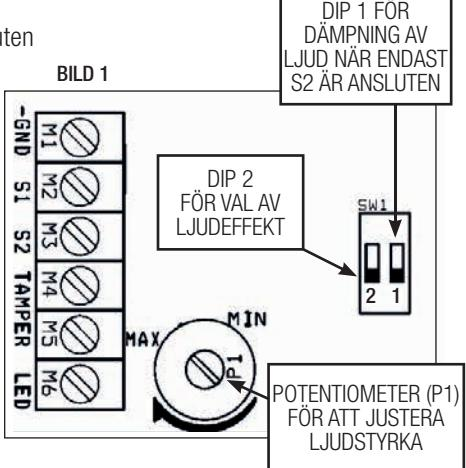
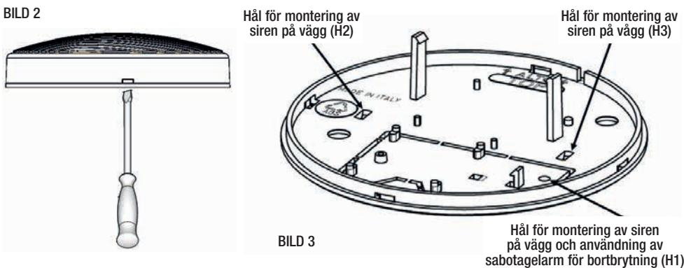

# MANUAL

# SP 1000 SIREN FÖR INOMHUSMONTAGE

2017 www.alarmtech.se SP 1000 Manual 1702se www.alarmtech.se 2017 www.alarmtech.se 1/4 SP 1000 Manual 1702se

S

#### BESKRIVNING:

SP 1000 är en piezoelektrisk siren avsedd för inomhusbruk i främst anläggningar för inbrottslarm. Den är utvecklad för att uppfylla kraven enligt gällande SBSC och EN standard.

Ljudstyrkan justeras via en potentiometer och det är möjligt att välja mellan sex olika toner.

SP 1000 är konstruerad för att avge ett mycket högt ljudtryck men samtidigt inte dra för hög ström, vilket innebär att den kan användas till både trådlösa och trådbundna centralapparater.

Elektroniskt polaritetsskydd samt sabotageskydd för öppning och bortbrytning är standard.

| TEKNISKA DATA           |                                  |  |  |  |
|-------------------------|----------------------------------|--|--|--|
| Matningsspänning        | 10 - 15 Vdc                      |  |  |  |
| Märkt strömförsörjning  | 12 Vdc                           |  |  |  |
| Max Strömförbrukning    | 90 mA ± 10 mA                    |  |  |  |
| Ljudeffekt (justerbart) | > 90 dB at 1m, Max 115 dB        |  |  |  |
| Frekvens                | Från 500 till 3000 Hz            |  |  |  |
| Frekvens val            | Se Tabell 1 och Tabell 2         |  |  |  |
| Kapslingsmaterial       | ABS vit plast                    |  |  |  |
| Mått                    | ø 135 D 38 mm                    |  |  |  |
| Vikt                    | 154 gr                           |  |  |  |
| Arbetstemperatur        | Från -10 °C till +40 °C          |  |  |  |
| Luftfuktighet           | 75% Max                          |  |  |  |
| IP                      | IP4X                             |  |  |  |
| Miljöklass              | II                               |  |  |  |
| Godkännande             | EN50131-4: 2009 (grad 3)         |  |  |  |
|                         | SSF1014 v.5                      |  |  |  |
| Larmklass               | Larmklass 3                      |  |  |  |
| Certifi eringsorgan     | certifi erad av Telefi cation BV |  |  |  |

## JUSTERINGAR:

I SP 1000 fi nns möjligheten att välja olika toner samt ljudstyrkan.

En DIP-switch och anslutning S1-S2 möjliggör valet av toner.

En DIP-switch samt 1 potentiometer möjliggör reglering av ljudstyrka.

DIP2: Ljudeffekt

DIP1: Dämpning av ljudstyrka när enbart S2 är ansluten

P1: Justering av ljudstyrka

(Se tabell 1 & 2 för närmare beskrivning)

#### INKOPPLING:

GND - Jord S1 - Strömförsörjning +12V / TON1 S2 - Strömförsörjning +12V / TON2 Tamper - Sabotagekontakt N.C.

#### OBSERVERA:

Genom att öka den akustiska effekten ökar den genomsnittliga strömförbrukningen proportionellt. Exempel: 80 dB motsvarar 60 mA; 115dB motsvarar 90mA.

| TABELL 1     |                |                                |                  |                       |  |  |
|--------------|----------------|--------------------------------|------------------|-----------------------|--|--|
| TERMINAL S1  | TERMINAL S2 | LJUDEFFEKT 1 – DIP2 OFF        | MAX              | MAX LJUDSTYRKA        |  |  |
|              |                | MODULATION                     | STRÖMFÖRBRUKNING |                       |  |  |
| 12V          | 0V eller fri   | Trapetseffekt (2740 - 3000 Hz) | 60 mA            | 115 dBA               |  |  |
| 0V eller fri | 12V            | Kontinuerlig (2800 Hz)         | 60 mA            | 115 dBA               |  |  |
|              |                |                                |                  | (90 dBA med DIP 1 ON) |  |  |
| 12V          | 12V            | Tvåfärgad (1800 – 2800 Hz)     | 90 mA            | 110 dBA               |  |  |

| TABELL 2     |                |                         |                         |                                  |  |  |
|--------------|----------------|-------------------------|-------------------------|----------------------------------|--|--|
| TERMINAL S1  | TERMINAL S2 | LJUDEFFEKT 2 – DIP2 ON  | MAX STRÖMFÖRBRUKNING | MAX LJUDSTYRKA                   |  |  |
|              |                | MODULATION              |                         |                                  |  |  |
| 12V          | 0V eller fri   | Pulsad (1830 Hz)        | 60 mA                   | 100 dBA                          |  |  |
| 0V eller fri | 12V            | Minskande (1200-500 Hz) | 60 mA                   | 115 dBA (92 dBA med DIP 1 ON) |  |  |
| 12V          | 12V            | Kontinuerlig (2800 Hz)  | 60 mA                   | 115 dBA                          |  |  |

#### MONTERING:

- 1. För att öppna sirenen, infoga en skruvmejsel (5 mm) i hålet på undersidan av sirenen. Vrid skruvmejseln medurs eller moturs för att lossa locket (Bild 2).
- 2. Ta bort locket.
- 3. Borra två hål i väggen för de avsedda hålen H2 och H3 (Bild 3). Använd lämpliga skruvar och plugg för att montera sockeln (ingår ej).
- 4. För sabotagefunktion, fäst sirenen på väggen genom hålet H1 (Bild 3)..

# SERVICE OCH UNDERHÅLL

SP 1000 måste installeras av behörig personal. Tillverkaren tar inget ansvar för felaktig installation eller för eventuella hörselnedsättningar som kan förekomma om hörselorgan är för nära sirenen vid driftsättning.

Avprovning och funktionstest är alltid nödvändig efter installation och vid årlig revision.

OBS! Använd hörselskåpor vid montering och avprovning.

Tillverkaren försäkrar att denna produkt är i överensstämmelse med alla relevanta EU-direktiv om CE-märkning och med 2014/30 / EU-direktiv (elektromagnetisk kompatibilitet) Den fullständiga försäkran om överensstämmelse fi nns tillgänglig på begäran på info@alarmtech.se

Produkten tillverkas i Italien.

## BESTÄLLNINGSINFORMATION

| Typ     | E-nr    | Beskrivning  |
|---------|---------|--------------|
| SP 1000 | 5372314 | Inomhussiren |

Välkommen att kontakta Alarmtech Alarmtech Sweden AB P.O. Box 7079 19207 Sollentuna Sweden Tel: +46 8 631 06 11 Fax: +46 8 35 17 21 e-mail: info@alarmtech.se www.alarmtech.se

www.alarmtech.se 2017 www.alarmtech.se 4/4 SP 1000 Manual 1702se