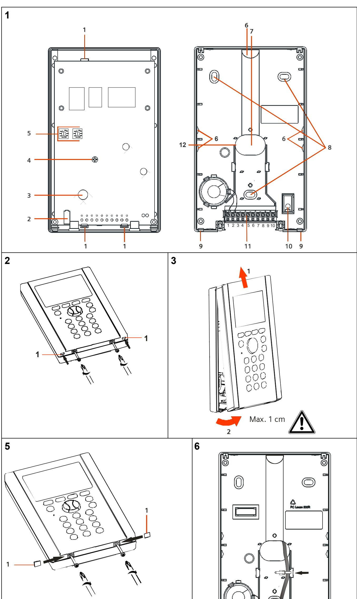
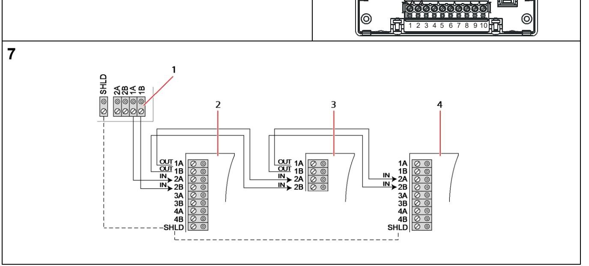

## **SPCK620**

# **SPCK623**

**Comfort Keypad Comfort Keypad with Audio/CR (en) Komfortbedienteil Komfortbedienteil mit Audio/Kartenleser (de) Teclado confort Teclado confort con Audio/CR (es) Tastiera Confort Tastiera Confort con Audio/CR (it) Comfort knappsats Comfort knappsats med ljud/CR (sv) Clavier confort Clavier confort avec Audio/LC (fr) Comfort-bediendeel Comfort-bediendeel met audio/kaartlezer (nl)**

**STEP: A6V10270955, Edition: 01.10.2015** 

## **English – Instructions**

**Attention:** This device shall only be connected to power supplies compliant to EN60950-1, chapter 2.5 ("limited power source").

#### **Risk of damage to the device**

- Use the device only indoors and in dry environments.
- Do not expose it to dripping or splashing water.
- Do not let the contact areas of the board get dusty and do not touch them with your bare hands.

### **EC Declaration of Conformity**

Hereby, Vanderbilt International (IRL) Ltd declares that this radio equipment type is in compliance with all relevant EU Directives for CE marking. From 20/04/2016 it is in compliance with Directive 2014/30/EU (Electromagnetic Compatibility Directive) and Directive 2014/35/EU (Low Voltage Directive). From 13/06/2016 it is also in compliance with Directive 2014/53/EU (Radio Equipment Directive). The full text of the EU declaration of conformity is available at: http://pcd.vanderbiltindustries.com/doc/SPC

### **Product description**

The SPCK620 is equipped with soft keys and large graphical LCD for easy operation. The functionality can be enhanced with key switch expander SPCE110 or indication expander SPCE120.

The SPCK623 is equipped with a proximity card reader (125 kHz EM 4102) for easy user access, soft keys, large graphical LCD and voice annunciation support. The functionality can be enhanced with key switch expander SPCE110 or indication expander SPCE120.

### **Product overview (Figure 1)**

| 1  | Lugs holding the PCB                     |
|----|------------------------------------------|
| 2  | Tamper switch                            |
| 3  | Card Reader (only SPCK 623)              |
| 4  | Fixing screw for printed circuit board   |
| 5  | Rotary switches                          |
| 6  | Breakout                                 |
| 7  | Cable entry                              |
| 8  | Holes for fastening                      |
| 9  | Lugs                                     |
| 10 | Corrugated-head screw for arcing contact |
| 11 | Screw terminal                           |
| 12 | Cable duct                               |

#### **Installation**

#### **Opening the housing**

- 1. Loosen the screws by a couple of turns (Fig. 2).
- 2. Push the lugs downwards and slightly lift the cover using a screwdriver (Fig. 2 item 1).
- 3. Lift the cover by approx. 1 cm and push it upwards (Fig. 3).

#### **Connecting cables**

- 1. Insert the cable through the cable entry hole in the base (Fig. 1 item 7). If necessary, carefully remove the breakout pieces (Fig. 1 item 6).
- 2. Connect the individual wires to the screw terminals (see the following table and Fig. 6).
- 3. Attach the cable with a cable tie (Fig. 6).

| See Fig. 1, item 11: Contact pins |              |                                    |  |  |
|-----------------------------------|--------------|------------------------------------|--|--|
| Contact pin                       | Abbreviation | Function                           |  |  |
| 1                                 | LS -         | Loudspeaker negative (black cable) |  |  |
| 2                                 | LS +         | Loudspeaker positive (red cable)   |  |  |
| 3                                 | 1 A          | X-BUS                              |  |  |
| 4                                 | 1 B          | X-BUS                              |  |  |
| 5                                 | 2 A          | X-BUS                              |  |  |
| 6                                 | 2 B          | X-BUS                              |  |  |
| 7                                 | 0 V          | Power supply negative              |  |  |
| 8                                 | + 12         | Power supply positive              |  |  |
| 9                                 | SCL          | Not used                           |  |  |
| 10                                | SDA          | Not used                           |  |  |

#### **Mounting the base**

Make sure to mount the unit only on surfaces that are sufficiently hard and rigid.

- 1. Mark 3 holes for the fixing screws (Fig. 1 item 8) and one for the safety screw (Fig. 1 item 10).
- 2. Drill the holes and screw the base.

#### **Mounting the cover**

- 1. Hook the top of the cover into the base and push downward.
- 2. Push back the upper part of the housing.

The two lugs on the base engage with the corresponding recesses in the cover.

- 3. Tighten the two screws at the bottom of the unit and seal them using the supplied seals (Fig. 5).
### **Wiring the X-BUS interface**

The X-BUS interface provides connection of expanders and keypads to the SPC controller. The X-BUS can be wired in a number of different configurations depending on the installation requirements.

NOTE: Maximum System cable length = number of Expanders and Keypads in the system x maximum distance for cable type.

| Cable type                   | Distance |
|------------------------------|----------|
| CQR standard alarm cable     | 200 m    |
| UTP category: 5 (solid core) | 400 m    |
| Belden 9829                  | 400 m    |
| IYSTY 2 x 2 x 0.6 (min)      | 400 m    |

Fig. 7 shows the wiring of the X-BUS to an expander/controller and the following expander/controller in Spur Configuration. Terminals 3A/3B and 4A/4B (if available for this module) are only used for using a branch wiring technique. If using a Spur configuration, the last device is not wired back to the controller.

#### **See Fig. 7: Wiring of expanders**

- **1** SPC controller
- **2** Previous expander
- **3** SPCK620/623
- **4** Next expander

Please refer to SPC Configuration Manual of connected controller for further wiring instructions, shielding, specifications and limitations.

### **X-BUS addressing**

For addressing, reconfiguration, device location, monitoring, editing of names, X-BUS type of communication, failure timer please refer to SPC Configuration Manual.

#### **Technical data**

| LCD-display                     | 128 x 64 pixels (approx. 6 x 20 characters)                      |
|---------------------------------|------------------------------------------------------------------|
| Operating current               | SPCK620: Max. 155 mA at 12 VDC SPCK623: Max. 230 mA at 12 VDC |
| Quiescent current               | SPCK620: Max. 55 mA at 12 VDC SPCK623: Max. 110 mA at 12 VDC  |
| Operating voltage               | 9.5 – 14 VDC                                                     |
| Field bus                       | X-BUS on RS-485 (307 kb/s)                                       |
| Tamper protection               | Type B (per EN50131-3)                                           |
| Tamper contact                  | Front / back tamper                                              |
| Card reader                     | SPCK623: Integrated (125kHz, EM 4102)                         |
| Audio                           | SPCK623: Supported via integrated speaker and microphone   |
| Operating temperature           | 5° ~ +40 °C                                                      |
| Relative humidity               | Max. 90 % (non-condensing)                                       |
| Colour                          | RAL 9003 (signal white)                                          |
| Mounting                        | Flat surface, wall-mounted                                       |
| Housing                         | Plastic housing (Polycarbonate)                                  |
| Dimensions (W x H x D)          | 112 x 185 x 28 mm                                                |
| Weight                          | 0.38 kg                                                          |
| Housing protection/IP rating | IP30                                                             |
| Standards                       | EN50131-3:2009, Grade 3, class II, Type B                        |

### **Deutsch – Anweisungen**

**Achtung:** Dieses Gerät darf nur an Stromquellen angeschlossen werden, die

- der Norm EN60950-1, Kapitel 2.5 ("begrenzte Stromquelle") entsprechen
### **Gefahr von Schäden am Gerät!**

- Das Gerät nur in trockenen Innenräumen verwenden.
- Das Gerät weder Tropf- noch Spritzwasser aussetzen.
- Darauf achten, dass die Kontakte an der Platte staubfrei sind und Kontakte nicht mit bloßen Händen berühren.

### **EG-Konformitätserklärung**

Hiermit erklärt Vanderbilt International (IRL) Ltd, dass dieser Funkgerätetyp den Anforderungen aller relevanten EU-Richtlinien für die CE-Kennzeichnung entspricht. Ab dem 20.04.2016 entspricht er der Richtlinie 2014/30/EU (Richtlinie über elektromagnetische Verträglichkeit) und der Richtlinie 2014/35/EU (Niederspannungsrichtlinie). Ab dem 13.06.2016 entspricht er außerdem der Richtlinie 2014/53/EU (Richtlinie über Funkanlagen). Der vollständige Text der EU-Konformitätserklärung steht unter http://pcd.vanderbiltindustries.com/doc/SPC zur Verfügung.

### **Produktbeschreibung**

Das SPCK620 verfügt über Softkeys und ein großes grafisches Display (LCD ) für eine einfache Bedienung. Der Funktionsumfang kann mit einem Schlüsselschalter-Erweiterungsmodul SPCE110 oder einem Anzeige-Erweiterungsmodul SPCE120 erweitert werden.

Das SPCK623 verfügt über einen Proxy-Kartenleser (125 kHz EM 4102) für einen einfachen Benutzerzugang, Softkeys, ein großes LCD-Display und unterstützt Sprachansage. Der Funktionsumfang kann mit einem Schlüsselschalter-Erweiterungsmodul SPCE110 oder einem Anzeige-Erweiterungsmodul SPCE120 erweitert werden.

### **Produktübersicht (Abbildung 1)**

| 1  | Haltelaschen der Platine              |  |
|----|---------------------------------------|--|
| 2  | Sabotagekontakt                       |  |
| 3  | Kartenleser (nur SPCK 623)            |  |
| 4  | Befestigungsschraube für Leiterplatte |  |
| 5  | Drehschalter                          |  |
| 6  | Durchbruch                            |  |
| 7  | Kabeleinführung                       |  |
| 8  | Befestigungsbohrungen                 |  |
| 9  | Laschen                               |  |
| 10 | Rändelschraube für Kurzschlusskontakt |  |
| 11 | Schraubklemme                         |  |
| 12 | Kabelführung                          |  |

### **Installation**

#### **Öffnen des Gehäuses**

- 1. Die Schrauben mit mehreren Umdrehungen lösen (Abb. 2).
- 2. Die Laschen nach unten drücken und das Gehäuse mit einem Schraubendreher leicht nach oben abheben (Abb. 2, Element 1).
- 3. Das Gehäuse ca. 1 cm abheben und dann nach oben schieben (Abb. 3).

#### **Anschließen der Kabel**

- 1. Das Kabel durch die dafür vorgesehene Öffnung im Unterteil einführen (Abb. 1, Element 7).
Die Durchbruchteile vorsichtig ausbrechen (Abb. 1, Element 6) (wenn erforderlich).

- 2. Die einzelnen Drähte an den Schraubklemmen anschließen (siehe Tabelle unten und Abb. 6).
- 3. Das Kabel mit einem Kabelbinder befestigen (Abb. 6).

#### **Siehe Abb. 1, Element 11: Anschlüsse**

| Anschluss | Abkürzung | Funktion                               |
|-----------|-----------|----------------------------------------|
| 1         | LS -      | Lautsprecher negativ (schwarzes Kabel) |
| 2         | LS +      | Lautsprecher positiv (rotes Kabel)     |
| 3         | 1 A       | X-BUS                                  |
| 4         | 1 B       | X-BUS                                  |
| 5         | 2 A       | X-BUS                                  |
| 6         | 2 B       | X-BUS                                  |
| 7         | 0 V       | Stromversorgung, Minuspol              |
| 8         | + 12      | Stromversorgung, Pluspol               |
| 9         | SCL       | nicht benutzt                          |
| 10        | SDA       | nicht benutzt                          |

#### **Montieren des Gehäuses**

Das Gerät nur auf ausreichend harten und festen Oberflächen montieren.

- 1. Die Lage der drei Bohrungen für die Befestigungsschrauben (Abb. 1, Element 8) und die Bohrung für die Sicherungsschraube markieren (Abb. 1, Element 10).
- 2. Die Löcher für die Befestigungsschrauben bohren und das Unterteil festschrauben.

#### **Gehäusemontage**

- 1. Gehäuseoberteil in das Unterteil einhaken und nach unten drücken.
- 2. Gehäuseoberteil nach hinten schieben.
Die beiden Laschen am Unterteil passen in die entsprechenden Aussparungen im Oberteil.

- 3. Die beiden Schrauben an der Unterseite anziehen und mit den mitgelieferten Plomben abdecken (Abb. 5).
### **Verdrahtung der X-BUS-Schnittstelle**

Die X-BUS-Schnittstelle stellt die Verbindungen von Erweiterungsmodulen und Bedienteilen zum SPC-Controller bereit. Der X-BUS kann je nach Anforderungen der Installation auf unterschiedliche Weise verdrahtet werden.

**HINWEIS:** Maximale Systemkabellänge = Anzahl von Erweiterungsmodulen und Bedienteilen im System mal maximale Entfernung für den jeweiligen Kabeltyp.

| Kabeltyp                             | Länge |
|--------------------------------------|-------|
| CQR-Standardalarmkabel               | 200 m |
| UTP-Kategorie: 5 (Massivdrahtleiter) | 400 m |
| Belden 9829                          | 400 m |
| IYSTY 2 × 2 × 0,6 (min.)             | 400 m |

Abb. 7 zeigt die Verdrahtung des X-BUS mit dem Erweiterungsmodul/Controller und das/den folgende/n Erweiterungsmodul/Controller in Stichleitungskonfiguration. Die Klemmen 3A/3B und 4A/4B (wenn an diesem Modul vorhanden) werden nur für Abzweigverdrahtungen verwendet. Bei einer Stichleitungskonfiguration hat das letzte Gerät keine Rückleitung zum Zentrale.

#### **Siehe Abb. 7: Verdrahtung von Erweiterungsmodulen**

- **1** SPC-Zentrale
- **2** Vorangegangene Erweiterung
- **3** SPCK620/623
- **4** Nächste Erweiterung

Weitere Einzelheiten zur Verdrahtung und Abschirmung sowie Spezifikationen und Einschränkungen enthält das SPC-Konfigurationshandbuch des angeschlossenen Controllers.

### **X-BUS-Adressierung**

Einzelheiten zu Adressierung, Neukonfiguration, Geräteanordnung, Überwachung, Namensbearbeitung, X-BUS-Kommunikationstyp, Ausfall-Timer enthält das SPC-Konfigurationshandbuch.

### **Technische Daten**

| LC-Display              | 128 × 64 Bildpunkte (ca. 6 × 20 Zeichen)                            |  |
|-------------------------|---------------------------------------------------------------------|--|
| Betriebsstrom           | SPCK620: max. 155 mA bei 12 VDC SPCK623: max. 230 mA bei 12 VDC  |  |
| Ruhestrom               | SPCK620: max. 55 mA bei 12 VDC SPCK623: max. 110 mA bei 12 VDC   |  |
| Betriebsspannung        | 9,5–14 V DC                                                         |  |
| Feldbus                 | X-BUS über RS485 (307 kBit/s)                                       |  |
| Sabotageschutz          | Typ B (gemäß EN50131-3)                                             |  |
| Sabotagekontakt         | Sabotageschalter auf der Frontplatte und rückwärtig              |  |
| Kartenleser             | SPCK623: Integriert (125 kHz, EM 4102)                              |  |
| Audio                   | SPCK623: unterstützt durch integrierte Lautsprecher und Mikrofon |  |
| Betriebstemperatur      | +5 – +40 °C                                                         |  |
| Rel. Luftfeuchtigkeit   | max. 90 % (nicht kondensierend)                                     |  |
| Farbe                   | RAL 9003 (Signalweiß)                                               |  |
| Montage                 | ebener Untergrund, Wandmontage auf Putz                             |  |
| Gehäuse                 | Kunststoffgehäuse (Polykarbonat)                                    |  |
| Abmessungen (B × H × T) | 112 × 185 × 28 mm                                                   |  |
| Gewicht                 | 0,38 kg                                                             |  |
| Schutzklasse            | IP30                                                                |  |
| Normen                  | EN50131-3:2009, Grad 3, Klasse II, Typ B                            |  |

## **Español – Instrucciones**

**Atención:** Este dispositivo únicamente se conectará a fuentes de alimentación que cumplan la norma EN60950-1, capítulo 2.5 ("Fuente de alimentación limitada").

## **Riesgo de daños en el dispositivo**

- Utilice el dispositivo únicamente en interiores y en entornos secos.
- No lo exponga al goteo ni a salpicaduras de agua.
- No deje que las superficies de contacto de la placa se cubran de polvo, y no las toque con las manos desnudas.

### **Declaración de conformidad CE**

Por la presente, Vanderbilt International (IRL) Ltd declara que este tipo de equipo de radio cumple con todas las directivas de la UE relevantes para el marcado CE. Desde el 20/04/2016 cumple con la directiva 2014/30/UE (directiva de compatibilidad electromagnética) y con la directiva 2014/35/UE (directiva sobre baja tensión). Desde el 13/06/2016 cumple también con la directiva 2014/53/UE (directiva de equipos radioeléctricos).

El texto completo de la declaración UE de conformidad está disponible en http://pcd.vanderbiltindustries.com/doc/SPC

### **Descripción del producto**

El SPCK620 está equipado con teclas programables y una amplia pantalla LCD, lo que facilita su manejo. Sus funciones se pueden mejorar con un módulo de expansión de interruptor de llave SPCE110 ó un módulo de expansión de indicación SPCE120.

El SPCK623 está equipado con un lector de tarjeta de proximidad (125 kHz EM 4102) para un acceso más fácil del usuario, teclas programables, una amplia pantalla LCD y soporte de ayuda vocal. Sus funciones se pueden mejorar con un módulo de expansión de interruptor de llave SPCE110 ó un módulo de expansión de indicación SPCE120.

### **Visión general del producto (figura 1)**

| 1 | Ojales de sujeción de la placa                      |
|---|-----------------------------------------------------|
| 2 | Interruptor de tamper                               |
| 3 | Lector de tarjetas (sólo en el SPCK 623)            |
| 4 | Tornillo de sujeción para placa de circuito impreso |

| 5  | Conmutadores rotativos                            |
|----|---------------------------------------------------|
| 6  | Punto de apertura                                 |
| 7  | Entrada de cables                                 |
| 8  | Orificios para sujeción                           |
| 9  | Ojales                                            |
| 10 | Tornillo de cabeza ondulada para contacto de arco |
| 11 | Terminal atornillado                              |
| 12 | Conducto de cables                                |

### **Instalación**

#### **Apertura de la carcasa**

- 1. Afloje los tornillos con un par de vueltas (fig. 2).
- 2. Empuje el casquillo hacia abajo y levante la tapa ligeramente con un destornillador (fig. 2 elemento 1).
- 3. Levante la tapa aprox. 1 cm y empújela hacia arriba (fig. 3).

#### **Conexión de los cables**

- 1. Inserte el cable a través del orificio de entrada de cables situado en la base (fig. 1 elemento 7). Si es necesario, retire con cuidado las piezas de los puntos de apertura (figura
1 elemento 6).

- 2. Conecte los diferentes cables a los terminales atornillados correspondientes (véase la siguiente tabla y la fig. 6).
- 3. Fije el cable con un lazo de cable (fig. 6).

| Véase fig. 1, elemento 11: pins de contacto |             |                                |  |  |
|---------------------------------------------|-------------|--------------------------------|--|--|
| Pin de contacto                          | Abreviatura | Función                        |  |  |
| 1                                           | LS -        | Altavoz negativo (cable negro) |  |  |
| 2                                           | LS +        | Altavoz positivo (cable rojo)  |  |  |
| 3                                           | 1 A         | X-Bus                          |  |  |
| 4                                           | 1 B         | X-Bus                          |  |  |
| 5                                           | 2 A         | X-Bus                          |  |  |
| 6                                           | 2 B         | X-Bus                          |  |  |
| 7                                           | 0 V         | Alimentación polo negativo     |  |  |
| 8                                           | + 12        | Alimentación polo positivo     |  |  |
| 9                                           | SCL         | Sin función                    |  |  |
| 10                                          | SDA         | Sin función                    |  |  |

#### **Montaje de la base**

Asegúrese de montar la unidad sólo en aquellas superficies que sean lo suficientemente duras y rígidas.

- 1. Marque 3 orificios para los tornillos de sujeción (fig. 1 elemento 8) y uno para el tornillo de seguridad (fig. 1 elemento 10).
- 2. Taladre los orificios y atornille la base.

#### **Montaje de la tapa**

- 1. Enganche la parte superior de la tapa en la base y empújela hacia abajo.
- 2. Empuje hacia atrás la parte superior de la carcasa.
- Los dos ojales de la base deben encajar con las correspondientes ranuras de la tapa.
- 3. Apriete los dos tornillos en el fondo de la unidad y cúbralos con los precintos suministrados (fig. 5).

### **Cableado de la interfaz X-BUS**

La interfaz X-BUS permite conectar módulos de expansión y teclados al controlador SPC. El X-BUS se puede cablear con un gran número de configuraciones diferentes según los requisitos de la instalación.

**NOTA:** Longitud máxima de cables del sistema = número de módulos de expansión y teclados del sistema x distancia máxima del tipo de cable.

| Tipo de cable                    | Distancia |
|----------------------------------|-----------|
| Cable de alarma estándar CQR     | 200 m     |
| Categoría UTP: 5 (núcleo sólido) | 400 m     |
| Belden 9829                      | 400 m     |
| IYSTY 2 x 2 x 0,6 (mín.)         | 400 m     |

La fig. 7 muestra el cableado del X-BUS a un módulo de expansión/controlador y al siguiente módulo de expansión/controlador en configuración en punta. Los terminales 3A/3B y 4A/4B (en caso de que estén disponibles para este módulo) sólo se utilizan para emplear una técnica de cableado de bifurcación. Si emplea una configuración en punta, el último dispositivo no se conecta al controlador.

#### **Véase Fig. 7: Cableado de módulos de expansión**

- **1** Controlador SPC
- **2** Módulo de expansión anterior
- **3** SPCK620/623
- **4** Módulo de expansión posterior

Consulte, en el Manual de configuración de SPC del controlador conectado, otras instrucciones sobre cableado, apantallamiento, especificaciones y limitaciones de los cables.

### **Direccionamiento X-BUS**

Para más información sobre direccionamiento, reconfiguración, ubicación de dispositivos, supervisión, edición de nombres, tipo de comunicación X-BUS o fallo del temporizador, consulte el Manual de configuración de SPC.

### **Datos técnicos**

| Pantalla LCD                     | 128 x 64 píxeles (aprox. 6 x 20 caracteres) |
|----------------------------------|---------------------------------------------|
|                                  | SPCK620: máx. 155 mA a 12 VCC               |
| Corriente de funcionamiento      | SPCK623: máx. 230 mA a 12 VCC               |
|                                  | SPCK620: máx. 55 mA a 12 VCC                |
| Corriente de reposo              | SPCK623: máx. 110 mA a 12 VCC               |
| Voltaje de funcionamiento        | 9,5 – 14 V CC                               |
| Bus de campo                     | X-BUS sobre RS-485 (307 kb/s)               |
| Protección de tamper             | Tipo B (por EN50131-3)                      |
| Contacto de tamper               | Tamper frontal/trasero                      |
| Lector de tarjetas               | SPCK623: integrado (125 kHz, EM 4102)       |
| Audio                            | SPCK623: soportado mediante altavoz y       |
|                                  | micrófono integrados                        |
| Temperatura de funcionamiento | 5° ~ +40 °C                                 |
| Humedad relativa                 | Máx. 90% (sin condensación)                 |
| Color                            | RAL 9003 (blanco señal)                     |
| Montaje                          | En superficie plana, mural                  |
| Carcasa                          | Carcasa de plástico (policarbonato)         |
| Dimensiones (An. × Al. × Pr.)    | 112 x 185 x 28 mm                           |
| Peso                             | 0,38 kg                                     |
| Protección de la carcasa         | IP30                                        |
| Estándares                       | EN50131-3:2009, Grado 3, clase II, Tipo B   |

## **Français – Instructions**

**Attention :** Cet appareil ne doit être connecté qu'à des sources d'alimentation électrique conformes à la norme EN60950-1, chapitre 2.5 (« Source d'énergie limitée »).

#### **Risque d'endommagement de l'appareil**

- Utilisez l'appareil uniquement à l'intérieur, dans des environnements secs.
- Ne l'exposez pas aux ruissellements ni aux éclaboussures.
- Empêchez l'accumulation de poussière sur les surfaces de contact de la carte et ne les touchez pas les mains nues.

### **Déclaration de conformité CE**

Par la présente, Vanderbilt International (IRL) Ltd déclare que le type d'équipement radio considéré est en conformité avec toutes les directives UE applicables relatives au marquage CE. Il sera en conformité avec les directives 2014/30/UE (directive compatibilité électromagnétique (CEM)) et 2014/35/UE (directive basse tension) à compter du 20.04.2016. Il sera également en conformité avec la directive 2014/53/UE (directive dite RED relative à l'équipement radio) à compter du 13.06.2016.

Le texte intégral de la déclaration de conformité aux directives de l'Union européenne est disponible à http://pcd.vanderbiltindustries.com/doc/SPC

### **Description du produit**

Le SPCK620 possède des touches programmables et un écran LCD graphique grande taille facilitant l'utilisation. Ses fonctions peuvent être étendues en ajoutant le transpondeur d'interrupteur à clé SPCE110 ou le transpondeur d'indication SPCE120.

Le SPCK623 est équipé d'un lecteur de badges de proximité (125 kHz EM 4102) facilitant l'accès des utilisateurs, de touches programmables, d'un grand écran LCD graphique et de fonctions d'annonce vocale. Ses fonctions peuvent être étendues en ajoutant le transpondeur d'interrupteur à clé SPCE110 ou le transpondeur d'indication SPCE120.

**Vue d'ensemble du produit (figure 1)** 

| 1  | Pattes maintenant la carte de circuit imprimé       |
|----|-----------------------------------------------------|
| 2  | Commutateur d'autosurveillance                      |
| 3  | Lecteur de carte (uniquement sur le SPCK 623)       |
| 4  | Vis de fixation pour la carte de circuit imprimé    |
| 5  | Roues codeuses d'adressage                          |
| 6  | Perforation                                         |
| 7  | Entrée de câble                                     |
| 8  | Orifices de fixation                                |
| 9  | Pattes                                              |
| 10 | Orifice pour vis d'autosurveillance à l'arrachement |
| 11 | Bornier                                             |
| 12 | Goulotte pour câble                                 |

### **Installation**

#### **Ouverture du boîtier**

- 1. Desserrez les vis de quelques tours (fig. 2).
- 2. Abaissez les pattes et soulevez légèrement le couvercle au moyen d'un tournevis (fig. 2, réf. 1).
- 3. Soulevez le couvercle d'environ 1 cm et poussez-le vers le haut (fig. 3).

#### **Branchement des câbles**

- 1. Insérez le câble au travers de l'orifice pratiqué sur le fond (fig. 1, réf. 7). Le cas échéant, retirez avec précaution les pièces de cassure (fig. 1 réf. 6).
- 2. Connectez chacun des fils aux bornes (voir le tableau ci-dessous et la fig. 6).
- 3. Attachez le câble avec un attache-câble (fg. 6).

| Voir fig. 1, réf. 11 : Bornes |             |                                              |
|-------------------------------|-------------|----------------------------------------------|
| Borne                         | Abréviation | Fonction                                     |
| 1                             | LS -        | Borne négative du haut-parleur (câble noir)  |
| 2                             | LS +        | Borne positive du haut-parleur (câble rouge) |
| 3                             | 1 A         | X-BUS                                        |
| 4                             | 1 B         | X-BUS                                        |
| 5                             | 2 A         | X-BUS                                        |
| 6                             | 2 B         | X-BUS                                        |
| 7                             | 0 V         | Alimentation, borne négative                 |
| 8                             | + 12        | Alimentation, borne positive                 |
| 9                             | SCL         | Non utilisé                                  |
| 10                            | SDA         | Non utilisé                                  |

#### **Fixation de l'embase**

Assurez-vous de ne monter l'unité que sur des surfaces suffisamment dures et rigides.

- 1. Marquez 3 trous pour les vis de fixation (fig. 1, réf. 8) et un pour la vis de sécurité (fig. 1, réf. 10).
- 2. Percez les vis et vissez l'embase.

#### **Montage du couvercle**

- 1. Accrochez la partie supérieure du couvercle dans l'embase et appuyez vers le bas.
- 2. Relevez la partie supérieure du boîtier.
- 3. Les deux pattes situées sur l'embase entrent dans les encoches correspondantes du couvercle.
- 4. Resserrez les deux vis situées sur le fond de l'unité et couvrez-les avec les plombs de sécurité fournis (fig. 5).

### **Câblage de l'interface X-BUS**

L'interface X-BUS permet la connexion des transpondeurs et des claviers à la centrale SPC. Le X-BUS peut être câblé selon plusieurs configurations différentes en fonction des besoins d'installation.

**REMARQUE :** longueur maximale du câble système = nombre de transpondeurs et de claviers dans le système x distance maximale pour le type de câble.

| Distance |
|----------|
| 200 m    |
| 400 m    |
| 400 m    |
| 400 m    |
|          |

La fig. 7 montre le câblage du X-BUS sur un transpondeur/une centrale et le transpondeur/la centrale suivante en configuration en boucle ouverte. Les bornes 3A/3B et 4A/4B (si disponibles pour ce module) ne sont utilisées que pour un câblage en branche. Si vous utilisez une configuration en boucle ouverte, le dernier périphérique n'est pas câblé en retour sur la centrale.

#### **Voir la Fig. 7 : câblage de transpondeurs**

- **1** Contrôleur SPC
- **2** Transpondeur précédent
- **3** SPCK620/623
- **4** Transpondeur suivant

Veuillez vous référez au manuel de configuration du SPC de la centrale connectée

pour obtenir des instructions de câblage, de blindage, des spécifications et des limitations supplémentaires

### **Adressage du X-BUS**

Pour l'adressage, la reconfiguration, la localisation du périphérique, la surveillance, l'édition des noms, le type de communication X-BUS, le minuteur de panne, veuillez vous référer au manuel de configuration du SPC.

### **Caractéristiques techniques**

| Écran LCD                  | 128 x 64 pixels (env. 6 x 20 caractères)                         |
|----------------------------|------------------------------------------------------------------|
| Courant de service         | SPCK620 : 155 mA max. à 12 VCC SPCK623 : 230 mA max. à 12 VCC |
| Courant de repos           | SPCK620 : 55 mA maxi à 12 VCC SPCK623 : 110 mA max. à 12 VCC  |
| Tension de service         | 9,5 – 14 V CC                                                    |
| Bus de terrain             | X-BUS sur RS-485 (307 ko/s)                                      |
| Protection antisabotage | Type B (selon EN50131-3)                                         |

| Contact                   | Contact frontal/arrière                                               |
|---------------------------|-----------------------------------------------------------------------|
| d'autosurveillance        |                                                                       |
| Lecteur de badges         | SPCK623 : Intégré (125kHz, EM 4102)                                   |
| Audio                     | SPCK623 : Prise en charge via haut-parleurs et microphone intégrés |
| Température de service | 5° ~ +40 °C                                                           |
| Humidité relative         | 90 % max. (sans condensation)                                         |
| Couleur                   | RAL 9003 (blanc signal)                                               |
| Montage                   | Surface plane, montage mural                                          |
| Boîtier                   | Boîtier en plastique (polycarbonate)                                  |
| Dimensions (l x H x P)    | 112 x 185 x 28 mm                                                     |
| Poids                     | 0,38 kg                                                               |
| Protection du boîtier     | IP30                                                                  |
| Normes                    | EN50131-3:2009, Grade 3, classe II, Type B                            |

## **Italiano – Istruzioni**

**Attenzione:** Questo dispositivo può essere collegato solo ad alimentatori conformi alla norma EN60950-1, capitolo 2.5 ("limited power source")

#### **Pericolo danneggiamento dispositivo**

- Utilizzare il dispositivo esclusivamente in ambienti interni secchi.
- Non esporre il dispositivo a spruzzi o gocce d'acqua.
- Far attenzione che le aree di contatto della scheda non siano a contatto con polvere e non toccarle a mani nude.

### **Dichiarazione di conformità CE**

Con la presente Vanderbilt International (IRL) Ltd dichiara che questo tipo di apparecchio radio è conforme a tutte le relative Direttive UE per la marcatura CE. Dal 20/04/2016 è conforme alla Direttiva 2014/30/UE (Direttiva sulla compatibilità elettromagnetica) e Direttiva 2014/35/UE (Direttiva sulla bassa tensione). Dal 13/06/2016 è anche conforme con la Direttiva 2014/53/UE (Direttiva sulle apparecchiature radio).

Il testo completo della dichiarazione di conformità UE è disponibile presso http://pcd.vanderbiltindustries.com/doc/SPC

### **Descrizione prodotto**

SPCK620 è dotato di tasti funzione e di un ampio LCD grafico per facile funzionamento. La funzionalità può essere migliorata con l'interruttore a chiave SPCE110 o espansione di segnalazione SPCE120.

SPCK623 presenta un lettore di tessere di prossimità (125 kHz EM 4102) per velocizzare e semplificare l'accesso alle aree riservate, tasti funzione, ampio LCD grafico e supporto di segnalazione vocale. La funzionalità può essere migliorata con l'interruttore a chiave SPCE110 o espansione di segnalazione SPCE120.

### **Panoramica del prodotto (Figura 1)**

| 1  | Asole di supporto della PCB                |
|----|--------------------------------------------|
| 2  | Interruttore tamper                        |
| 3  | Lettore di tessere (solo SPCK 623)         |
| 4  | Vite di fissaggio per il circuito stampato |
| 5  | Interruttori rotativi                      |
| 6  | Punto forabile                             |
| 7  | Ingresso cavo                              |
| 8  | Fori di fissaggio                          |
| 9  | Asole                                      |
| 10 | Vite per il collegamento ad arco           |
| 11 | Morsettiera di collegamento a vite         |
| 12 | Condotto cavo                              |

### **Installazione**

#### **Aprire la custodia**

- 1. Allentare le viti di alcuni giri (Fig. 2).
- 2. Premere le linguette verso il basso e sollevare leggermente il coperchio con un cacciavite (Fig. 2, elemento 1).
- 3. Sollevare il coperchio di circa 1 cm e tirarlo verso l'alto (Fig. 3).

#### **Collegare i cavi**

- 1. Inserire il cavo attraverso il foro d'ingresso per cavi nella base (Fig. 1, elemento 7). Rimuovere con attenzione i punti di passaggio forabili (Fig. 1, elemento 6) se necessario.
- 2. Collegare i singoli cavi alla morsettiera (vedi tabella seguente e Fig. 6).
- 3. Fissare il cavo con una fascetta (Fig. 6).

#### **Vedi Fig. 1, elemento 11: Pin di contatto**

| Pin di contatto | Abbreviazione | Funzione                           |
|--------------------|---------------|------------------------------------|
| 1                  | LS -          | Altoparlante negativo (cavo nero)  |
| 2                  | LS +          | Altoparlante positivo (cavo rosso) |
| 3                  | 1 A           | X-BUS                              |

| 4  | 1 B  | X-BUS                  |
|----|------|------------------------|
| 5  | 2 A  | X-BUS                  |
| 6  | 2 B  | X-BUS                  |
| 7  | 0 V  | Alimentazione negativa |
| 8  | + 12 | Alimentazione positiva |
| 9  | SCL  | Non utilizzato         |
| 10 | SDA  | Non utilizzato         |

#### **Montaggio della base**

Accertarsi di installare l'unità solo su superfici sufficientemente resistenti e rigide.

1. Marcare i 3 fori per le viti di fissaggio (Fig. 1, elemento 8) e uno per la vite di sicurezza (Figura 1, elemento 10).

- 2. Praticare i fori e avvitare la base.
#### **Montare il coperchio**

- 1. Fissare la parte superiore del coperchio alla base e spingere verso il basso.
- 2. Spingere indietro la parte superiore dell'alloggiamento. Le due asole alla base corrispondono con le rientranze corrispondenti nel coperchio.
- 3. Serrare le due viti sul lato inferiore dell'unità e sigillarle con le coperture incluse nella confezione (Fig. 5).

### **Collegamento dell'interfaccia X-BUS**

L'interfaccia X-BUS consente la connessione di espansioni e tastiere al controllore SPC. L'X-BUS può essere collegato in un vasto numero di configurazioni diverse in base ai requisiti d'installazione.

**NOTA:** Lunghezza cavo massima del sistema = numero di espansioni e tastiere nel sistema x distanza massima per tipo di cavo.

| Tipo di cavo                   | Distanza |
|--------------------------------|----------|
| Cavo allarme standard CQR      | 200 m    |
| Categoria UTP: 5 (anima piena) | 400 m    |
| Belden 9829                    | 400 m    |
| IYSTY 2 x 2 x 0,6 (min)        | 400 m    |

La figura 7 mostra il collegamento dell'X-BUS ad un'espansione/controllore e la seguente espansione/controllore nella configurazione a catena. I terminali 3A/3B e 4A/4B (se disponibili per questo modulo) sono impiegati solo per utilizzare una tecnica di cablaggio derivata. Se si usa una configurazione a catena, l'ultimo dispositivo non è collegato al controllore.

#### **Vedi Fig. 7: Cablaggio di espansioni**

- **1** Controllore SPC
- **2** Espansione anteriore
- **3** SPCK620/623
- **4** Espansione successiva

Per ulteriori istruzioni relative a cablaggio, schermatura, specifiche tecniche e limitazioni, fare riferimento al Manuale di configurazione SPC del controllore collegato.

### **Indirizzamento X-BUS**

Per ulteriori informazioni su indirizzamento, riconfigurazione, posizione del dispositivo, monitoraggio, modifica dei nomi, tipo di comunicazione X-BUS, temporizzatore di guasto, fare riferimento al Manuale di configurazione SPC.

#### **Specifiche tecniche**

| Display LCD                           | 128 x 64 pixel (circa 6 x 20 caratteri)                          |
|---------------------------------------|------------------------------------------------------------------|
| Corrente di esercizio                 | SPCK620: Max. 155 mA a 12 VCC SPCK623: Max. 230 mA a 12 VCC   |
| Corrente a riposo                     | SPCK620: Max. 55 mA a 12 VCC SPCK623: Max. 110 mA a 12 VCC    |
| Tensione di esercizio                 | 9,5 – 14 VCC                                                     |
| Bus di campo                          | X-BUS su RS-485 (307 kb/s)                                       |
| Protezione antisabotaggio (tamper) | Tipo B (per EN50131-3)                                           |
| Contatto antisabotaggio (tamper)   | Tamper anteriore / posteriore                                    |
| Lettore tessere                       | SPCK623: integrato (125kHz, EM 4102)                             |
| Audio                                 | SPCK623: supportato tramite altoparante integrato e microfono |
| Temperatura di esercizio           | tra 5°C e +40°C                                                  |
| Umidità relativa                      | Max. 90 % (senza condensa)                                       |
| Colore                                | RAL 9003 (bianco segnale)                                        |
| Montaggio                             | Superficie piatta, montaggio a parete                            |
| Alloggiamento                         | Alloggiamento in plastica (policarbonato)                        |
| Dimensioni (L x A x P)             | 112 x 185 x 28 mm                                                |
| Peso                                  | 0,38 kg                                                          |
| Protezione alloggiamento           | IP30                                                             |
| Standard                              | EN50131-3:2009, grado 3, classe II, Tipo B                       |

**Nederlands – Instructies**

**Let op:** Sluit dit apparaat alleen aan op voedingseenheden die voldoen aan EN60950-1, hoofdstuk 2.5 ("limited power source").

#### **Risico op schade aan het apparaat**

- Gebruik het apparaat alleen binnenshuis en in droge omgevingen.
- Stel het apparaat niet bloot aan druip- of spatwater.
- Laat de contactoppervlakken van de kaart niet stoffig worden en raak deze niet aan met blote handen.

### **EU-compatibiliteitsverklaring**

Hiermee verklaart Vanderbilt International (IRL) Ltd dat dit type radioapparatuur voldoet aan alle toepasselijke EU-richtlijnen voor CE-markering. Vanaf 20-04-2016 voldoet het aan richtlijn 2014/30/EU (Richtlijn Elektromagnetische compatibiliteit) en richtlijn 2014/35/EU (Laagspanningsrichtlijn). Vanaf 13-06-2016 voldoet het ook aan richtlijn 2014/53/EU (Richtlijn Radioapparatuur).

De volledige tekst van de EU-conformiteitsverklaring is beschikbaar op http://pcd.vanderbiltindustries.com/doc/SPC

### **Productbeschrijving**

De SPCK620 is voorzien van softwaretoetsen en een grote grafische LCD voor eenvoudige bediening. De functionaliteit kan worden uitgebreid met de sleutelschakelaar SPCE110 of indicatie-uitbreiding SPCE120.

De SPCK623 is voorzien van een proximitykaartlezer (125 kHz EM 4102) om gebruikers eenvoudig toegang te verlenen, softwaretoetsen, groot grafisch LCD en ondersteuning voor gesproken meldingen. De functionaliteit kan worden uitgebreid met de sleutelschakelaar SPCE110 of indicatie-uitbreiding SPCE120.

### **Productoverzicht (Afbeelding 1)**

| 1  | Lippen die de printplaat vasthouden                           |
|----|---------------------------------------------------------------|
| 2  | Sabotageschakelaar                                            |
| 3  | Kaartlezer (alleen SPCK 623)                                  |
| 4  | Bevestigingsschroef voor printplaat                           |
| 5  | Draaischakelaars                                              |
| 6  | Uitdrukstuk                                                   |
| 7  | Kabeldoorvoer                                                 |
| 8  | Openingen voor bevestiging                                    |
| 9  | Lippen                                                        |
| 10 | Schroef met gegolfde kop voor contact voor afbrekingscontrole |
| 11 | Klemmenstrook                                                 |
| 12 | Kabelgoot                                                     |
|    |                                                               |

### **Installatie**

#### **Behuizing openen**

- 1. Draai de schroeven met enkele slagen los (Afb. 2).
- 2. Duw de lippen in en til breng de klep voorzichtig omhoog met een schroevendraaier (Afb. 2, punt 1).
- 3. Breng de klep circa 1 cm omhoog en duw naar boven (Afb. 3).

#### **Kabels aansluiten**

- 1. Voer de kabel door de kabelopening in de basis (Afb. 1, punt 7). Verwijder zo nodig voorzichtig de uitdrukstukken (Afb. 1, punt 6).
- 2. Sluit de aders aan op de schroefaansluitingen (zie de volgende tabel en Afb. 6).
- 3. Bevestig de kabel met een kabelbinder (Afb. 6).

| Zie Afb. 1, punt 11: Contactpennen |           |                                     |  |  |
|------------------------------------|-----------|-------------------------------------|--|--|
| Contactpen                         | Afkorting | Functie                             |  |  |
| 1                                  | LS -      | Luidspreker negatief (zwarte kabel) |  |  |
| 2                                  | LS +      | Luidspreker positief (rode kabel)   |  |  |
| 3                                  | 1 A       | X-bus                               |  |  |
| 4                                  | 1 B       | X-bus                               |  |  |
| 5                                  | 2 A       | X-bus                               |  |  |
| 6                                  | 2 B       | X-bus                               |  |  |
| 7                                  | 0 V       | Voeding negatief                    |  |  |
| 8                                  | + 12      | Voeding positief                    |  |  |
| 9                                  | SCL       | Niet gebruikt                       |  |  |
| 10                                 | SDA       | Niet gebruikt                       |  |  |

#### **Montageplaat bevestigen**

- Monteer de eenheid alleen op een harde en stevige ondergrond.
- 1. Markeer 3 gaten voor de bevestigingsschroeven (Afb.1, punt 8) en een gat voor de beveiligingsschroef (Afb. 1, punt 10).
- 2. Boor de gaten en bevestig de basis.

#### **De klep monteren**

- 1. Haak de bovenzijde van de klep in de basis en druk omlaag.
- 2. Duw het bovenste gedeelte van de behuizing terug.

De twee lippen grijpen in de corresponderende uitsparingen in de klep.

- 3. Draai de twee schroeven op de onderzijde van de eenheid aan en verzegel deze met de meegeleverde loodjes (Afb. 5).
### **Bekabeling van X-bus-interface**

De X-bus-interface verzorgt de verbinding van uitbreidingen en bediendelen met de SPC-controller. Er zijn verschillende typologieën mogelijk voor de X-bus. Welke wordt gekozen, is afhankelijk van de vereisten van de installatie.

**OPMERKING:** Maximale kabellengte van het systeem = aantal uitbreidingen en bediendelen in het systeem x maximumafstand voor kabeltype.

| Kabeltype                        | Afstand |
|----------------------------------|---------|
| CQR-standaardalarmkabel          | 200 m   |
| UTP categorie: 5 (massieve kern) | 400 m   |
| Belden 9829                      | 400 m   |
| IYSTY 2 x 2 x 0,6 (min)          | 400 m   |

In Afb. 7 ziet u de bekabeling van de X-bus naar een uitbreiding/controller en de volgende uitbreiding/controller in kanaalconfiguratie. De aansluitingen 3A/3B en 4A/4B (indien beschikbaar voor deze module) worden alleen gebruikt voor de bekabeling van een aftakking. Bij een kanaalconfiguratie wordt het laatste apparaat niet terug aangesloten op de controller.

| Zie Afb. 7: Bedrading van uitbreidingen |                      |  |
|-----------------------------------------|----------------------|--|
| 1                                       | SPC-controller       |  |
| 2                                       | Vorige uitbreiding   |  |
| 3                                       | SPCK620/623          |  |
| 4                                       | Volgende uitbreiding |  |

Zie de SPC Configuratiehandleiding van de aangesloten controller voor meer instructies voor de bekabeling, afscherming, specificaties en beperkingen.

### **Adressering van X-bus**

Zie de SPC Configuratiehandleiding voor informatie over adressering, reconfiguratie, plaats van apparaten, bewaking, bewerken van namen, communicatietype van de X-bus en de storingtimer.

### **Technische gegevens**

| LCD-display                   | 128 x 64 pixels (ongeveer 6 x 20 tekens)                           |  |
|-------------------------------|--------------------------------------------------------------------|--|
| Bedrijfsstroom                | SPCK620: Max. 155 mA bij 12 VDC SPCK623: Max. 230 mA bij 12 VDC |  |
| Ruststroom                    | SPCK620: Max. 55 mA bij 12 VDC SPCK623: Max. 110 mA bij 12 VDC  |  |
| Bedrijfsspanning              | 9,5 – 14 VDC                                                       |  |
| Veldbus                       | X-bus op RS-485 (307 kb/s)                                         |  |
| Beveiliging tegen sabotage | Type B (per EN50131-3)                                             |  |
| Sabotagecontact               | Sabotage voor / achter                                             |  |
| Kaartlezer                    | SPCK623: Geïntegreerd (125kHz, EM 4102)                            |  |
| Audio                         | SPCK623: Ondersteund via geïntegreerde luidspreker en microfoon |  |
| Bedrijfstemperatuur           | 5° ~ +40°C                                                         |  |
| Relatieve vochtigheid         | Max. 90% (niet-condenserend)                                       |  |
| Kleur                         | RAL 9003 (signaalwit)                                              |  |
| Bevestiging                   | Vlak oppervlak, wandmontage                                        |  |
| Behuizing                     | Kunststofbehuizing (polycarbonaat)                                 |  |
| Afmetingen (B x H x D)        | 112 x 185 x 28 mm                                                  |  |
| Gewicht                       | 0,38 kg                                                            |  |
| Beveiliging van behuizing  | IP30                                                               |  |
| Normen                        | EN50131-3:2009, Graad 3, klasse II, Type B                         |  |

### **Svenska – Instruktioner**

**Observera:** Denna enhet får endast anslutas till strömkällor som uppfyller kraven för EN60950-1, kapitel 2.5 ("begränsad strömkälla").

#### **Risk för skada på enheten**

- Använd utrustningen endast inomhus och i torra omgivningar.
- Utsätt den inte för droppande eller stänkande vatten.
- Låt inte kontaktytorna på kortet bli dammiga och rör dem inte med bara händerna.

### **EC Konformitetsdeklaration**

Härmed försäkrar Vanderbilt International (IRL) Ltd att denna typ av radioutrustning överensstämmer med alla relevanta EG-direktiv för CE-märkning. Från 20/04/2016 överensstämmer den med direktiv 2014/30/EG (Direktiv om elektromagnetisk kompatibilitet) och direktiv 2014/35/EG (Direktiv om lågspänning). Från 13/06/2016 överensstämmer den även med direktiv 2014/53/EG (Direktiv om radioutrustning).

Den fullständiga texten för EG-försäkran om överensstämmelse finns på http://pcd.vanderbiltindustries.com/doc/SPC

### **Produktbeskrivning**

SPCK620 är försedd med programstyrda tangenter (softkeys) och en stor grafisk LCD-skärm för enkel manövrering. Funktionaliteten kan förbättras med expansionsenheterna nyckelomkopplare SPCE110 eller indikeringsenhet SPCE120.

SPCK623 är utrustad med TAG-läsare (125 kHz EM 4102) för lätt användaråtkomst, softkeys, stor grafisk LCD-skärm och stöd för röstmeddelande. Funktionaliteten kan förbättras med expansionsenheterna nyckelomkopplare SPCE110 eller indikeringsenhet SPCE120.

### **Produktbeskrivning (figur 1)**

|    | Fästen som håller kretskortet               |  |
|----|---------------------------------------------|--|
| 1  |                                             |  |
| 2  | Sabotagebrytare                             |  |
| 3  | Kortläsare (endast SPCK 623)                |  |
| 4  | Fastsättningsskruv för kretskort            |  |
| 5  | Vridomkopplare                              |  |
| 6  | Utgrening                                   |  |
| 7  | Kabelingång                                 |  |
| 8  | Fastsättningshål                            |  |
| 9  | Fästen                                      |  |
| 10 | Skruv med räfflat huvud för ljusbågskontakt |  |
| 11 | Skruvplint                                  |  |
| 12 | Kabelkanal                                  |  |
|    |                                             |  |

## **Installation**

### **Öppna höljet**

- 1. Lossa skruvarna några varv (fig. 2).
- 2. Tryck fästena nedåt och lyft höljet något med en skruvmejsel (fig. 2, objekt 1).
- 3. Lyft upp toppen av höljet ca. 1 cm och tryck upp (fig. 3).

#### **Anslutning av kablar**

- 1. För in kabeln genom kabelingångshålet i basen (fig. 1, objekt 7). Ta vid behov försiktigt bort utgreningsstyckena (fig. 1, objekt 6).
- 2. Anslut kablarna till skruvplintarna (se följande tabell och fig. 6).
- 3. Fäst kablarna med ett kabelband (fig. 6).

| Se fig. 1, objekt 11: Kontaktstift |             |                                 |  |  |
|------------------------------------|-------------|---------------------------------|--|--|
| Kontaktstift                       | Förkortning | Funktion                        |  |  |
| 1                                  | LS -        | Högtalare negativ (svart kabel) |  |  |
| 2                                  | LS +        | Högtalare positiv (röd kabel)   |  |  |
| 3                                  | 1 A         | X-BUS                           |  |  |
| 4                                  | 1 B         | X-BUS                           |  |  |
| 5                                  | 2 A         | X-BUS                           |  |  |
| 6                                  | 2 B         | X-BUS                           |  |  |
| 7                                  | 0 V         | Strömförsörjning negativ        |  |  |
| 8                                  | + 12        | Strömförsörjning positiv        |  |  |
| 9                                  | SCL         | Används ej                      |  |  |
| 10                                 | SDA         | Används ej                      |  |  |

#### **Montera basen**

Se till att du endast monterar enheten på ytor som är tillräckligt fasta och hållbara.

- 1. Markera 3 hål för fastsättningsskruvarna (fig.1, objekt 8) och en för säkerhetsskruven (fig. 1, objekt 10).
- 2. Borra hålen och skruva fast basen.

#### **Montering av höljet**

- 1. Haka in överdelen av höljet i basen och tryck nedåt.
- 2. Skjut tillbaka den övre delen av höljet. De två fästena på basen låses fast med motsvarande fördjupningar i höljet.
- 3. Dra åt de två skruvarna i enhetens nedre del och försegla dem med hjälp av de medföljande förseglingarna (fig. 5).

- 4. Dra åt de två skruvarna i enhetens nedre del och försegla dem med hjälp av de medföljande förseglingarna (fig. 5).
### **Koppling av X-BUS-gränssnittet**

X-BUS-gränssnittet ansluter expansionsenheter och knappsatser till SPCkontrollenheten. Kopplingen av X-BUS kan göras på många olika sätt beroende på installationskrav.

**ANMÄRKNING:** Maximal längd för systemkabel = antal expansionsenheter och knappsatser i systemet x max avstånd för kabeltypen.

| Kabeltyp                       | Avstånd |
|--------------------------------|---------|
| CQR standard larmkabel         | 200 m   |
| UTP-kategori: 5 (solid ledare) | 400 m   |
| Belden 9829                    | 400 m   |
| IYSTY 2 x 2 x 0,6 (min)        | 400 m   |

Fig. 7 visar koppling av X-BUS till en expansions-/kontrollenhet och nästa expansions-/kontrollenhet i kedjekonfiguration. Terminalerna 3A/3B och 4A/4B (om dessa finns för denna modul) används bara när man använder kabelförgrening. Vid användning av kedjekonfiguration kopplas den sista enheten inte tillbaka till kontrollenheten.

#### **Se fig. 7: Koppling av expansionsenheter**

- **1** SPC-kontrollenhet
- **2** Förra expansionsenheten
- **3** SPCK620/623
- **4** Nästa expansionsenhet

Se SPC-konfigurationsmanual för den anslutna kontrollenheten för att få ytterligare information om kablage, skärmning, specifikationer och begränsningar.

### **X-BUS-adressering**

Se SPC-konfigurationsmanual för mer information om adressering, omkonfigurering, enhetslokalisering, övervakning, redigering av namn, X-BUSkommunikationstyp och timerfunktion vid fel.

### **Tekniska data**

| LCD-display           | 128 x 64 pixlar (cirka 6 x 20 tecken)         |  |
|-----------------------|-----------------------------------------------|--|
| Driftsström           | SPCK620: Max. 155 mA vid 12 VDC               |  |
|                       | SPCK623: Max. 230 mA vid 12 VDC               |  |
| Viloström             | SPCK620: Max. 55 mA vid 12 VDC                |  |
|                       | SPCK623: Max. 110 mA vid 12 VDC               |  |
| Driftspänning         | 9,5 ~ 14 VDC                                  |  |
| Fältbuss              | X-BUS på RS-485 (307 kb/s)                    |  |
| Sabotageskydd         | Typ B (per EN50131-3)                         |  |
| Sabotagekontakt       | Främre/bakre sabotageskydd                    |  |
| Kortläsare            | SPCK623: Integrerad (125 kHz, EM 4102)        |  |
| Ljud                  | SPCK623: Stöds via den integrerade högtalaren |  |
|                       | och mikrofonen                                |  |
| Drifttemperatur       | 5 ° ~ +40 °C                                  |  |
| Relativ luftfuktighet | Max. 90 % (ingen kondens)                     |  |
| Färg                  | RAL 9003 (vit signal)                         |  |
| Montering             | Yt-, väggmontering                            |  |
| Hölje                 | Plasthölje (polykarbonat)                     |  |
| Mått                  | 112 x 185 x 28 mm                             |  |
| (B x H x D)           |                                               |  |
| Vikt                  | 0,38 kg                                       |  |
| Kapslingsskydd        | IP30                                          |  |
| Standarder            | EN50131-3:2009, grad 3, klass II, Typ B       |  |