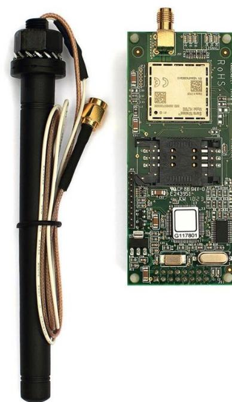
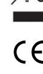
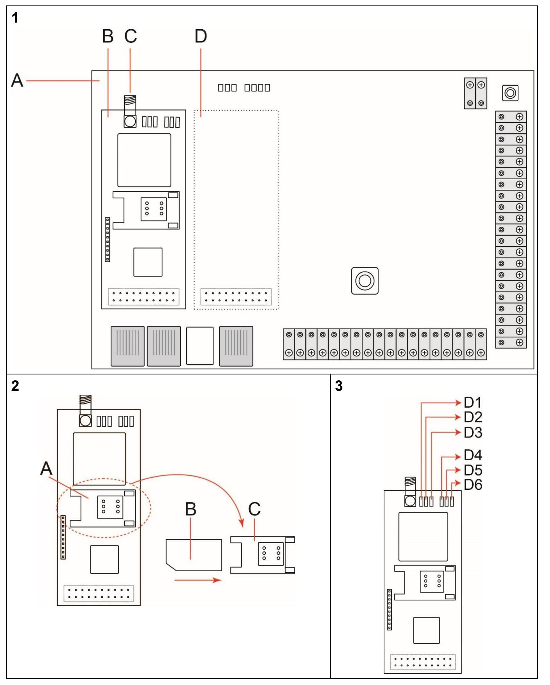
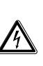
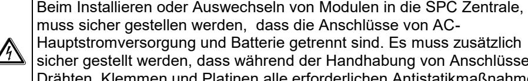
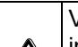
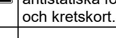

# **SPCN340**

**GSM (4G) module incl. Antenna (en) GSM-modul (4G) inkl. antenne (da) GSM-Modul (4G) mit Antenne (de) Módulo GSM (4G) con Antena (es) Module GSM (4G) avec antenne (fr) GSM-modul (4G)inkl. antenn (sv)**

Vanderbilt Clonshaugh Business and Technology Park Clonshaugh Dublin D17 KV84 Ireland http://www.vanderbiltindustries.com/

**Article Number:** V54550-B102_A300 **Document ID:** I-200373 **Edition:** 14.10.2019

# **English – Instructions**

This device must only be connected to SPC42xx/43xx/52xx/53xx/63xx.

## **EC Declaration of Conformity**

Hereby, Vanderbilt International (IRL) Ltd declares that this radio equipment type is in compliance with all relevant EU Directives for CE marking.

- EMC directive:2014/30/EU
- LVD directive: 2014/35/EU
- RE directive (RED): 2014/53/EU

The full text of the EU declaration of conformity is available at https://vanderbiltindustries.com/compliance-documents

#### **Package contents**

- SPCN340 x1
- Antenna x 1
- Mounting pillar x 4

#### **Product overview**

The SPCN340 modem provides the SPC controller with a GSM (4G) interface. The modem supports 4G and 2G communications, enabling IP communications to central station software, SPC Connect, and mobile technologies. Analogue central stations are also supported for SIA, Extended SIA, Contact ID, and Fast Format. The "Pay As You Go" (PAYG) credit balance can also be read by SPC controller when a PAYG SIM is used with a provider that supports USSD credit checks. For a description of the GSM (4G) features please consult the *SPC4xxx/5xxx/6xxx Installation & Configuration Manual*.

### **Installing the SPCN340**

| A proportions of the proposition of the proposition of the former of the first of the first to the first to the first to the first to the first to the first the first to the fi |  |  |
|-------------------------------------------------------------------------------------------------------------------------------------------------------------------------------------|--|--|
|                                                                                                                                                                                     |  |  |
|                                                                                                                                                                                     |  |  |

When replacing or installing modules on the SPC system, always ensure that the mains supply and the battery are disconnected. Ensure that all antistatic precautions are adhered to when handling connectors, wires, terminals and PCBs.

Do not reduce the standard-size SIM card to micro- or nano-size.

The SPCN340 must have a standard-size SIM card installed in the unit to operate. The SIM card must be in the holder before power is applied to the SPC system (see below for details on installing the SIM card).

#### **See Fig. 1: SPCN340**

- **A** Controller PCB (Printed Circuit Board)
- **B** SPCN340 in the primary slot on the controller PCB
- **C** SMA connector for antenna
- **D** Secondary slot

Before installing the GSM (4G) module onto the SPC controller, ensure that a functioning SIM card is installed on the module.

#### **See Fig. 2: Insert SIM Card**

- **A** SIM card holder
- **B** SIM card
- **C** Flap on SIM card holder

To insert a SIM card into the GSM (4G) module:

- 1. Place a finger on the SIM card holder (Fig. 2, Item A) and slide the SIM card holder flap (Fig. 2, item C) to the right
- 2. Rotate the SIM card holder flap to the 'up' position
- 3. Slide the SIM card (Fig. 2, Item B) into the SIM card holder flap.
- 4. Rotate the SIM card holder flap back to its original position.
- 5. Press and slide the SIM card holder flap to the left to click into place.

Make a note of the unlock code for your SIM card. The code is required when enabling the SIM card on the SPC system.

#### To install the SPCN340 (with SIM card):

- 1. Ensure the AC mains power and battery backup connections are removed.
- 2. Insert the push-in mounting pillars (included with the module) into the four hole positions on either the primary slot (left) or secondary slot (right) on the
- controller. 3. Align the 16-pin female socket over the 16-pin male connector, ensuring that the holes on the SPCN340 are aligned with the top of the mounting pillars.
- 4. Firmly but gently press down to secure the module.
- 
- 5. Attach the antenna (supplied) to the SMA connector (Fig. 1, item C) on the GSM (4G) module.

For new system installations, consider removing the knock-out for the antenna prior to mounting the housing on the wall.

- 6. Mount the antenna on the top of the housing using one of the 12mm knock-out holes provided. The 12mm knock-out holes align with the primary slot (left) and secondary slot (right). Ensure that the antenna is unobstructed.
- 7. Restore the AC mains power and battery backup connections to the controller.

### **LED Functionality**

There are six LEDs on the top of the modem module labelled D1 to D6 (See Fig.

3). These are used to indicate the status of the modem.

The function of each LED is as follows:

| LED   | State    | Indicates    | LED   | State    | Signal Strength |
|-------|----------|--------------|-------|----------|-----------------|
| D1    | Flashing | Power        | D4    | Off      | Low 1           |
| Green |          |              | Red   | Flashing | Low 2 - 3       |
|       |          |              |       | On       | Medium 4 - 5    |
| D2    | On       | Mast         | D5    | Flashing | Medium 6        |
| Green |          | connection   | Amber | On       | High 7          |
| D3    | On       | Data         | D6    | Flashing | High 8          |
| Green |          | Transmission | Green | On       | Very High 9     |

### **Configuring the SPCN340**

For configuration instructions, please refer to the Configuring Modems sections of the *SPC4xxx/5xxx/6xxx Installation & Configuration Manual*.

For 4G performance ensure that the panel firmware is updated with version 3.11 or later.

#### **Technical Data**

| 4G: 800MHz/900MHz/1800MHz        |  |  |  |
|----------------------------------|--|--|--|
| 2G: 900 MHz/1800MHz              |  |  |  |
| Max. 130 mA at 12 VDC            |  |  |  |
| Max. 40 mA at 12 VDC             |  |  |  |
| -10 to +50 °C                    |  |  |  |
| Max. 90 % (non-condensing)       |  |  |  |
| Plug on module to SPC controller |  |  |  |
| 90mm x 38mm x 25mm (PCB)         |  |  |  |
| 0.130 kg                         |  |  |  |
| Pending: EN                      |  |  |  |
|                                  |  |  |  |

#### **Ordering Information**

| SPCN340.000 GSM (4G) Module incl. Antenna |                     | V54550-B102-A300 |  |  |
|-------------------------------------------------|---------------------|------------------|--|--|
| SPCW101.000                                     | External aerial kit | V54559-B101-A100 |  |  |

# **Dansk – Instruktioner**

Denne enhed må kun tilsluttes en SPC central

SPC42xx/43xx/52xx/53xx/63xx

### **EN Direktiver og godkendelse**

Hermed erklærer Vanderbilt International (IRL) Ltd, at denne transmissions enhed er i overensstemmelse med følgende EU-direktiver for CE-mærkning:

- Direktiv 2014/30 / EU (EMC Direktivet)
- Direktiv 2014/35 / EU (lavspændingsdirektivet)
- Direktiv 2014/53/EU (radioudstyrdirektivet)

Den fulde ordlyd af EU-overensstemmelseserklæringen er tilgængelig på: https://vanderbiltindustries.com/compliance-documents

### **Pakkens indhold**

- SPCN340 x1
- Antenne x 1
- Monterings stag x 4

### **Produkt beskrivelse**

SPCN340-modemmet giver SPC-centralen et GSM-interface (4G). Modemmet understøtter 4G- og 2G-kommunikation, der muliggør IP-kommunikation til kontrolcentraler, SPC Connect og mobile teknologier. Analoge kontrolcentraler understøttes også for SIA, Extended SIA, Contact ID og Fast Format. Kreditsaldoen for "Pay As You Go" (PAYG) kan også aflæses af SPC-centralen, når et PAYG-SIM-kort anvendes med en udbyder, der understøtter USSDkredittjek.

Hvis du ønsker en beskrivelse af GSM-funktionerne (4G), se da manualen *installations- og konfigurationsmanualen til SPC4xxx/5xxx/6Xxx*.

### **Installation af SPCN340**

Ved udskiftning eller installation af moduler på SPC-systemet skal det altid sikres, at strømforsyningen og batteriet er frakoblet. Sørg for, at alle antistatiske forholdsregler overholdes ved håndtering af stik, ledninger,

- 
klemmer og printkort.

Reducer ikke SIM-kortets standardstørrelse til mikro- eller nanostørrelse.

SPCN340-enheden skal have et SIM-kort i standardstørrelse installeret for at kunne fungere. SIM-kortet skal sidde i holderen, før SPC-systemet strømforsynes (se oplysninger nedenfor om, hvordan SIM-kortet installeres).

**Se fig. 1: SPCN340**

**A** Centralens printkort

- **B** SPCN340 i det primære slot på centralens printkort
- **C** SMA-stik til antenne
- **D** Sekundært slot

Før GSM-modulet (4G) installeres på SPC-centralen, skal det sikres, at der er installeret et fungerende SIM-kort på modulet.

#### **Se fig. 2: Indsæt SIM-kort**

- **A** SIM-kortholder
- **B** SIM-kort
- **C** Flap på SIM-kortholder

Sådan indsættes et SIM-kort i GSM-modulet (4G):

- 1. Anbring en finger på SIM-kortholderen (fig. 2, A), og skub SIMkortholderflappen (fig. 2, punkt C) mod højre.
- 2. Drej SIM-kortholderflappen til positionen "op".
- 3. Skub SIM-kortet (fig. 2, punkt B) ind i SIM-kortholderflappen.
- 4. Drej SIM-kortholderflappen tilbage til dens oprindelige position.
- 5. Tryk på og skub SIM-kortholderflappen mod venstre for at klikke den på plads.

Skriv koden til oplåsning af dit SIM-kort ned. Koden skal bruges, når SIMkortet skal aktiveres på SPC-systemet.

Sådan installeres SPCN340 (med SIM-kort):

- 1. Sørg for, at forbindelsen til forsyningsnettet og batterisikring er afbrudt.
- 2. Isæt monterings-stagene (følger med modulet) ind i de fire huller på enten det primære slot (venstre) eller det sekundære slot (højre) på centralen.
- 3. Ret den 16-benede hunsokkel ind over det 16-benede hanstik, og sørg for, at hullerne på SPCN340 er rettet ind efter toppen af stigeledningerne.
- 4. Tryk forsigtigt ned for at fastgøre modulet.
- 5. Fastgør antennen (medfølger) på SMA-stikket (fig. 1, punkt C) på GSMmodulet (4G).

Ved installation af nye systemer er det en god ide at fjerne antenne udslags blanketten, før kabinettet monteres på væggen.

- 6. Monter antennen øverst på kabinettet ved hjælp af et af de tilgængelige 12 mm udslags blanketter. 12 mm udstøderhullerne er rettet ind efter det primære slot (venstre) og det sekundære slot (højre). Sørg for, at antennen ligger uhindret i kabinettet.
- 7. Genopret centralens forbindelse til forsyningsnettet og batterisikringen.

### **LED-funktionalitet**

Der er seks LED-lamper øverst på modemmodulet mærket D1 til D6 (se fig. 3). De angiver modemmets status.

Hver LED-lampes funktion er som følger:

| LED  | Tilstand | Angiver         |  | LED  | Tilstand | Signalstyrke |
|------|----------|-----------------|--|------|----------|--------------|
| D1   | Blinker  | Tændt           |  | D4   | Slukket  | Lav 1        |
| Grøn |          | Rød             |  |      | Blinker  | Lav 2-3      |
|      |          |                 |  |      | Tændt    | Medium 4-5   |
| D2   | Tændt    | Mastforbindelse |  | D5   | Blinker  | Medium 6     |
| Grøn |          |                 |  | Gul  | Tændt    | Høj 7        |
| D3   | Tændt    | Data            |  | D6   | Blinker  | Høj 8        |
| Grøn |          | transmitteres   |  | Grøn | Tændt    | Meget Høj 9  |

### **Konfiguration af SPCN340**

Du kan finde konfigurationsanvisninger i afsnittene om konfiguration af modemmer i *installations- og konfigurationsmanualen til SPC4xxx/5xxx/6Xxx*.

For 4G-ydelse skal det sikres, at panelfirmwaren er opdateret med version 3.11 eller nyere.

### **Tekniske data**

| Netværksforbindelse    | 4G: 800 MHz/900 MHz/1800 MHz      |
|------------------------|-----------------------------------|
|                        | 2G: 900 MHz/1800 MHz              |
| Driftsstrøm            | Maks. 130 mA ved 12 VDC           |
| Hvilestrøm             | Maks. 40 mA ved 12 VDC            |
| Driftstemperatur       | -10 til +50 °C                    |
| Relativ luftfugtighed  | Maks. 90 % (ikke-kondenserende)   |
| Montering              | Tilslut modulet til SPC-centralen |
| Mål (B X H X D)        | 90 mm x 38 mm x 25 mm (printkort) |
| Vægt                   | 0,130 kg                          |
| Standarder/godkendelse | Afventer: EN                      |

#### **Bestillingsoplysninger**

| SPCN340.000 GSM-modul (4G) inkl. V54550-B102-A300 antenne |  |
|--------------------------------------------------------------------|--|
| SPCW101.000 Eksternt antenneudstyr V54559-B101-A100          |  |

## **Deutsch – Anweisungen**

**WARNUNG** - Dieses Gerät darf nur an SPC42xx / 43xx / 52xx / 53xx / 63xx angeschlossen werden.

### **EG-Konformitätserklärung**

Hiermit erklärt Vanderbilt International (IRL) AG, dass dieses gerätetyps den Anforderungen den folgenden EU-Richtlinien für die CE-Kennzeichnung entspricht:

- Richtlinie 2014/30/EU (Richtlinie über elektromagnetische Verträglichkeit
- Richtlinie 2014/35/EU (Niederspannungsrichtlinie)
- Richtlinie 2014/53/EU (Richtlinie über Funkanlagen)

Der vollständige Text der EU-Konformitätserklärung steht unter https://vanderbiltindustries.com/compliance-documents zur Verfügung.

### **Lieferumfang**

- 1 × SPCN340
- 1 × Antenne
- 4 × Montagezapfen

### **Produktübersicht**

Das SPCN340-Modem stellt eine GSM (4G)-Schnittstelle für die SPC-Zentrale zur Verfügung. Das Modem unterstützt die Kommunikationsstandards 4G und 2G und ermöglicht dadurch eine IP-Verbindungen mit einer Alarmempfangsoftware, mit SPC Connect sowie mit mobilen Technologien. Desweiteren wird die Kommunikation mit analogen Alarmempfangszentralen über die Protokolle SIA, Extended SIA, Contact ID und Fast Format unterstützt.

Bei Verwendung einer Prepaid-SIM-Karte kann das Guthaben über die SPC-Zentrale abgrufen werden, wenn der Provider die USSD-Bonitätsprüfung unterstützt. Eine Beschreibung der GSM (4G)-Funktionen ist im Installations- und Konfigurationshandbuch von SPC4xxx/5xxx/6xxx enthalten.

### **Installieren des SPCN340**

muss sicher gestellen werden, dass die Anschlüsse von AC-Hauptstromversorgung und Batterie getrennt sind. Es muss zusätzlich sicher gestellt werden, dass während der Handhabung von Anschlüssen,

Die SIM-Karte muss im Standardformat vorliegen und darf nicht auf das Format einer Micro- oder Nano-SIM zugeschnitten oder gestanzt werden.

Das SPCN340 benötigt für die ordnungsgemäße Funktionsweise eine SIM-Karte im Standardformat. Die SIM-Karte muss in den dafür vorgesehenen SIM-Kartenhalter eingelegt sein, bevor das System mit Strom versorgt wird. (Einzelheiten zur Installation der SIM-Karte siehe unten).

#### **Siehe Abb. 1: SPCN340**

**A** SPC-Zentralenplatine

**B** SPCN340 im primären Steckplatz auf der SPC-Zentralenplatine

- **C** SMA-Stecker für Antenne
- **D** Sekundärer Steckplatz

Vor dem Installieren des GSM (4G)-Moduls auf dem SPC-Controller, muss eine funktionsfähige SIM-Karte in das Modul einsteckt sein.

#### **Siehe Abb. 2: Einstecken der SIM-Karte**

| A | SIM-Kartenhalter |
|---|------------------|
| B | SIM-Karte        |

- **C** Klappe des SIM-Kartenhalters
Einstecken einer SIM-Karte in das GSM (4G)-Modul:

- 1. Finger auf dem SIM-Kartenhalter (Abb. 2, Element A) platzieren und die Halteklappe der SIM-Karte (Abb. 2, Element C) nach rechts schieben.
- 2. Die Halteklappe der SIM-Karte senkrecht klappen.
- 3. Die SIM-Karte (Abb. 2, Element B) in die Halteklappe für die SIM-Karte einlegen.
- 4. Die Halteklappe der SIM-Karte in ihre ursprüngliche Position klappen.
- 5. Die Halteklappe der SIM-Karte nach unter drücken und anschließend bis zum Einrasten nach links schieben.

Der Entsperrcode der SIM-Karte muss unbedingt notiert werden. Dieser wird für die Aktivierung der SIM-Karten im System benötigt.

Installieren des SPCN340 (mit SIM-Karte):

- 1. Sicherstellen, dass die Anschlüsse AC-Hauptstromversorgung und Batterie getrennt sind.
- 2. Die Montagezapfen (im Lieferumfang des Modems enthalten) in die vier Löcher des primären (links) oder sekundären Steckplatzes (rechts) auf die Zentralenplatine stecken.
- 3. Die 16-polige Buchse über dem 16-poligen Stecker ausrichten und dabei sicherstellen, dass die Löcher des SPCN340 auf die Montagezapfen ausgerichtet sind.
- 4. Das Modul vorsichtig bis zum Einrasten des Moduls nach unten drücken.
- 5. Die Antenne (im Lieferumfang des SPCN340 enthalten) an den SMA-Anschluss (Abb. 1, Element C) des GSM (4G)-Moduls anschließen.
- Bei neuen Systeminstallationen muß die vorgestanzte Öffnung für die Antenne vor der Befestigung des Gehäuses an der Wand entfernt werden
- 6. Die Antenne auf der Oberseite der Gehäuse mit zur Hilfenahme der vorgestanzten 12mm-Öffnungen montieren. Die 12mm-Öffnungen stimmen hierbei mit dem primären Steckplatz (links) und dem sekundären Steckplatz (rechts) überein. Die Antenne darf generell nicht verdeckt sein.
- 7. Die Verbindung der Anschlüsse AC-Hauptstromanschluss und Batterie wieder anschließen.

## **LED-Funktionen**

Auf dem Modem befinden sich sechs LEDs mit den Kennzeichnungen D1 bis D6 (siehe Abb. 3). Sie geben Hinweise über den Status des Modems. Den LEDs sind folgende Funktionen zugeordnet:

| LED  | Status  | Anzeige für      |  | LED  | Status  | Signalstärke |
|------|---------|------------------|--|------|---------|--------------|
| D1   | Blinken | Stromversorgung  |  | D4   | Aus     | Niedrig 1    |
| Grün |         |                  |  | Rot  | Blinken | Niedrig 2–3  |
|      |         |                  |  |      | Ein     | Mittel 4–5   |
| D2   | Ein     | Verbindung mit   |  | D5   | Blinken | Mittel 6     |
| Grün |         | Sendemast        |  | Gelb | Ein     | Hoch 7       |
| D3   | Ein     | Datenübertragung |  | D6   | Blinken | Hoch 8       |
| Grün |         |                  |  | Grün | Ein     | Sehr Hoch 9  |

### **Konfigurieren des SPCN340**

Konfigurationsanleitungen sind im *Installations- und Konfigurationshandbuch von SPC4xxx/5xxx/6xxx* in den Abschnitten zur Modemkonfiguration enthalten.

Für den 4G-Support des Modems, muß sicher gestellt sein, dass die Zentralen-Firmware mindestens Version 3.11 oder höher ist.

#### **Technische Daten**

| Netzwerkanschluss       | 4G: 800MHz/900MHz/1800MHz        |
|-------------------------|----------------------------------|
|                         | 2G: 900 MHz/1800MHz              |
| Betriebsstrom           | max. 130 mA bei 12 VDC           |
| Ruhestrom               | max. 40 mA bei 12 VDC            |
| Betriebstemperatur      | -10 nach +50 °C                  |
| Rel. Luftfeuchtigkeit   | max. 90 % (nicht kondensierend)  |
| Montage                 | Aufsteckmodul für SPC-Controller |
| Abmessungen (B × H × T) | 90mm × 38mm × 25mm (Platine)     |
| Gewicht                 | 0,130 kg                         |
| Normen/Zulassungen      | Ausstehend: EN                   |

#### **Bestellangaben**

| SPCN340.000 | GSM (4G)-Modul mit Antenne | V54550-B102-A300 |
|-------------|-------------------------------|------------------|
| SPCW101.000 | Externer Antennensatz         | V54559-B101-A100 |

### **Español – Instrucciones**

**ADVERTENCIA -** Este dispositivo solo debe conectarse a SPC42xx / 43xx / 52xx / 53xx / 63xx.

#### **Declaración de conformidad CE**

Por la presente, Vanderbilt International (IRL) Ltd declara que este tipo de equipo cumple con todas las directivas de la UE relevantes para el marcado CE.

- Directiva 2014/30/UE (directiva de compatibilidad electromagnética)
- Directiva 2014/35/UE (directiva sobre baja tensión)
- Directiva 2014/53/UE (directiva de equipos radioeléctricos)

El texto completo de la declaración UE de conformidad está disponible en https://vanderbiltindustries.com/compliance-documents

### **Contenido del paquete**

- 1 x unidad SPCN340
- 1 x antena
- 4 x terminales de montaje

### **Descripción del producto**

El módem SPCN340 proporciona al controlador SPC una interfaz GSM (4G). Este módem admite comunicaciones 4G y 2G, lo que permite la comunicación por IP con el software de la central receptora de alarmas, SPC Connect y tecnologías móviles. Las receptoras analógicas también son compatibles con SIA, SIA Extendido, Contact ID y Formato rápido.

Cuando se utiliza una tarjeta SIM de prepago, el estado del crédito de prepago también se puede leer desde el controlador SPC con un proveedor que admite comprobaciones de crédito de USSD.

Para ver una descripción de las características de GSM (4G), consulte el *Manual de instalación y configuración de SPC4xxx/5xxx/6xxx.*

#### **Instalación del SPCN340**

Al sustituir o instalar módulos en el sistema SPC, asegúrese siempre de que el equipo esté desconectado de la red de alimentación y de la batería. Debe adoptar todas las precauciones antiestáticas al manipular conectores, cables, terminales y placas.

No reduzca la tarjeta SIM de tamaño estándar al tamaño micro o nano.

El SPCN340 debe tener una tarjeta SIM de tamaño estándar instalada en la unidad para funcionar. La tarjeta SIM debe estar en el soporte antes de encenderse el sistema SPC (abajo encontrará más información sobre la instalación de la tarjeta SIM).

#### **Véase Fig. 1: SPCN340**

- **A** Placa de circuito impreso (PCB) del controlador
- **B** SPCN340 en la ranura principal de la PCB del controlador
- **C** Conector SMA para antena
- **D** Ranura secundaria

Antes de instalar el módulo GSM (4G) en el controlador SPC, asegúrese de que dispone de una tarjeta SIM instalada en el módulo que funcione correctamente.

#### **Véase Fig. 2: Insertar la tarjeta SIM**

**A** Soporte de la tarjeta SIM

**B** Tarjeta SIM

- **C** Tapa del soporte de la tarjeta SIM
Para insertar una tarjeta SIM en el módulo GSM (4G):

- 1. Coloque un dedo sobre el soporte de la tarjeta SIM (Fig. 2, elemento A) y deslice la tapa del soporte de la tarjeta SIM (Fig. 2, elemento C) a la derecha.
- 2. Gire la tapa del soporte de la tarjeta SIM a la posición "hacia arriba"
- 3. Deslice la tarjeta SIM (Fig. 2, elemento B) hacia dentro de la tapa del soporte de la tarjeta SIM.
- 4. Gire la tapa del soporte de la tarjeta SIM devolviéndola a su posición original.
- 5. Presione y deslice la tapa del soporte de la tarjeta SIM a la izquierda de modo que encaje en su sitio con un clic.

Anote el código de desbloqueo de su tarjeta SIM. Este código será necesario a la hora de activar la tarjeta SIM en el sistema SPC.

Para instalar el SPCN340 (con tarjeta SIM):

- 1. Asegúrese de que se han desconectado la alimentación de C.A. y las conexiones de copia de seguridad de la batería.
- 2. Inserte los terminales de montaje enchufables (incluidos con el módulo) en los cuatro orificios, ya sea en la ranura principal (izquierda) del controlador o en la secundaria (derecha).
- 3. Alinee el enchufe hembra de 16 pines sobre el conector macho de 16 pines, asegurándose de que los orificios del SPCN340 estén alineados con la parte superior de los terminales de montaje.
- 4. Presione firmemente, pero con cuidado, para ajustar el módulo.
- 5. Conecte la antena (suministrada con el SPCN340) al conector SMA (Fig. 1, elemento C) del módulo GSM (4G).

Para instalar un nuevo sistema, deberá eliminar los orificios perforados para la antena antes de montar la carcasa en la pared.

- 6. Monte la antena en la parte superior de la carcasa a través de uno de los agujeros perforados de 12 mm existentes. Los orificios perforados de 12 mm se alinean con la ranura principal (izquierda) y la ranura secundaria (derecha). Asegúrese de que la antena no esté obstruida.
- 7. Restablezca la alimentación de C.A. y las conexiones de la batería con el controlador.

#### **Funcionalidad LED**

Hay seis LED en la parte superior del módulo de módem con las etiquetas D1 a D6 (véase Fig. 3). Estos LED sirven para indicar el estado del módem. Las funciones de cada uno de los LED son las siguientes:

| LED   | Estado      | Indica       |  | LED   | Estado      | Intensidad de la señal |
|-------|-------------|--------------|--|-------|-------------|---------------------------|
| D1    | Parpadeando | Alimentación |  | D4    | Apagado     | Baja 1                    |
| Verde |             |              |  | Rojo  | Parpadeando | Baja 2 - 3                |
|       |             |              |  |       | Encendido   | Media 4 - 5               |
| D2    | Encendido   | Conexión     |  | D5    | Parpadeando | Media 6                   |
| Verde |             | con antena   |  | Ámbar | Encendido   | Alta 7                    |
| D3    | Encendido   | Transmisión  |  | D6    | Parpadeando | Alta 8                    |
| Verde |             | de datos     |  | Verde | Encendido   | Muy Alta 9                |

### **Configuración del SPCN340**

Las instrucciones de configuración se pueden consultar en las secciones de configuración de módems del *Manual de instalación y configuración de SPC4xxx/5xxx/6xxx*.

| Para el rendimiento 4G asegúrese de que el firmware del panel se |
|------------------------------------------------------------------|
| actualiza con la versión 3.11 o posterior.                       |

#### **Datos técnicos**

| Conexión de red                  | 4G: 800MHz/900MHz/1800MHz                  |
|----------------------------------|--------------------------------------------|
|                                  | 2G: 900 MHz/1800MHz                        |
| Corriente de funcionamiento      | Máx. 130 mA a 12 VCC                       |
| Corriente de reposo              | Máx. 40 mA a 12 VCC                        |
| Temperatura de funcionamiento | -10 a +50 °C                               |
| Humedad relativa                 | Máx. 90% (sin condensación)                |
| Montaje                          | Módulo complementario para controlador SPC |
| Dimensiones (An. × Al. × Pr.) | 90mm x 38mm x 25mm (PCI)                   |
| Peso                             | 0,130 kg                                   |
| Estándares/ aprobación           | Pendiente: Homologación EN                 |
|                                  |                                            |

#### **Información para pedidos**

| SPCN340.000 | Módulo GSM (4G) con antena | V54550-B102-A300 |
|-------------|-------------------------------|------------------|
| SPCW101.000 | Kit de antena externa         | V54559-B101-A100 |

# **Français – Instructions**

**AVERTISSEMENT -** Cet appareil doit uniquement être connecté à SPC42xx / 43xx / 52xx / 53xx / 63xx.

#### **Déclaration de conformité CE**

Par la présente, Vanderbilt International (IRL) Ltd déclare que le type d'équipement considéré est en conformité avec toutes les directives UE applicables relatives au marquage CE.

- Directive 2014/30/UE (directive compatibilité électromagnétique (CEM))
	- Directive 2014/35/UE (directive basse tension)
- Directive 2014/53/UE (directive dite RED relative à l'équipement radio)
- Le texte intégral de la déclaration de conformité aux directives de l'Union

- 
européenne est disponible à https://vanderbiltindustries.com/compliancedocuments.

### **Contenu de l'emballage**

- SPCN340
- 1 antenne
- 4 picots de montage

### **Description générale**

Le modem SPCN340 dote la centrale SPC d'une interface GSM (4G). Le modem prend en charge les communications 4G et 2G, et permet les communications IP avec le logiciel du centre de télésurveillance, SPC Connect, et les technologies mobiles. Les centres de télésurveillance analogiques sont également pris en charge pour SIA, Extended SIA, Contact ID, et Fast Format. Le crédit d'une carte prépayée « Pay As You Go » (PAYG) peut également être lu par la centrale SPC lorsqu'une carte SIM PAYG est utilisée avec un fournisseur qui prend en charge les vérifications de crédit USSD.

Pour la description des fonctions GSM (4G), veuillez consulter le *Manuel d'installation et de configuration de SPC4xxx/5xxx/6xxx*.

### **Installation du SPCN340**

Lors du remplacement ou de l'installation de modules sur le système SPC, assurez toujours que l'alimentation électrique et la batterie sont

déconnectées. Assurez-vous que toutes les précautions antistatiques sont respectées lors de la manipulation des connecteurs, fils, bornes et cartes de circuit imprimé.

Le SPCN340 doit contenir une carte SIM de taille standard pour être opérationnel. La carte SIM doit être installée avant de mettre le système SPC sous tension (voir ci-dessous pour obtenir des détails sur l'installation de la carte SIM).

**Voir la Fig. 1 : SPCN340**

- **A** Carte de circuit imprimé de la centrale
- **B** SPCN340 dans l'emplacement primaire de la carte de circuit imprimé
- **C** Connecteur SMA pour l'antenne
- **D** Emplacement secondaire

Avant d'installer le module GSM (4G) sur la centrale SPC, assurez-vous qu'une carte SIM en état de marche est installée sur le module.

#### **Voir la Fig. 2 : Insertion de la carte SIM**

- **A** Support de carte SIM
- **B** Carte SIM
- **C** Patte du support de carte SIM

Pour insérer une carte SIM dans le module GSM (4G) :

- 1. Posez un doigt sur le support de la carte SIM (Fig. 2 A) et faites glisser la patte du support de la carte SIM (Fig. 2 - C) vers la droite.
- 2. Tournez la patte du support de la carte SIM vers le haut.
- 3. Faites glisser la carte SIM (Fig. 2 B) dans la patte du support de la carte SIM.
- 4. Tournez la patte du support de la carte SIM dans sa position initiale.
- 5. Appuyez et glissez la patte du support de la carte SIM vers la gauche jusqu'à entendre un clic audible.

Notez le code de déblocage de votre carte SIM. Ce code vous sera demandé pour activer la carte SIM sur le SPC.

Pour installer le SPCN340 (avec la carte SIM) :

- 1. Assurez-vous que les connexions de l'alimentation électrique CA et de la batterie de secours sont débranchées.
- 2. Insérez les picots de montage (inclus avec le module) dans les quatre orifices de l'emplacement principal (gauche) ou de l'emplacement secondaire (droite) de la centrale.
- 3. Alignez la prise femelle à 16 broches sur le connecteur mâle à 16 broches, en vous assurant que les trous du SPCN340 sont alignés sur la partie supérieure des picots de montage.
- 4. Appuyez fermement mais sans forcer pour fixer le module.
- 5. Branchez l'antenne (fournie avec le SPCN340) sur le connecteur SMA (Fig. 1 C) situé sur le module GSM (4G).

Pour l'installation d'un nouveau système, ouvrez le cas échéant le trou préperforé pour l'antenne avant de monter le boîtier sur le mur.

6. Montez l'antenne en haut du boîtier en utilisant l'un des trous pré-perforés de 12 mm prévus. Les trous pré-perforés de 12 mm sont alignés sur l'emplacement principal (gauche) et l'emplacement secondaire (droite). Assurez-vous qu'aucun obstacle ne vient gêner la communication avec l'antenne.

- 7. Rebranchez les connexions de l'alimentation électrique CA et de la batterie de secours sur la centrale.
### **Fonction des voyants**

6 témoins sont situés en haut du module de modem. Ils sont identifiés par D1 à D6 (voir Fig. 3). Ils servent à indiquer l'état du modem.

Les voyants ont la signification suivante :

| TÉMOIN LED | État       | Indication   | TÉMOIN LED | État       | Puissance du signal |
|---------------|------------|--------------|---------------|------------|------------------------|
| D1            | Clignotant | Sous tension | D4            | Éteint     | Faible 1               |
| Vert          |            |              | Rouge         | Clignotant | Faible 2 - 3           |
|               |            |              |               | Allumé     | Moyenne 4 - 5       |
| D2            | Allumé     | Connexion au | D5            | Clignotant | Moyenne 6              |
| Vert          |            | réseau       | Orange        | Allumé     | Élevée 7               |
| D3            | Allumé     | Transmission | D6            | Clignotant | Élevée 8               |
| Vert          |            | de données   | Vert          | Allumé     | Très Élevée 9       |

### **Configuration du SPCN340**

Pour la description de la configuration, veuillez lire le chapitre Configuration des modems du *Manuel d'installation et de configuration de SPC4xxx/5xxx/6xxx*.

Pour les performances 4G, assurez-vous que la version 3.11 ou supérieure du microprogramme est installée.

### **Caractéristiques techniques**

| 4G: 800MHz/900MHz/1800MHz               |
|-----------------------------------------|
| 2G: 900 MHz/1800MHz                     |
| 130 mA maxi à 12 VCC                    |
| 40 mA maxi à 12 VCC                     |
| -10 à +50 °C                            |
| 90 % max. (sans condensation)           |
| Module d'extension pour la centrale SPC |
| 90mm x 38mm x 25mm (circuit imprimé)    |
|                                         |

- 

| Poids                 | 0,130 kg                     |
|-----------------------|------------------------------|
| Normes / homologation | En attente : Homologation EN |

#### **Bestelinformatie**

| SPCN340.000 | GSM (4G)-module incl. antenne | V54550-B102-A300 |
|-------------|----------------------------------|------------------|
| SPCW101.000 | Externe antennekit               | V54559-B101-A100 |

### **Svenska –** Instruktioner

**VARNING-** Enheten får endast anslutas till SPC42xx / 43xx / 52xx / 53xx / 63xx.

### **EC Konformitetsdeklaration**

Härmed försäkrar Vanderbilt International (IRL) Ltd att denna typ av överensstämmer med alla relevanta EG-direktiv för CE-märkning.

- Direktiv 2014/30/EG (Direktiv om elektromagnetisk kompatibilitet)
- Direktiv 2014/35/EG (Direktiv om lågspänning)
- Direktiv 2014/53/EG (Direktiv om radioutrustning)

Den fullständiga texten för EG-försäkran om överensstämmelse finns på https://vanderbiltindustries.com/compliance-documents.

#### **Förpackningens innehåll**

- SPCN340 x 1
- Antenn x 1
- Monteringspluggar x 4

#### **Produktöversikt**

Modemet SPCN340 gör att SPC centralen får ett GSM (4G) gränssnitt. Modemet stödjer kommunikation via 4G och 2G nät, vilket gör det möjligt att sända IPkommunikation till larmmottagare och programvara, SPC Connect och mobila teknologier. Analoga larmmottagare stöds även för SIA, Extended SIA, Contact ID och Fast Format.

"Pay As You Go" (PAYG) saldokontroll kan också hämtas av SPC centralen när ett PAYG-SIM används med en leverantör som stöder USSD saldokontroller. För en beskrivning av GSM (4G) funktionen kan du läsa Installations och konfigurationshandbok till SPC4xxx/5xxx/6xxx.

#### **Installation av SPCN340**

Var noga med att alltid koppla ur elnätet och batteriet vid utbyte eller

installation av moduler i SPC-systemet. Var noga med att följa alla antistatiska försiktighetsåtgärder vid hantering av kontakter, ledningar, poler

Minska inte SIM-kortet i normalstorlek till storleken mikro eller nano.

Du måste installera ett SIM-kort i normalstorlek i SPCN340-enheten för att den ska fungera på rätt sätt. SIM-kortet måste vara placerat i hållaren innan strömmen slås på till SPC-systemet (se nedan för anvisningar om hur man installerar SIM-kortet).

#### **Se bild 1: SPCN340 A** Mönsterkort (PCB) till styrenheten

- **B** SPCN340 i den primära platsen på styrenhetens mönsterkort
- **C** SMA-uttag till antenn
- **D** Sekundär plats

Innan du installerar GSM (4G)-modulen på SPC-styrenheten, måste du se till att ett fungerande SIM-kort har installerats i modulen.

#### **Se bild 2: Isättning av SIM-kort**

- **A** SIM-korthållare
- **B** SIM-kort
- **C** Flik på SIM-korthållaren

Gör så här för att sätta i ett SIM-kort i GSM (4G)-modulen:

- 1. Placera ett finger på SIM-korthållaren (bild 2, objekt A) och skjut fliken på SIMkorthållaren (bild 2, objekt C) åt höger.
- 2. Vrid SIM-korthållarens flik till positionen "upp".
- 3. Skjut in SIM-kortet (bild 2, objekt B) i fliken på SIM-korthållaren.
- 4. Vrid tillbaka SIM-korthållarens flik till den ursprungliga positionen.
- 5. Tryck på och skjut SIM-korthållarens flik till vänster så att den klickar fast på plats.

Notera upplåsningskoden till SIM-kortet. Du kommer att behöva koden när du ska aktivera SIM-kortet på SPC-systemet.

Gör så här för att installera SPCN340 (med SIM-kort):

- 1. Försäkra dig om att strömförsörjningen (AC) och anslutningen för batteribackup är bortkopplade.
- 2. Stoppa in tryckpluggarna för montering (medföljer tillsammans med modulen) i de fyra hålpositionerna på antingen den primära platsen (vänster) eller på den sekundära (höger) på styrenheten.
- 3. Rikta in honkontakten med 16 stift ovanför hanuttaget med 16 stift och se till att hålen på SPCN340 är inriktade mot de över delarna på monteringspluggarna.
- 4. Tryck försiktigt men bestämt nedåt för att sätta fast modulen.
- 5. Anslut antennen (medföljer tillsammans med SPCN340-enheten) till SMAuttaget (bild 1, objekt C) på GSM (4G)-modulen.

| Vid installation av nya system kan man välja att ta bort uttryckningsdelarna |
|------------------------------------------------------------------------------|
| för antennen innan man montera kåpan på väggen.                              |

- 6. Montera antennen ovanpå kåpan genom att använda ett av de uttryckningshål på 12 mm som är markerade. Uttryckningshålen på 12 mm är placerade så att de passar med den primära platsen (vänster) och den sekundära platsen (höger). Se till att det inte finns några hinder i vägen för antennen.
- 7. Slå på strömförsörjningen (AC) och anslut batteribackupen till styrenheten.

### **Lysdiodernas funktion**

Det sitter sex lysdioder på modemmodulens ovansida. Dessa är märkta med D1– D6 (se bild 3). Dessa används för att indikera modemets status.

Funktionerna för var och en av dessa lysdioder är följande:

| LYSDIOD          | Status  | Indikation för |           | LYSDIOD    | Status  | Signalstyrka |
|------------------|---------|----------------|-----------|------------|---------|--------------|
| D1               | Blinkar | Ström på       |           | D4         | Av      | Låg 1        |
| Grönt ljus       |         |                | Rött ljus |            | Blinkar | Låg 2–3      |
|                  |         |                |           |            | På      | Medium 4–5   |
| D2               | På      | Mastanslutning |           | D5         | Blinkar | Medium 6     |
| Grönt ljus       |         |                |           | Orange     | På      | Hög 7        |
|                  |         |                |           | ljus       |         |              |
| D3 Grönt ljus | På      | Dataöverföring |           | D6         | Blinkar | Hög 8        |
|                  |         |                |           | Grönt ljus | På      | Mycket Hög 9 |

#### **Konfigurering av SPCN340**

För konfigurationsanvisningar kan du läsa avsnitten under Konfiguration av modem i *Installations- och konfigurationshandbok till SPC4xxx/5xxx/6xxx*.

| För 4G prestanda, se till att centralens firmware har uppdaterats till version |
|--------------------------------------------------------------------------------|
| 3.11 eller högre.                                                              |

#### **Tekniska data**

| Nätverksanslutning     | 4G: 800MHz/900MHz/1800MHz              |  |
|------------------------|----------------------------------------|--|
|                        | 2G: 900 MHz/1800MHz                    |  |
| Driftsström            | Max. 130 mA vid 12 VDC                 |  |
| Viloström              | Max. 40 mA vid 12 VDC                  |  |
| Drifttemperatur        | -10 till +50 °C                        |  |
| Relativ luftfuktighet  | Max. 90 % (ingen kondens)              |  |
| Montering              | Plug-on-modul till SPC-kontrollenheten |  |
| Mått (B x H x D)       | 90mm x 38mm x 25mm (kretskort)         |  |
| Vikt                   | 0,130 kg                               |  |
| Standarder/godkännande | Väntar på: Godkännande från EN         |  |

#### **Beställningsinformation**

| SPCN340.000 | GSM-modul inklusive antenn | V54550-B102-A300 |
|-------------|----------------------------|------------------|
| SPCW101.000 | Extern antennsats          | V54559-B101-A100 |