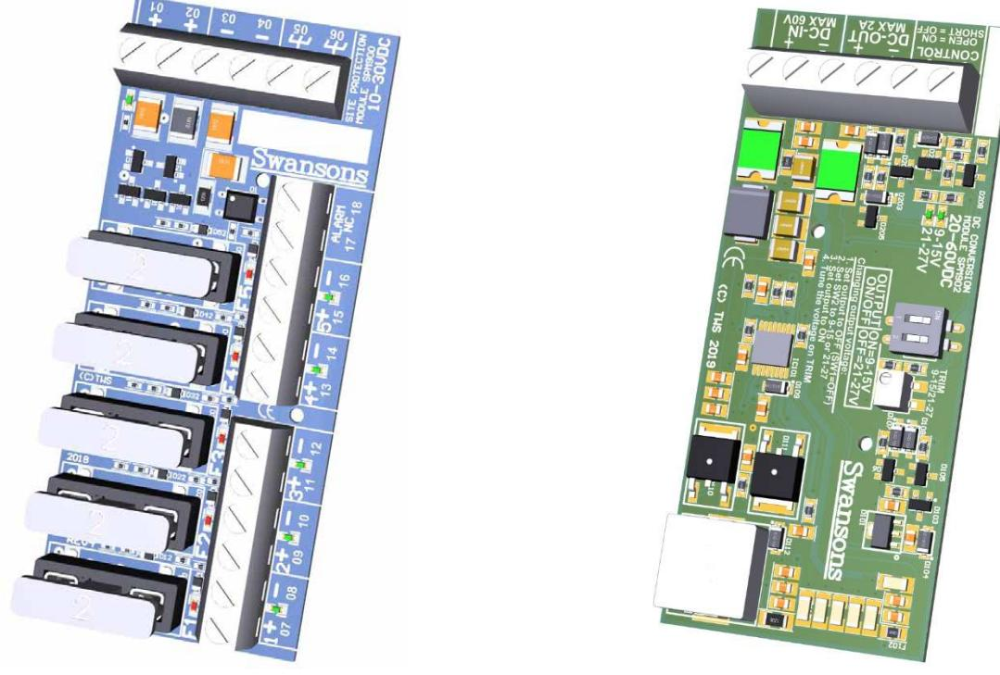

# SPM90x-Moduler

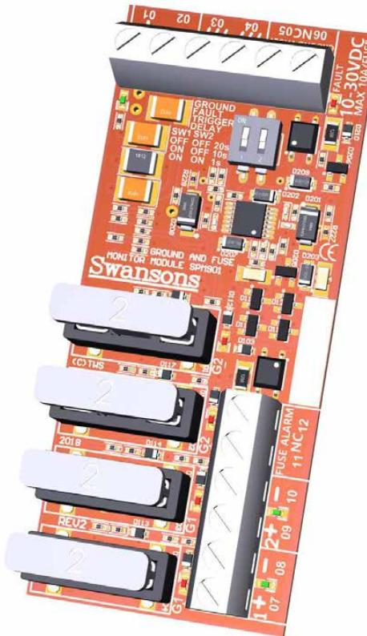

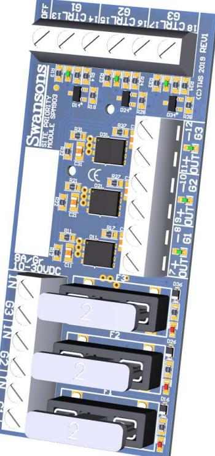

 Installation, planering och funktion Rev 3

| 1   | Säkerhet och support  2         |  |
|-----|---------------------------------|--|
| 1.1 | Support  2                      |  |
| 2   | Modulöversikt 3                 |  |
| 2.1 | Grundläggande  3                |  |
| 2.2 | SPM900  3                       |  |
| 2.3 | SPM901  3                       |  |
| 2.4 | SPM902  3                       |  |
| 2.5 | SPM903  3                       |  |
| 3   | SPM900  4                       |  |
| 3.1 | Översikt  4                     |  |
| 3.2 | Funktioner  5                   |  |
| 3.3 | Installation  5                 |  |
| 4   | SPM901 – SLÄPPS under 2019!  6  |  |
| 4.1 | Översikt  6                     |  |
| 4.2 | Funktioner  7                   |  |
| 4.3 | Installation  7                 |  |
| 5   | SPM902 – SLÄPPS under 2019!  8  |  |
| 5.1 | Översikt  8                     |  |
| 5.2 | Funktioner  9                   |  |
| 5.3 | Installation  9                 |  |
| 6   | SPM903 – SLÄPPS under 2019!  10 |  |
| 6.1 | Översikt  10                    |  |
| 6.2 | Funktioner  11                  |  |
| 6.3 | Installation  11                |  |
| 7   | Dokumenthistorik  12            |  |
| 7.1 | Revision 1  12                  |  |
| 7.2 | Revision 2  12                  |  |

# 1 Säkerhet och support

- Endast auktoriserad och erfaren personal inom AC och DC får använda, arbeta, serva/underhålla och installera dessa enheter.
- Denna manual skall läsas igenom grundligt och förstås av all handhavande personal. Vid minsta tveksamhet om systemets uppbyggnad, funktion, komponenter samt säkerhet skall leverantören kontaktas.

#### 1.1 Support

För teknisk support, kontakta Swansons på mail support@swtm.se.

# 2 Modulöversikt

# 2.1 Grundläggande

SPM90x-modulkort är formfaktorbaserade på Linjators L-moduler (86 x 36.5mm) (se www.linjator.se). Modulerna passar i ett flertal olika kapslingssystem så som det utbud som finns hos bl.a. Swansons, TLab West, VMC och Linjator. Alla moduler har sin specifika funktion men kan även kombineras för att uppnå andra/utökade funktioner (se mer om detta i senare kapitel). Linjator erbjuder även ett stort antal andra moduler med olika funktioner som med fördel kan användas tillsammans med SPM90x-serien.

# 2.2 SPM900

SPM900 är ett klassiskt säkringskort för enkelpolig (+) avsäkring. Kortet har 5 grupper och en gemensam larmutgång för säkringsfel. Förutom att avsäkra utgående spänning ger även SPM900 ett utökat skydd för överspänningar, åska och andra transienter.

# 2.3 SPM901

SPM901 är ett säkringskort som erbjuder två dubbelt (+ och -) avsäkrade grupper med larmutgång samt även jordfelsdetektering med egen larmutgång. Även SPM901 erbjuder utökat skydd mot överspänningar, åska och andra transienter.

# 2.4 SPM902

SPM902 är en DC/DC omvandlare som reglerar ned inkommande spänning med hög effektivitet. Den kan användas i såväl 24V anläggningar för att erhålla en stabil 12VDC eller i PoE system och där omvandla 48VDC till 12 eller 24VDC.

#### 2.5 SPM903

SPM903 är ett avsäkrings- och prioritetsstyrningskort som kan användas för att bortkoppla oprioriterade laster eller som ett avsäkrat utgångskort. SPM903 har tre helt individuella kanaler.

# 3 SPM900

# 3.1 Översikt

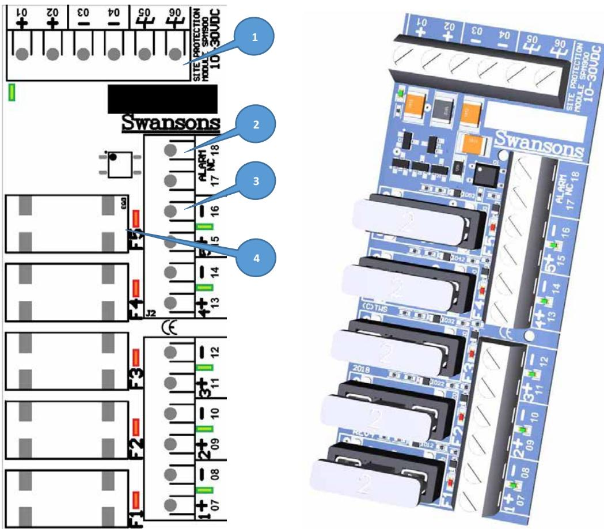

- 1. Anlutningsplint för inkommande spänning och jord som även kan användas som vidarekoppling till ytterligare kort. Grön LED till vänster i bild indikerar inkommande spänning.
- 2. Larmutgång som kommer vara SLUTEN om alla säkringar är hela och spänningen in till modulen är över 5VDC
- 3. Grupputgångar (5st) med grön LED som indikerar att säkringen är hel och att spänning finns
- 4. Gruppsäkningar (5st) för respektive grupputgång med röd LED som indikerar att säkring är trasig

| Anslutning nr.     | Funktion                                  | Kommentar                                                                         |
|--------------------|-------------------------------------------|-----------------------------------------------------------------------------------|
| 01, 02             | Inkommande/Utgående +                     | 10-30VDC                                                                          |
| 03, 04             | Inkommande/Utgående -                     | 10-30VDC                                                                          |
| 05, 06             | Inkommande/Utgående jord                  | Används endast för transientskydd (valfri)                                        |
| 07, 09, 11, 13, 15 | Grupputgångar avsäkrad +                  | Max 6A/grupp, Max 10A/kort (kontinuerlig ström vid max 10°C temperaturhöjning) |
| 08, 10, 12, 14, 16 | Grupputgångar –                           | (ej avsäkrad)                                                                     |
| 17/18              | Larmutgång, sluten om alla säkringar hela | Max 300mA @ 30VAC/DC last                                                         |

Inkommande spänning kopplas direkt vidare via säkringarna till grupputgångarna och tänder upp de gröns LEDs som sitter vid respektive utgång. Om alla utgångar är spänningssatta (alla säkringar hela) så kommer larmutgången att vara sluten. Skulle någon säkring skulle lösa ut kommer respektive grön LED att slockna, röd LED tänds och larmutgången bryts.

# 3.3 Installation

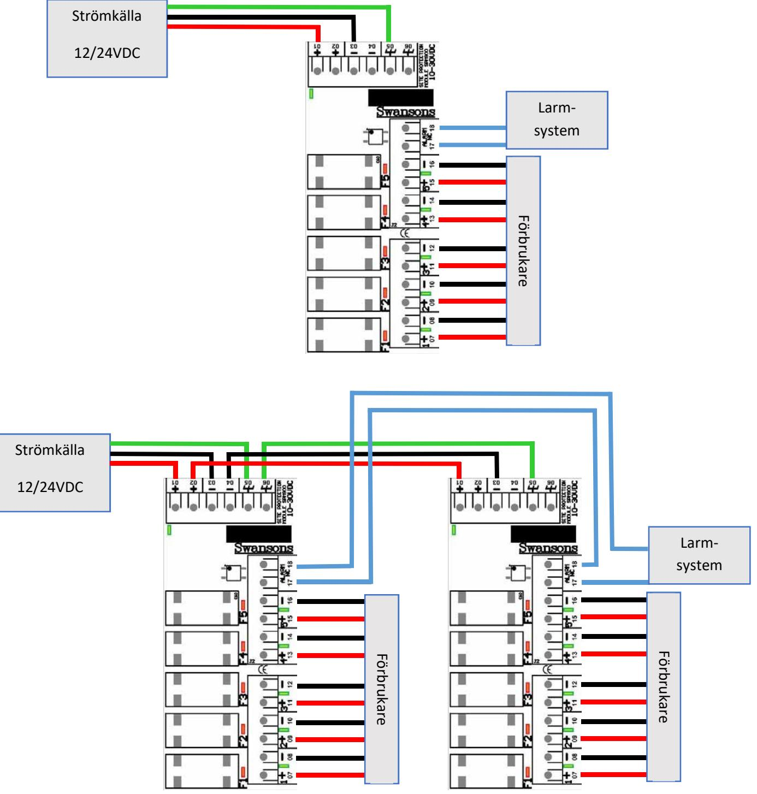

# 4 SPM901 – SLÄPPS under 2019!

# 4.1 Översikt

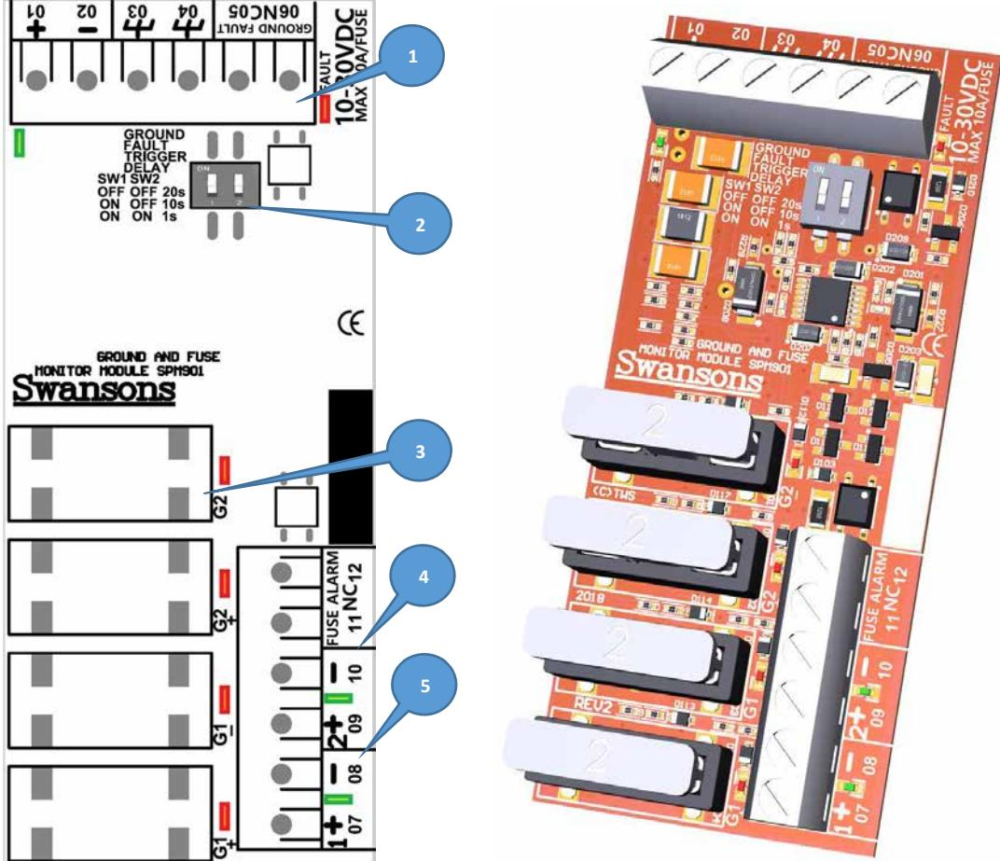

- 1. Anlutningsplint för inkommande spänning och jord. Grön LED till vänster i bild indikerar inkommande spänning. Röd LED till höger indikerar utlöst jordfel.
- 2. DIP-brytare för inställning av tillslagsfördröjning av jordfel (frånslag är alltid fördröjt ca. 1s).
- 3. Gruppsäkningar (4st/2 grupper) för respektive grupputgång med röd LED som indikerar att säkring är trasig
- 4. Larmutgång som kommer vara SLUTEN om alla säkringar är hela och spänningen in till modulen är över 5VDC

| Anslutning nr. | Funktion                                  | Kommentar                                  |
|----------------|-------------------------------------------|--------------------------------------------|
| 01             | Inkommande/Utgående +                     | 10-30VDC                                   |
| 02             | Inkommande/Utgående -                     | 10-30VDC                                   |
| 03, 04         | Inkommande/Utgående jord                  |                                            |
| 05, 06         | Larmutgång, bryter vid jordfel            | Fördröjning ställs på DIP-brytare          |
| 07/08          | Utgång +/- till förbrukare                | Avsäkrade via G1+ och G1- säkring, max 10A |
| 09/10          | Utgång +/- till förbrukare                | Avsäkrade via G2+ och G2- säkring, max 10A |
| 11/12          | Larmutgång, sluten om alla säkringar hela | Max 300mA @ 30VAC/DC last                  |

- 5. Grupputgångar (2st) med grön LED som indikerar att säkringen är hel och att spänning finns

Inkommande spänning kopplas vidare till grupputgångarna via säkringar på båda polerna. Om alla säkringar är hela kommer den gröna lysdioden vid respektive grupputgång att vara tänd. Skulle någon säkring lösa ut kommer respektive grupps gröna lysdiod att släckas och röd lysdiod kommer indikera vilken säkring som löst ut. Om någon säkring är utlöst kommer larmutgången för säkringslarm (FUSE ALARM/11-12) att brytas.

Modulen övervakar kontinuerligt resistansen mellan inkommande +, inkommande – och jord. Skulle resistansen mellan dessa poler och jord understiga 10kΩ under inställd tid kommer utgången för jordfel (GROUND FAULT/05-06) att brytas samt röd LED vid utgång tändas. Inställningen för tid görs på DIP-brytaren (kan göras under drift) enligt följande:

| Brytare 1 | Brytare 2 | Tillslagsfördröjning (ca) |
|-----------|-----------|---------------------------|
| ON        | ON        | 1 sekund                  |
| ON        | OFF       | 10 sekunder               |
| OFF       | OFF       | 20 sekunder               |

OBS! Frånslagsfördröjning är alltid ca. 1 sekund.

# 4.3 Installation

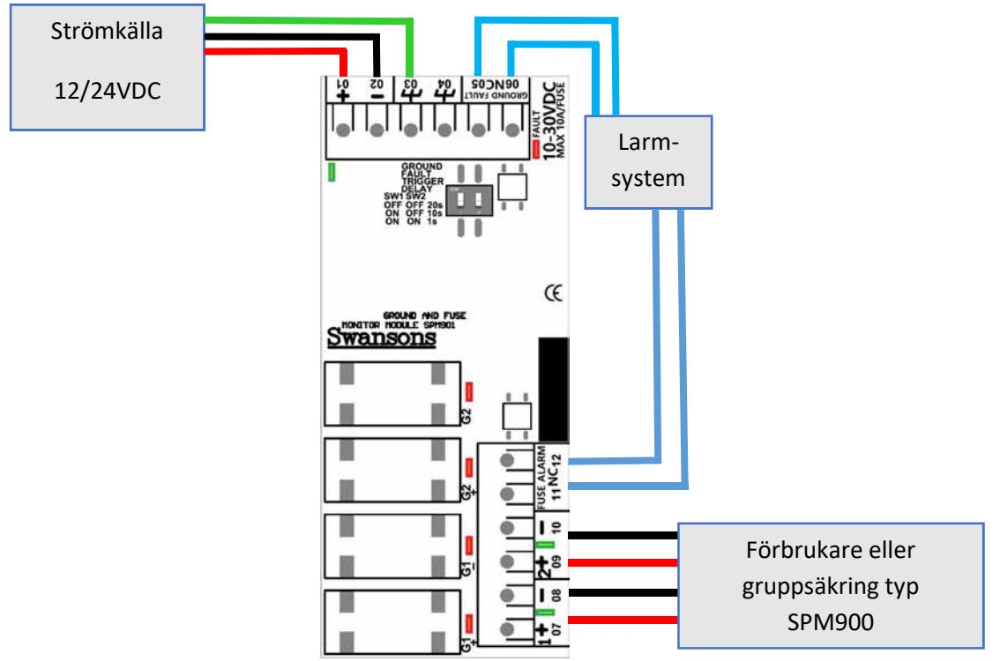

# 5 SPM902 – SLÄPPS under 2019!

# 5.1 Översikt

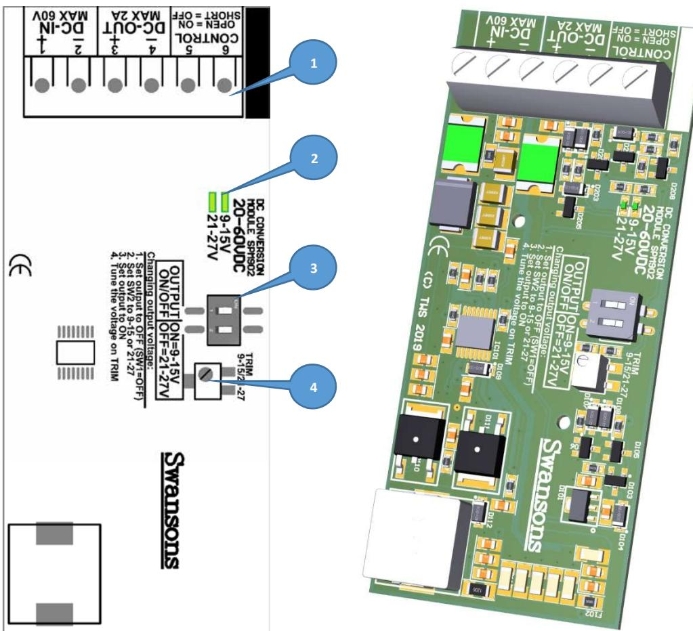

- 1. Anslutningsplint för inkommande DC, utgående DC samt ON/OFF
- 2. Lysdioder för indikering av utspänningsintervall
- 3. DIP-brytare för grov inställning av utspänning
- 4. Vridreglage för fin-trimmning av utspänning

| Anslutning nr. | Funktion          | Kommentar                               |
|----------------|-------------------|-----------------------------------------|
| 1, 2           | Inkommande DC +/- | Max 60VDC, strömbegränsad till 1A       |
| 3, 4           | Utgående DC +/-   | Strömbegränsad till 2A                  |
| 5, 6           | ON/OFF styrning   | Kortsluts för avstängning av utspänning |

Inkommande spänning regleras till lägre volt och matas ut på utgående poler. Omvandlingen sker med en s.k. Switch-regulator vilket gör att upp till 95% effektivitet kan uppnås. Den inkommande spänningen bör vara minst 5V högre än utgående, d.v.s. för att kunna få ut 12VDC skall inspänning vara minst 17VDC. Enheten kan hantera inspänningar på upp till 60VDC.

Utspänning justeras grovt på DIP-Switch och fin-trimmas på vridreglaget (10-varvig) enligt följande:

| Brytare 1 | Brytare 2 | Vridreglage         |
|-----------|-----------|---------------------|
| ON        | ON        | Ca. 9-15V           |
| ON        | OFF       | Ca. 21-28V          |
| OFF       | -         | Utspänning avstängd |

För att ställa utspänning med enheten inkopplad skall följande steg göras:

- 1. Sätt brytare 1 i OFF (regulatorn stängs av)
- 2. Ställ brytare 2 i valfritt läge (ON för 9-15V, OFF för 21-28V)
- 3. Ställ brytare 1 i ON (starta regulator)
- 4. Finjustera utspänning på vridreglage och kontrollera med multimeter på plint

OBS! Om utgående last är inkopplad vid moment 3 säkerställ att inkopplad utrustning klarar val max-spänning (d.v.s. 15 eller 28V beroende på inställningen på brytare 2).

Modulen kan även fjärrstyras AV/PÅ genom att sluta/bryta styrsignalen på anslutning 5/6 med externt relä. Sluts denna ingång kommer utspänning direkt att sjunka till 0V.

## 5.3 Installation

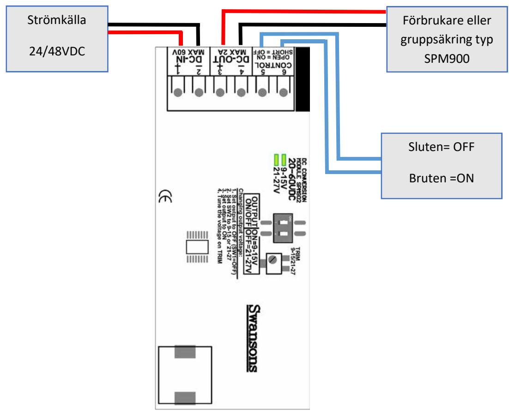

# 6 SPM903 – SLÄPPS under 2019!

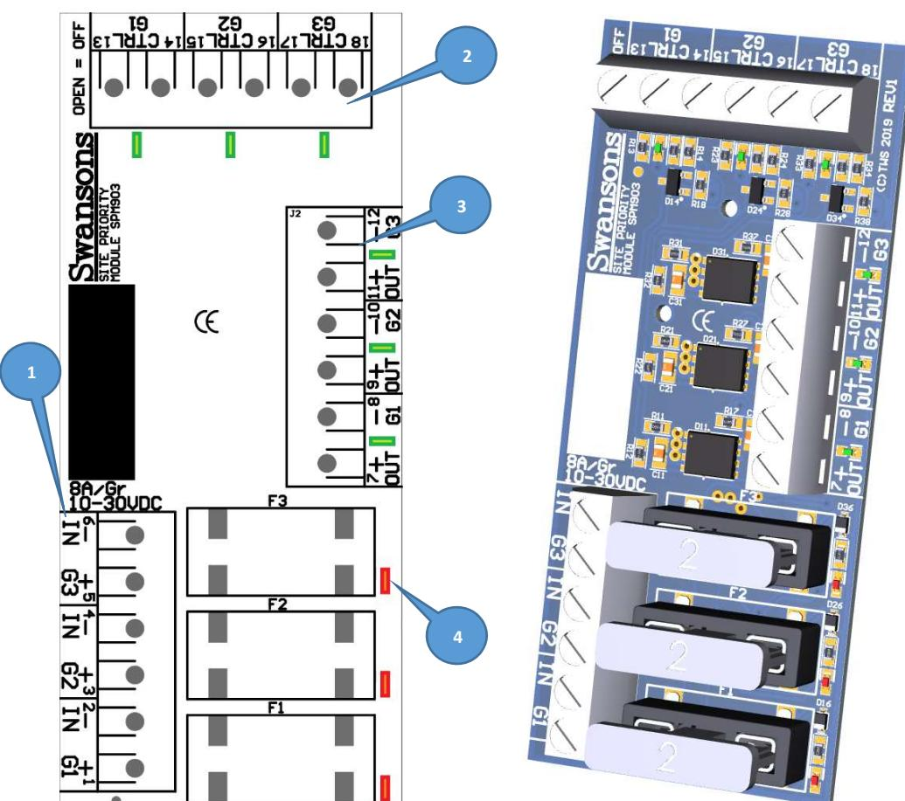

- 1. Inkommande spänning till respektive grupp
- 2. Styrningar för respektive grupp, grön LED lyser om spänning ut är aktiverat (sluten ingång)
- 3. Utgångar för respektive grupp, grön LED lyser om spänning matas ut
- 4. Avsäkringar för respektive grupp, röd LED indikerar om säkring löst ut

| Anslutning nr. | Funktion                   | Kommentar                       |
|----------------|----------------------------|---------------------------------|
| 1/2            | Inkommande +/- för grupp 1 | 10-30VDC                        |
| 3/4            | Inkommande +/- för grupp 2 | 10-30VDC                        |
| 5/6            | Inkommande +/- för grupp 3 | 10-30VDC                        |
| 7/8            | Utgående +/- för grupp 1   | Avsäkrad via F1, max 8A         |
| 9/10           | Utgående +/- för grupp 2   | Avsäkrad via F2, max 8A         |
| 11/12          | Utgående +/- för grupp 3   | Avsäkrad via F3, max 8A         |
| 13/14          | Styrning grupp 1           | Slutning för att aktivera grupp |
| 15/16          | Styrning grupp 2           | Slutning för att aktivera grupp |
| 17/18          | Styrning grupp 3           | Slutning för att aktivera grupp |

Kortets tre grupper är helt åtskilda varandra. När spänning matas in på t.ex. grupp 1 (1/2) kommer den skickas vidare till utgående plint för grupp (7/8) om slutning finns på styrningsingången (13/14). Om inte slutning finns på ingången kommer den positiva signalen (+) att brytas bort och grön LED vid styrningsingången kommer släckas. Varje utgång har en egen grön LED som tänds när spänning matas ut och varje grupps positiva (+) är avsäkrad. Vid varje säkring finns en röd LED som tänds om säkringen löser ut.

Då grupperna är isolerade från varandra kan de matas från olika spänningskällor och ha olika spänning (t.ex. 24VDC på en grupp och 12VDC på en annan).

#### 6.3 Installation

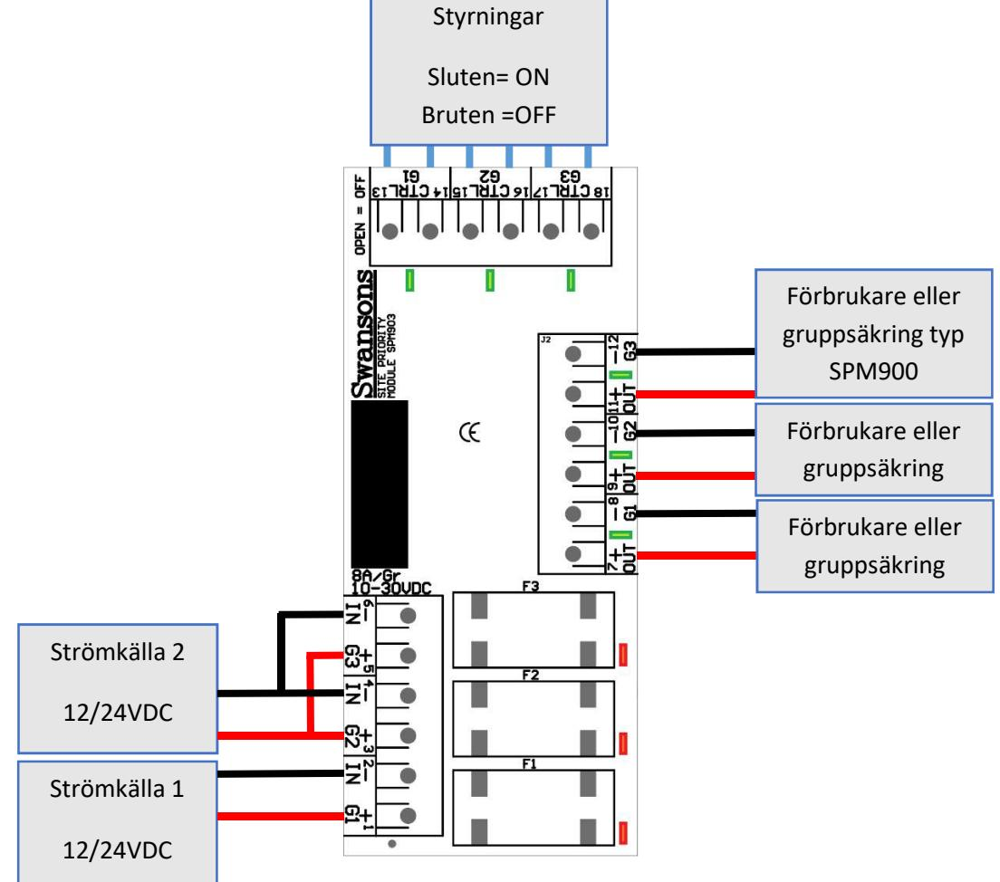

# 7 Dokumenthistorik

#### 7.1 Revision 1

Dokumentet upprättat 2019-01-16

## 7.2 Revision 2

Mindre revideringar efter granskning 2019-01-17

# 7.3 Revision 3

Mindre revideringar efter granskning 2019-01-17