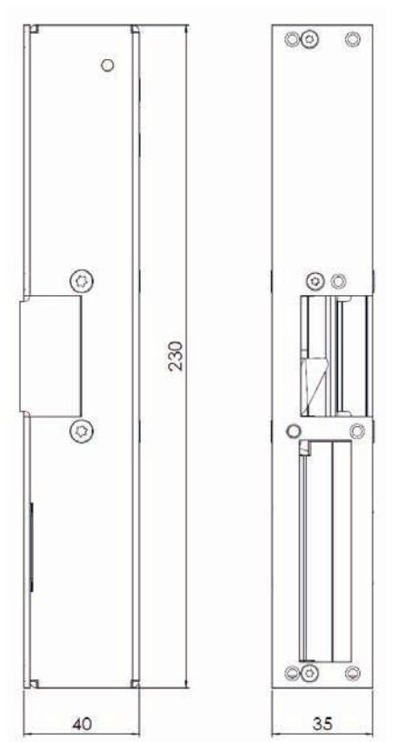
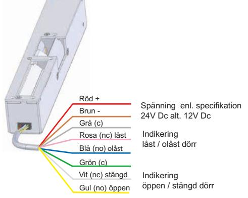

### VIKTIG INFORMATION

Läs bifogad installationsanvisning noggrant innan installation. Montagestolpens måttskiss är inkluderad i stolpens förpackning. Vid installation av produkten måste varningar och allmänna instruktioner följas. All bifogad dokumentation måste överlämnas av installatör till användare.

Före installation, säkerställ att dörr, karm är i gott skick och att rätt dörrhängning i kombination med beslag överensstämmer. Kontrollera certifikat innan installation i branddörr för att säkerställa att rätt kombination används. Kontrollera att dörrens konstruktion tillåter användning av elslutbleck. Kan användas i dubbel svängdörr om dörrens konstruktion tillåter elslutbleck. Beroende på dörrtyp (trä, stål eller aluminium) kan olika montage behövas (montagestolpe eller skruv). Vid installation i pardörr med dörrstängare, kontrollera om dörrkordinator krävs.

Under installation måste annan beslagning t.ex. tätningslister hanteras varsamt så att funktion på varken elslutbleck eller övrig beslagning påverkas. Var observant att urtag överensstämmer med montagestolpens måttskiss.

Efter installation, säkerställ att alla skruvar är åtdragna, skruvhuvuden inte sticker upp och att dörrbladet löper fritt.

För användning tillsammans med typgodkända dörrar i högst brandteknisk klass E60/A60/ EI60. Kontrollera att dörrens godkännande tillåter användning av elslutbleck enligt denna installationsanvisning.

Elslutbleck med ett vridfall för regellås. Låsets fallkolv skall vara i fast ingrepp. P800158B, Step 28E, i isolerad enkeldörr av stål P800158D, Step 28E, i isolerad enkeldörr av stål 2P02715, STEP 18, i enkeldörr i av stål

Säkerhetsegenskaperna på denna produkt är avgörande för dess överensstämmelse med EN 14846. Inga ändringar av något slag, andra är de som beskrivs i dessa anvisningar är tillåtna.

|               | Stendals EL AB Signalistgatan 17 721 31 Västerås, Sweden |   |   |         |  |   |  |  | CERTIFIERAD |          |
|---------------|----------------------------------------------------------------|---|---|---------|--|---|--|--|-------------|----------|
| 0402 - 18-03  | 16                                                             |   |   | STEP 18 |  |   |  |  |             |          |
| EN 14846:2008 | 3                                                              | V | 8 | 11      |  | M |  |  |             | C0517-14 |

#### KONTAKTA OSS

Kom ihåg att du alltid är välkommen att kontakta oss om du behöver hjälp. Maila eller ring vår tekniska support på info@steplock.se eller 021-480 12 13.

#### När det måste fungera.

# Installationsanvisning STEP 18 SecureTM

Omvänd funktion

2021, version 1

#### ARTIKELNUMMER

| Artikelnummer        | Benämning                                                                    |
|----------------------|------------------------------------------------------------------------------|
| ST181-A 7 mm         | Omvänd funktion 24 V DC, vänster. Anpassad för Connect. Inkl. 5 m kabel.     |
| ST181-A 7 mm 10 M    | Omvänd funktion 24 V DC, vänster. Anpassad för Connect. Inkl. 10 m kabel.    |
| ST181-A 9 mm         | Omvänd funktion 24 V DC, vänster. Anpassad för Connect. Inkl. 5 m kabel.     |
| ST181-A 9 mm 10 M    | Omvänd funktion 24 V DC, vänster. Anpassad för Connect. Inkl. 10 m kabel.    |
| ST181-A12 7 mm       | Omvänd funktion 12 V DC, vänster. Anpassad för Connect. Inkl. 5 m kabel.     |
| ST181-A12 9 mm       | Omvänd funktion 12 V DC, vänster. Anpassad för Connect. Inkl. 5 m kabel.     |
| ST181-B 7 mm         | Omvänd funktion 24 V DC, höger. Anpassad för Connect. Inkl. 5 m kabel.       |
| ST181-B 7 mm 10 M    | Omvänd funktion 24 V DC, höger. Anpassad för Connect. Inkl. 10 m kabel.      |
| ST181-B 9 mm         | Omvänd funktion 24 V DC, höger. Anpassad för Connect. Inkl. 5 m kabel.       |
| ST181-B 9 mm 10 M | Omvänd funktion 24 V DC, höger. Anpassad för Connect. Inkl. 10 m kabel.      |
| ST181-B12 7 mm       | Omvänd funktion 12 V DC, höger. Anpassad för Connect. Inkl. 5 m kabel.       |
| ST181-B12 9 mm       | Omvänd funktion 12 V DC, höger. Anpassad för Connect. Inkl. 5 m kabel.       |
| ST181-C 10 mm        | Omvänd funktion 24 V DC, vänster. Anpassad för Modul. Inkl. 5 m kabel.       |
| ST181-C 12 mm        | Omvänd funktion 24 V DC, vänster. Anpassad för Modul. Inkl. 5 m kabel.       |
| ST181-C12 10 mm      | Omvänd funktion 12 V DC, vänster. Anpassad för Modul. Inkl. 5 m kabel.       |
| ST181-C12 12 mm      | Omvänd funktion 12 V DC, vänster. Anpassad för Modul. Inkl. 5 m kabel.       |
| ST181-D 10 mm        | Omvänd funktion 24 V DC, höger. Anpassad för Modul. Inkl. 5 m kabel.         |
| ST181-D 12 mm        | Omvänd funktion 24 V DC, höger. Anpassad för Modul. Inkl. 5 m kabel.         |
| ST181-D12 10 mm      | Omvänd funktion 12 V DC, höger. Anpassad för Modul. Inkl. 5 m kabel.         |
| ST181-D12 12 mm      | Omvänd funktion 12 V DC, höger. Anpassad för Modul. Inkl. 5 m kabel.         |
| ST181-AS             | Omvänd funktion 24 V DC, vänster. För RC-klassifierade dörrar, med Assa 511. |
| ST181-AS12           | Omvänd funktion 12 V DC, vänster. För RC-klassifierade dörrar, med Assa 511. |
| ST181-BS             | Omvänd funktion 24 V DC, höger. För RC-klassifierade dörrar, med Assa 511.   |
| ST181-BS12           | Omvänd funktion 12 V DC, höger. För RC-klassifierade dörrar, med Assa 511.   |

#### TEKNISKA EGENSKAPER

- Durability: Grade Y enligt SS-EN 14846.
- Corrosion: Grade M enligt SS-EN 14846.
- Security: Grade 7 enligt SS-EN 14846.
- Security electrical manipulation: Grade 1 (omvänd) enl. SS-EN 14846.
- Vridfall i ytbehandlat stål, låshus i rostfritt stål.
- Brandgodkänd.
- Mikrobrytare enpoligt växlande, max. 30 V DC, 1 A.
- Inbyggd indikering för avkänning att dörren är stängd/öppen (kolvkontakt) och låst/olåst (spärrkontakt) för koppling till passersystem, larmanläggning etc.
- Skyddsdiod finns inbyggd.
- Brythållfasthet 15 kN (≈ 1500 kg).
- Öppnar trots listtryck på 5 kN (≈ 500 kg) i omvänd funktion.
- Knacksäkrad.
- Nödutrymningsfunktion enligt SS-EN179 erhålls med utrymningslås Assa 710, 711 och behör Assa 179-A, 179-B. Återinrymning via utvändigt trycke.

## STRÖMFÖRBRUKNING OCH KOPPLINGSSCHEMA

| Strömförbrukning 24 V DC        | Strömförbrukning 12 V DC       |
|---------------------------------|--------------------------------|
| 0 mA vid vridfall i vila        | 0 mA vid vridfall i vila       |
| 126 mA i omvänd funktion (låst) | 98 mA i omvänd funktion (låst) |
| 267 mA max                      | 545 mA max                     |

Kontakta oss vid system med balanserad larmslinga.

- Elslutblecket ska matas med fast stabiliserad likspänning, som avviker max +15 % / -10 % från märkspänningen.
- Indikering kolvkontakt: öppen / stängd dörr.
- Inkoppling: kontakt.

no nc no c nc c

kontakt Magnet Spärr

3.Blå

4. Rosa

6.Grå

8.Gul

5.Vit

7.Grön

1.Röd +12, 24V Dc

2.Brun -

Kolv

#### INSTALLATIONSANVISNING

- Se till att urtaget är rengjort från flisor och spån ordentligt.
- Montera montagestolpen på elslutblecket med 6 st M4X6 TUFLOK skruvar.
- STEP montagestolpe måste användas. Se montageritningen för att få rätt placering mot låskistan.
- Dörrspringan mellan låskistans stolpe och elslutbleckets montagestolpe ska vara 3 mm ± 1 mm.
- Säkerställ att det finns ett glapp mellan låsets regel och elslutbleckets vridfall på 1 mm ± 0,5 mm.
- Dörrlåsets regelkolv ska träffa och få vridfallet att rotera.
- Dörrlåsets fallkolv ska vid stängd dörr greppa in i fallkolvuttaget.
- Då elslutblecket är upplåst ska vridfallet lätt kunna rotera mellan öppet och stängt läge.
- Då elslutblecket är låst ska vridfallet vara spärrat när dörren är stängd.
- Var noga med att kabeln inte kläms när slutblecket fälls in i karmen.

Observera att STEP 18 Secure eller montagestolpen ej får övermålas.

#### UNDERHÅLLSANVISNING

- Kontrollera regelbundet elslutbleckets funktion och fastsättning i karmen.
- Två gånger per år, eller vid behov, ska vridfallet smörjas med fett. Använd ett tunt skikt av DIN 51502 fett.

Observera att STEP 18 Secure aldrig får smörjas med olja.