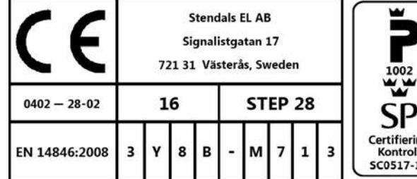
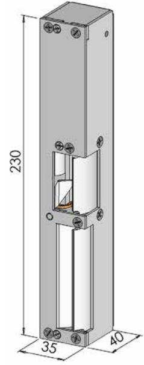
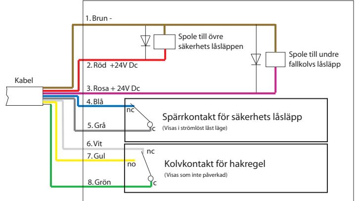
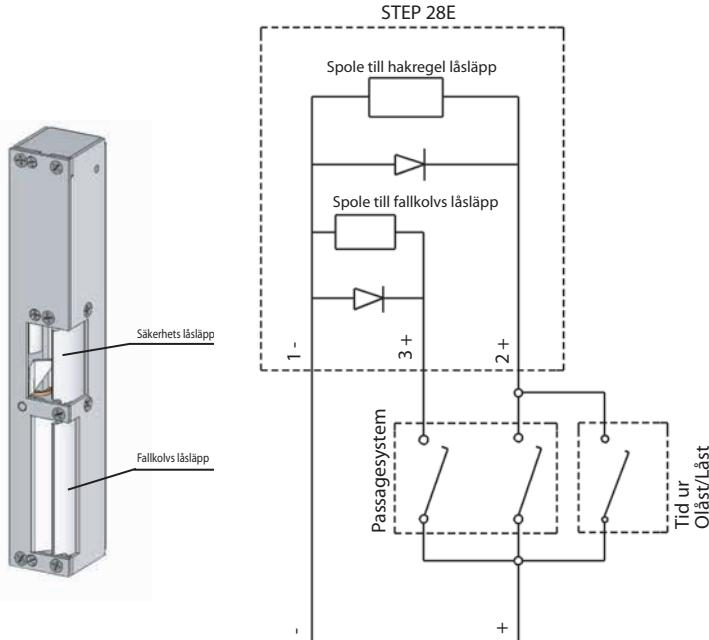

| Funktion       | Rättvänd funktion    |          |                      |            |  |
|----------------|----------------------|----------|----------------------|------------|--|
| Spänning       | 24 VDC + 15% / - 10% |          | 12 VDC + 15% / - 10% |            |  |
| Dörrhängning   | Vänster              | Höger    | Vänster              | Höger      |  |
| Art. nr. Evo   | ST280-AE             | ST280-BE | ST280-AE12           | ST280-BE12 |  |
| Art. nr. Modul | ST280-CE             | ST280-DE | ST280-CE12           | ST280-DE12 |  |
|                | 500 mA upplåst       |          | 1000 mA upplåst      |            |  |

| Funktion       | Omvänd funktion      |          |                      |            |  |
|----------------|----------------------|----------|----------------------|------------|--|
| Spänning       | 24 VDC + 15% / - 10% |          | 12 VDC + 15% / - 10% |            |  |
| Dörrhängning   | Vänster              | Höger    | Vänster              | Höger      |  |
| Art. nr. Evo   | ST281-AE             | ST281-BE | ST281-AE12           | ST281-BE12 |  |
| Art. nr. Modul | ST281-CE             | ST281-DE | ST281-CE12           | ST281-DE12 |  |
|                | 267 mA max           |          | 534 mA max           |            |  |

Läs bifogad installationsanvisning noggrant innan installation. Montagestolpens måttskiss är inkluderad i stolpens förpackning. Vid installation av produkten måste varningar och allmäna instruktioner följas. All bifogad dokumentation måste överlämnas av installatör till användare.

Före installation, säkerställ att dörr, karm är i gott skick och att rätt dörrhängning i kombination med beslag överensstämmer. Kontrollera certifikat innan installation i branddörr för att säkerställa att rätt kombination används. Kontrollera att dörrens konstruktion tillåter användning av elslutbleck. Kan användas i dubbel svängdörr om dörrens konstruktion tillåter elslutbleck. Beroende på dörrtyp (trä, stål eller aluminium) kan olika montage behövas (montagestolpe eller skruv). Vid installation i pardörr med dörrstängare, kontrollera om dörrkordinator krävs.

Under installation måste annan beslagning t.ex. tätningslister hanteras varsamt så att funktion på varken elslutbleck eller övrig beslagning påverkas. Var observant att urtag överensstämmer med montagestolpens måtskiss.

Efter installation, säkerställ att alla skruvar är åtdragna, skruvhuvuden inte sticker upp och att dörrbladet löper fritt.

För användning tillsammans med typgodkända dörrar i högst brandteknisk klass E60/A60/EI60. Kontrollera att dörrens godkännande tillåter användning av elslutbleck enligt denna installationsanvisning.

Elslutbleck med två vridfall för regellås. Vridfall som håller fallkolv skall utföras med rättvänd funktion.

P800158B, Step 28E, i isolerad enkeldörr av stål.

P800158D, Step 28E, i isolerad enkeldörr av stål

Säkerhetsegenskaperna på denna produkt är avgörande för dess överensstämmelse med EN 14846. Inga ändringar av något slag, andra är de som beskrivs i dessa anvisningar är tillåtna.

# Installationsanvisning STEP 28E Rättvänd funktion

STEP 28 elslutbleck används som ellåsning där dörrautomatik eller draghandtag skall kombineras med krav på brandtillhållning

- För att erhålla en god funktion skall montageritningen för montagestolpen användas för urtag och placering av montagestolpen. En springa på 3mm +/-1mm måste finnas mellan karm och dörr.
- Elslutblecket skall matas med märkspänningen ± 10%.
- Dörrlåsets regelkolv skall träffa och få vridfallet att rotera.
- Då elslutblecket är upplåst skall vridfallet lätt kunna rotera mellan öppet och stängt läge.
- Då elslutblecket är låst och dörren är stängd skall det övre vridfallet vara spärrat.
- Då elslutblecket upplåses skall dörren kunna öppnas utan att behöva använda trycket.
- Det undre vridfallet skall innesluta dörrlåsets fallkolv och skall endast öppnas vid passage följt av nedbrytning.

## Montage

STEP 28E skall monteras med monteringstople anpassad för låshuset i dörren.

- Montera montagestolpen med 6st M4X8 TUFLOK (bifogas i stolpförpackning).
- Undvik fil- och smärgelspån, då detta stör elslutbleckets funktion. Efter att urtag för slutblecket gjorts i karmen, skall urtaget rengöras.
- Var noga med att kabeln inte kläms när slutblecket trycks in i karmen.
- Elslutbleck eller montagestolpe får ej övermålas.
- Anslut elslutblecket enligt kopplingsschemat.

(Vid användande av panikutrymningsbeslag Assa 1125 med låshus 1525 skall föreglingstappen tas bort)

# Kopplingsschema STEP 28E

#### Exempel på inkoppling av STEP 28E rättvänd funktion

### Teknisk specifikation

- Vridfall i ytbehandlat stål, låshus och monteringsstolpe i rostfritt stål.
- Inbyggd indikering för avkänning att dörren är stängd/öppen(kolvkontakt) och låst/olåst (spärrkontakt) för koppling till passersystem, larmanläggning etc.
- Brythållfasthet 15 kN (1500 kg)
- Garanterar öppning trots listtryck på 5kN (500Kg) i rättvänd och omvänd funktion
- Nödutrymningsfunktion enligt Europastandard SS-EN179 erhålls med utrymningslås Assa 710, 711 och behör Assa 179-A, 179-B. Återinrymning via utvändigt trycke.
- Knackskyddad
- • Mikrobrytare enpoligt växlande
- Max. 30 VDC, 1 A
- Inbyggt transientskydd

## Underhållsanvisning

- •Elslutbleckets funktion skall kontrolleras med jämna mellanrum i samband med provning av brandcellsgränser och utrymningsvägar eller liknande.
- •Elslutbleckets fastsättning i karm bör kontrolleras 2 ggr/år.
- •Smörjning av vridfallet skall ske med ett tunt skikt låsfett (DIN 51502) 2ggr/år. Olja får aldrig användas.

Inkoppling av elslutbleck som skall vara öppet på t.ex. dagtid

Om elslutblecket skall vara öppet dagtid får endast tiduret kopplas till spolen som styr hakregel låsläppen. Dörren öppnas då med tryckeshandtaget eller från dörrautomatiken vid utpassage. Detta för att elslutblecket fortfarande skall bibehålla de brandigenhållande egenskaper som är krav.