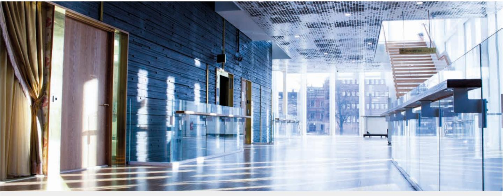
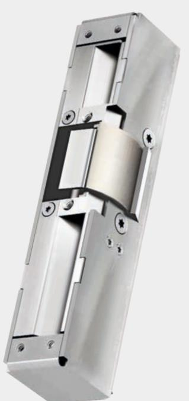
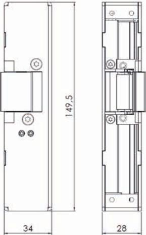
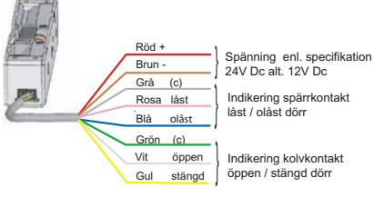

#### www.steplock.se

# – Kraftigt elslutbleck med unik prestanda STEP 60 SilentTM

STEP 60 Silent är en ny generation elslutbleck med överlägsen teknik anpassad för enkel- och dubbelfallås. Patenterad STEPteknik ger dörren en mjuk gång och en nästintill ljudlös öppning och stängning. Brandgodkänd upp till E/EI 120.

#### Minskad ljudnivå ger brett användningsområde

STEP 60 Silent har unika öppnings- och stängningsegenskaper som ger ett mycket brett användningsområde. En mjuk och tyst gång tillsammans med den kraftiga konstruktionen gör att STEP 60 Silent passar utmärkt i dörrar som används högfrekvent eller där en minskad ljudnivå är önskvärt. STEP 60 Silent förbättrar dörrmiljön i exempelvis flerbostadshus, kontor, skolor och sjukhus.

#### Hög säkerhet

STEP 60 Silent ger en hög intrångssäkerhet genom ett unikt vridfall som tar hela fallkolvens utlåsning, hög brytstyrka och ett elektriskt manövrerat knackskydd som omöjliggör manipulation av låsfunktionen. Brytstyrkan uppnås i både rättvänd och omvänd funktion.

#### Montagestolpar

Till STEP 60 Silent finns ett stort urval montagestolpar i rostfritt stål.

#### Passande låshus

- Enkel- och dubbelfallås i Connect-serien
- Enkel- och dubbelfallås i Modul-serien
- Enkel- och dubbelfallås i Smalprofil-serien

## Tekniska data

Brandgodkänd upp till E/EI 120

| Strömförbrukning i rättvänd funktion                                        |                          | Strömförbrukning i omvänd funktion |                          |
|-----------------------------------------------------------------------------|--------------------------|------------------------------------|--------------------------|
| 24 V DC + 15 % - 10 %                                                    | 12 V DC + 15 % - 10 % | 24 V DC + 15 % - 10 %           | 12 V DC + 15 % - 10 % |
| 250 mA max                                                                  | 500 mA max               | 193 mA max                         | 386 mA max               |
| 121 mA olåst                                                                | 242 mA olåst             | 105 mA låst                        | 210 mA låst              |
| Strömförbrukning 0 mA för vridfall i vila (rättvänd = låst, omvänd = olåst) |                          |                                    |                          |

| Artikelnummer | Benämning                                                       |
|---------------|-----------------------------------------------------------------|
| ST600         | Rättvänd funktion 24 V DC inklusive kolvkontakt och 5 m kabel.  |
| ST600 10 M    | Rättvänd funktion 24 V DC inklusive kolvkontakt och 10 m kabel. |
| ST600-12      | Rättvänd funktion 12 V DC inklusive kolvkontakt och 5 m kabel.  |
| ST600-12 10 M | Rättvänd funktion 12 V DC inklusive kolvkontakt och 10 m kabel. |
| ST601         | Omvänd funktion 24 V DC inklusive kolvkontakt och 5 m kabel.    |
| ST601 10 M    | Omvänd funktion 24 V DC inklusive kolvkontakt och 10 m kabel.   |
| ST601-12      | Omvänd funktion 12 V DC inklusive kolvkontakt och 5 m kabel.    |
| ST601-12 10 M | Omvänd funktion 12 V DC inklusive kolvkontakt och 10 m kabel.   |

- Durability: Grade X enligt SS-EN 14846.
- Corrosion: Grade M enligt SS-EN 14846.
- Security: Grade 3 enligt SS-EN 14846.
- Security electrical manipulation: Grade 3 (rättvänd) Grade 1 (omvänd) enligt SS-EN 14846.
- Brandgodkänd upp till brandteknisk klass E/EI 120.
- Mikrobrytare enpoligt växlande, max. 30 V DC, 1 A.
- Inbyggd indikering för avkänning att dörren är stängd/öppen (kolvkontakt) och låst/olåst (spärrkontakt) för koppling till passersystem, larmanläggning etc.
- Brythållfasthet 16 kN (≈ 1600 kg).
- Garanterar öppning trots listtryck på 1 kN (≈ 100 kg) i rättvänd och omvänd funktion.
- Skyddsdiod finns inbyggd.
- Knacksäkrad.
- Inklusive 5 eller 10 meter anslutningskabel.

### Med STEPs unika listtrycksteknik

Ett vanligt problem är att dörren utsätts för tryck, exempelvis på grund av att dörren är lite skev eller att det samlats grus eller snö vid tröskeln. STEP 60 Silent är utrustad med STEPs unika listtrycksteknik som gör att dörren kan låsa upp, även om den utsätts för tryck på upp till 100 kg.

- Tätningslister och tryckskillnader listtrycksfunktionen gör att dörren alltid kan låsas upp, trots att dörrlåset spänner mot elslutblecket.
- Dörrautomatik listtrycksfunktionen i kombination med en snabb upplåsning gör att dörren öppnas snabbt och utan risk för att fastna.
- Utrymningsdörr listtrycksfunktionen säkerställer att brandlarmet kan frilägga låsningen, trots tryck mot dörren av folkmassa, tätningslister, tryckskillnader eller sneda dörrar.

Måttskiss STEP 60 Silent.

Kopplingsschema med kolvkontakt.