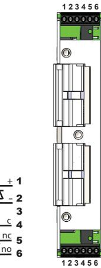
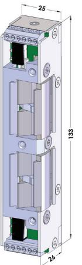
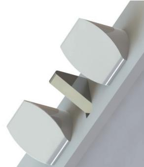
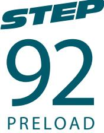

# Dubbelt elslutbleck för öppningsautomatik

STEP 92 Preload är en helt ny typ av elslutbleck. Elslutblecket har två vridfall anpassade för tryckesfall och cylinderfall i ett dubbelfalllås. Med en separat elektrisk låsning på varje fallkolv blir möjligheterna större för dörrar med öppningsautomatik eller draghandtag. STEP 92 Preload är brandgodkänd i A60/E60/EI60

## Separata vridfall ger nya funktioner

Det övre och undre vridfallet kan separat ställas i rättvänd eller omvänd funktion. STEP 92 Preload kan därmed anpassas till många olika dörrfunktioner.

### Listtrycksteknik

Både vridfallet för tryckesfall och cylinderfall hanterar listtryck, vilket ger en driftsäker öppning med automatiska dörröppnare.

Inkoppling sker med skruvplintar. Skyddsdiod finns inbyggd.

Mycket kompakt och grund för enkel installation

Dörrlåset ska vara dubbelfallås enligt skandinavisk standard

# Anpassar dörrfunktioner till automatiska dörröppnare

- Dörrautomatik med dagöppet i brandcellsgräns
- Dörrautomatik med nödutrymning och återinryming i brandcellsgräns
- Dörr i brandcellsgräns kan upplåsas via brandlarm för utrymning
- Olåst dörr i brandcellsgräns med öppningsautomatik kan utrustas med dubbelfallås och vara förberedd för elektrisk passagekontroll.

#### Driftsäkerhet och Utrymningssäkerhet

Tätningslister och tryckskillnader - Listrycksfunktionen medger att dörren alltid kan låsas upp trots att dörrlåset spänner mot elslutblecket

Dörrautomatik – Listrycksfunktionen i kombination med den snabba upplåsningen gör att dörren öppnas snabbt och utan risk för att fastna

Utrymningsdörr - Listrycksfunktionen säkerställer att brandlarmet kan frilägga låsningen, trots tryck mot dörren av folkmassa, tätningslister, tryckskillnader eller sneda dörrar

## Tekniska data

Brandgodkänd i A60/E60/EI60 Typgodkännandebevis 0450/01

#### Strömförbrukning per vridfall separat

| Rättvänd/Omvänd funktion |                    |
|--------------------------|--------------------|
| 24V Dc ± 10%             | 12V Dc ± 10%       |
| 110mAh / max 300 mA      | 220mAh / max 600mA |

#### Artikelnummer

| ST925    | Omställbar rättvänd-omvänd funktion 24V Dc inkl. kolvkontakt |
|----------|--------------------------------------------------------------|
| ST925-12 | Omställbar rättvänd-omvänd funktion 12V Dc inkl. kolvkontakt |

- Mikrobrytare enpoligt växlande, Max. 30V Dc, 1 A
- Skyddsdiod finns inbyggd
- Inbyggd indikering i båda vridfallen för avkänning att dörren är stängd/öppen(kolv kontakt)
- Brythållfasthet 9 kN (900kg)
- Garanterar öppning trots listtryck i rättvänd och omvänd funktion
- Knacksäkrad
- Vändbar för att passa höger- och vänsterdörrar
- För användning tillsammans med godkända dörrar i högst brandteknisk klass E 60/A 60/EI 60

#### Passande låshus

Dubbelfall-lås i Connect serien Dubbelfall-lås i Modul serien Dubbelfall-lås i Smalprofill serien

