### VIKTIG INFORMATION

Läs bifogad installationsanvisning noggrant innan installation. Eltryckeslåsets måttskiss är inkluderad i förpackningen. Vid installation av produkten måste varningar och allmänna instruktioner följas. All bifogad dokumentation måste överlämnas av installatör till användare.

Före installation, säkerställ att dörr, karm är i gott skick och att rätt dörrhängning i kombination med beslag överensstämmer. Kontrollera certifikat innan installation i dörr för att säkerställa att rätt kombination används.

För användning tillsammans med typgodkända dörrar i högst brandteknisk klass E/EI120. Kontrollera att dörrens konstruktion tillåter användning av eltryckeslås. Kan användas i dubbel svängdörr om dörrens konstruktion tillåter eltryckeslås.

Beroende på dörrtyp (trä, stål eller aluminium) kan olika montage behövas (låshusstolpe eller skruv). Vid installation i pardörr med dörrstängare, kontrollera om dörrkoordinator krävs.

|               | Stendals EL AB Signalistgatan 17 721 31 Västerås, Sweden |   |   |   |  |  |  |   |  |
|---------------|----------------------------------------------------------------|---|---|---|--|--|--|---|--|
| 0402 - 110-02 | STEP 110                                                       |   |   |   |  |  |  |   |  |
| EN 14846:2008 | 3                                                              | X | 6 | - |  |  |  | 1 |  |

KONTAKTA OSS

Kom ihåg att du alltid är välkommen att kontakta oss om du behöver hjälp. Maila eller ring vår tekniska support på info@steplock.se eller 021-480 12 13.

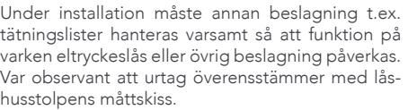

Efter installation, säkerställ att alla skruvar är åtdragna, skruvhuvuden inte sticker upp och att dörrbladet löper fritt.

Elektromekaniskt lås avsett för montage i dörrar upp till och över 200 kg. PHB10089A, STEP 110 i enkeldörr av oisolerade stålprofiler.

Säkerhetsegenskaperna på denna produkt är avgörande för dess överensstämmelse med EN 14846. Inga ändringar av något slag, andra än de som beskrivs i dessa anvisningar är tillåtna.

### När det måste fungera.

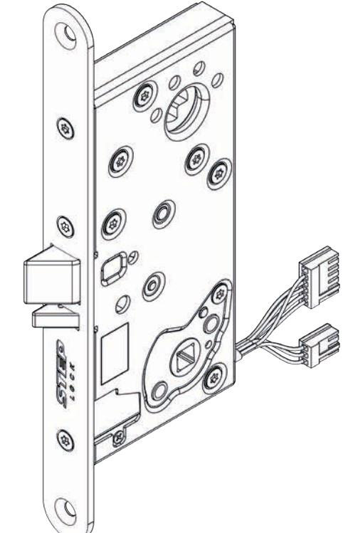

# Installationsanvisning STEP 110TM

Utgåva 4, 2020-05-26

## INNEHÅLL

| Teknisk specifikation STEP 110        | Symmetrisk/osymmetrisk låshusstolpe8 |
|---------------------------------------|--------------------------------------|
| - Måttskiss2                          | Urtagsritning9                       |
| - Artikelnummer, tekniska egenskaper3 | Installationsanvisning10             |
| - Strömförbrukning, kopplingsschema3  | Underhållsanvisning11                |
| Tillbehör4                            | Viktig information och CE-märkning12 |
| Kabelöverföring5                      | Kontakta oss12                       |
| Justering av ställbara funktioner6    |                                      |

## TEKNISK SPECIFIKATION STEP 110

## MÅTTSKISS

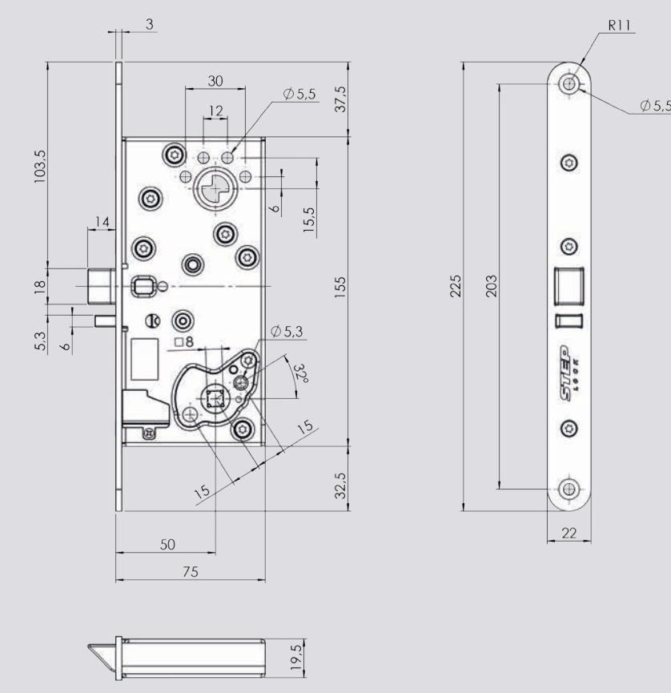

### AVLÄGSNA TRYCKESPINNEN (gäller för ST110 och ST110-12)

För att kunna lossa tryckespinnen måste fjädern bakom tryckesroddaren tryckas ner. Använd en spårmejsel för att trycka ner fjädern och dra därefter tryckespinnen rakt ut.

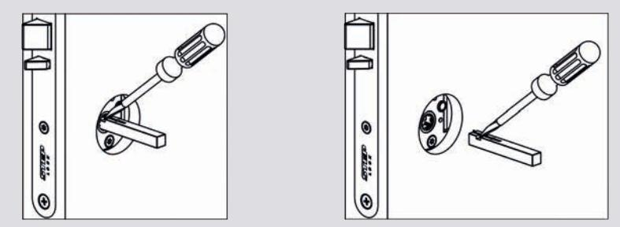

## UNDERHÅLLSANVISNING

- Kontrollera regelbundet eltryckeslåsets funktion.
- Kontrollera alltid eltryckeslåsets funktion i samband med provning av brandcellsgränser, utrymningsvägar eller liknande.
- Kontrollera regelbundet eltryckeslåsets fastsättning i dörrbladet samt monterade vred, trycken, cylindrar och slutbleck.
- Två gånger per år, eller vid behov, ska fallkolven och förreglingen smörjas med fett. Använd ett tunt skikt av DIN 51502 fett.
- Observera att eltryckeslåset aldrig får smörjas med olja.

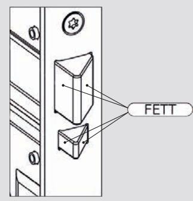

## INSTALLATIONSANVISNING

- 1. Se till att urtaget är rengjort från flisor och spån.
- 2. Anslut kontakterna.
- 3. Fäll in eltryckeslåset i dörrbladet och fixera stolpen med två skruvar. Använd bifogade FXTB 4,5x30 FZB i trädörrar och MFX M5x16 FZB i stål-/aluminiumdörrar.

Var noga med att kabeln inte kläms när eltryckeslåset fälls in.

- 4. Säkerställ att dörrspringan mellan låshusstolpen och slutblecket/ elslutbleckets montagestolpe är 3 mm + 2 mm / - 1 mm.
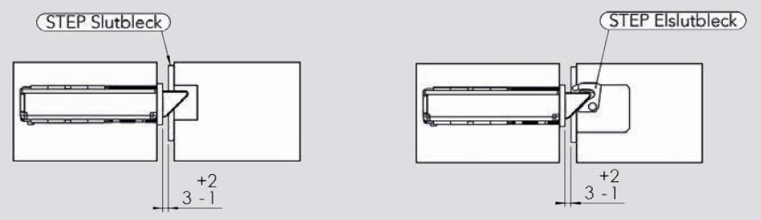

- 5. Gäller för ST110 och ST110-12. För in de två tryckespinnarna mot respektive sidas tryckesroddare. Använd en spårmejsel för att trycka ner fjädern och för sedan tryckespinnen rakt in. Säkerställ att tryckespinnens fjäder hakar i ordentligt bakom tryckesroddaren.
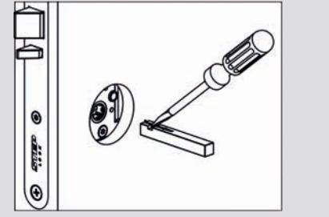

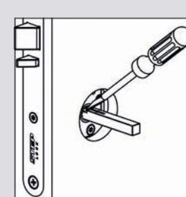

Observera att eltryckeslåset inte får övermålas.

### ARTIKELNUMMER OCH TEKNISKA EGENSKAPER

| Artikelnummer | Benämning                                                                  |
|---------------|----------------------------------------------------------------------------|
| ST110         | STEP 110 eltryckeslås, 24 V DC, modern kolvplacering, split funktion.      |
| ST110 KPL     | STEP 110 komplett set. Inklusive ST110, kabelöverföring och 10 m kabel.    |
| ST110-12      | STEP 110 eltryckeslås, 12 V DC, modern kolvplacering, split funktion.      |
| ST110-12 KPL  | STEP 110 komplett set. Inklusive ST110-12, kabelöverföring och 10 m kabel. |
| ST112         | STEP 110 eltryckeslås, 24 V DC, modern kolvplacering.                      |
| ST112 KPL     | STEP 110 komplett set. Inklusive ST112, kabelöverföring och 10 m kabel.    |
| ST112-12      | STEP 110 eltryckeslås, 12 V DC, modern kolvplacering.                      |
| ST112-12 KPL  | STEP 110 komplett set. Inklusive ST112-12, kabelöverföring och 10 m kabel. |

- Modern kolvplacering.
- Mikrobrytare enpoligt växlande, max. 30 V DC, 1 A.
- Inbyggd patenterad Direct Drive™-funktion.
- Inbyggda mikrobrytare indikerar stängt och förreglat läge samt tryckesmanövrering.
- Skyddsdiod finns inbyggd.
- Vändbar för att passa höger- och vänsterdörrar.
- Omställbar rättvänd/omvänd funktion.
- Omställbar elektrisk/mekaniskt manövrerad sida (gäller ST110, ST110-12, ST110 KPL, ST110-12 KPL)
- Anpassat för runda och ovala skandinaviska cylindrar.
- Dorndjup 50 mm.
- Både återfjädrande trycken och icke återfjädranden trycken kan användas.
- Halogenfri kabel.

### STRÖMFÖRBRUKNING OCH KOPPLINGSSCHEMA

### Strömförbrukning i rättvänd och omvänd funktion

| 24 V DC + 15 % - 10 % | Max 60 mA  |
|-----------------------|------------|
| 12 V DC + 15 % - 10 % | Max 120 mA |

Strömförbrukning 0 mA i vila (rättvänd = låst, omvänd = olåst)

### Kopplingsschema för låset Kopplingsschema för kabeln

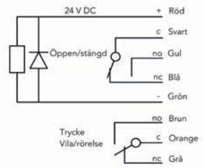

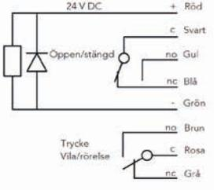

Följande skruv- och kontaktkit levereras som standard:

| Artikelnr. | Benämning                                                                                                                                                                                                 |
|------------|-----------------------------------------------------------------------------------------------------------------------------------------------------------------------------------------------------------|
| ST1087     | Skruv- och kontaktkit: - 2 st träskruvar FXTB 4,5x30 FZB - 2 st maskingängade skruvar MFX M5x16 FZB - 1 st kopplingsplint och stift hane 6-polig - 1 st kopplingsplint och stift hane 3-polig |

Art.nr ST110, ST110-12, ST110 KPL och ST110-12 KPL levereras inklusive två tryckespinnar:

| Artikelnr. | Benämning                         |
|------------|-----------------------------------|
| ST1088-50  | 1 st STEP Tryckespinne, 8x8x50 mm |
| ST1088-60  | 1 st STEP Tryckespinne, 8x8x60 mm |

### TRYCKESPINNAR

Dörrens tjocklek samt vilket trycke som ska användas, styr hur långa tryckespinnarna bör vara. Tabellen nedan visar hur tryckespinnarnas längd, L-A och L-B, kan styras av måtten A och B. Observera att även tryckets djup kan påverka valet av tryckespinnar.

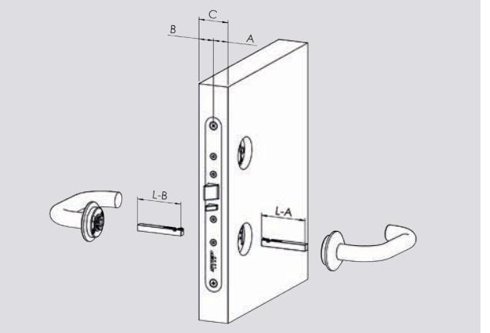

| A eller B  | L-A eller L-B |
|------------|---------------|
| 15 - 20 mm | 40 mm         |
| 18 - 30 mm | 50 mm         |
| 28 - 40 mm | 60 mm         |
| 38 - 50 mm | 70 mm         |
| 48 - 60 mm | 80 mm         |
| 58 - mm    | 90 mm         |
|            |               |

## KOMPLETT SET

ST110 KPL, ST110-12 KPL, ST112 KPL och ST112-12 KPL är kompletta set som inkluderar eltryckeslåset, tillbehören beskrivet ovan, samt följande:

| Artikelnr. | Benämning                                          |
|------------|----------------------------------------------------|
| ST1086     | 10 m halogenfri kabel, 12 ledare                   |
| ST1283     | STEP Kabelöverföring. Innerdiameter fjäder 10,8 mm |

## TILLBEHÖR URTAGSRITNING

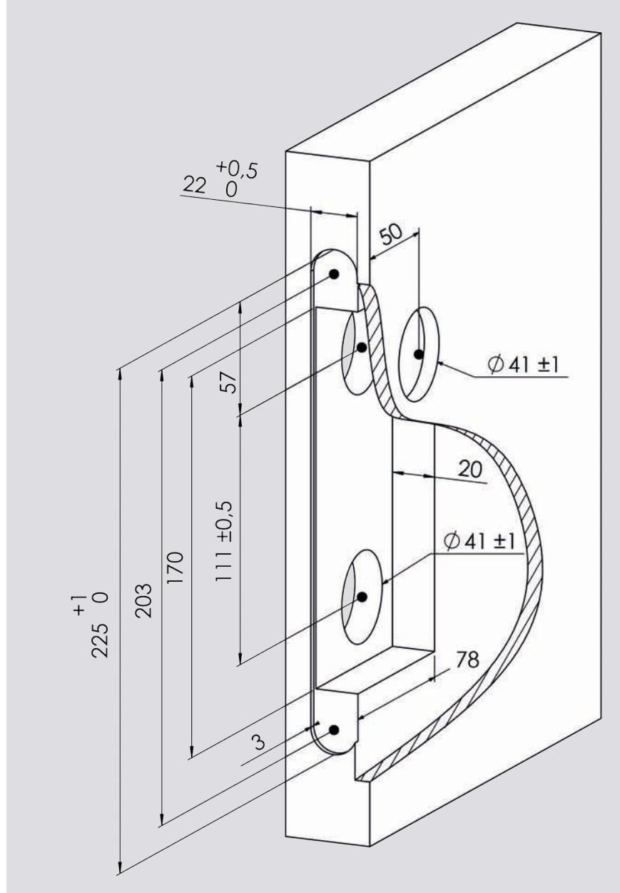

## SYMMETRISK/OSYMMETRISK LÅSHUSSTOLPE

STEP 110 levereras med en symmetrisk låshusstolpe som standard.

I sortimentet finns en osymmetrisk låshusstolpe för montage av STEP 110 i dörrar med osymmetriskt urtag.

| Artikelnr. | Benämning                              |
|------------|----------------------------------------|
| ST1193     | Osymmetrisk låshusstolpe för STEP 110. |
|            |                                        |

### BYTE AV LÅSHUSSTOLPE

1. Skruva ur de tre skruvarna som fixerar den symmetriska låshusstolpen . A

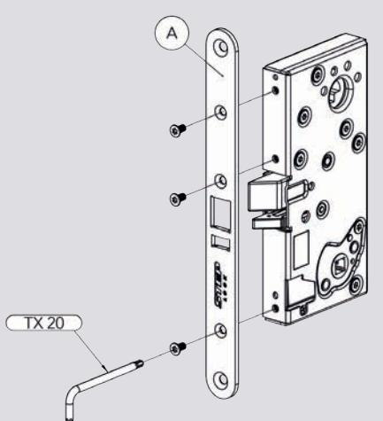

- 2. Byt till den osymmetriska låshusstolpen och fixera åter de tre skruvarna med 3 Nm återdragsmoment. B
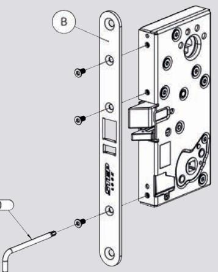

## KABELÖVERFÖRING

STEP Kabelöverföring är tillverkad i rostfritt stål och passar både trä-, stål- och aluminiumdörrar. Fjädern har en bred innerdiameter på 10,8 mm som underlättar genomföringen av kabeln.

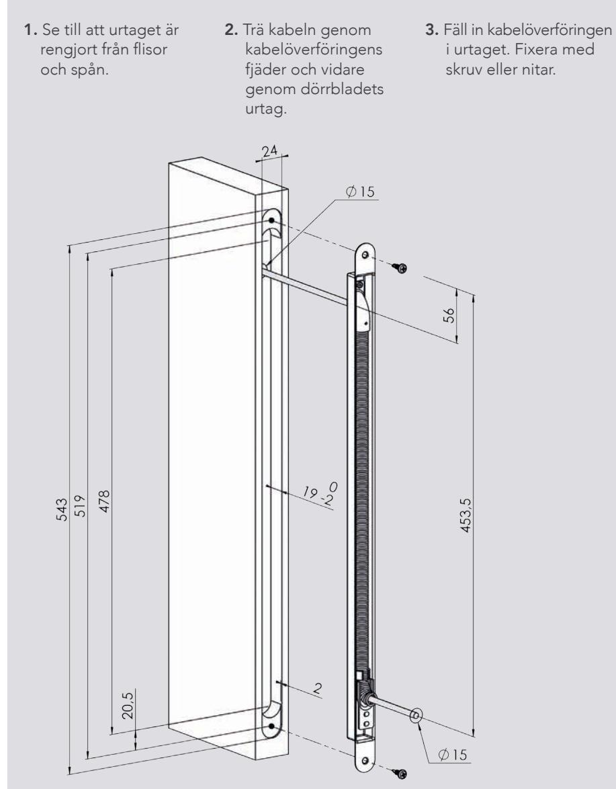

## ÄNDRA MEKANISKT STYRD SIDA (gäller för ST110 och ST110-12) STÄLLBARA FUNKTIONER

STEP 110 har flera ställbara funktioner. Samtliga funktioner kan ändras genom enkla justeringar på låshusets utsida.

- STEP 110 levereras som standard med rättvänd funktion för högerhängd dörr.
- STEP 110 med artikelnummer ST110 och ST110-12 levereras med splitfunktion där höger sida är mekaniskt styrd och vänster sida är elektriskt styrd.
- STEP 110 med artikelnummer ST112 och ST112-12 levereras utan splitfunktion där båda sidor är elektriskt styrda.

## ÄNDRA FRÅN HÖGER- TILL VÄNSTERHÄNGD DÖRR

- 1. Håll in fallkolven och förreglingen . A B
- 2. Skruva ur skruvarna och som fixerar fallkolven och förreglingen med en 2 mm insexnyckel. C D
- 3. Vänd fallkolven och förreglingen 180° vertikalt och placera tillbaka dem. A B
- 4. Håll in och . A B
- 5. Fixera med 2 Nm och med 1,8 Nm återdragsmoment. C D

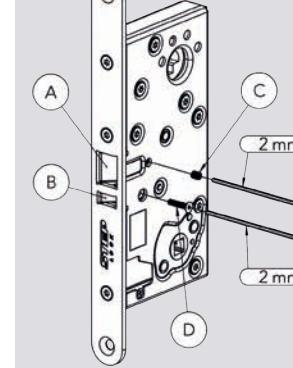

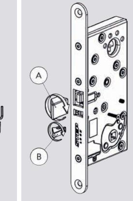

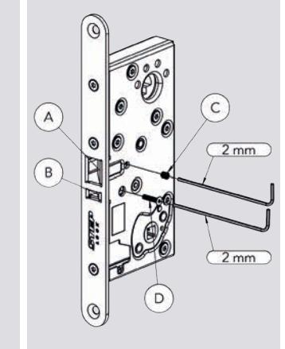

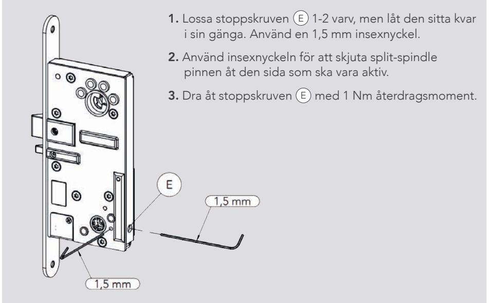

## ÄNDRA FRÅN RÄTTVÄND TILL OMVÄND FUNKTION

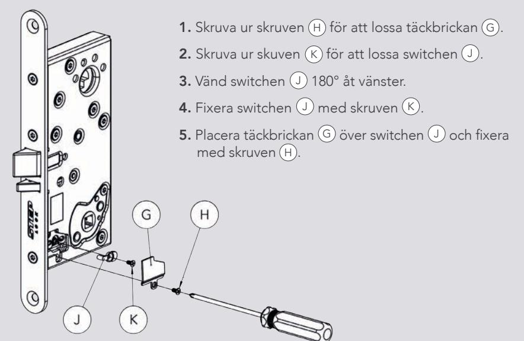