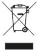
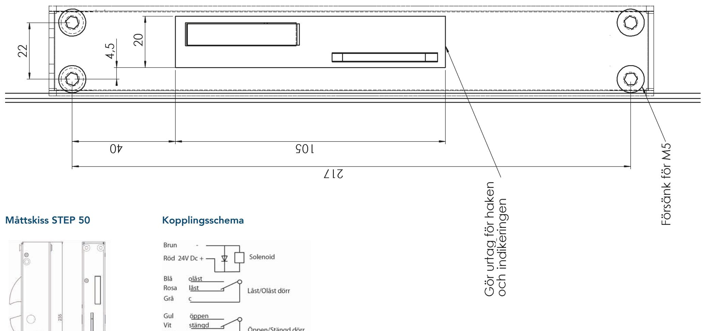
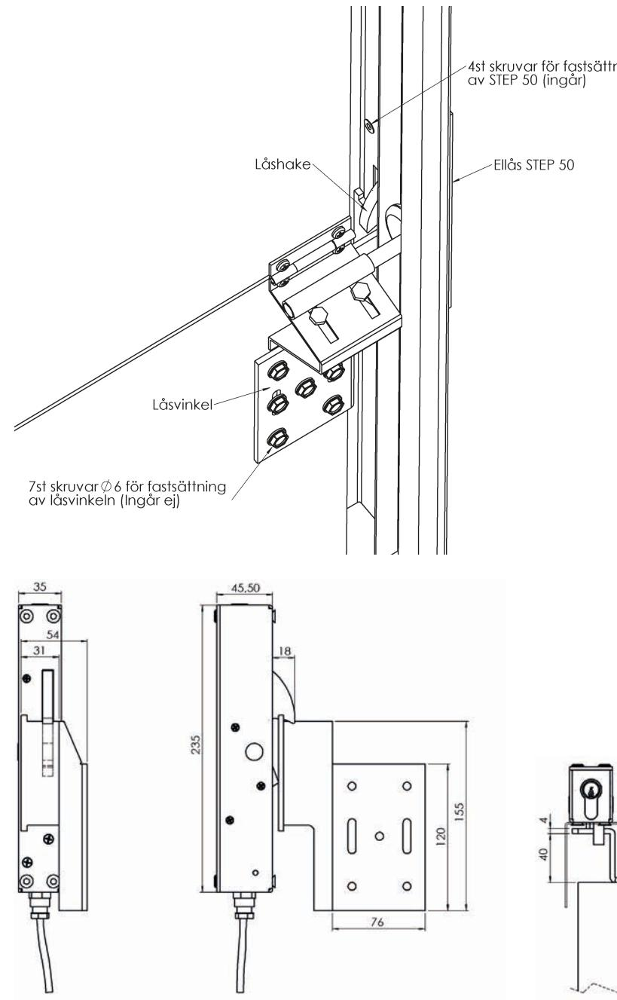
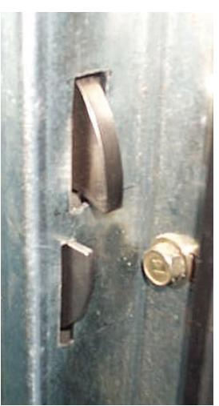
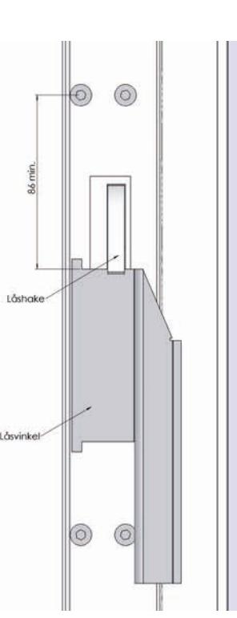
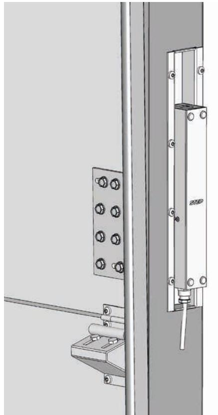
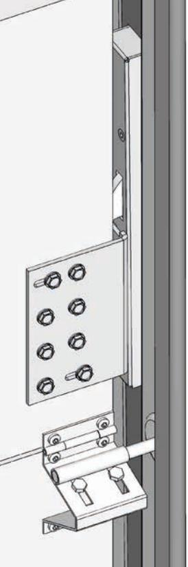
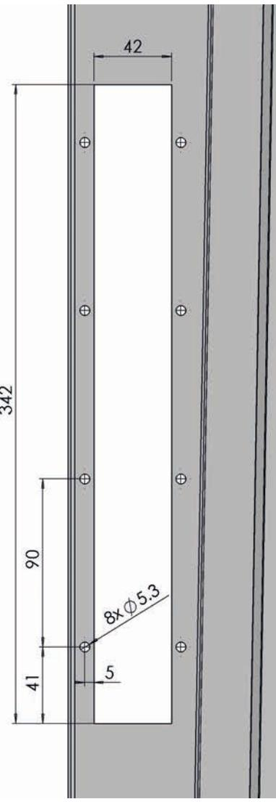
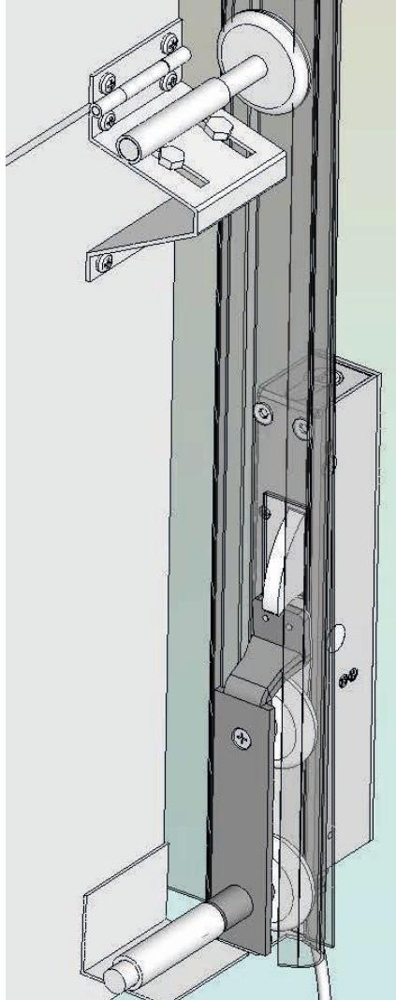
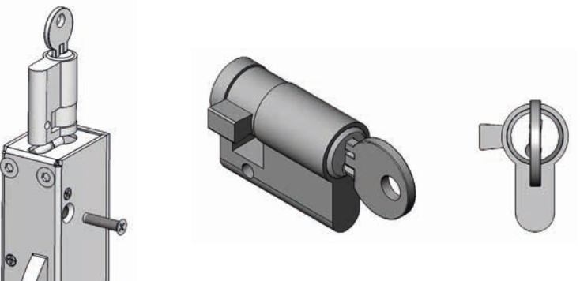

## Teknisk specifikation

- Spänning: 24 V DC + 15 % -10 %. 100 % ED 6,5 W.
- Mikrobrytare enpoligt växlande, max. 30 V DC, 1 A.
- Inbyggd indikering för avkänning att porten är stängd/öppen (kolvkontakt) och låst/ olåst (spärrkontakt) för koppling till passersystem, larmanläggning etc.
- Brythållfasthet 10 kN (≈ 1000 kg).
- Skyddsdiod finns inbyggd.
- Material: låshus i rostfritt stål, låshake i härdat stål.
- Inklusive 5 m halogenfri kabel.

| Benämning                                                                               |
|-----------------------------------------------------------------------------------------|
| Elektriskt lås STEP 50 för takskjutportar. Inkl. fästskruvar och 5 m halogenfri kabel.* |
|                                                                                         |
| Benämning                                                                               |
| Låsvinkel avsedd för port med vertikal- eller höglyftssystem.**                         |
|                                                                                         |

| ST527-2 | Låsvinkel avsedd för port med standard- eller höglyftssystem.** |
|---------|-----------------------------------------------------------------|
|         |                                                                 |

- ST527-3 Eurocylinder inklusive 2 stycken nycklar.
- ST527-5 Infällningskassett avsedd för montage med ST527-2.
- ST527-7 Låssläde avsedd för port med standard- eller låglyftsystem.**
- ST527-9 Låssläde avsedd för port med standard- eller låglyftsystem Hörmann.**

* Bultar för fastsättning av låsvinkel i porten medföljer ej.

** De olika systemen kan se mycket olika ut och varierar från port till port. Vi rekommenderar därför att du testar dig fram för att se vilken låssläde och låsvinkel som passar just ditt montage.

#### Strömförbrukning i rättvänd funktion

24 V DC + 15 % - 10 % 313 mA olåst

## Kontakta oss

Kom ihåg att du alltid är välkommen att kontakta oss om du behöver hjälp. Maila eller ring vår tekniska support på info@steplock.se eller 021-480 12 13.

|                  | Stendals El AB Signalistgatan 17 72131 Västerås Sverige |
|------------------|------------------------------------------------------------------|
| STEP 50          | 13                                                               |
| SS-EN 14846:2008 | CPR-50-01                                                        |

# Installationsanvisning STEP 50

STEP 50 är ett högkvalitativt ellås för industriportar. De elektriskt låsta portarna styrs bekvämt och säkert via exempelvis ett passersystem.

Låset är speciellt utvecklat för att klara av tuffa miljöer som garage och industrilokaler.

STEP 50 använder ingen spänning vid låsningen, utan öppnas endast med spänning som kan brytas direkt då porten lämnar sitt stängda läge. Portens status låst/upplåst och öppen/ stängd känns av med två mikrobrytare. Om låset kopplas till en larmanläggning, ger detta larm om porten tvångsöppnas.

Står emot krafter på 1000 kg.

Läs bifogad installationsanvisning noggrant innan installation. Vid installation av produkten måste varningar och allmänna instruktioner följas. All bifogad dokumentation måste överlämnas av installatör till användare.

#### Borrmall

### Installationsanvisning STEP 50 med låsvinkel ST527-1

- 
- 1. Bestäm och märk ut ungefärligt läge för placering av låsvinkeln. Ellåset kan monteras på höger eller vänster sida av porten.
Låsvinkeln ska placeras så nära gångjärnsfästet som möjligt för att klara böjen på skenan. På högersida monteras låsvinkeln nedan för gångjärnsfästet och på vänster sida monteras låsvinkeln ovanför gångjärnsfästet. Det går även att montera låsvinkeln under hjulfästet för att undvika att böjen på väggskenan tar i Låsvinkeln. Testa att skjuta upp porten med låsvinkeln provisoriskt fastsatt.

- 2. Upprikta och sätt fast låsvinkeln i de två slitsade hålen så att låsvinkeln senare kan justeras både i upp och nedåt riktning.
- 3. Ställ porten i sitt nedersta läge, märk upp det läge på väggskenan där låshaken ska träffa låsvinkeln. Ellåset låser upp även vid tryck mot låshaken när öppnarsignal givits, låsvinken ska därför monteras med så lite spel som möjligt (max 5 mm) för att erhålla en solid låsning. Markera sedan var det första hålet ska placeras (minst 86 mm från låsvinkeln se ritning).
- 4. Skär ut för låshaken och indikeringen enligt skiss. Borra och försänk för M5 skruvarna. Sätt fast ellåset STEP 50 med hjälp av de 4 st bifogade skruvarna.
- 5. Finjustera inställningen av låsvinkeln då porten stängs så att alltid låshaken kommer ut till låst läge. STEP 50 är testad för att klara ett tryck mot låshaken vid öppning.
- 6. Då injusteringen är klar fastsätts de återstående 5st skruvarna i låsvinkeln.

OBS! Fastsättningen ska vara så stabil att den tål en påkänning av ca 1000 kg lyftkraft på porten.

- 7. Låsvinkeln ska fettas in på de ytor som kommer i kontakt med låshaken.
- 8. Om det finns krav på hög säkerhet i byggnaden, bör kabeln för elanslutning till låset förläggas i pansarrör så att den är oåtkomlig för obehörig (t.ex. skyddad med pansarrör i nära anslutning till låset). Skruvarna till låsvinkeln bör också svetsas fast så att man inte kan montera ner låsvinkeln.

### Installationsanvisning STEP 50 med infällningskassett ST527-5 för industriport med 2 tums skena

1. Bestäm och märk ut ungefärligt läge för placering av ellåset STEP 50. Mät så att kassetten får plats i utrymmet mellan väggfästet och hjulskenan. Ellåset kan monteras på höger eller vänster sida av porten och bör monteras så långt ner som möjligt. Testa att skjuta upp porten med låsvinkeln provisoriskt fastsatt. Kontrollera att inte låsvinkeln fastnar mot skenan och att den går fri från linan.

Skiss över STEP 50 med infällningskassett ST527-5 för industriport med 2 tums skena

2. Skär ut för låshuskassetten enligt skiss. Borra för M5 skruvarna. Sätt fast kasseten med STEP 50 i skenan med 8 st skruvar.

3. Ställ porten i sitt nedersta läge, märk upp det läge på portbladet där låsvinkeln skall monteras.

4. Upprikta och sätt fast Låsvinkeln i de två slitsade hålen så att låsvinkeln senare kan justeras i sidled.

5. Finjustera inställningen av låsvinkeln då porten stängs så att alltid låshaken kommer ut till låst läge. STEP 50 är testad för att klara ett tryck mot låshaken vid öppning.

6. Då injusteringen är klar fastsätts de återstående 5 st skruvarna i låsvinkeln.

OBS! Fastsättningen skall vara så stabil att den tål en påkänning av ca 1000 kg lyftkraft på porten.

7. Låsvinkeln skall fettas in på de ytor som kommer i kontakt med låshaken.

8. Om det finns krav på hög säkerhet i bygnaden, bör kabeln för elanslutning till låset förläggas i pansarrör så att den är oåtkomlig för obehörig (t.ex. skyddad med pansarrör i nära anslutning till låset). Skruvarna till låsvinkeln och kassett bör fastsättas med svets.

Urtagsritning för kassett

### Installationsanvisning STEP 50 med låssläde ST527-7 för industriport

- 1. Montera bort det nedersta hjulet på den sida som är bäst lämpad för montering av ellåset. För in hjul axeln in i släden, röret för hjulaxeln kan behövas att kortas av för att hjulet skall passa in mellan plåtarna. Skruva tillbaka plåten på släden använd alltid loctite till skruvarna så att de inte lossnar under drift. Skjut in låssläden i C skenan, montera tillbaka hjul axeln i ursprungliga fästet på porten. Prova nu att skjuta upp porten för att se att låssläden löper fritt hela vägen upp till översta läget. Röret på låssläden kan i vissa fall behöva svetsas fast för att minska röligheten på låssläden på vissa porttyper.
- 2. Bestäm och märk ut ungefärligt läge för placeringen av ellåset genom att skjuta ner porten med låssläden till sitt nedersta läge. Markera på Cskenan där dit den översta delen på låssläden når och. Gör ett fyrkantigt urtag enligt måttskiss för både låshaken och indikeringsskivan så att låshakens underdel kommer på samma höjd som märket. Märk ut och borra hål för fastsättningsskruvarna igenom C-skenan så att ellåsets låshake ligger emot låssläden med ett spel på max 5 mm, detta för att inte låsglappet skall bli för stort. Försänk och sätt fast ellåset med de fyra bifogade M5 skruvarna med loctite.
- 3. Koppla in ellåset enligt kopplingsschemat.

#### Installationsanvisning av eurocylinder

Eurocylindern går att få i befintligt Assa Twin system.

För in eurocylindern i STEP 50 med nyckeln i. Skruva fast cylindern med M5 skruven som ingår. Tappen ska peka åt vänster enligt bild när nyckeln är urtagen.

