# STEPS FOR INSTALLING A DEVICE

### **STEPS FOR ADDING A DEVICE**

- Follow the guidelines for each device in the next slides to add and install the devices in the new Gateway
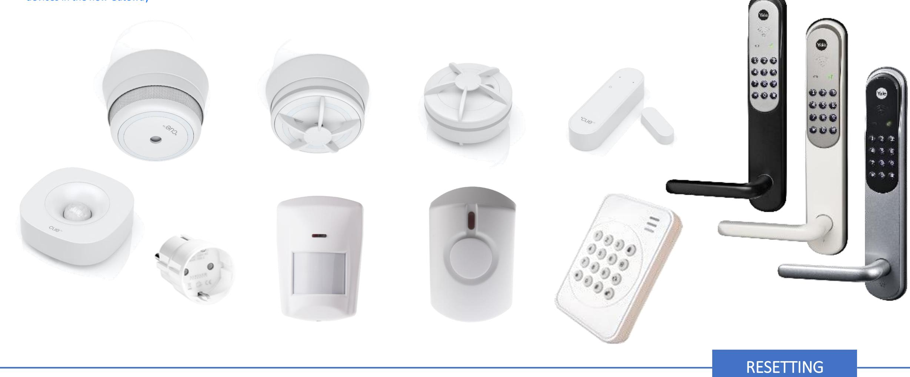

## **Smoke Detector (Develco)**

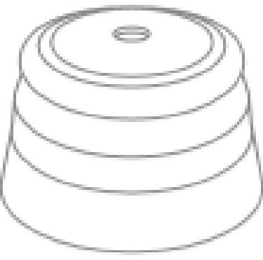

### **STEPS FOR RESETTING**

- 1. Detach the sensor from the mounting base by twisting it counter clockwise.
- 2. Press and hold the LED button.
- 3. While you are holding the button down, the LED first flashes once, then two times in a row and finally numerous times in a row.
- 4. Release the button while the LED is flashing numerous times in a row.
- 5. After you release the button. The LED shows one long flash, and the reset is completed.

### **Smoke Sensor Step by step guide**

- 1. Pull out the battery isolation strip or insert the batteries.
- 2. The Smoke Sensor will start searching for a Gateway.
- 3. Go to add device in your app and choose Smoke Sensor. The Gateway is now automatically set to pairing mode.
- 4. The LED flashes red while the Smoke Sensor is searching for a Gateway.

- 5. The LED button stops flashing when the Smoke Sensor has joined the Gateway.
- 6. For factory reset please refer to the user manual.

### **Mounting**

- 7. Detach the Sensor from the mounting base by twisting it counter clockwise.
- 8. Use the mounting base ring to mark the screw holes on the ceiling or on the wall

- 9. Use enclosed screws and plugs to install the mounting base.
- 10. You will not be able to attach the Sensor if the battery is missing or inserted incorrectly.
- 11. Attach the Sensor by twisting clockwise until it clicks.

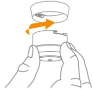

## **Windows / Door Sensor (Develco)**

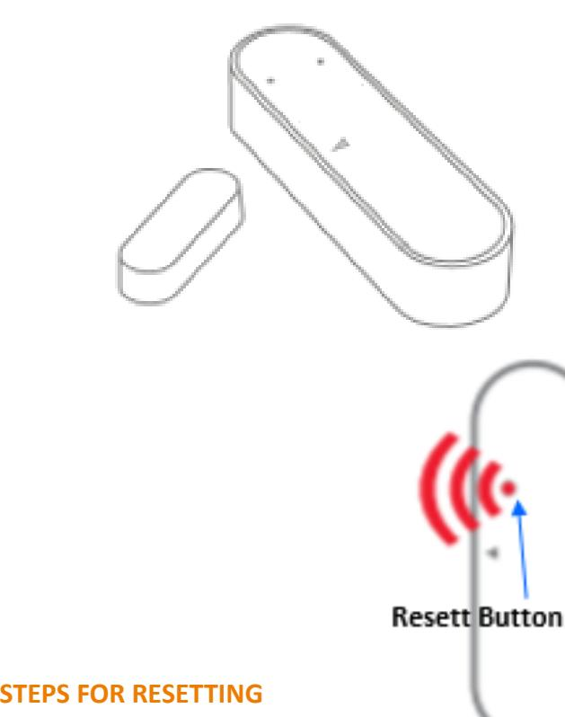

- 1. Press and hold the reset button.
- 2. While you are holding the button down, the LED flashes once, then twice in a row, and finally numerous times in a row.
- 3. Release the button while LED is flashing numerous times in a row.
- 4. After you release the button the LED shows one long flash, and the reset is completed.

### **Window/Door Sensor**

### **Step by step guide**

- 1. Open the sensor by pressing the top switch and pull the front of the casing.

- 2. insert the batteries.
- 3. The Sensor will start searching for a Gateway
- 4. Go to add device in your app and choose Door/window sensor. The Gateway is now automatically set to pairing mode.
- 5. The LED flashes red while the Motion Sensor is searching for a Gateway.

6. When the LED stops flashing the Motion Sensor has joined the Gateway.

- 7. For factory reset please refer to the user manual.
### **MOUNTING**

Clean the surface before mounting. The magnet has to be placed on that side of the sensor which is marked with a small arrow. The Sensor (a) should be mounted to the frame using the double sided tape already applied on the back of the sensor and magnet. Press firmly to secure sensor and magnet.

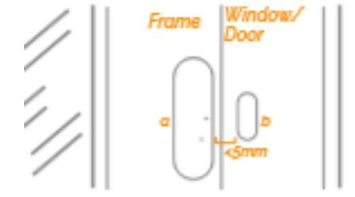

The magnet (b) should be mounted on the door or window no further than 5mm away from the arrow on the sensor.

The sensor and magnet may be placed on separate three dimensional planes. Place it as near to the point on the sensor indicated by the grey arrow.

| ACK |  |
|-----|--|

## **Motion Sensor Mini (Develco)**

- 
- 
- 

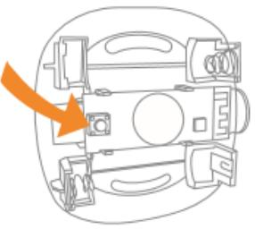

- 
- 
- 

### **Motion Sensor Mini Step by step guide**

- 1. Open the sensor by pushing the switch and pulling the top of the casing.
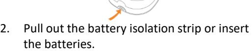

- 3. The Motion Sensor will start searching for a Gateway.
- 4. Go to add device in your app and choose Motion sensor mini. The Gateway is now automatically set to pairing mode.
- 5. The LED flashes red while the Motion Sensor is searching for a Gateway.

- 6. When the LED stops flashing the Motion Sensor has joined the Gateway.

### **2 TYPES OF MOUNTING (a and b)**

Open the casing, remove the batteries a: Mounting flat on a ceiling or wall. b: corner, with a bracket

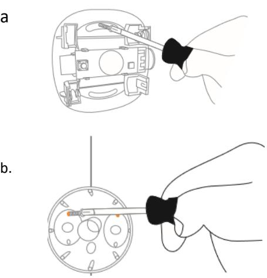

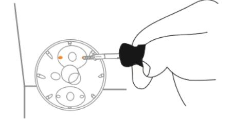

### **MOUNTING**

The Sensor should be mounted no higher then 2 meters, in a corner, facing away from windows and direct sunlight.

- 1. If mounted with a bracket, attach the sensor with the supplied screews
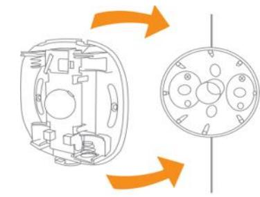

- 2. Insert the batteries, the Sensor will come back online within a few minutes.
- 3. For factory reset please refer to the user manual.

## **Smart Plug Mini (Develco) Smart Plug Mini**

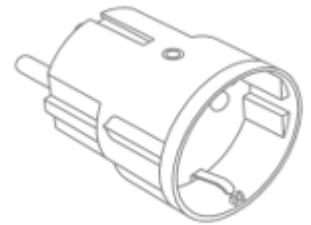

- 
- 
- 

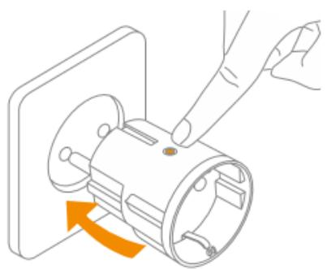

- 
## **Step by step guide**

- 1. Connect the Smart Plug Mini to the power outlet.
- 2. The Smart Plug Mini will start searching for a Gateway.
- 3. Go to add device in your app and choose Smart Plug Mini UK. The Gateway is now automatically set to pairing mode.
- 4. While the Smart Plug Mini is searching for the network, the LED button is flashing red

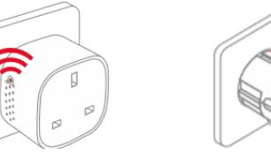

- 5. When the LED stops flashing, the Smart Plug Mini has successfully joined the gateway.
- 6. Green LED means that the Smart Plug output is active. The plug can be switched on and off by pushing the LED button.

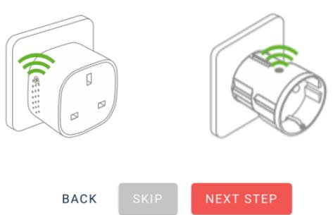

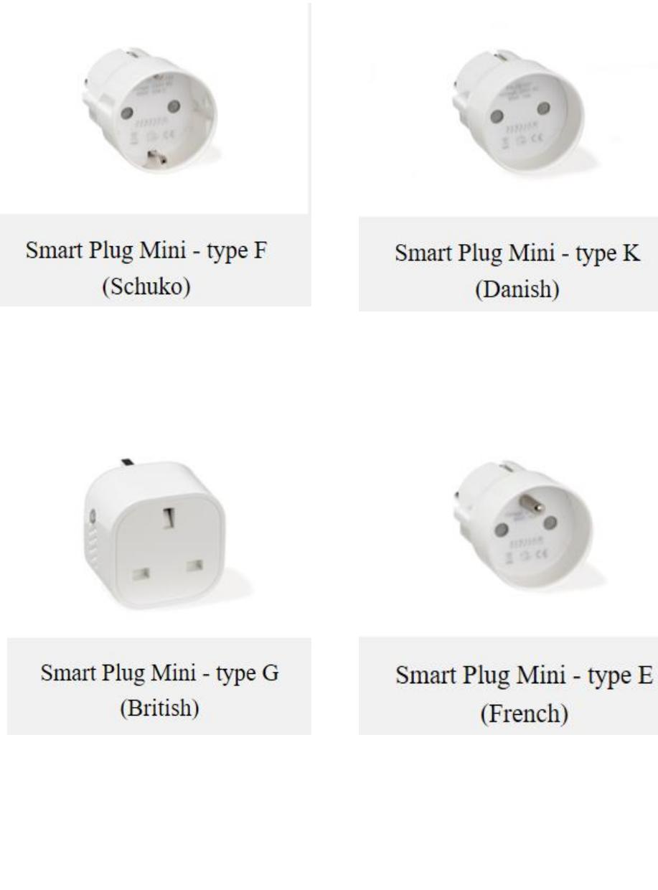

## **Smart plug and Smart Cable**

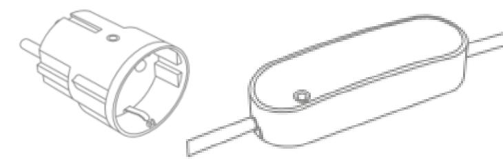

## **Auto-Off**

- The Auto-OFF feature can be found by clicking the device you want on the dashboard.
- Then click the settings icon in the upper-right corner and then advanced.
- You can now set Auto-OFF time on your device.
- Values you can set is minimum time is 1 min and maximum is 4 hours and 15 minutes

Once you have selected the time, the device will automatically turn off when the selected time has been reached.

| 11:45 ◀           | "11 "                |
|-------------------|----------------------|
| Innstilling enhet |                      |
| GENERELL          | AVANSERT             |
| Automasjon        | (i)                  |
| Auto-AV status    |                      |
| Slå av etter      | Velg varighet >   |
|                   |                      |
|                   |                      |
|                   | Velg ønsket varighet |
| 01                | 12                   |
| 02                | 13                   |
| 03                | 14                   |
| 04                | 15                   |
| 05                | 16                   |
| 06 07          | 17 18             |
|                   | Bekreft              |
|                   | Avbryt               |
|                   |                      |

## **Heat Sensor (Develco)**

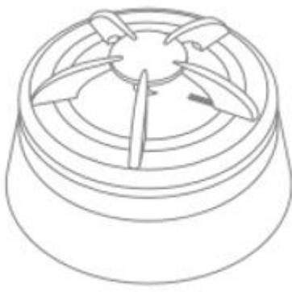

### **STEPS FOR RESETTING**

- 1. Detach the sensor from the mounting base by twisting it counter clockwise.
- 2. Press and hold the LED button.
- 3. While you are holding the button down, the LED first flashes once, then two times in a row and finally numerous times in a row.
- 4. Release the button while the LED is flashing numerous times in a row.
- 5. After you release the button. The LED shows one long flash, and the reset is completed.

### **Heat Sensor**

**Step by step guide**

- 1. Pull out the battery isolation strip or insert the batteries.
- 2. Go to add device in your app and choose Heat sensor. The Gateway is now automatically set to pairing mode.
- 3. The LED flashes red while the Heat Sensor is searching for a Gateway.

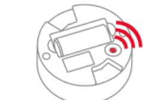

- 4. The LED button stops flashing when the Heat Sensor has joined the Gateway.
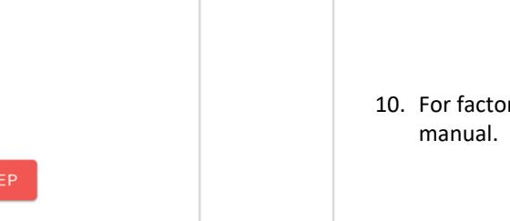

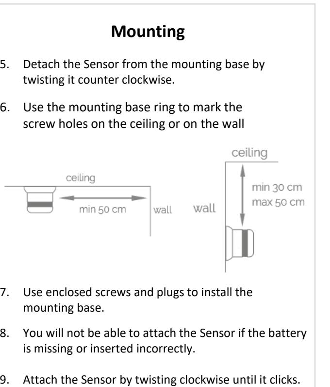

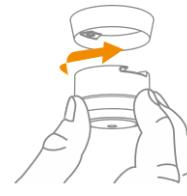

- 10. For factory reset please refer to the user
CLOSE BACK

## **Water Leak Sensor (Develco)**

- 
- 
- -

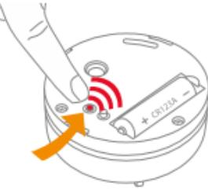

- 
- 

## **Water Leak Sensor**

### **Step by Step guide**

The Water Leak Sensor should be placed on the ground, where water is suspected

- 1. Detach the cover of the detector by twisting it counter clockwise.
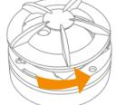

- 2. Pull out the battery isolation strip or insert the batteries.
- 3. Put the plastic disc back and close the casing by twisting it clockwise.
- 4. Go to add device in your app and choose Water leak sensor The Gateway is now automatically set to pairing mode.
- 5. The LED flashes red while the Water Leak Sensor is searching for a Gateway.

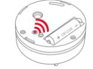

- 6. The LED button stops flashing when the Water Leak Sensor has joined the Gateway.
- 7. For factory reset please refer to the user manual.

## **Humidity Sensor (Develco)**

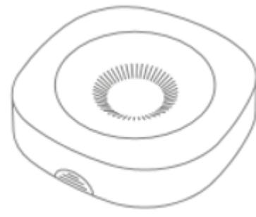

- 
- 

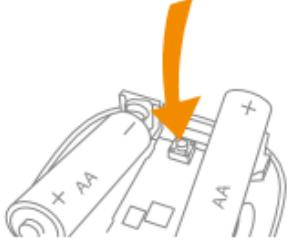

- 
- 

### **Humidity Sensor**

### **Step by step guide**

- 1. Open the sensor by pushing the switch and pulling the top of the casing.
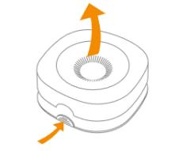

- 2. Pull out the battery isolation strip or insert the batteries.
- 3. Go to add device in your app and choose Humidity sensor. The Gateway is now automatically set to pairing mode.
- 4. The LED flashes red while the Humidity Sensor is searching for a Gateway.

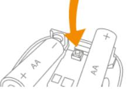

- 5. When the LED stops flashing the Humidity Sensor has successfully joined the Gateway.

### **Mounting**

- 6. Open the casing of the Humidity Sensor and remove the batteries.
- 7. Use double-sided tape or screws to attach the sensor to the wall.

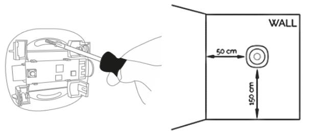

- 8. Insert the batteries.
- 9. Make sure that the Humidity Sensor has joined a Gateway before closing the casing.
- 10. For factory reset please refer to the user manual.

BACK CLOSE

## **Air Quality Sensor (Develco)**

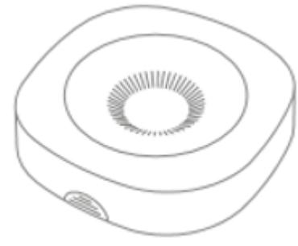

- 
- 

- 
- 
- 

### **Air Quality Sensor Step by step guide**

- 1. Open the sensor by pushing the switch and pulling the top of the casing.
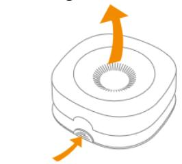

- 2. Pull out the battery isolation strip or insert the batteries.
- 3. Go to add device in your app and choose Air quality sensor. The Gateway is now automatically set to pairing mode.
- 4. The LED flashes red while the Humidity Sensor is searching for a Gateway.

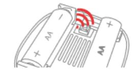

- 5. When the LED stops flashing the Air Quality Sensor has joined the Gateway.
- 
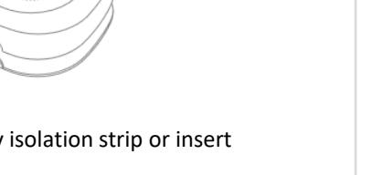

### **Mounting**

- 6. Open the casing of the Air Quality Sensor and remove the batteries.
- 7. Use double-sided tape or screws to attach the sensor on the wall.

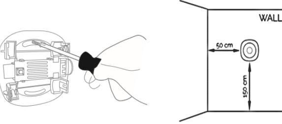

- 8. Insert the batteries.
- 9. Make sure that the Air Quality Sensor has joined a Gateway before closing the casing.
- 10. For factory reset please refer to the user manual.

BACK CLOSE

## **Smart Cable (Develco) Smart Cable**

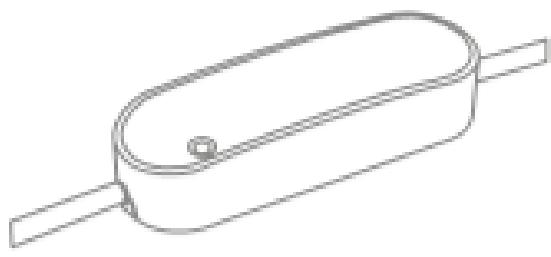

- 
- 
- 

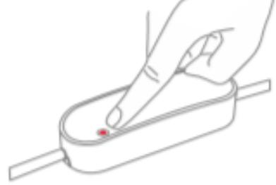

- 
## **Step by step guide**

- 
- 

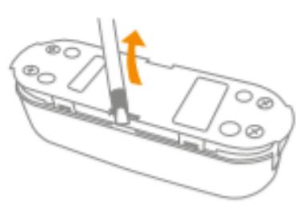

- 
- 

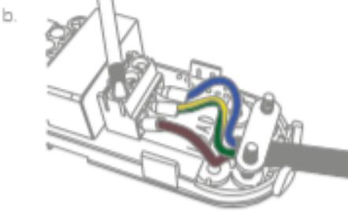

- 
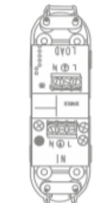

- 
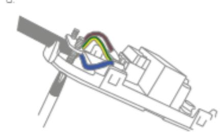

- 
- 
- 
- 

- 

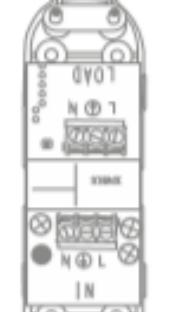

## **Smart plug and Smart Cable**

## **Auto-Off**

- The Auto-OFF feature can be found by clicking the device you want on the dashboard.
- Then click the settings icon in the upper-right corner and then advanced.
- You can now set Auto-OFF time on your device.
- Values you can set is minimum time is 1 min and maximum is 4 hours and 15 minutes

Once you have selected the time, the device will automatically turn off when the selected time has been reached.

| 11:45 ◀           | "11 "                |
|-------------------|----------------------|
| Innstilling enhet |                      |
| GENERELL          | AVANSERT             |
| Automasjon        | (i)                  |
| Auto-AV status    |                      |
| Slå av etter      | Velg varighet >   |
|                   |                      |
|                   |                      |
|                   | Velg ønsket varighet |
| 01                | 12                   |
| 02                | 13                   |
| 03                | 14                   |
| 04                | 15                   |
| 05                | 16                   |
| 06 07          | 17 18             |
|                   | Bekreft              |
|                   | Avbryt               |
|                   |                      |

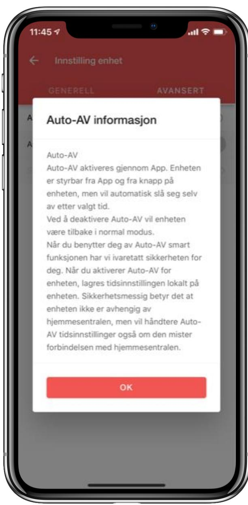

## **IO Modul (Develco) IO Module**

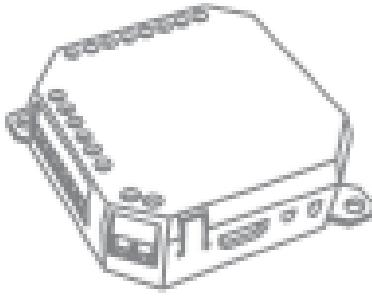

- 
- 

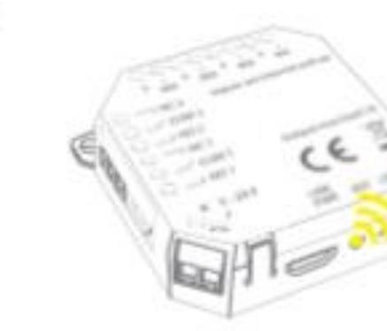

## **Step by step guide**

- 
- 
- 
- 

- 
- 

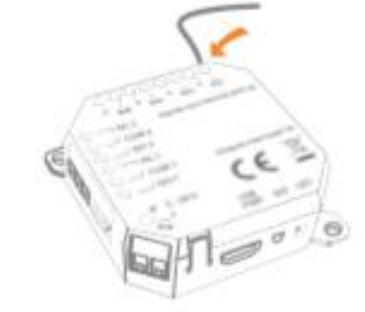

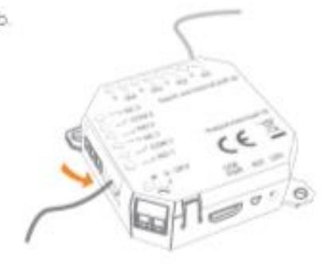

## **READY SPRING 2020**

- 
- 

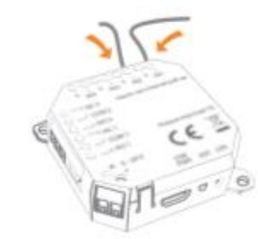

- 
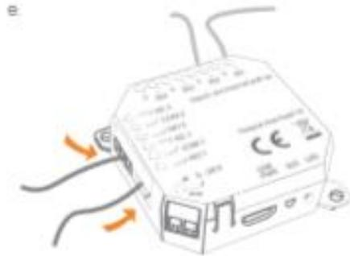

## **Smart Relay 16A Din (Develco)**

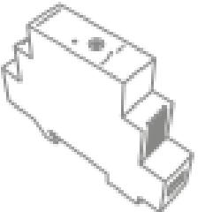

- 
- 

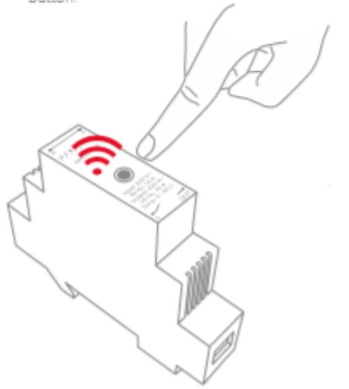

- 
### **Smart Relay 16A Din Step by step guide**

- 1. This device must be installed by an authorized electrician.

- 2. Place the Smart Relay on the DINrail and make sure it snaps onto it.

### **Getting started**

- 3. Connect the wiring as shown and tighten the screws (0.8 Nm)

### **Getting started**

- 4. Turn on the main power
- 5. Go to add device in your app and choose Smart relay 16A Din. The Gateway is now automatically set to pairing mode.
- 6. The LED flashes red while the Smart Relay is searching for a Gateway.

- 7. When the LED stops flashing the Smart Relay has successfully joined the Gateway.
- 8. For factory reset please refer to the user manual.

## **Keypad (Develco)**

- 
- 

- 
- 
- 

### **Keypad Step by step guide**

- 1. Open the casing of the device by removing the screw at the bottom of the device.

- 2. Use the included screws to mount the keypad on the wall

- 3. Alternatively, you can use the double adhesive tape to mount the backplate. We recommend using screws.

### **Keypad Step by step guide**

- 4. Insert the Batteries
- 5. When the device is powered up, the keypad will start searching for the Gateway.
- 6. Go to add device in your app and choose keypad. The gateway is now automatically set to pairing mode.
- 7. The LED flashes Yellow while the keypad is searching for a Gateway.

- 8. When the LED stops flashing the keypad has joined the Gateway.
- 9. For factory reset please refer to the user manual.

| CK |  | 2 S |
|----|--|--------|
|----|--|--------|

## **Keypad (Climax)**

### **Keypad Step by step guide** 1. Separate the front cover from the back cover by untightening the bottom screw in the front. 2. Break through the mounting holes on the back cover with a screwdriver. 3. Use the back cover to mark the installation point. 4. Mount the back cover and reassemble the keypad. Front Back 4. Set the alarm PIN for the gateway in the app main menu (4 digits). **Keypad Step by step guide** 1. Pull out the battery isolation strip or insert the batteries. 2. Go to add device in your app and choose Keypad. The Gateway is now automatically set to pairing mode. 3. Press and hold the pad lock open button for 10 seconds. The Keypad will emit a yellow flash, release. Two yellow flashes idicates that pairing is initiated. 5. For factory reset please refer to the user manual.

## **Smart Siren (Develco)**

- 
- 

- 
- 
- 

### **Smart Siren Mounting**

- 1. Open the casing of the device by removing the screw at the bottom of the device.

- 2. Use the included screws to mount the siren on the wall
- 3. Alternatively, you can use the double adhesive tape to mount the device. Make sure to press firmly on the device with the tape to make it stick.
- 4. Replace the Casing to the smart siren and fasten the screw.
- 5. Insert the attached cabel to a power socket

### **Smart Siren Step by step guide**

- 1. When the device is powered up, the Smart Siren will start searching for the Gateway .
- 2. Go to add device in your app and choose Smart siren. The Gateway is now automatically set to pairing mode .
- 3. The LED flashes Yellow while the smart siren is searching for a Gateway.

- 4. When the LED stops flashing the smart siren has joined the Gateway.
- 5. For factory reset please refer to the user manual.

|  | BACK |  | NEXT ST |
|--|------|--|---------|
|--|------|--|---------|

## **Siren Indoor (Climax)**

### **Siren Indoor**

**Step by step guide**

- 1. Plug the Siren into any standard wall 230V outlet.
- 2. Go to add device in your app and choose Siren. The Gateway is now automatically set to pairing mode.
- 3. Press and hold the button on the front of the Siren for 10 seconds. A red light will flash. Release the button. Two red flashes will appear and pairing is now initiated.
- 4. For factory reset please refer to the user manual.

## **Pet Immune Sensor (Climax)**

**Pet Immune Sensor Step by step guide**

- 1. Pull out the battery isolation strip or insert the batteries.
- 2. Go to add device in your app and choose Pet Immune. The Gateway is now automatically set to pairing mode.
- 3. Press and hold the function button on the front of the sensor for 10 seconds, then release to join the gateway.
- 4. If the sensor is not added to the gateway, a factory reset is necessary. Press and hold the function button for 10 seconds, then release the button

- **Mounting** The Sensor should be mounted no higher then 2 meters, in a corner, facing away from windows and direct sunlight. 2. Breakthrough the mounting knockouts on the base or the edges. Use the back cover as a template to drill the holes before mounting. 1. Loosen the fixing screw on the bottom and detach the front cover.

- 3. Screw the back cover to the wall.
- 4. Attach the front cover to the mounting base and tighten the fixing screw.
- 5. For factory reset please refer to the user manual.

BACK CLOSE

## **Window / Door Sensor (Climax)**

### **Climax Magnet Contact Step by step guide**

*The door contact should be installed on the inside door/window frame, and the magnet on the door/window.*

- 1. Pull out the battery isolation strip or insert the batteries.
- 2. Go to add device in your app and choose Climax Magnet Contact. The Gateway is now automatically set to pairing mode.
- 3. Press and hold the function button on the front of the sensor for 10 seconds.
- 4. Pairing is now initiated.

### **Mounting**

- 1. The Door Contact has 2 rib-marks on one side marking the internal magnet switch location. The Magnet should be installed within the two rib marks to ensure that the internal magnet faces the external magnet.

- 2. Open the front cover by loosening the screw on the bottom of the device.
- 3. Break through the 2 knockouts (1) and mark within the holes for presice positioning.

- 4. Screw the Door Contact to the door/window frame.
- 5. Fit the magnet on the door using the small piece of double sided tape or screws.
- 6. For factory reset please refer to the user manual.

## **Smoke sensor (Climax)**

| LED Button |
|------------|
|            |

### **Climax Smoke Sensor Step by Step guide**

Note: The Sensor should not be mounted in the kitchen, in near proximity of bathrooms, washrooms or air conditioning systems.

- 1. Pull out the battery isolation strip or insert the batteries.
- 2. Go to add device in your app and choose Climax Smoke Sensor. The Gateway is now automatically set to pairing mode.
- 3. Press and hold the function button (1) for 10 seconds and release.
- 4. When calibration is complete (up to 15 minutes), the Smoke Detector will emit 2 beeps and LED (2) will stop flashing to indicate it is now in normal operation.

### **Mounting**

- 1. Detach the mounting bracket from the Smoke Sensor
- 2. Use the mounting bracket as template to mark the two holes on ceiling for installing screws
- 3. Screw the mounting bracket to the ceiling.
- 4. Attach the Smoke Sensor to the bracket.

- 5. For factory reset please refer to the user manual.
BACK CLOSE

## **Yale Doorman V2N (YALE)**

### **Yale Doorman V2N Step by step guide**

- 1. Install the door lock according to the user manual.

Pair the door lock to the Gateway:

- 1. Go to add device in your app and choose Yale Doorman. The Gateway is now automatically set to pairing mode.
- 2. Take out one of the batteries and insert the module that came with the packaging.
- 3. Reinsert the battery.
- 4. Press the area marked "reset" on the module for 10 seconds, then release. Pairing is now initiated.

### **Integration**

Preform the integration after you have successfully added the module to the lock, and before starting adding any users.

- 1. Open your door and leave it open
- 2. On the Yale keypad do the following:
- 3. Enter # master code #
- 4. Lock will respond with "Integration activated"
- 5. The door lock is now fully integrated and ready to use.

BACK CLOSE

To get access to disarm the alarm with your electronic lock , do the following.

Existing door lock uses: Delete or change your door code. (Can change back to previous code) Return to door access Click on the door lock user Access to disables alarm can be selected

New door lock uses: Create door code. Return to door access Click on the door lock user Access to disables alarm can be selected

**Note:** If the door lock user has not registered the alarm pin you will not be able to use the lock as part of the alarm system.

| 11:40 4       |                                   | 11 2 |
|---------------|-----------------------------------|------|
|               | Administrer tilganger             |      |
| CL            | Christoffer Bruker -D       |      |
| Dørkode       |                                   |      |
| Endre dørkode |                                   |      |
| Slett dørkode |                                   |      |
| Nøkkelbrikke  |                                   |      |
|               | Opprett nøkkelbrikke              |      |
|               | Adgang deaktiverer alarm          | (i)  |
|               | Slå av alarmen med denne adgangen |      |
|               |                                   |      |

## **Yale Doorman – Secure mode**

With secure mode the door is securely locked both from inside and outside. The door can only be opened with registered user code or key tag from outside.

**Note!** When the door is opened the secure mode is deactivated.

## **Use the following steps to lock the door in secure mode:**

- Open the door
- Change the position of the button on the frontend of the lock case (Up or down).
- Close the door.
- Lock the door with Key Tag.
- Open/deactivate the secure mode with Key Tag, Your security code on the lock or by the App.

## **Yale Doorman – Secure mode**

Samples of the Secure mode symbol on your dashboard.

## **EasyCode Door Lock (EasyAccess)**

### **EasyCode Door Lock Step by step guide**

- 1. Install the doorlock according to the user manual provided in the packaging.
**To connect the doorlock to the smart home gateway:**

2. Insert the batteries.

- 3. Go to add device in your app and choose EasyAccess Door Lock. The Gateway is now automatically set to pairing mode.
- 4. To start pairing: Push one of the batteries down so the lock has no power Hold for 1.5 seconds. Release the battery back to original position. Repeat 6 times. If pairing fails repeat the process.

To get access to disarm the alarm with your electronic lock , do the following.

Existing door lock uses: Delete or change your door code. (Can change back to previous code) Return to door access Click on the door lock user Access to disables alarm can be selected

New door lock uses: Create door code. Return to door access Click on the door lock user Access to disables alarm can be selected

**Note:** If the door lock user has not registered the alarm pin you will not be able to use the lock as part of the alarm system.

| 11:40 4       |                                   | 11 2 |
|---------------|-----------------------------------|------|
|               | Administrer tilganger             |      |
| CL            | Christoffer Bruker -D       |      |
| Dørkode       |                                   |      |
| Endre dørkode |                                   |      |
| Slett dørkode |                                   |      |
| Nøkkelbrikke  |                                   |      |
|               | Opprett nøkkelbrikke              |      |
|               | Adgang deaktiverer alarm          | (i)  |
|               | Slå av alarmen med denne adgangen |      |
|               |                                   |      |

## **Dana Lock V3 BTZB (Danalock) Dana Lock V3 BTZB**

### **Dana Lock V3 BTZB Step by step guide**

- 1. Install the door lock according to the user manual provided in the packaging.
Pair the door lock to the Gateway:

- 2. Go to add device in your app and choose Dana Lock V3 BTZB. The Gateway is now automatically set to pairing mode.
- 3. Pull out the battery insolation strip and press the pinhole button 1 time.
- 4. The door lock will now start pairing.

- 5. To reset or calibrate the doorlock please refer to the user manual.

## **Reset**

- 1. If your lock is offline: Press the pinhole button for 1 second, release the pressure.
- 2. The lock will start a paring process against the Gateway.
- 3. If paring fails: Go to factory reset.

### **Factory reset:**

- 4. Press the pinhole button 10 times.
- 5. Take out one battery and insert it again.
- 6. Go to add device in your app and choose Dana Lock V3 BTZB. The Gateway is now automatically set to pairing mode.
- 7. Press the pinhole button for 1 second, release the pressure
- 8. The door lock will now start pairing.

## **Elko Super Thermostat (ELKO)**

### **Elko Super Thermostat Step by step guide**

The device should be installed by an authorized electrician.

- 1. Go to add device in your app and choose Elko Super Termostat. The Gateway is now automatically set to pairing mode.
- 2. To pair the device: The wireless symbol must be visible, if not. Press the arrow down and the M button to enable it.
- 3. Press and hold the arrow up button and the M button until Pairing is shown.

- 4. If pairing fails repeat the process.

| 11:36 ◀ TestFlight |
|-----------------------|
| Innstilling enhet     |
| GENERELL              |
|                       |
| Natt                  |
| Frostsikring 18    |
| Barnesikring          |
|                       |

### **ELKO Termostat**

To get the opportunity to set the desired temperature/week program after adding the thermostat, you must activate "night" in the app.

## **Namron ZigBee dimmer 400W**

**Namron ZigBee dimmer 400WStep by step guide**

The device should be installed by an authorized electrician.

- 1. Go to add device in your app and choose Namron ZigBee dimmer. The Gateway is now automatically set to pairing mode.
- 2. To pair the device: Press the reset button.
- 3. If pairing fails repeat the process.

## **READY SUMMER 2020**

## **IKEA Trådfri GU 10 Light Bulb (IKEA)**

### **IKEA Trådfri GU 10 Light Bulb Step by step guide**

- 1. To add the light bulb you must first perform a factory reset.
- 2. Insert the bulb into a socket (1) which is connected to a power source.

- 3. Toggle the main switch 6 times on/off. The bulb will flash once to indicate that is has been reset.
- 4. Turn the lamp off before proceeding.
- 5. Go to add device in your app and choose IKEA Trådfri GU Light Bulb. The Gateway is now automatically set to pairing mode.
- 6. Turn the lamp back on. The bulb will automatically start connecting to the Gateway.

## **READY SUMMER 2020** <https://www.ikea.com/no/no/cat/smartbelysning-36812/>

## **IKEA Trådfri E27 Light Bulb (IKEA)**

### **IKEA Trådfri E27 Light Bulb**

### **Step by step guide**

- 1. To add the light bulb you must first perform a factory reset.
- 2. Insert the bulb into a socket (1) which is connected to a power source.

- 3. Toggle the main switch (2) 6 times on/off. The bulb will flash ones to indicate that it has been reset.
- 4. Turn the lamp off before proceeding.
- 2. Go to add device in your app and choose IKEA Trådfri GU Light Bulb. The Gateway is now automatically set to pairing mode.
- 6. Turn the lamp back on. The bulb will automatically start connecting to the Gateway.

## **READY SUMMER 2020**