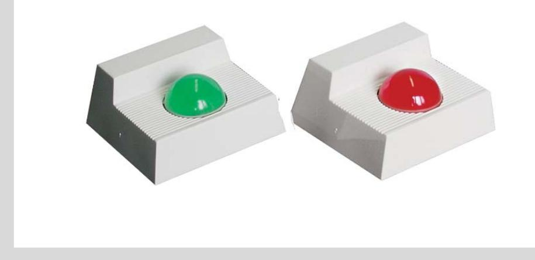
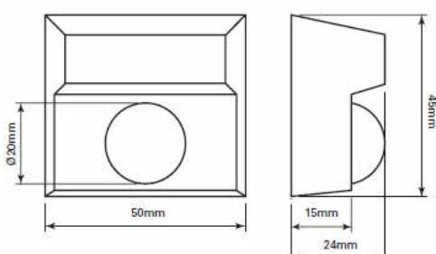

## SUM1490, SUM1490-S, SUM1490-GR

## LED-indikatorer

### **Viktiga funktioner :**

- Kompakt storlek
- Aetstethically talande
- Snabb & simpe att installera
- Tydlig LED
- bred ljusspridning
- opertaion 12 eller 24VDC
- Summer som tillval

# SUM1490, SUM1490-S, SUM1490-GR

 

LED-indikatorer

### **Beskrivning**

Hög synlighet lysdioder är idealiska vid en anmälan. Den kompakta storleken och låga strömförbrukning av de optiska och akustiska optiska repeaters gör dem idealiska för signalering av larm och avvikelser . De är vanligen installerade i gemensam användning med en detekteringsenhet i undertak och flytande golv .

Finns med ett brett utbud av LED- färgvarianter och med internt summer alternativet de optiska repete erbjuda tydlig visuell indikation som lämpar sig för en rad olika applikationer .

### **Teknisk specifikation**

| Matningsspänning spänning (12 V or 24V) | 12 … 24 VDC                                                     |  |
|-----------------------------------------|-----------------------------------------------------------------|--|
| - Strömförbrukning                      |                                                                 |  |
| - 12v/24v                               | Konstant röd lysdiod 10mA                                       |  |
|                                         | Konstant grön LED 20mA                                          |  |
|                                         | Konstant summer 20mA                                            |  |
| - Bostäder                              |                                                                 |  |
| - Material                              | Termoplastisk                                                   |  |
| - Färg                                  | Vit                                                             |  |
| indikationer                            |                                                                 |  |
| - SUM1490                               | LED-indikering konstant rött                                    |  |
| - SUM1490-S                             | LED-indikering röd och interna summern 75dB vid 0,3 ,           |  |
|                                         | alternativ för pulsad eller konstant - 2300 Hz , 0,5 s On / Off |  |
| - SUM1490-GR                            |                                                                 |  |
|                                         | LED-indikering fast grönt                                       |  |
| - Omgivningsförhållanden                |                                                                 |  |
| - Arbetstemperatur                      | -20 … +60 °C                                                    |  |
| - Skydd Bostäder (EN60529)              | IP40                                                            |  |
| Dimensioner ( Höjd x bredd x djup )     | 45 x 50 x 24 mm                                                 |  |

#### **Ordering Information**

| Typ                                                                                                                                         | Artikel Antal    | Beskrivning                                                                          | Vikt |
|---------------------------------------------------------------------------------------------------------------------------------------------|------------------|--------------------------------------------------------------------------------------|------|
| SUM1490                                                                                                                                     | N54539-Z158-A100 | LED-indikering , röd                                                                 | 21g  |
| SUM1490-S                                                                                                                                   | N54539-Z160-A100 | LED-indikering röd , med summer                                                      | 21g  |
| SUM1490-GR                                                                                                                                  | N54539-Z159-A100 | LED-indikering grön                                                                  | 21g  |
| Issued by Vanderbilt Clonshaugh Business and Technology Park Clonshaugh Dublin 17 Ireland www.vanderbiltindustries.com |                  | Data and design subject to change without notice. Supply subject to availability. |      |
| Vanderbilt                                                                                                                                  |                  | © Vanderbilt 2016                                                                    |      |

023_SUM1490_S_GR_b_sv.doc 05/08/2016 page 2