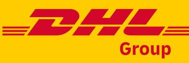
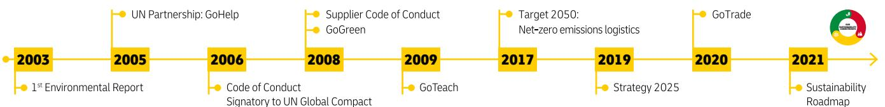
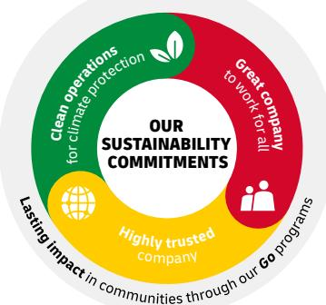
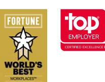
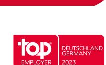
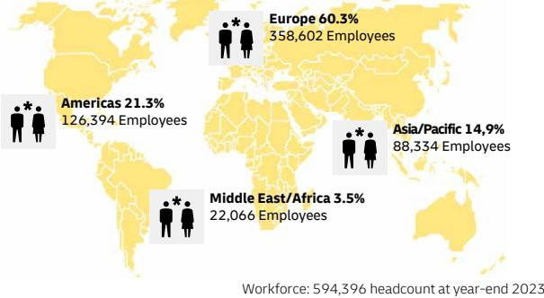
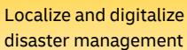

#### **La**ms SUSTAINABILITY ROADMAP FACTS & FIGURES

**sting i**

#### ACCELERATING SUSTAINABLE BUSINESS 2021-2030 **mpact** in communitiesthrough our *Go*

progra

- **<29m** tonnes CO₂e by 2030: science-based target for carbon reduction
- •**60%** E-Vehicles in pick-up and delivery by 2030
- •**30%** ESG-related targets integratedin the Corporate Board's annual bonus

## GROUP STRATEGY 2025

With around 594,000 employees in 220 countries and territories we are an essential driver of global trade, economic growth, and individual prosperity. Sustainability is our responsibility and well embedded in Strategy 2025.

## SUPPORTING UN SUSTAINABLE DEVELOPMENTS GOALS

As a longstanding partner to the United Nations (UN), the Group supports the UN Sustainable Development Goals (SDGs), focusing on **6** in particular.

## SUSTAINABILITY MILESTONES

From programs and philanthropy over responsible business practices to sustainability embedded in the Strategy 2025.

### ENVIRONMENT

**Clean operations** for sustainable logistics

### **Our aspirations by 2030:**

We continue to invest in sustainable technologiy until 2030 in **clean operations** to reduce our logistics-related GHG emissions from 40 million tonnes CO₂e in 2021 to <29 million tonnes CO₂e by 2030. By 2023 we already invested €442 m in sustainable technologies and fuels, of which €135 m are attributed to fuels. The Science-Based Targets initiative (SBTi) has reviewed and validated our sub-targets.

#### SUSTAINABILITY IN ROAD TRANSPORT

- Electrify **60%** of pickup and delivery vehicles
- >30% share of alt. fuels in the road fleet by 2030
- **35,200** (37,6%) E-Vehicles in operation

#### LEADER IN SUSTAINABLE FUELS

- Increase the use of sustainable fuels in air, ocean and road transportation to **>30%** by 2030
- **€135 million** added expenditures for sustainable fuels in 2023 (+105%)

#### CO2-NEUTRAL BUILDINGS

- Design **100%** of all new owned buildings to be carbon neutral
- **12,260** locations worldwide

#### SUSTAINABLE PORTFOLIO

- Offering sustainable alternatives for all core products & solutions
- GoGreen Plus products available in all divisions

| Purpose: | Connecting people, improving lives                  |
|----------|-----------------------------------------------------|
| Values:  | Respect & Results                                   |
| Mission: | Excellence. Simply Delivered. In a sustainable way. |

### SOCIAL

# **Great company** to work for all

#### **Our aspirations:**

We take action to provide a safe, inclusive and engaging working environment for all our employees.

#### ATTRACT & RETAIN THE BEST TALENT

Maintain a consistent **>80%** score on Employee Engagement (2023: 83%)

OCCUPATIONAL HEALTH & SAFETY Reduce accident rate (LTIFR) per 200k hours worked* to **<3.1** by 2025 (2023: 3.1 LTIFR)

#### **DHL Group: One of the world's largest private employers**

### DIVERSITY & INCLUSION

Increase share of women in upper and middle management to at least **30%** by 2025 (2023: 27,2%)

* Resulting in at least one working day of absence following the accident

### GOVERNANCE

# **Highly trusted** company

# **Our aspirations:**

We act as a role model for responsible corporate governance.

#### COMPLIANCE MANAGEMENT

- Values anchored in Code of Conduct and supplemented by topicspecifi c policies
- Policies and guidelines reviewed regularly
- Internal audits assess the implementation of our policies and the compliance with applicable laws and own policies

#### EFFECTIVE ESG GOVERNANCE

- ESG metrics and targets are integrated into our reporting and controlling
- As of 2022, ESG areas were incorporated into target portfolio for annual bonus calculation of the Board of Management
- Since 2023 on, ESG metrics have been included in the annual bonus for executives in upper management

#### ROBUST SUPPLIER MANAGEMENT

- Clear expectations on suppliers along ESG dimensions
- Assess high-risk suppliers based on structured due diligence process
- In 2023, the supplier spend covered by an accepted SCoC was at €35 billion
- >4,000 potential high-risk suppliers assessed in 2023

### RESPECT HUMAN RIGHTS

Embed **human rights awareness** in day-to-day work to prevent human rights violations

### OUR PEOPLE. OUR COMMUNITIES. OUR IMPACT.

We contribute to the socioeconomic development of the regions in which we operate through our sites, our employees and our business partners, thereby making a contribution to social and individual prosperity. As part of our corporate citizenship initiatives, we are leveraging our global network and the expertise of local employees in line with our purpose: Connecting people, improving lives

disaster management

Have additional 5 million trees planted by 2025

#### Facilitate cross-border trade for sustainable and inclusive growth

Expand GoTeach to improve employability