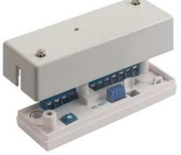
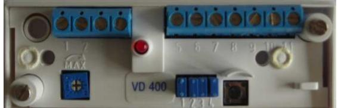
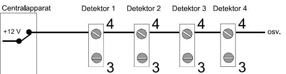
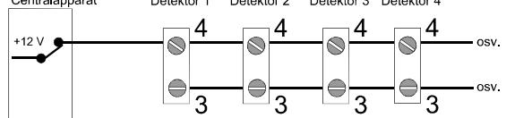
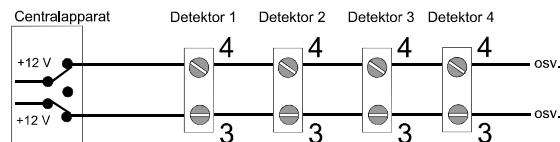
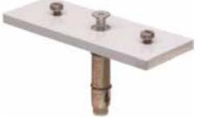
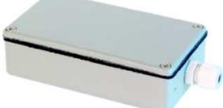
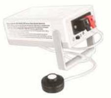

# **Seismisk detektor**

# **Installationsmanual VD 400**

## **BESKRIVNING**

Seismiska detektorn VD 400 erbjuder pålitlig övervakning mot angrepp med mekaniska och termiska verktyg på metallskåp och betongvalv.

VD 400 är en selektivt avkännande vibrationsdetektor. Den har 3 separata detektionskanaler, en integrationskanal för svaga signaler med lång varaktighet, en räknekanal som känner av stark påverkan på den övervakade ytan och en explosionskanal som känner av starka signaler från t.ex. en explosion.

Den känner av och analyserar de vibrationer som genereras när en inkräktare försöker forcera genom den övervakade ytan med mekaniska eller termiska verktyg. Den avancerade signalbehandlingen tar hänsyn till storleken på vibrationerna, frekvensen och varaktigheten. VD 400 är designad för att monteras på stål, betong och andra hårda material. Innan bevakningsområdet definieras måste ett antal faktorer tas med i beräkningen.

- Den skyddade ytans utförande, material och konstruktion.
- Detektorns läge på den skyddade ytan med hänsyn till reglar, skarvar, gångjärn och hörn etc.
- Bakgrundsstörningar kan påverka känsligheten.

Typiska bevakningsområden på olika underlag, **OBS**, praktiska tester måste göras för att verifiera räckvidden.

## **INSTALLATION & TEST**

#### **Programmering av byglar**

Det finns fyra byglar för programmering av funktioner i detektorn. Se figur.

**Bygel 1:** Kontrollerar räknekanalen. Borttagen bygel kopplar bort räknekanalen. Vid monterad bygel är antal pulser fast till 4.

**Bygel 2:** Kontrollerar känsligheten på räknekanalen.

| Material | Bevakningsområde radie |
|----------|------------------------|
| Stål     | 5 m                    |
| Betong   | 4 m                    |

#### **Montering**

- I förpackningen ingår 2 skruvar och en kabelgenomföring
- För montering på betong skall en separat monteringsplatta, MP 400, användas. Till plattan medlevereras skruvar, expanderbult och skruvar för att fästa detektorn
- Välj ut den bästa placeringen och markera och borra fästhål. Rengör ytan under detektorn för att säkerställa bästa detekteringsförmåga.
- Montera detektorn med hjälp av medföljande skruv.

#### **INKOPPLING**

Detektorn har 11 skruvplintar med trådskydd

| 1  | -   | 0 VDC                      |
|----|-----|----------------------------|
| 2  | +   | 12 VDC                     |
| 3  | AIS | Först att larma, fjärrtest |
| 4  | D/N | Dag/Natt kontroll          |
| 5  | C   | Larmrelä                   |
| 6  | NC  | Larmrelä                   |
| 7  | Sp  | Ledig                      |
| 8  | T   | Sabotagekontakt            |
| 9  | T   | Sabotagekontakt            |
| 10 | Sp  | Ledig                      |
| 11 | Sp  | Ledig                      |

**Anm**: Öppen ingång 3 och 4 är alltid Låg

Känsligheten reduceras med 2 gånger när bygeln inte är monterad.

**Bygel 3:** Kontrollerar larmreläet och har två funktionsval.

**AUTO**, återställer automatiskt larmreläet efter 2 sekunder. Bygel monterad.

**LATCH**, larmreläet kvarstår i larmläge till återställning sker antingen genom att bryta spänningen eller via ingång D/N. Bygel inte monterad.

**Bygel 4:** Kontrollerar LED funktion.

#### VD 400

**MONITOR**, LED indikerar vid larm och när detektorn detekterar vibrationer. Mycket korta blink när integrationskanal aktiveras, kort blink när räknekanal aktiveras och 2 sekunders lång blink när larmreläet aktiveras. Bygel monterad.

**AIS**, LED indikering styrs av D/N ingång i plint. Bygeln inte monterad.

Vid leverans är alla byglar monterade och detektorn har då följande funktioner.

- 1 Integrationskanalen är aktiv
- 2 4 pulser på räknekanalen
- 3 Vid kraftig signal (explosion) ges larm direkt oavsett inställning på räknekanalen
- 4 Larmreläet återställs automatiskt efter 2 sekunder
- 5 LED indikering aktiv enligt Monitor funktion, indikerar alla typer av händelser

| S1     | Pulser        | S2     | Känslighet |
|--------|---------------|--------|------------|
| ―      | 4 pulser ― |        | Normal     |
| ● ● | Ingen puls    | ● ● | Reducerad  |
|        |               |        |            |
| S3     | Relä          | S4     | LED        |
| ―      | AUTO          | ―      | Monitor    |
| ● ● | LATCH         | ● ● | AIS        |

## **Spänningsnivåer för AIS och D/N ingångar**

**Anm:** Om ingång 3 och 4 är öppen är dom "låga"

| Funktion och indike ringar | Ingång 3 AIS | Ingång 4 D/N |
|-------------------------------|-----------------|-----------------|
| DAG:                          | Låg (0 V)       | Låg (0 V)       |
| Ingen indikering              |                 |                 |
| När Larm från Natt i          |                 |                 |
| minne                         |                 |                 |
| DAG + TEST:                   | Hög (12 V)      | Låg (0 V)       |
| Indikering                    |                 |                 |
| Mycket kort = Integ           |                 |                 |
| ration                        |                 |                 |
| Kort = Räknekanal             |                 |                 |
| Lång = Larm                   |                 |                 |
| Larm i minne                  |                 |                 |
| Återställning av relä         | Låg (0 V)       | 0 V > 12 V      |
| och minne                     |                 |                 |
| NATT:                         | Låg (0 V)       | Hög (12 V)      |
| Larmminne                     |                 |                 |
| Ingen indikering              |                 |                 |

## **Pulsräknare**

VD 400 är utrustad med pulsräknare som med bygel S1 kan väljas att vara 4 pulser eller vara frånkopplad.

| Antal pulser | Bygel S1 |
|--------------|----------|
| Fyra pulser  | Sluten   |
| Frånkopplad  | Öppen    |

#### **Larmrelä**

VD 400 har en normalt sluten reläutgång som kan belastas med max. 25 V / 100 mA, reläets hålltid är cirka 2 sekunder. Vid leverans är bygel S3 sluten vilket ger automatisk återställning av larmreläet efter 2 sekunder.

| Reläfunktion     | Bygel S3 |
|------------------|----------|
| Automatiskt      | Sluten   |
| Hållande (LATCH) | Öppen    |

Genom att lämna bygel S3 öppen kräver detektorn att larmreläet återställs manuellt på ett av följande två sätt:

- Bryta matningsspänningen under några sekunder.
- Via centralapparaten koppla in Dag / Nattfunktionen på plint 4.

#### **Fjärrstyrning av Dag / Nattfunktion**

Genom att ansluta plint 4 ges möjlighet att från centralapparaten styra lysdiodens funktion samt även fjärråterställa larmreläet.

| Fjärrstyrning | Bygel S4 |
|---------------|----------|
| Ej inkopplad  | Sluten   |
| Inkopplad     | Öppen    |

Då potentialen på plint 4 ingången är positiv (hög) är indikeringsfunktionen avstängd, detta är det normala driftläget (nattläge). Då plint 4 ingångens potential ändras från positiv till negativ (hög till låg) kommer lysdioden att tändas på den detektor som löst ut larm. När plint 4 ingången återfår positiv potential återställs larmreläet och indikeringen slocknar.

Inkopplingen skall vara som bilden nedan visar.

| Funktionsläge | Potentional              |
|---------------|--------------------------|
| Dagläge       | Negativ (Låg)            |
| Nattläge      | Positiv (Hög)            |
| Återställning | Skiftning (Låg till hög) |

Genom att koppla samman flera detektorer via plint 4 ingången kan dessa fjärrstyras från centralapparaten.

#### **För korrekt funktion måste bygel S4 vara öppen.**

I nattläge skall alltså potentialen på plint 4 ingången vara hög. När ett larm löser ut kommer larmreläet att dra enligt bygel S3. Lysdioden kommer inte indikera men larmet lagras i minnet. För att få indikering måste potentialen ändras till låg på plint 4 ingången. Återställning sker vid potentialförändring igen.

## **Först att larma**

För att kombinera fjärrstyrd lysdiod med först att larma funktion krävs att en ledare till ansluts mellan alla i slingan ingående detektorer. Den ledaren ansluts till plint 3 på VD 400. Lysdioden kommer att indikera enligt följande:

- Lysdioden kommer att blinka på den detektor som först löst ut.
- Lysdioden kommer att lysa fast på de andra detektorer som också löst ut.

Inkopplingen skall vara som bilden nedan visar.

## **Fullständig funktion**

Med denna inkoppling kan två funktioner erhållas:

- Larmminne för först larmande detektor och efteråt larmande detektorer.
- Fjärrstyrd testfunktion.

Inkopplingen skall vara som bilden nedan visar.

- Vid tillkoppling av larmanläggningen skall en positiv potential kopplas till plint 4 ingången. Vid ett larm kommer detta lagras i minnet utan att indikeras på lysdioden.
- När larmanläggningen frånkopplas skall potentialen på plint 4 ingången vara negativ. Lysdioderna kommer nu att aktiveras och lysdioden på den först larmande detektorn kommer att blinka och lysa fast på de andra detektorerna som löst ut efteråt.
- Detektorerna kan nu ställas i testläge genom att en positiv potential kopplas till plint 3 ingången. Lysdioderna slocknar och detektorerna kan nu testas. När testningen är slutförd och potentialen på plint 3 ingången ändras kommer lysdioderna visa samma status som innan testen kopplades in.
- När larmanläggningen tillkopplas igen kommer larmminnena och pulsräknarna återställas.

## **OBS! Samtliga VD 400 detektorer i en anläggning kan sammankopplas via plint 3 ingången oavsett vilken sektion de tillhör.**

## **MONTERING**

- Lossa skruvarna i locket och lyft bort locket.
- Välj montageplats och markera fästhålen med hjälp av bottenplattan som mall.
- Borra med en 2 2.5 mm borr för de två medföljande skruvarna, använd inga andra skruvar.
- **Använd aldrig lim eller fästkuddar**.
- Tänk på att en slät och jämn monteringsyta under detektorn ger bättre räckvidd.
- Om monteringsplattan MP 400 används skall detektorn fästas i montageplattan med de till montageplattan medföljande skruvarna. Montageplattan **skall** fästas med den medföljande **expanderbulten** och inget annat.

## **DRIFTSÄTTNING OCH AVPROVNING**

Driftsättning och avprovningen är mycket enkel. Kontrollera att bygel S4 är sluten. Lysdioden kommer att indikera en aktiverad detektor och larmreläet återgår 2 sekunder efter aktivering. Om enheten är programmerad för fler pulser kommer varje mottagen och registrerad puls att indikeras med en kort blinkning på lysdioden. Larm indikeras med en längre blinkning.

- Sätt detektorn i MONITOR läge med bygel 4.
- Känsligheten skall vara i MAX, vrid potentiometern medurs till läge Max.
- Knacka lätt bredvid detektorn och kontrollera att varje knackning registreras och att larmreläet fungerar.
- Vrid nu potentiometern moturs till läge Min.
- Starta testningen med testutrustningen GVT 5000 på de mest avlägsna ställena som skall övervakas, öka känsligheten till lysdioden tänds upp.
- Kontrollera och efterjustera alla anslutningar. Kontrollera slutligen att både larmutgången och sabotagekontakten tas emot rätt i centralapparaten.

## **TEKNISKA DATA**

| Matningsspänning:                         | 8 - 15 VDC                    |
|-------------------------------------------|-------------------------------|
| Max rippel:                               | 2 Vpp vid 12 V                |
| Strömförbrukning:                         | 9 mA (11 mA vid larm)         |
| Larmutgång:                               | Relä (NC), 33 ohm i serie     |
| Kontaktdata:                              | 25 VDC / 100 mA               |
| Larmtid:                                  | 2 sek / kvarhållande          |
| Lågspänningslarm:                         | 7 VDC                         |
| Larmindikering:                           | LED                           |
| Sabotageskydd:                            | Ja lock och bortbrytning, NC, |
|                                           | 25 VDC / 100 mA               |
| Styringång test:                          | Låg < 3 V, Hög > 6 V          |
| Styringång Dag/Natt: Låg < 3 V, Hög > 6 V |                               |
| Känslighetsinställning: Potentiometer     |                               |
| Temperaturområde:                         | -20 - +50o C               |
| Larmåterställning:                        | Brytning av spänning          |
|                                           | /styringång                   |
| Kapslingsklass:                           | IP 42                         |
| Mått (L x B x H):                         | 91 x 31 x 23 mm               |
| Compliance:                               |                               |

## **TILLBEHÖR**

#### **MP 400 Monteringsplatta**

Monteringsplatta i metall för montage av CD 400 och VD 400 på tegel, betongväggar eller andra hårda underlag. Monteringsplattan fästs med den medföljande expanderbulten för att ge ett stort bevakningsområde.

# **TEKNISKA DATA**

Mått (L x B x H): 95 x 34 x 5 mm

#### **WH 400 Metallkapsling med värme**

Metallkapsling med inbyggt värmeelement för CD 400 och VD 400 när detektorn monteras i kalla och fuktiga utrymmen. Kapslingen levereras med expanderbultar för att ge ett stort bevakningsområde.

#### **TEKNISKA DATA**

Mått (L x B x H): 115 x 65 x 32 mm

#### **GVT 5000**

Handburen testenhet för test av glaskrossdetektorer och vibrationsdetektorer. Den genererar två typer av testsignaler. En för GD 300 detektorerna och en annan för VD 400 detektorerna. Enkel att använda och skadar inte testobjektet. Den har också en 12 V utgång för test av GD 300 serien innan montage.