# Skjutdörrar

## AKTIVERING OCH SÄKERHET >

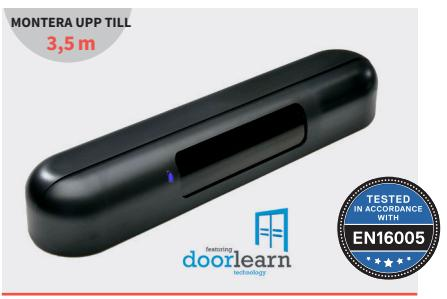

### **Dubbel teknik – nödutgångar**

- 4 m(b) x 4 m(d) detekteringsområde
- Radaraktivering + 3 infraröda säkerhetsridåer
- Energisparande teknik som detekterar i en riktning och filtrerar bort korsande trafik
- Reläutgångar med ström-, frekvens- och standardaktivering

# AKTIVERING OCH SÄKERHET >

# **3H-IR14/3H-IR14C**

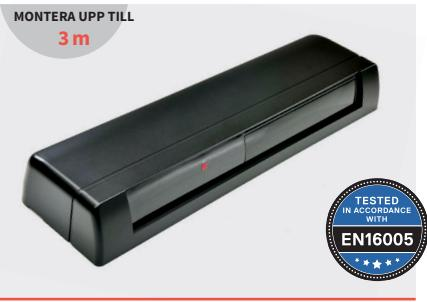

- IR-teknik
- 3 m(b) x 2 m(d) detekteringsområde
- Infraröd aktivering + 2 säkerhetsridåer för fotgängare
- Passar även till sidomarkiser

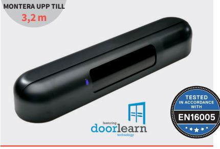

### **Dubbel teknik**

- 4 m(b) x 4 m(d) detekteringsområde
- Radaraktivering + 3 infraröda säkerhetsridåer
- Energisparande teknik som detekterar i en riktning
- Robust och lätt att installera

# AKTIVERING > SÄKERHET >

# **HR50-UNI/HR50 HP1/HP2**

#### **MONTERA UPP TILL**

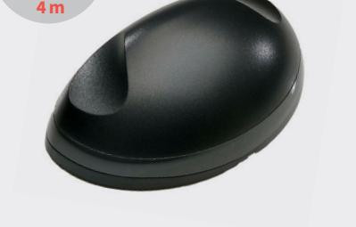

#### **Radarteknik**

- 5 m(b) x 3 m(d) detekteringsområde
- Kan monteras på vägg eller tak
- Slow motion-detekteringsteknik
- Aktivering av dörren åt ett eller båda håll

# **SSR-3-ER SSR-3 HR100-CT**

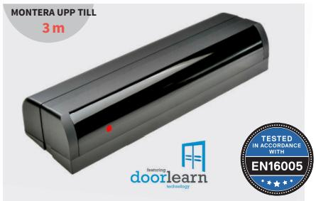

### **IR-teknik**

- 3,2 m(b) x 2,5 m(d) detekteringsområde
- Infraröd aktivering + 3 infraröda säkerhetsridåer
- Energisparande teknik som detekterar i en riktning
- Robust och lätt att installera

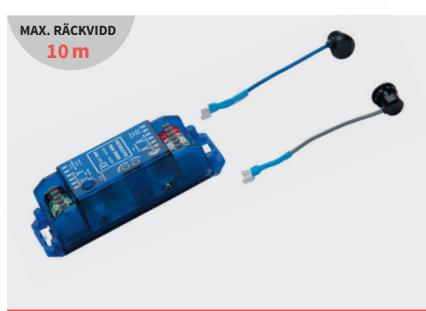

### **IR-teknik**

- Enkel eller dubbel uppsättning av säkerhetssensorer
- 10 m rörelseområde
- Enastående tålighet mot negativ påverkan från direkt solljus
- Snabb installation

# Slagdörrar

## SÄKERHET >

# **SSS-5**

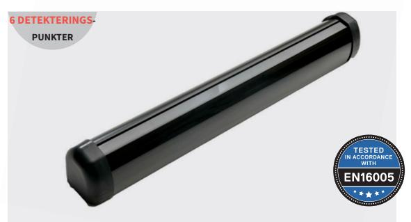

#### **IR-teknik – säkerhet**

- 1 m bred säkerhetsridå med bara 1 PCB-enhet
- Enkel installation med tryckknapp
- Finns i 3 olika längder
- Robust sensorhölje

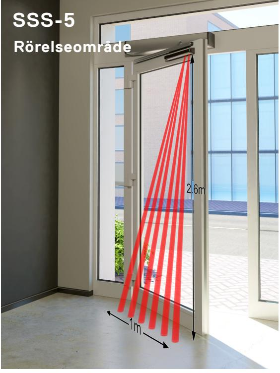

## **FP60/FSR5000**

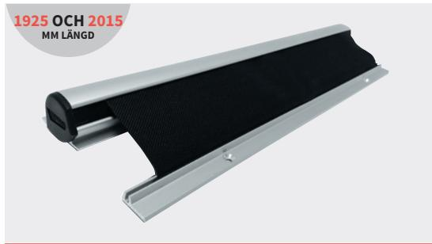

#### **Fingerskydd – rullgardinstyp**

- System med klämma för enkel installation
- Livslängd testad med cykler på 1 m
- Rostfritt och tvättbart
- Finns i längderna 1 925 mm och 2 015 mm

#### AKTIVERING >

## **HR50-UNI**

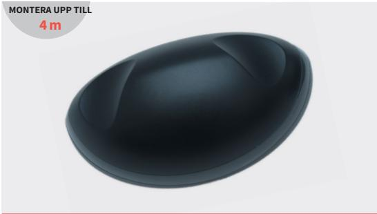

#### **Radarteknik – detektering i en riktning**

- 5 m(b) x 3 m(d) detekteringsområde justerbart
- Monteras över gångjärnet för att aktivera slagdörrar
- Kan monteras horisontellt eller vertikalt
- Liten och extremt robust

# Tel: **+353 (0)59 9140345** Mejl: **info@hotron.com www.hotron.com** För köp, service eller teknisk support:

### AKTIVERING OCH SÄKERHET >

# **KABUTO**

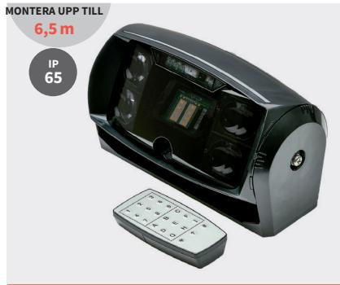

#### **Dubbel teknik**

- Upp till 7 m(b) x 9 m(d) detekteringsområde
- Skiljer mellan fordonstrafik och fotgängare
- Filtrerar bort korsande trafik och detekterar i en riktning

# **HR400-IND**

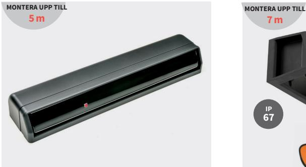

#### **IR-teknik**

- Upp till 6 m(b) x 4,5 m(d) detekteringsområde
- 2 säkerhetsridåer för fotgängare och varor
- Unikt justerbart rörelseområde

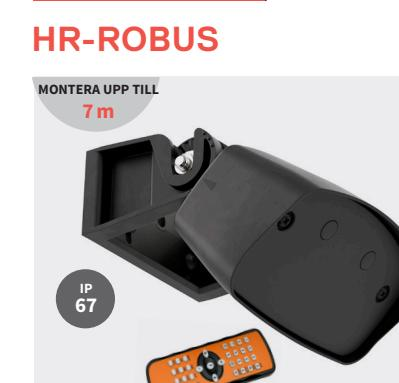

AKTIVERING >

#### **Radarteknik**

- Upp till 5 m(b) x 8 m(d) detekteringsområde
- Skiljer mellan fordonstrafik och fotgängare
- Filtrerar bort korsande trafik och detekterar i en riktning

## SÄKERHET >

## **RLK 31**

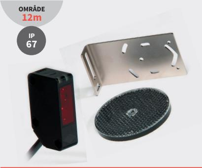

#### **IR-teknik – säkerhet**

- Universellt monteringsfäste medföljer
- Vatten- och dammtät
- Optimal inställning indikeras av LED-signal

# AKTIVERING > OMKOPPLARE >

## **ULD**

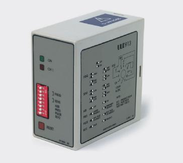

### **Markdetektor**

- Versioner med en kanal eller dubbla kanaler
- Möjlighet till detektering i en riktning
- Närvaro- eller pulsdetekteringslägen

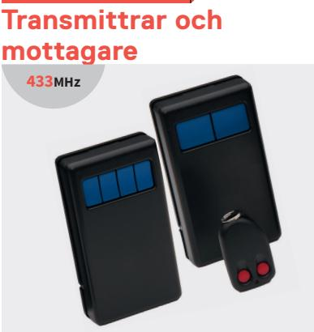

#### **Handhållen och radiostyrd**

- Versioner med en, två eller fyra kanaler
- Batterilivslängd på 60 000 cykler
- Mottagaren kan programmera upp till 12 separata transmitterkoder

## Säkerhet för fotgängare

# Dörrbrytare

## BERÖRINGSFRI >

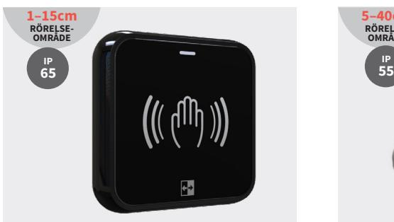

#### **Beröringsfri och trådlös omkopplare**

- Aktiv IR-teknik
- Anslut upp till 10 omkopplare till 1 mottagare
- Detektering indikeras av LED/summer
- 12 månaders batterilivslängd

## **AerWave ClearWave J-Wave**

# **5–40cm RÖRELSE-OMRÅDE IP**

### **Beröringsfri omkopplare**

- Radarteknik
- Monteras direkt mot väggen
- Konstant lysande lysdiod
- Stort detekteringsområde

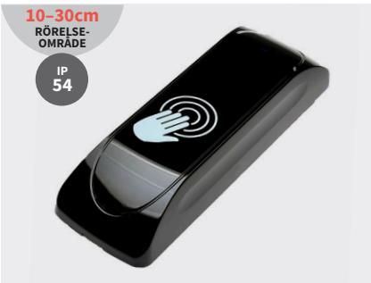

### **Kompakt beröringsfri omkopplare**

- Aktiv IR-teknik
- Monteras direkt mot väggen
- Konstant lysande lysdiod
- Av tålig polykarbonat

## TRYCKKNAPP >

# **Tryckplattor**

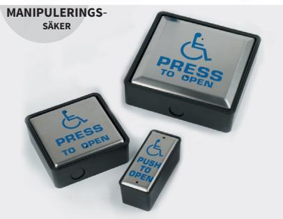

#### **Rostfria tryckplattor**

- Finns i olika storlekar
- Fast ansluten eller trådlös
- Håller länge testad i över 10 miljoner cykler
- Versioner med bakgrundbelysning

# **Tryckplattor av antimikrobiell koppar**

#### **MANIPULERINGS**-

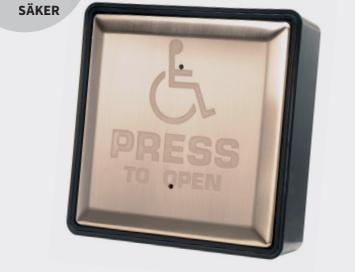

#### **Antimikrobiella tryckplattor**

- Dödar 99,9 % av bakterier
- Fast ansluten eller trådlös
- Håller länge testad i över 10 miljoner cykler
- Versioner med bakgrundbelysning

## **WT-400**

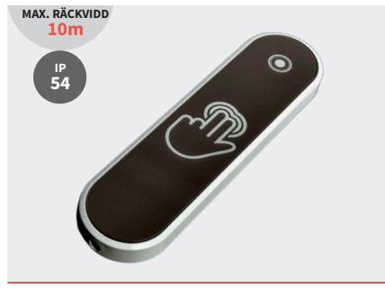

#### **Trådlös, kompakt tryckplatta**

- Anslut ett obegränsat antal WT-400 till mottagaren WR-24
- Mått: 40 mm (b) x 150 mm (h) x 13 mm (d)
- Enkel sammankoppling mellan tryckknapp och mottagare
- 24 månaders batterilivslängd