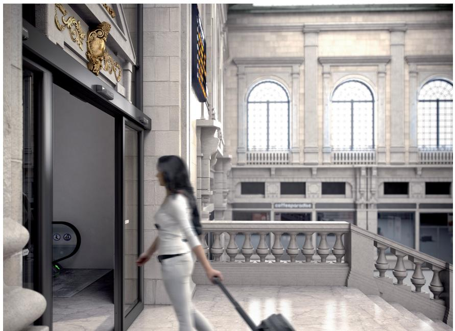
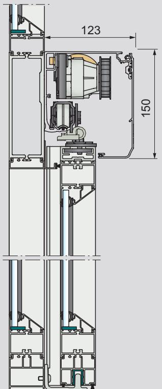
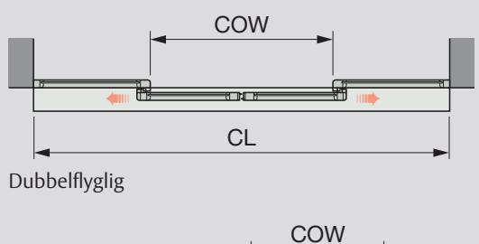
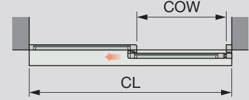
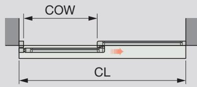

# Skjutdörrsöppnare ASSA ABLOY SL500

Den modulbaserade skjutdörren ASSA ABLOY SL500 kan uppgraderas och byggas till för att anpassas efter

## företagets tillväxt.

#### **Hållbara entréer**

Ni kan vara säkra på att entrén passar trafikflödet och uppställd miljöpåverkan. För att göra entrén mer miljöhållbar kan vi erbjuda ett antal olika lösningar: extra tätning (ASSA ABLOY TightSeal), hållbart driftläge, smart öppningsbredd baserat på trafikflödet, inre och yttre luftsluss, samt timerinställningar och mycket mer.

#### **Säkerheten i första rummet**

För att möjliggör säker passage mellan stängande dörrar backar dörrarna om de upptäcker ett hinder, därefter börjar dörrarna långsamt röra sig igen för att kontrollera om hindret är borta. Om något hinder finns under öppning eller mellan öppnande dörrar och anslutande väggar eller inredningsdetaljer, stoppar dörren omedelbart. Efter en tidsfördröjning stänger dörrarna. Dörrarnas hastighet och kraft kan justeras för att ge bästa säkerhet. För optimal säkerhet och användarbekvämlighet bör man använda ett övervakande ASSA ABLOY närvarodetekteringssystem.

| Tekniska specifikationer                                                                                                                                                                                                                                               |                                                |
|------------------------------------------------------------------------------------------------------------------------------------------------------------------------------------------------------------------------------------------------------------------------|------------------------------------------------|
| Öppnarens mått                                                                                                                                                                                                                                                         | 150 mm x 123 mm (höjd x djup)               |
| Strömförsörjning                                                                                                                                                                                                                                                       | 100-240 V AC ±10 % 50/60 Hz                 |
| Effektförbrukning                                                                                                                                                                                                                                                      | max 250 W                                      |
| Rekommenderad maximal dörrvikt ASSA ABLOY SL500-2 utan panikbrytfunktion 200 kg/ dörrblad ASSA ABLOY SL500-2 med panikbrytfunktion 100 kg/ dörrblad ASSA ABLOY SL500-1 utan panikbrytfunktion 240 kg ASSA ABLOY SL500-1 med panikbrytfunktion 100 kg |                                                |
| Dörröppningsbredd (COW) ASSA ABLOY SL500-2 (dubbelflyglig) ASSA ABLOY SL500-1 Kontakta lokal säljrepresentant för andra dimensioner.                                                                                                                       | 1000 – 3000 mm 800 – 3000 mm (enkelflyglig) |
| Öppnings- och stängningshastighet är justerbar                                                                                                                                                                                                                   | upp till 1,7 m/s (2 dörrblad)               |
| Öppethållandetid                                                                                                                                                                                                                                                       | 0 – 60 s                                       |
| Temperaturområde                                                                                                                                                                                                                                                       | -20 °C till +50 °C                             |
| Relativ luftfuktighet (icke-kondenserande)                                                                                                                                                                                                                          | max 85 %                                       |

#### **Säkerhet**

Välj säkerhetsnivå genom att lägga till olika funktioner. Oönskade besökare är inget problem med ASSA ABLOY SL500 T, tack vare de olika låsenheterna. Driftlägesväljaren kan ställas in efter era säkerhetsbehov, både under och efter era öppettider. Slussfunktionen hjälper ytterligare till att förbättra säkerhetsnivån.

#### **Service och underhåll för er bekvämlighet**

Via underhållsindikatorer och automatisk diagnos kan ni alltid ligga steget före ett driftstopp, alternativt kan ni låta oss ta hand om underhållet via ASSA ABLOY Entrance Systems specialanpassade underhållsprogram.

Vänster öppning

Höger öppning

COW = Dörröppningsbredd CL = Kåplängd

# **Standardutrustning**

Kåpa: natureloxerad aluminium

- Bärprofil med transmission
Elektronisk styrenhet med plug-in-anslutningar och strömförsörjning

#### **Universal och anpassningsbar**

ASSA ABLOY SL500 kan inte bara specialanpassas efter tekniska krav, utan även efter aktuell budget. Modulegenskaperna säkerställer modern mångsidighet och uppgraderingsmöjligheter. Kombinerat med vårt stora sortiment av dörrsystem ger dörröppnaren möjlighet att skapa attraktiva entréer som perfekt matchar ert företag och trafikflödet.

### **Modeller**

**ASSA ABLOY SL500-2 -** Två dörrblad, dubbelflygliga, med eller utan panikbrytfunktion **ASSA ABLOY SL500-R/L** - Ett dörrblad, enkelflyglig, öppnas åt höger eller vänster, med eller utan panikbrytfunktion

# **Tillbehör och alternativ**

- Kåpa: Övriga eloxeringsalternativ eller målade i RALfärger Dörradapter för dörrar, upp till 65 mm tjocklek, från andra leverantörer Trafikstyrd öppningsbredd Synkronisering av två öppnare Väljare för öppningsläge Elektronisk nödmodul för öppning och stängning Panikbrytfunktion Nödknapp
ASSA ABLOY kombinerade rörelse- och närvarosensor

Elektriska låsanordningar

Slussfunktion mellan dörröppnare

Nyckelbrytare

ASSA ABLOY automatiska dörrsystem

Nödutgång i enlighet med CO48 (Frankrike). Vid strömavbrott kan dörren öppnas med det inbyggda gummibandet.

Denna utrustning ska installeras, inspekteras regelbundet, underhållas och servas av behörig servicetekniker. Schema för förebyggande underhåll ska upprättas för korrekt och säker drift. Kontakta din ASSA ABLOY Entrance Systemsrepresentant för att få mer information om våra serviceerbjudanden!

ASSA ABLOY Entrance Systems Phone: +46 10 47 48 100 info.se.entrance@assaabloy.com