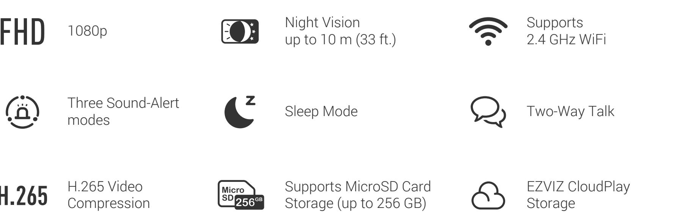
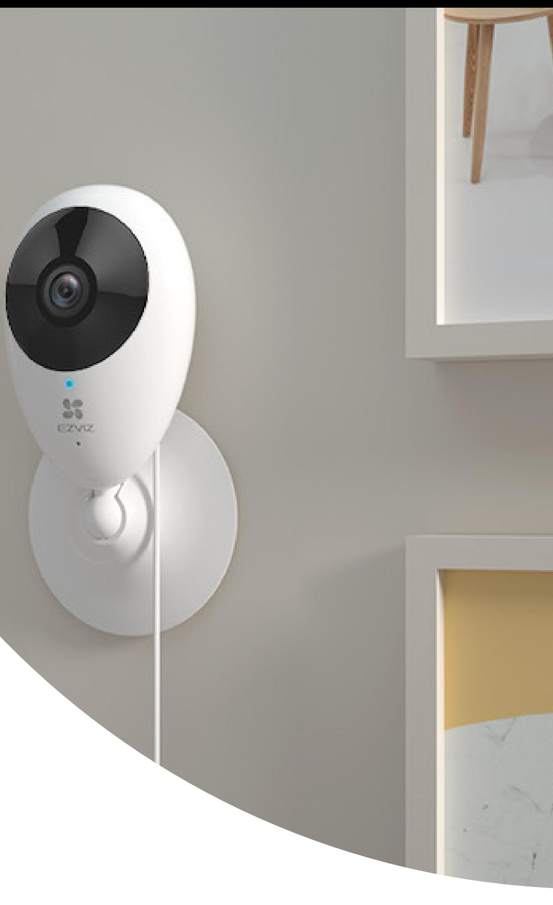
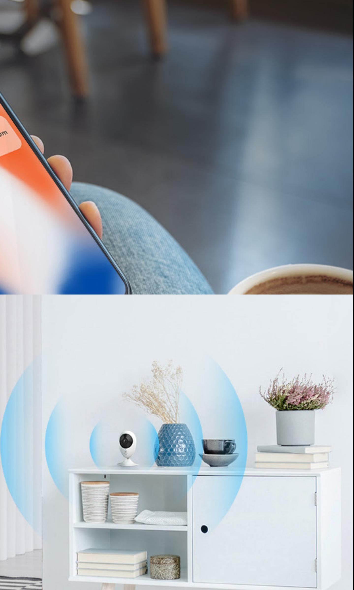
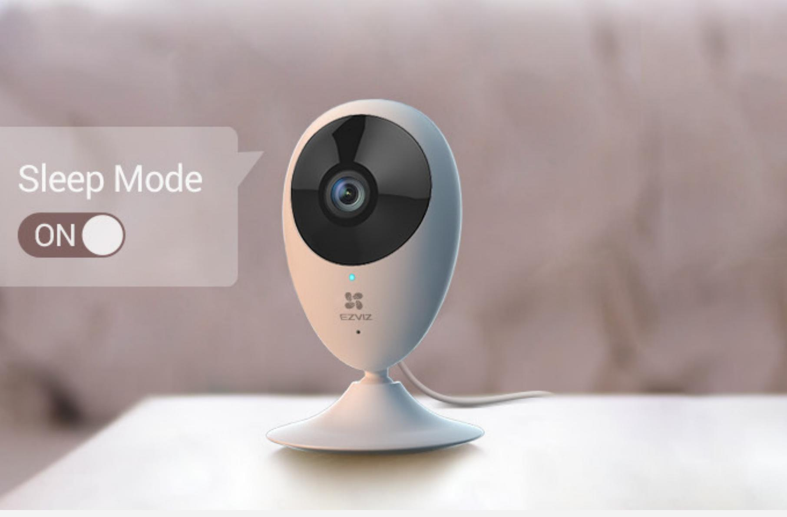
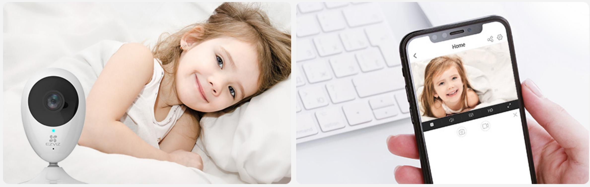
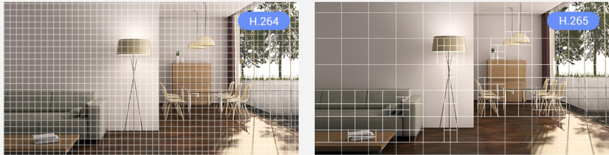
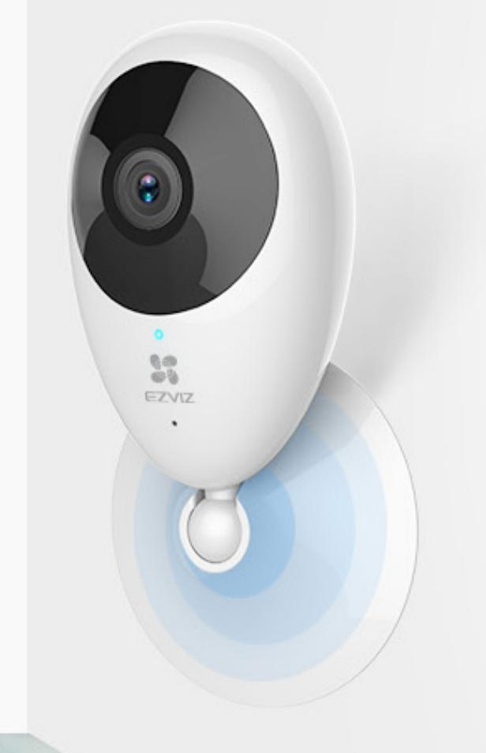

## Simple yet Extremely Powerful.

A Full HD 1080p Wi-Fi camera with a magnetic base, designed for simple and quick installation.

# Smart Home Camera

When it's dark, the C2C automatically switches to night vision mode for around-the-clock Full HD video coverage, ensureing a night vision up to10 meters.

### Keep them safe, day and night.

The C2C delivers Full HD 1080p video, and with a 108° ultra-wide-angle lens, it covers a wider range of space, so you can keep an eye on what's valuable to you.

### Full HD 1080p video with a wide-angle lens.

This camera also comes with three audio alert modes for motion detection – silent, short beep, and siren. Want to hear your visitors while you are in another room? Set the camera on siren mode so you will hear the alert loud and clear.

### User-friendly audio alerts.

The C2C watches for movement. It will send instant notifications to your smartphone when it detects motions.

### Instant alerts.

With one tap of the EZVIZ App on your mobile device, you can enable the sleep mode. Pause real-time viewing and recording whenever you need the privacy.

### Records only when you need it.

The camera comes with a built-in microphone and speaker, enabling two-way audio via the camera and your phone or tablet.

### Two-way audio.

The C2C Camera features the advanced H.265 video compression technology, achieving better video quality with only half the bandwidth and half the storage space of the previous video compression standard (H.264).

## H.265 video technology.

The C2C comes with a magnetic base and mounting kit for easy placement on walls or ceilings. Once set up, you can manually adjust it to cover just about any angle you need.

### Easy installation.

Required bandwith: 100%

Required Storage space: 100%

Required bandwith: 50%

#### Required Storage space: 50%

## Specifications Model CS-C2C-A0-1E2WF (1080P, H.265)

#### Function

| Smart Alarm      | Motion detection                                                                       |
|------------------|----------------------------------------------------------------------------------------|
| Two-way Talk     | Supports                                                                               |
| General Function | Anti-Flicker, Dual-Stream, Heart Beat, Mirror Image, Password Protection, Watermark |

#### Video & Audio

| Max. Resolution   | 1920 × 1080                                            |
|-------------------|--------------------------------------------------------|
| Frame Rate        | Max: 25 fps; Self-Adaptive during network transmission |
| Video Compression | H.265 / H.264                                          |
| H.265 Type        | Main Profile                                           |
| Video Bit Rate    | HD; Standard. Adaptive bit rate.                       |
| Audio Bit Rate    | Self-adaptive                                          |
| Max. Bitrate      | 1 Mbps                                                 |
|                   |                                                        |

#### Network

Channel Bandwidth Supports 20 MHz Security Wi-Fi Pairing AP pairing Protocol

Standard IEEE802.11b, 802.11g, 802.11n Frequency Range 2.4 GHz ~ 2.4835 GHz Transmission Rate 11b: 11 Mbps, 11g: 54 Mbps, 11n: 72 Mbps 64 / 128-bit WEP, WPA / WPA2, WPA-PSK / WPA2-PSK Interface Protocol EZVIZ cloud proprietary protocol EZVIZ cloud proprietary protocol

Camera

| Image Sensor         | 1/3" Progressive Scan CMOS                                             |
|----------------------|------------------------------------------------------------------------|
| Shutter Speed        | Self-adaptive shutter                                                  |
| Lens                 | 4 mm, view angle: 108° (Diagonal), 91° (Horizontal), 50° (Vertical) |
| Minimum Illumination | 0.5 Lux @(F2.2, AGC ON), 0 Lux with IR                                 |
| Lens Mount           | M12                                                                    |
| Day & Night          | IR-cut filter with auto-switching                                      |
| DNR                  | 3D DNR                                                                 |
| Night Vision         | 10 m                                                                   |

#### Storage

Local Storage MicroSD card (max. 256 GB) Cloud Storage EZVIZ Cloud Storage

General

| Operating Conditions  | -10 ºC ~ 45 ºC (14 °F ~ 113 °F ), Humidity 95% or less ( non-condensing) |
|-----------------------|-----------------------------------------------------------------------------|
| Power Supply          | DC 5V / 1A                                                                  |
| Power Consumption     | Max. 4.0 W                                                                  |
| Product Dimensions    | 110 × 58 × 38 mm (4.33 x 2.28 x 1.50 inch)                                  |
| Packaging Dimensions  | 149 × 91.5 × 87.5 mm (5.87 x 3.60 x 3.44 inch)                              |
| Net Weight            | 100 g (3.53 oz)                                                             |
| Weight (With Package) | 292 g (10.30 oz)                                                            |
|                       |                                                                             |

# In the box:

- C2C Camera
- USB Cable
- 3-Meter Power Adapter
- Foam Sticker
- Metal Plate
- Base
- Drill Template
- Screw Kit
- Regulatory Information
- Quick Start Guide

FCC/UL/CE/RoHS/WEEE/REACH

# Certificates

