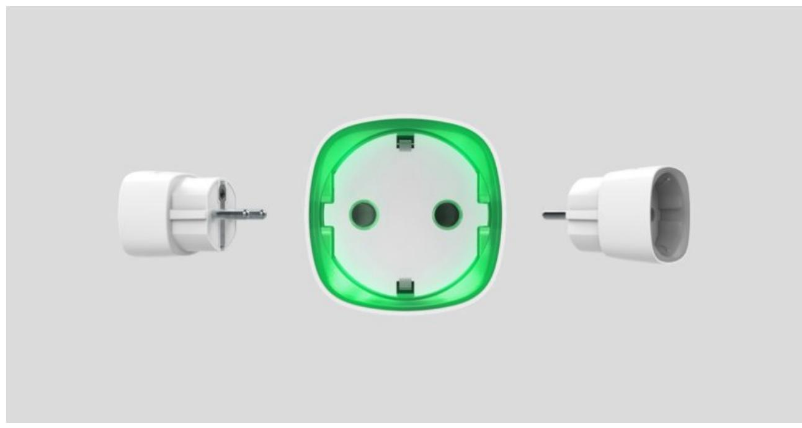
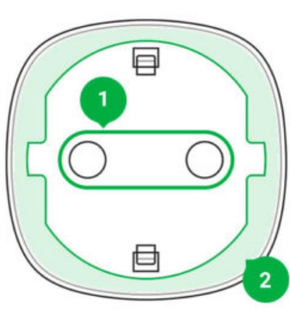
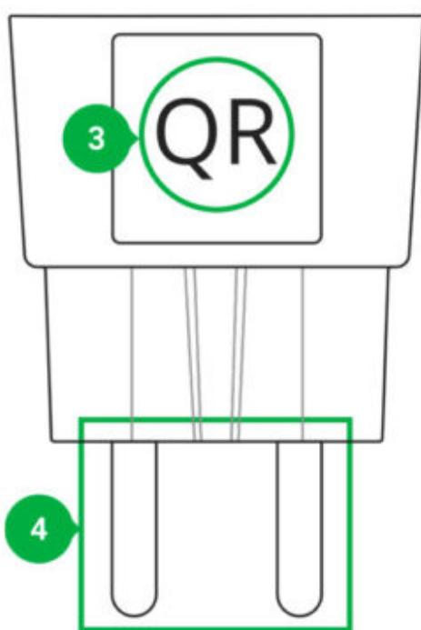
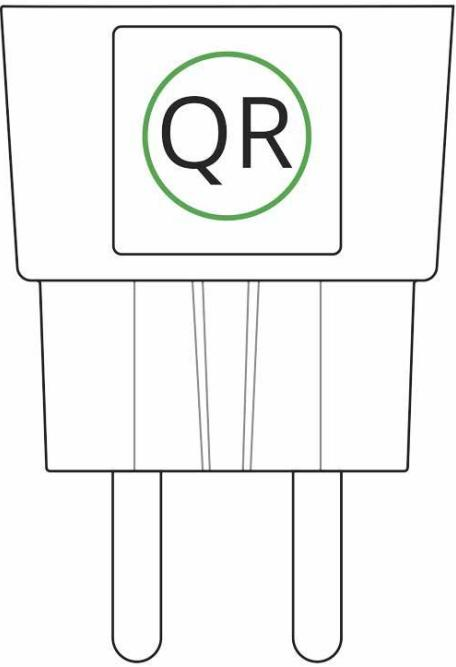
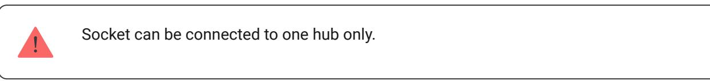
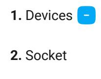
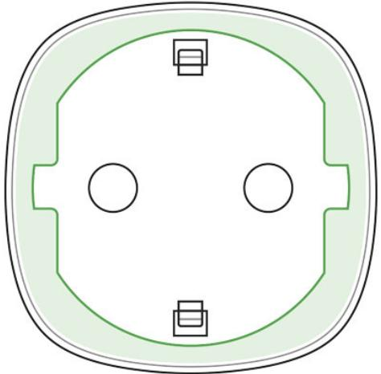
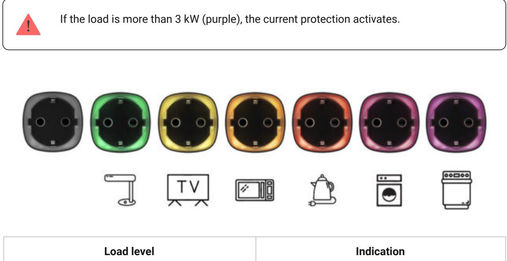

# Socket User Manual

Updated December 8, 2021

**Socket** is a wireless indoor smart plug with the power-consumption meter for indoor use. Designed as a European plug adapter (Schuko type F), Socket controls the power supply of electrical appliances with a load of up to 2.5 kW. Socket indicates the load level and is protected from overload. Connecting to the Ajax security system via a secured radio protocol, the device supports communication at a distance of up to 1,000 m in line of sight. Jeweller

Socket operates with only and does not support connecting via or integration modules. Ajax hubs ocBridge Plus uartBridge

Use scenarios to program actions of (Relay, WallSwitch or Socket) in response to an alarm, press or a schedule. A scenario can be created remotely in the Ajax app. automation devices Button

How to create and configure a scenario in the Ajax security system

The Ajax security system can be connected to a central monitoring station of a security company.

Buy smart plug Socket

# Functional Elements

- **1.** Two-pin socket
- **2.** LED border
- **3.** QR Code
- **4.** Two-pin plug

# Operating Principle

Socket switches on/off the 230 V power supply, opening one pole by the user command in the or automatically according to , , . Ajax app a scenario Button press a schedule

Socket is protected against voltage overload (exceeding the range of 184–253 V) or overcurrent (exceeding 11 A). In case of overload, the power supply switches off, resuming automatically when voltage restored to normal values. In case of overcurrent, the power supply switches off automatically, but can only be restored manually by the user command in the Ajax app.

Socket with firmware version 5.54.1.0 and higher can operate in pulse or bistable mode. With this firmware version you can also select the relay contact status:

- **Normally closed** Socket stops supplying power when activated, and resumes when turned off.
- **Normally open** Socket supplies power when activated, and stops feeding when turned off.

Socket with firmware version below 5.54.1.0 only works in bistability mode with a normally open contact.

#### How to find out the firmware version of the device?

In the app, users can check the power or amount of energy consumed by electrical appliances connected via Socket.

At low loads (up to 25 W), current and power consumption indications may be displayed incorrectly due to hardware limitations.

# Connecting

# Before connecting the device

- **1.** Switch on the hub and check its Internet connection (the logo glows white or green).
- **2.** Install the . Create the account, add the hub to the app, and create at least one room. Ajax app
- **3.** Make sure that the hub is not armed, and it does not update by checking its status in the Ajax app.

### To pair Socket with the hub

- **1.** Click **Add device** in the Ajax app.
- **2.** Name the device, scan it, or enter the **QR code** manually (located on the case and packaging), select the room.

- **3.** Plug the Socket into a power outlet and wait 30 seconds the LED frame will flash green.
- **4.** Click **Add** the countdown will begin.
- **5.** Socket will appear in the list of hub devices.

The device statuses update depends on the ping interval set in the hub settings. The default value is 36 seconds.

If the device failed to pair, wait 30 seconds and then retry.

For detection and pairing to occur, the device should be located in the coverage area of the hub's wireless network (at the same object). A connection request is transmitted only at the moment of switching on the device.

When pairing the hub with the smart plug that was previously paired with another hub, make sure that it was unpaired with a former hub in the Ajax app. For correct unpairing, the device should be in the coverage area of the hub's wireless network (at the same object): when unpaired correctly, the Socket LED frame continuously blinks green.

If the device has not been correctly unpaired, do the following to connect it to the new hub:

- **1.** Make sure that Socket is outside the coverage area of the former hub's wireless network (the indicator of the communication level between the device and the hub in the app is crossed out).
- **2.** Select the hub with which you want to pair Socket.
- **3.** Click **Add Device**.
- **4.** Name the device, scan or enter the **QR code** manually (located on the case and packaging), select the room.
- **5.** Click **Add** the countdown will begin.
- **6.** During the countdown, for a few seconds, give Socket at least 25 W load (by connecting and disconnecting a working kettle or lamp).
- **7.** Socket will appear in the list of hub devices.

#### States

**1.** Devices

#### **2.** Socket

| Parameter                | Value                                               |
|--------------------------|-----------------------------------------------------|
| Jeweller Signal Strength | Signal strength between the hub and the Socket      |
| Connection               | Connection status between the hub and the Socket |

| ReX                      | radio signal Displays the status of using a range extender                                                                |
|--------------------------|---------------------------------------------------------------------------------------------------------------------------------|
| Active                   | State of the Socket (turned on/off)                                                                                             |
| Voltage                  | The current input voltage level of Socket                                                                                       |
| Current                  | Current at the Socket input                                                                                                     |
| Current protection       | Indicates whether the overcurrent protection is enabled                                                                      |
| Voltage protection       | Indicates whether the overvoltage protection is enabled                                                                      |
| Power                    | Current consumption in W                                                                                                        |
| Electric Energy Consumed | The electric power consumed by the device connected to the Socket. The counter is reset when the Socket lose the power |
| Temporary Deactivation   | Displays the status of the device: active or completely disabled by the user                                                 |
| Firmware                 | Device firmware version                                                                                                         |
| Device ID                | Device identifier                                                                                                               |

#### Settings

**3.** Settings

| Setting     | Value                                                                   |
|-------------|-------------------------------------------------------------------------|
| First field | Device name, can be edited                                              |
| Room        | Selecting the virtual room to which the device is assigned           |
| Mode        | Selecting Socket operation mode:                                        |
|             | Pulse — when activated, Socket generates a pulse of a given duration |

|                               | Bistable — Socket, when activated, changes the state of contacts to the opposite Settings are available with firmware version 5.54.1.0 and higher                                                                                                                                                                            |
|-------------------------------|---------------------------------------------------------------------------------------------------------------------------------------------------------------------------------------------------------------------------------------------------------------------------------------------------------------------------------------|
| Contact status                | Normal contact state Normally closed Normally open                                                                                                                                                                                                                                                                              |
| Pulse duration                | Selecting the pulse duration in the pulse mode: From 0.5 to 255 seconds                                                                                                                                                                                                                                                            |
| Overcurrent Protection        | If enabled, power supply switches off if the current load exceeds 11A, if disabled the threshold is 16A (or 13A for 5 seconds)                                                                                                                                                                                                  |
| Overvoltage protection        | If enabled, power supply switches off in case of a voltage surge beyond the range of 184 – 253 V                                                                                                                                                                                                                                   |
| Indication                    | The option of disabling the LED frame of the device                                                                                                                                                                                                                                                                                |
| LED Brightness                | The option of adjusting the brightness of the LED frame of the device (high or low)                                                                                                                                                                                                                                                |
| Scenarios                     | Opens the menu for creating and configuring scenarios Learn more                                                                                                                                                                                                                                                                |
| Jeweller Signal Strength Test | Switches the device to the signal strength test mode                                                                                                                                                                                                                                                                               |
| User Guide                    | Opens the Socket User Guide                                                                                                                                                                                                                                                                                                           |
| Temporary Deactivation        | Allows the user to deactivate the device without removing it from the system. The device will not execute system commands and participate in automation scenarios. All notifications and alarms of the device will be ignored Please note that deactivated device will save it's current state (active or inactive) |
| Unpair Device                 | Disconnects the device from the hub and deletes                                                                                                                                                                                                                                                                                       |

### Indication

Socket informs the user of the power level consumed by connected appliances using the LED.

| No power on the Socket    | Don't have any indication |
|---------------------------|---------------------------|
| Socket turned off         | Blue                      |
| Socket turned on, no load | Green                     |
| ~550 W                    | Yellow                    |
| ~1250 W                   | Orange                    |
| ~2000 W                   | Red                       |
| ~2500 W                   | Dark red                  |

| ~3000 W                                   | Purple                              |
|-------------------------------------------|-------------------------------------|
| One or more types of protection triggered | Smoothly lights up and goes out red |
| Hardware failure                          | Quick red flashes                   |

The exact power can be seen in the . Ajax Security System application

# Functionality Testing

The Ajax security system allows conducting tests for checking the functionality of connected devices.

The tests do not start immediately but within a period of 36 seconds when using default settings. The test time start depends on the settings of the detector ping interval (the "**Jeweller**" menu in the hub settings).

Jeweller Signal Strength Test

### Installation of the Device

The location of Socket depends on its remoteness from the hub, and obstacles hindering the radio signal transmission: walls, floors, large objects inside the room.

Do not install the device near sources of magnetic fields (magnets, magnetized objects, wireless chargers, etc.) and inside rooms with temperature and humidity outside the permissible limits!

Check the Jeweller signal level at the installation location. If the signal level is low (one bar), we cannot guarantee the stable operation of the device.

If the device has a low or unstable signal strength, use a . radio signal range extender

Socket is designed to connect to a European two-pin socket (Schuko type F).

#### Maintenance

The device does not require maintenance.

# Tech specs

| Actuating element                                      | Electromagnetic relay                                                                                                                                     |
|--------------------------------------------------------|-----------------------------------------------------------------------------------------------------------------------------------------------------------|
| Service life                                           | At least 200,000 switches                                                                                                                                 |
| Voltage and type of external power supply              | 110–230 V, 50/60 Hz                                                                                                                                       |
| Voltage protection for 230 V mains                     | Yes, 184–253 V                                                                                                                                            |
| Maximum load current                                   | 11 A (continuous), 13A (up to 5 s)                                                                                                                        |
| Operating modes                                        | Pulse and bistable (firmware version is 5.54.1.0 or higher. Manufacture date from March 4, 2020) Only bistable (firmware version under 5.54.1.0) |
| Pulse duration                                         | 0.5 to 255 seconds (firmware version is 5.54.1.0 or higher)                                                                                            |
| Maximum current protection                             | Yes, 11 A if the protection is turned on, up to 13 A if the protection is turned off                                                                   |
| Maximum temperature protection                         | Yes, +85°С. The socket turns off automatically if the temperature is exceeded                                                                          |
| Electric shock protection class                        | Class I (with grounding terminal)                                                                                                                         |
| Energy consumption parameter check                     | Yes (current, voltage, power consumption)                                                                                                                 |
| Load indicator                                         | Yes                                                                                                                                                       |
| Output power (resistive load at 230 V)                 | Up to 2.5 kW                                                                                                                                              |
| Average energy consumption of the device on standby | Less than 1 W⋅h                                                                                                                                           |
| Radio communication protocol                           | Jeweller Learn more                                                                                                                                    |
| Radio frequency band                                   | 866.0 – 866.5 MHz 868.0 – 868.6 MHz 868.7 – 869.2 MHz 905.0 – 926.5 MHz                                                                          |

|                             | 915.85 – 926.5 MHz 921.0 – 922.0 MHz Depends on the region of sale.  |
|-----------------------------|----------------------------------------------------------------------------|
| Compatibility               | hubs radio Operates with all Ajax , and signal range extenders |
| Maximum radio signal power  | 8,97 mW (limit 25 mW)                                                      |
| Radio signal modulation     | GFSK                                                                       |
| Radio signal range          | Up to 1000 m (when there are no obstacles)                                 |
| Installation method         | In power outlet                                                            |
| Operating temperature range | From 0°С to +40°С                                                          |
| Operating humidity          | up to 75%                                                                  |
| Protection class            | IP20                                                                       |
| Overall dimensions          | 65.5 × 45 × 45 mm (with plug)                                              |
| Weight                      | 58 g                                                                       |
| Service life                | 10 years                                                                   |

In case of using inductive or capacitance load, the maximum switched current is reduced to 8 A at 230 V AC!

#### Compliance with standards

# Complete Set

- **1.** Socket
- **2.** Quick Start Guide

### Warranty

Warranty for the "AJAX SYSTEMS MANUFACTURING" LIMITED LIABILITY COMPANY products is valid for 2 years after the purchase.

If the device does not work correctly, you should first contact the support service—in half of the cases, technical issues can be solved remotely!

#### The full text of the warranty

User Agreement

Customer support: support@ajax.systems