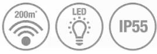

# **DCP311**

Trådlös tryckknapp med LED-indikator - Stående, vit

Den trådlösa tryckknappen Honeywell DCP311 kombinerar fantastisk funktionalitet med en design som är bäst i klassen. Den har LED-indikator som visar att tryckknappen fungerar och funktionen med hemlig knackning spelar en annan melodi så att du vet att det är någon i familjen eller någon du känner som står vid dörren.

# Förpackningens innehåll:

1 x Trådlös tryckknapp,1 x CR2032 (3V) Batteri,1 x Snabbstartguide, 1 x Säkerhet och garanti,1 x Konformitetsdeklaration,

### Viktiga funktioner och fördelar:

**Sinnesro** - Sinnesro för besökare, tack vare en LED-lampa som bekräftelse på tryckknappen och sinnesro för dig tack vare den hemliga knackningsfunktionen, som spelar en annan melodi så att du vet om det är en familjemedlem eller vän som står vid dörren. För total sinnesro kan du med Honeywell ActivLink™ koppla ihop din dörrklocka med Honeywells säkerhetstillbehör och hemlarmskit för att skapa ett skräddarsytt varningssystem för ditt hem.

**Enkla att installera** - Alla Honeywells tryckknappar och tillbehör är enkla att installera, med möjligt skruvfritt montage och ett lättöppnat batterifack så att du är klar på några minuter. Allt detta backas upp av en 2-årig produktgaranti.

# Specifikation:

| Trådlös tryckknapp                           |                                                     |
|----------------------------------------------|-----------------------------------------------------|
| Färg                                         | Vit                                                 |
| Väggmonterad                                 | Tillval                                             |
| Monteringsalternativ utan skruvar (fästtejp) | Ja                                                  |
| Frekvens / Trådlös räckvidd*                 | 868MHz / 200m                                       |
| Visuella varningar                           | LED-blixtljus                                       |
| Ström                                        | Batteri: 1 x CR2032 (3V) - (inkluderad)             |
| Batteritid (år)                              | 2                                                   |
| Batterifunktioner                            | Indikator för lågt batteri / Lättöppnat batterifack |
| Tryckknappens design                         | Stående                                             |
| Namnskylt med pushfunktion                   | Nej                                                 |
| IP-klassning                                 | IP55                                                |
| Driftstemperatur/förvaringstemperatur        | 0°C till +40°C/-20°C till +60°C                     |
| Mått (mm) / Vikt (g)                         | 30 (h) x 70 (b) x 16 (d) / 23.5 (g)                 |
| Fästanordningar                              | Stöd / Väggpluggar / Skruvar / Fästtejp             |
|                                              |                                                     |
| Förpackning                                  |                                                     |
| EAN-kod / Standardpack EAN-kod               | 5004100965738 / 5004100967312                       |
| Förpackningens mått (mm) / Vikt (g)          | 83 (h) x 146 (b) x 30 (d) / 108 (g)                 |

* Mätt i en öppen omgivning. Väggar, tak och metallkonstruktioner minskar den maximala räckvidden.

Standardförpackningens kvantitet 6

livewell.honeywell.com | © 2015 Honeywell International Inc.