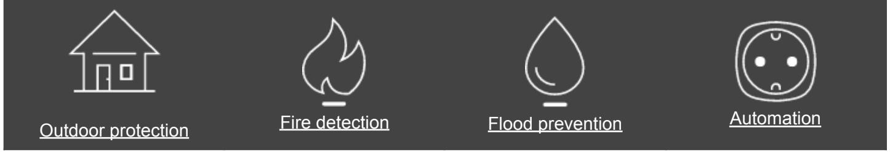

# StarterKit Cam Plus

Basic security system setup with visual alarm verifications and LTE support

### For intrusion detection and prevention

## Instant info on what caused an alarm

Communication with the outer world is critical for a security system. It defines the speed of reaction to potential threats. Hub 2 Plus controls the StarterKit Cam Plus system. It is equipped with Ethernet port, Wi-Fi module, and 2 SIM cards supporting LTE. Four channels back up each other to guarantee continuous instant alarm communication. Moreover, they allow Ajax to deliver photo verifications to alarm monitoring companies and users in less than 9 seconds. Even over a cellular network.

## For projects of any complexity

StarterKit Cam Plus is the core of a multi-level security system. Hub 2 Plus can manage 200 devices: motion detectors with photo verification of events and sirens, fire and leak detectors, automation relays, even integration modules with wired devices.

With StarterKit Cam Plus, engineers can add 200 users to the system and create 25 security groups — to divide large premises into zones and organize access. And 64 automation scenarios to lower the impact of a human factor on security.

- 200 users
- 200 devices in a system
- 25 security groups
- 35 km2 maximum radio range coverage with 5 ReX

## StarterKit Cam Plus consists of four devices

- [Hub 2 Plus](https://ajax.systems/products/hub2-plus/) The hub controls all security system devices. When detectors identify threats, it informs an alarm monitoring company and users with push-notifications, SMS, and calls.
- [MotionCam](https://ajax.systems/products/motioncam/) Motion detector spots trespassers the moment they step on a protected property and takes a series of photos.
- [DoorProtect](https://ajax.systems/products/doorprotect/) Detector reacts to opening instantly. This is the first line of protection of a security system. It can be installed on any door type.
- [SpaceControl](https://ajax.systems/products/spacecontrol/) The key fob arms and disarms your home. It allows users to call for help in one click in case of an emergency.

#### Extend your security system arsenal

