# StreetSiren DoubleDeck User Manual

Updated December 8, 2021

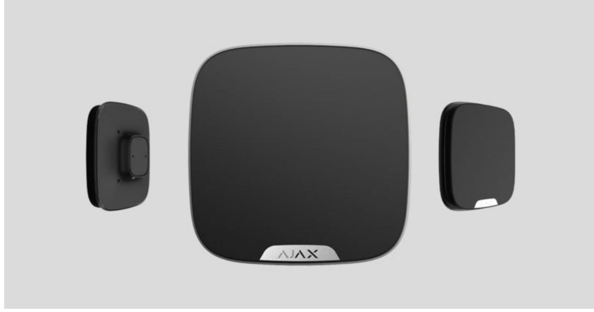

**StreetSiren DoubleDeck** is a wireless outdoor siren with mount for the branded faceplate. Equipped with a LED frame and piezoelectric alarm indicator producing sound volume up to 113 dB, StreetSiren can operate up to 5 years from pre-installed batteries. It can also be powered from an external 12 V power supply.

StreetSiren DoubleDeck communicates with the hub via the secured Jeweller radio protocol. The communication range is up to 1,500 meters provided there are no obstacles.

The siren only works as part of the Ajax security system. Integration with third-party systems and connection to or are not supported. ocBridge Plus uartBridge

The siren is set up via for iOS, Android, macOS, and Windows. The system notifies users of all events with push notifications, SMS, and calls (if activated). Ajax apps

#### Buy street siren StreetSiren DoubleDeck

#### Buy branded faceplate for StreetSiren DoubleDeck

The Ajax security system can be connected to a central monitoring station (CMS) of the security company. A list of security companies is available . on the website

#### Functional elements

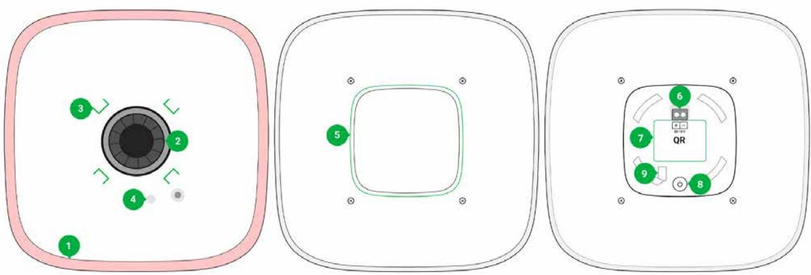

- **1.** LED frame
- **2.** Piezoelectric alarm indicator
- **3.** Latches for mounting the Brandplate

- **4.** Place for fixing the Brandplate with a screw
- **5.** SmartBracket mounting plate
- **6.** Terminals for connecting the external power supply
- **7.** QR code. The QR code includes the ID/serial number of the device
- **8.** On/off button
- **9.** Place for fixing the SmartBracket panel with a screw

### Operating principle

StreetSiren DoubleDeck performs two tasks:

1. **Informs about the alarm**. The device responds to triggering of the tamper and security system alarms in less than a second, including a siren and LED backlight, which scares off intruders and attracts the attention of neighbors.

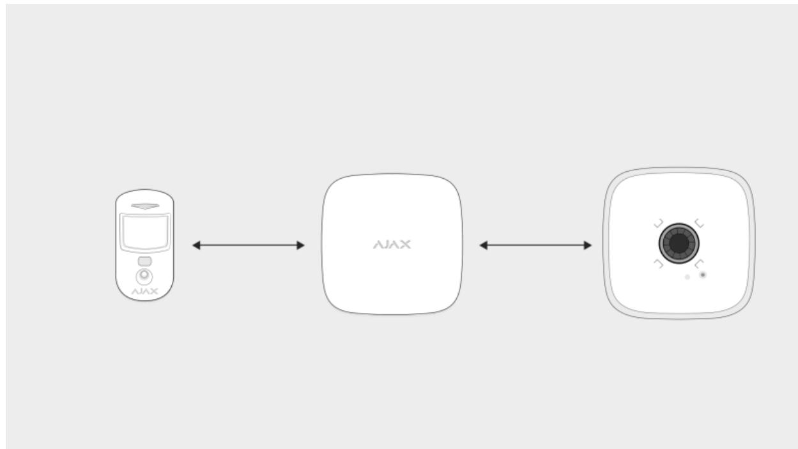

2. **Serves as a security status indicator**. The siren uses LED indication to notify that the object is armed, as well as uses sound and LEDs to notify about the delay when entering/leaving. These functions will be useful when controlling the security system using SpaceControl or KeyPad (the siren reminds you of disarming when you enter the object).

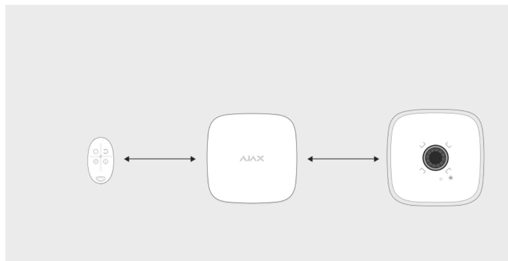

#### What is Delay When Entering/Leaving

When installed properly, it is hard to dismount and disconnect an activated siren: its body is robust, the buzzer protected, and power is from the bundled batteries, so the siren will continue to work even if there is a power outage at the object. Also, if the system is armed, the power button is blocked, preventing the siren from being turned off.

The siren is equipped with a tamper button and an accelerometer. The tamper button is triggered when the device body is opened/broken, and the accelerometer is triggered when somebody's attempting to move or dismantle the device.

What is a tamper

#### Connecting a siren to a hub

#### Before starting connection

- **1.** Install the . . Add a hub to the app and create at least one room. Ajax app Create an account
- **2.** Make sure that the hub is on and has Internet access. The status of the Internet connection is available in the Ajax app and is also indicated by the color of the hub's logo (lights white or green).
- **3.** Make sure that the hub **is disarmed** and **is not starting updates**. This can be checked in the Ajax app.

Only users with administrator rights can connect the StreetSiren DoubleDeck to the hub.

### To connect StreetSiren DoubleDeck

- **1.** Go to the **Devices** tab in the Ajax app and click **Add Device**.
- **2.** Name the device, scan or type the QR code (located on the body and packaging), and select the location room.
- **3.** Click **Add**; the countdown will begin.
- **4.** Turn on StreetSiren DoubleDeck by holding the power button for 3 seconds. Keep in mind that the hub connection request is only sent when the siren is turning on.

The power button is recessed into the body and is tight to press. You can use a thin, hard object, like a pencil, to press it.

For detection and pairing to take place, StreetSiren DoubleDeck must be within the hub's radio communication range, i. e. at the same guarded object.

StreetSiren DoubleDeck shuts down automatically 6 seconds after turning on if it failed to connect to the hub. There is no need to deactivate the device to retry the connection. If StreetSiren DoubleDeck has already been assigned to another hub, turn off the siren and follow the standard addition procedure.

The connected siren will appear in the list of hub devices in the app. Updating device statuses in the list depends on the ping time defined in Jeweller settings. The default value is 36 seconds.

Up to 10 sirens can be connected to one hub.

### States of StreetSiren DoubleDeck

#### Icons

Icons display some of the StreetSiren DoubleDeck states. You can view them in the , in the **Devices** menu . Ajax app

| Icon | Value                                                                     |
|------|---------------------------------------------------------------------------|
|      | Shows Jeweller signal strength between the hub and StreetSiren DoubleDeck |
|      | Battery charge level                                                      |
|      |                                                                           |

#### States

Siren states can be found in the Ajax app:

- **1.** Go to the **Devices** tab .
- **2.** Select StreetSiren DoubleDeck from the list.

| Parameter                | Value                                                                                                                                                                                                                    |
|--------------------------|--------------------------------------------------------------------------------------------------------------------------------------------------------------------------------------------------------------------------|
| Temperature              | Siren temperature, which is measured on the processor and changes gradually. Displayed in 1°C increment. Acceptable error between the value in the app and temperature at the installation site: 2–4°C       |
| Jeweller Signal Strength | Signal strength between the hub/range extender and siren. We recommend installing the siren in places with the signal strength of 2-3 bars                                                                      |
| Connection               | Connection status between the hub/range extender and StreetSiren DoubleDeck: Online — the siren is connected to the hub/range extender Offl ine — the siren is not connected to the hub/range extender |
| Battery Charge           | Battery level of the device. Two states available: ОК Battery discharged How battery charge is displayed in Ajax apps                                                                                        |
| Lid                      | The tamper status of the device, which responds to the opening of the device body                                                                                                                                     |

|                                                    | What is a tamper                                                                                                                                                                                                                                                                     |
|----------------------------------------------------|--------------------------------------------------------------------------------------------------------------------------------------------------------------------------------------------------------------------------------------------------------------------------------------|
| ReX Range extender name                            | Displays when the siren is operating via a radio signal range extender                                                                                                                                                                                                            |
| External Power                                     | External power supply status of the siren: Connected — external 12 V power supply is connected to the siren Disconnected — siren powered by pre installed batteries                                                                                                      |
| Alarm Volume                                       | Volume level in case of alarm: Muted Quiet Loud Very loud                                                                                                                                                                                                                |
| Alarm Duration, sec                                | Duration of the alarm sound: from 3 to 180 seconds                                                                                                                                                                                                                                |
| Alert If Moved                                     | Alarm when the accelerometer is triggered. When enabled, the siren is triggered if you turn the body or detach the device from the mount                                                                                                                                       |
| LED indication                                     | If enabled, the siren LED frame blinks once every 2 seconds when the system is in the armed mode Disabled — LED indication is off Armed — the siren blinks only when in the armed mode Always — the siren blinks regardless of the state of the security system |
| Beep When Arming/Disarming                         | If enabled, the siren alerts you by backlighting the LED frame and a short beep when arming and disarming                                                                                                                                                                      |
| Notify about arming/disarming of the Night mode | If enabled, the siren alerts you by backlighting the LED frame and a short beep when arming and disarming the system from the Night mode                                                                                                                                       |
| Beep on Entry/Exit delay                           | If this option is enabled, the siren signals about                                                                                                                                                                                                                                   |

|                                                        | a delay when entering/leaving                                                                                                                                     |
|--------------------------------------------------------|-------------------------------------------------------------------------------------------------------------------------------------------------------------------|
| Notify about the entry/exit delay in the Night mode | If this option is enabled, the siren beeps to signal about an entry/exit delay in the Night mode                                                            |
| Beep volume                                            | Volume of the audible notification signal about arming/disarming, entry/exit delay, opening detector triggering: Quiet Loud Very loud              |
| Temporary Deactivation                                 | Shows the status of the device: active, completely disabled by the user, or only notifications about triggering of the device tamper button are disabled |
| Firmware                                               | StreetSiren DoubleDeck firmware version. It is not possible to change the firmware                                                                             |
| ID                                                     | StreetSiren DoubleDeck ID/serial number. Also located on the device packing box and under the SmartBracket mount                                            |
| Device No.                                             | Number of the device loop (zone)                                                                                                                                  |

### Settings

#### **To set up StreetSiren DoubleDeck:**

- **1.** Go to the **Devices** tab in the . Ajax app
- **2.** Select StreetSiren DoubleDeck from the list.
- **3.** Go to **Settings** by clicking on the .

Note that after editing the settings, you should click the **Back** button to save them.

| Settings    | Value                                      |
|-------------|--------------------------------------------|
| First field | Siren name that can be edited. The name of |

|                      | device you can see at notifications in the event feed.                                                                                  |
|----------------------|--------------------------------------------------------------------------------------------------------------------------------------------|
|                      | The name can contain up to 12 Cyrillic characters or up to 24 Latin symbols                                                             |
| Room                 | Selecting the virtual room to which StreetSiren DoubleDeck is assigned. The room name you can see at notifications in the event feed |
|                      | Selecting the group to which the siren is assigned. You can select one or all groups:                                                   |
|                      | When assigned to a group, the siren and its indication are related to alarms and events of this group                                |
| Alarms in Group Mode | When attached to all groups, the siren and its indication are related to alarms and events of all groups in the system               |
|                      | Regardless of the group selected, the siren will Night Mode respond to activation and alarms                                   |
|                      | Learn more                                                                                                                                 |
|                      | The siren responds to system alarms with the selected volume:                                                                           |
|                      | Muted — the siren does not sound when the alarm is raised                                                                               |
| Alarm Volume         | Quiet — 85 dB volume                                                                                                                       |
|                      | Loud — 100 dB volume                                                                                                                       |
|                      | Very loud — 113 dB volume                                                                                                                  |
|                      | The volume level is measured 1 m away from the siren                                                                                    |
| Alarm Duration, sec  | Determines how long the siren sounds in case of alarm: 3 to 180 seconds for each operation. Set in increments of 3 seconds           |
| Alert If Moved       | Alarm when the accelerometer is triggered: the siren is triggered if you turn the body or detach the device from the mount.          |

|                               | The built-in accelerometer takes 60 seconds to remember the normal position. Do not rush to check the performance of the function before this time expires                                                                                             |
|-------------------------------|-----------------------------------------------------------------------------------------------------------------------------------------------------------------------------------------------------------------------------------------------------------------|
| LED indication                | LED indication of the siren settings: Disabled — LED indication is off Armed — LED blinks once every 2 seconds only when the system is armed Constantly — LED blinks once every 2 seconds regardless of the mode state More about indication  |
| Beeps settings                | Opens the siren notification settings. A detailed available description of the settings is below                                                                                                                                                       |
| Volume Test                   | Switches the device to the volume test mode What is Volume Level Test                                                                                                                                                                                        |
| Jeweller Signal Strength Test | Switching the siren to the Jeweller signal strength test mode. The test allows you to check the signal level between the hub and StreetSiren DoubleDeck and determine the optimal installation location What is Jeweller Signal Strength Test |
| Signal Attenuation Test       | Switching StreetSiren DoubleDeck to the signal attenuation test mode What is Attenuation Test                                                                                                                                                             |
| User Guide                    | Opens the StreetSiren DoubleDeck User Guide                                                                                                                                                                                                                     |
| Temporary Deactivation        | Allows the user to disconnect the device without removing it from the system (available for StreetSiren DoubleDeck with firmware version 3.71 and later). Two options are available:                                                                |

|               | Deactivate entirely — the device will not execute system commands or participate in automation scenarios, and the system will ignore device alarms and other notifications |
|---------------|-------------------------------------------------------------------------------------------------------------------------------------------------------------------------------------|
|               | Deactivate lid notifications — the system will ignore only notifications about the triggering of the device tamper button                                                     |
|               | Learn more about temporary                                                                                                                                                          |
|               | deactivation of devices                                                                                                                                                             |
| Unpair Device | Unpairs StreetSiren DoubleDeck, disconnects it from the hub, and deletes its settings                                                                                            |

### Siren beeps settings

| Arming/Disarming                   | When this option is enabled, the siren warns of arming and disarming by lighting of the LED frame and by a short beep                                          |
|------------------------------------|----------------------------------------------------------------------------------------------------------------------------------------------------------------------|
| Night Mode Activation/Deactivation | If enabled, the siren alerts you by backlighting the LED frame and a short beep when arming and disarming the system from the Night mode What is Night mode |
| Entry Delays                       | If this option is enabled, the siren beeps to signal about an entry delay What is Delay When Entering/Leaving                                               |
| Exit Delays                        | If this option is enabled, the siren beeps to signal about an exit delay What is Delay When Entering/Leaving                                                |
| Entry Delays in Night Mode         | If this option is enabled, the siren beeps to signal about an entry delay in the Night mode What is Night mode What is Delay When                           |

|                           | Entering/Leaving                                                                                                                                              |
|---------------------------|---------------------------------------------------------------------------------------------------------------------------------------------------------------|
| Exit Delays in Night Mode | If this option is enabled, the siren beeps to signal about an exit delay in the Night mode What is Night mode What is Delay When Entering/Leaving |
| Beep volume               | Selecting the volume level of the siren at the time of notification on arming/disarming or delay when entering/leaving and opening:                     |
|                           | Quiet — 85 dB volume                                                                                                                                          |
|                           | Loud — 100 dB volume                                                                                                                                          |
|                           | Very loud — 113 dB volume                                                                                                                                     |
|                           | The volume level was measured 1 m away from the siren                                                                                                      |

### Setting up the processing of detector alarms

Through the Ajax app, you can configure which detector alarms can activate the siren. This can help to avoid situations when the security system notifies of LeaksProtect leak detector alarm or any other device alarm. The parameter is adjusted in the detector or device settings:

- **1.** Sign in to the . Ajax app
- **2.** Go to the **Devices** menu .
- **3.** Select the detector or device.
- **4.** Go to its **Settings** and define the necessary activation parameters for the siren.

### Setting the tamper alarm response

The siren can respond to the tamper alarm of devices and detectors. The option is disabled by default. Note that the tamper reacts to the opening and closing of

the body, even if the system is not armed!

What is a tamper

#### **For the siren to respond to tamper triggering, in the Ajax app:**

- **1.** Go to the **Devices** menu .
- **2.** Select the hub and go to its **Settings** .
- **3.** Select the **Service** menu.
- **4.** Go to **Siren Settings**.
- **5.** Enable the **Alert with a siren if the hub or detector body is open** option.

## Setting the response to pressing the panic button in the Ajax app

The siren can respond to pressing the panic button in Ajax apps. Note that the panic button can be pressed even if the system is not armed!

#### **For the siren to respond to pressing the panic button:**

- **1.** Go to the **Devices** tab .
- **2.** Select a hub and go to its **Settings** .
- **3.** Select the **Service** menu.
- **4.** Go to **Siren Settings**.
- **5.** Enable the **Alert with a siren if the panic button is pressed in the app** option.

### Setting the siren after-alarm indication

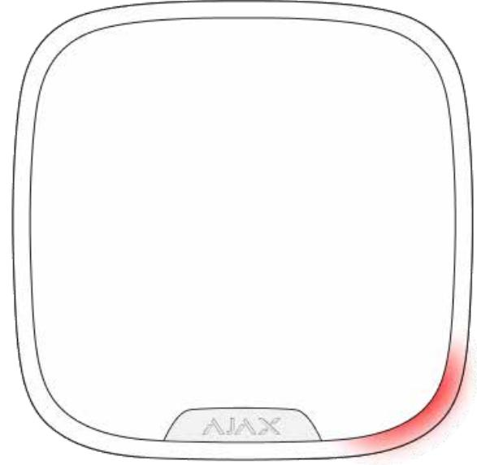

The siren can inform about triggerings in the armed system by means of LED indication.

#### **The option functions as follows:**

- **1.** The system registers the alarm.
- **2.** The siren plays an alarm (duration and volume depend on settings).
- **3.** The lower right corner of the siren LED frame blinks twice (about once every 3 seconds) until the system is disarmed.

Thanks to this feature, system users and passing security companies patrols can see that the system was triggered.

> The siren after-alarm indication does not work for always active detectors, if the detector was triggered when the system was disarmed.

#### **To enable the siren after-alarm indication, in :** Ajax PRO app

#### 1. Go to siren settings:

- Hub → Settings → Service → Siren Settings
2. Specify what events the sirens will inform about by double blinking before the security system is disarmed:

- Confirmed alarm
- Unconfirmed alarm
- Lid opening

3. Select the sirens needed. Go back to **Siren Settings**. The set parameters will be saved.

- 4. Click **Back**. All values will be applied.
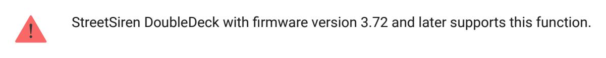

### Indication

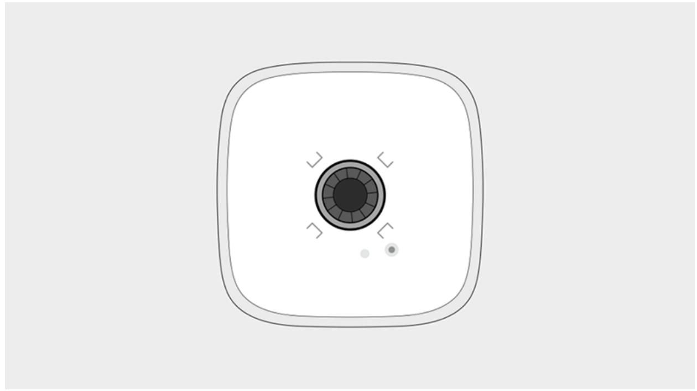

| Event                                                                               | Indication                                                                                                           |
|-------------------------------------------------------------------------------------|----------------------------------------------------------------------------------------------------------------------|
|                                                                                     | The siren emits an acoustic signal and the LED frame blinks red.                                                  |
| Alarm                                                                               | The duration and volume of the alarm, as well as the presence of LED indication, depends on the siren settings |
| An alarm was detected in the armed system (if after-alarm indication is enabled) | The siren LED frame blinks red twice in the lower right corner about every 3 seconds until                        |

|                                                           | the system is disarmed.                                                                                                                                                  |
|-----------------------------------------------------------|--------------------------------------------------------------------------------------------------------------------------------------------------------------------------|
|                                                           | The indication turns on after the siren has completely played the alarm signal configured in settings                                                              |
| Switching on                                              | The LED frame blinks red once                                                                                                                                            |
| Switching off                                             | The LED frame lights up red for 1 second and then blinks 3 times                                                                                                      |
| Hub connection failed                                     | The LED frame blinks 6 times in the lower right corner. Then the whole LED frame blinks 3 times, and then the siren turns off                                      |
| Security system is armed (if indication is enabled)    | The LED frame blinks once, and the siren emits a short beep                                                                                                           |
| Security system is disarmed (if indication is enabled) | The LED frame blinks twice and the siren emits two short beeps                                                                                                        |
| Siren in the armed mode (if indication is enabled)     | The LED in the lower right corner lights up every 2 seconds. When external power supply is connected, the LED frame in the lower right corner lights constantly |
| Battery low                                               | The LED in the lower right corner lights up and goes out when arming and disarming, alarming, dismantling, or opening the siren                                    |

### Functionality test

The Ajax security system allows conducting tests for checking the functionality of connected devices.

The tests do not start straight away but not later than over a single hub– detector ping period (36 seconds with the standard settings of the hub). You can change the ping period of devices in the **Jeweller** menu of the hub settings.

**Tests are available in the device settings menu:**

- **Ajax App** → **Devices** → **StreetSiren DoubleDeck** → **Settings**
Jeweller Signal Strength Test

Volume Level Test

#### Attenuation Test

### Choosing a location

The placement of StreetSiren DoubleDeck determines its distance from the hub and the presence of obstacles between them that impede the passage of the radio signal: walls, inter-floor constructions, or large-sized objects located in the room.

When choosing a place, take into account the audibility of the siren, as well as the visibility of its LED indication, as this determines the device performance.

StreetSiren DoubleDeck withstands heat, cold, and temperature drops. The sealed body is certified and complies with protection class IP54. The outdoor siren is protected from rain and snow and can be installed on the facade of the building without a canopy.

> Be sure to check the signal strength at the installation site. If the signal strength is low (a single bar), we cannot guarantee a stable operation of the security system! At the very least, relocate the device as repositioning even by 20 cm can significantly improve the signal reception.

If after moving the device still has a low or unstable signal strength, use a . radio signal range extender

### Installation

### Connecting external power supply

When connecting the external power supply and using StreetSiren DoubleDeck, follow the general electrical safety regulations for using electrical appliances, as well as the requirements of regulatory legal acts on electrical safety.

StreetSiren DoubleDeck runs on bundled battery for up to 5 years and is equipped with terminals for connecting 12V DC external power supply. The connection of external power supply is recommended in order to avoid rapid discharge of batteries in the case of installation in places characterized by low temperatures or when frequent siren activations are reported.

Before installing the device, be sure to check the insulation of the wires for damage. Use only a grounded power source. It is strictly forbidden to disassemble the device under voltage! Do not use the device with a damaged power cable.

#### **To connect external power supply:**

- **1.** Drill a hole for a cable in the SmartBracket mount.
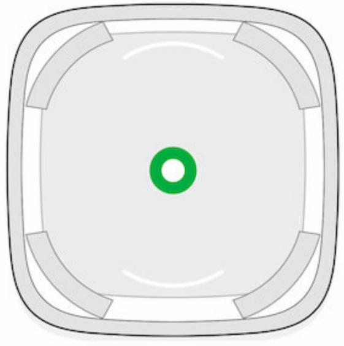

- **2.** Route the dead external power cable through the mounting plate.
- **3.** Connect the cable to the terminal strips observing polarity.

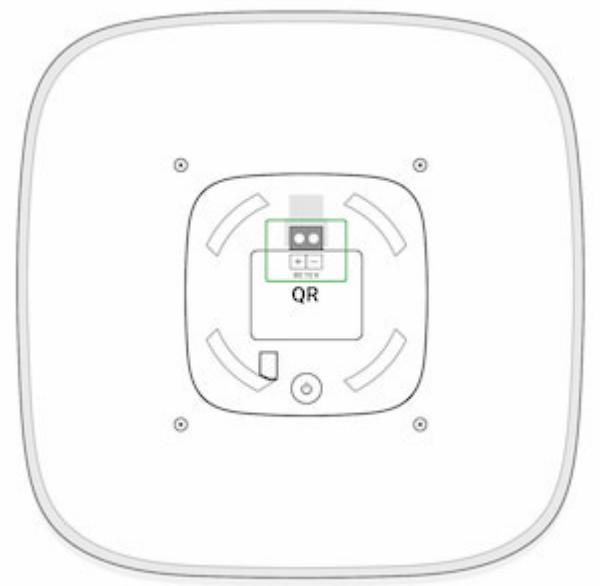

- **4.** Turn on power the **External Power Supply** field value changes to **Connected** in StreetSiren DoubleDeck statuses.
- **5.** Install the siren.

After connecting external power supply, do not remove the batteries from the siren: they act as a backup power source.

> The system will send a notification about the need for service as soon as the battery level drops to 20%.

### Mounting the Brandplate

#### **In order to mount the faceplate:**

- **1.** Turn off the external power of the siren, if connected.
- **2.** Unscrew the fixing screw from the bottom of the siren with a PH2 screwdriver if the siren is mounted on the SmartBracket mounting plate.

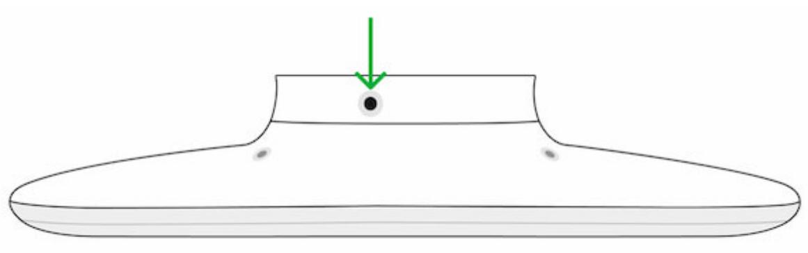

- **3.** Remove the siren from the SmartBracket mounting panel, turning it counterclockwise if the siren is mounted on the mounting plate.
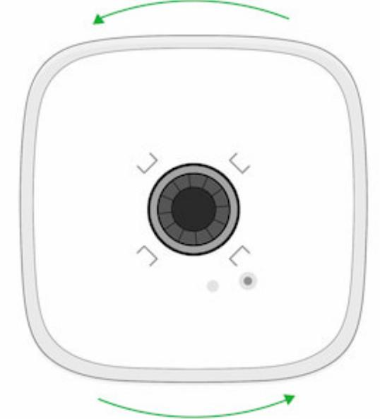

- **4.** Turn off the device by pressing the power button for 3 seconds.
- **5.** Turn off the external power supply (if applicable) by unscrewing the terminal blocks and disconnecting the power wires.

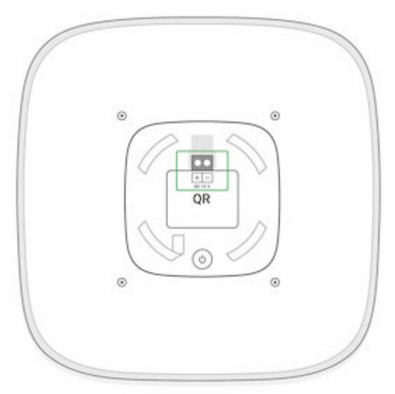

- **6.** Place the front side of the siren on a hard surface and unscrew the 4 screws on the rear panel with a PH2 screwdriver.
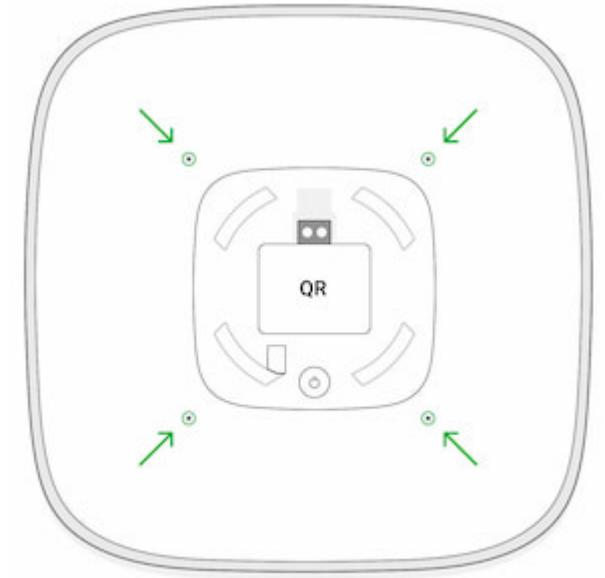

- **7.** Turn the siren over while holding the front and back of the body. Remove the protective plastic panel.
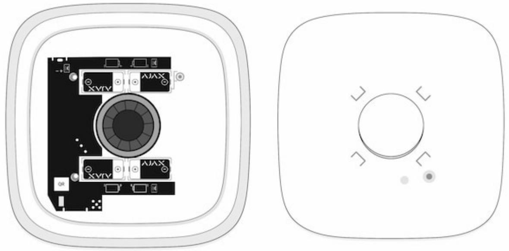

When installing the panel, do not remove the plastic frame and do not remove the LED strip from the seat!

- **8.** Drill a hole in the plastic protective plate at the defined location.
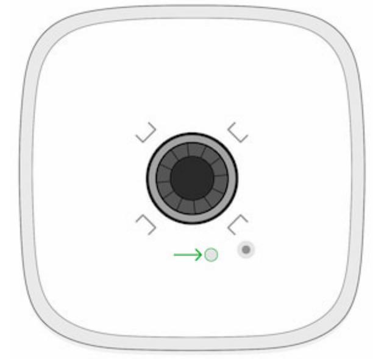

Non-hardening sealant may be on the piezoelectric detector and in the hole of the protective plastic panel. Do not wipe it! If the sealant contaminates your hands, wipe it off with a napkin.

- **9.** Mount Brandplate on the protective plastic panel.
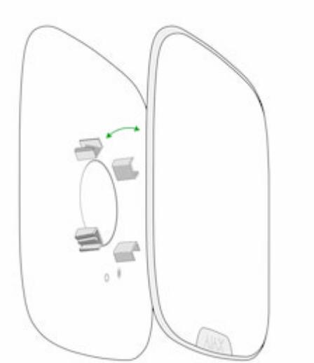

**10.** Fix the Brandplate to the protective plastic panel using the bundled bolt.

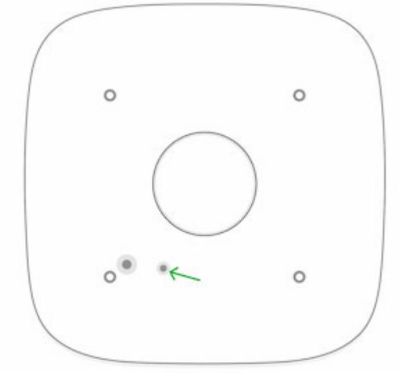

- **11.** Fit the protective plastic panel in place (the Ajax logo on the connection side of the LED strip to the board) with little effort. The properly mounted plastic panel will protrude above the LED frame no more than 1.0 to 1.5 mm.
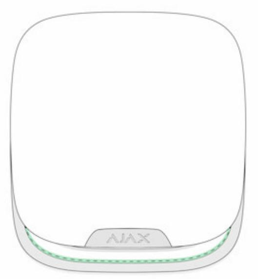

- **12.** Turn the siren over while holding the front and back of the body, and tighten 4 screws.
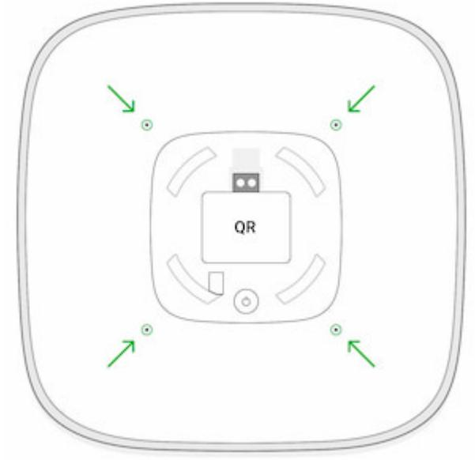

- **13.** Turn on the siren and check the status of tampers in the app.
### Siren mounting

Before mounting the siren, be sure to choose the optimal location that meets the requirements of this manual.

The recommended installation height is 2.5 meters or more. This will make difficulties for intruders to access the device. If you try to detach the device from the mount, the system will raise an alarm. The security company and users will receive a notification of a sabotage attempt, and the sound of a siren will shock the intruders.

#### **In order to install a siren:**

- **1.** Fasten the SmartBracket mounting plate to the surface using the bundled screws. When using other fasteners, make sure they do not damage or deform the panel.
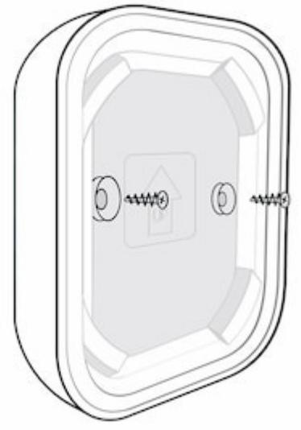

Do not use double-sided adhesive tape for either temporary or permanent mounting of the siren. The tape may break off under the weight of the siren. In addition, the tape dries up over time, which may cause the device to fall and the security system to trigger.

- **2.** Mount the siren on the SmartBracket and turn it clockwise.
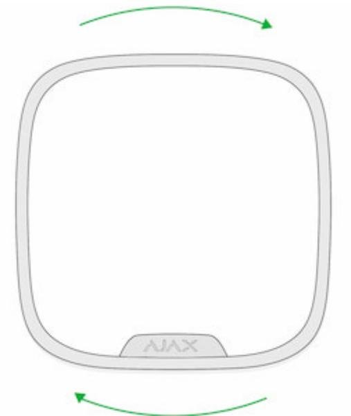

- **3.** Secure the siren with a screw. This reduces the risk of burglary.
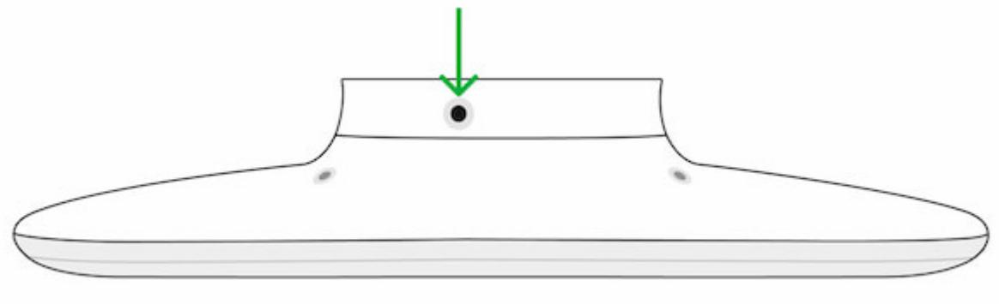

#### **Do not install a siren:**

- Near the metal objects and mirrors. They can shield and attenuate the radio signal.
- In places where the audio signal can be jammed.
- Closer than 1 meter to the hub.
- Near the glass break detectors.

#### Maintenance

Check StreetSiren DoubleDeck regularly. Clean the body from dust, cobwebs, and other contaminants as they emerge. Use a soft dry cloth that is suitable for equipment care. Do not use any substances containing alcohol, acetone, gasoline, and other active solvents to clean the device.

The batteries installed in the siren provide up to 5 years of battery life. When the batteries are discharged, the security system will send a corresponding notification, and the LED frame in the lower right corner will light up and go out when the system is arming and disarming (if the indication is disabled), when alarming, dismantling, or opening the siren body.

#### What is the StreetSiren DoubleDeck batteries runtime and what does it affect

How to replace batteries in StreetSiren DoubleDeck

### Technical Specifications

| Siren type                                 | Wireless                                                                                                                                                      |
|--------------------------------------------|---------------------------------------------------------------------------------------------------------------------------------------------------------------|
| Type of notification                       | Sound and light                                                                                                                                               |
| Installation method                        | Indoor / Outdoor                                                                                                                                              |
| Brandplate material                        | Plastic                                                                                                                                                       |
| Brandplate installation method             | Clip lock and mounting screw                                                                                                                                  |
| Notification volume                        | 85–113 dB at a distance of 1 m (customizable)                                                                                                                 |
| Alarm sounding time                        | Customizable, 3 to 180 seconds                                                                                                                                |
| Siren Sound Alert Frequency                | 3.5 ± 0.5 kHz                                                                                                                                                 |
| Protection against dismantling             | Accelerometer and tampers for violation of the integrity of the body                                                                                       |
| Compatibility                              | hubs radio Operates only with all Ajax , and signal range extenders                                                                               |
| Arming/disarming status indication         | Available                                                                                                                                                     |
| Indication of delays when entering/leaving | Available                                                                                                                                                     |
| Radio communication protocol               | Jeweller Learn more                                                                                                                                        |
| Radio frequency band                       | 866.0 – 866.5 MHz 868.0 – 868.6 MHz 868.7 – 869.2 MHz 905.0 – 926.5 MHz 915.85 – 926.5 MHz 921.0 – 922.0 MHz Depends on the region of sale. |
| Maximum RF output power                    | 7.29 mW (max 25 mW)                                                                                                                                           |
| Radio signal range                         | Up to 1,500 m (any obstacles absent) Learn more                                                                                                            |
| Power supply                               | 4 × CR123A, 3 V                                                                                                                                               |
| Battery life                               | Up to 5 years Learn more                                                                                                                                   |
| Auxiliary power supply                     | 12 V DC, 1,5 A                                                                                                                                                |
|                                            |                                                                                                                                                               |

| Body protection level       | IP55                |
|-----------------------------|---------------------|
| Operating temperature range | From –25°С to +50°С |
| Operating humidity          | Up to 95%           |
| Dimensions                  | 200 × 200 × 55 mm   |
| Weight                      | 571 g               |
| Service life                | 10 years            |

#### Compliance with standards

### Complete Set

- **1.** StreetSiren DoubleDeck
- **2.** SmartBracket mounting plate
- **3.** CR123A battery (pre-installed) 4 pcs
- **4.** Mounting kit
- **5.** Quick Start Guide

### Warranty

The warranty for the "AS MANUFACTURING" Limited Liability Company products is valid for 2 years after the purchase and does not apply to the bundled rechargeable battery.

If the device does not function properly, we recommend that you first contact the support service as technical issues can be resolved remotely in half of the cases!

#### Warranty obligations

#### User agreement

Technical support: support@ajax.systems