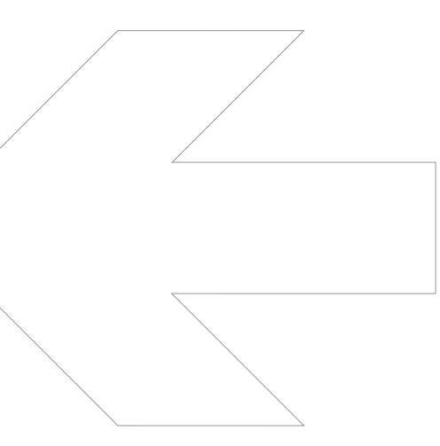

|      |                                         | SPECIFIKATIONER Antal porttelefondörrar | Styra Porttelefonkort 4800 4 , Dörr 5 - Dörr 8 |
|------|-----------------------------------------|--------------------------------------------|---------------------------------------------------|
|      | Styra Porttelefonkort 4800 90-420-48 | Antal avsäkrade A485-portar                | 4                                                 |
| nr.  |                                         | Kommunikation till central                 | RS 485 (A485)                                     |
| art. |                                         | Mått (hxbxd)                               | 65x98x26mm                                        |
|      |                                         | Strömförsörjning (från central)            | 24 V                                              |
|      |                                         | Nettovikt i kg                             | 0,10                                              |
|      |                                         |                                            |                                                   |

## **Styra Porttelefonkort 4800**

**Tillbehörskort för montage i Styra 3000** 

## **EGENSKAPER OCH FÖRDELAR**

- Stödjer fyra porttelefondörrar med Ringa. (Dörr 5 Dörr 8).
- Fyra avsäkrade A485-portar.
- Spara in på behovet av separat avsäkring.
- Underlätta kabeldragningen,
- lägg en Aptuskabel 2 till varje dörrmiljö.
- Anslut läsare, porttelefon o.dyl. direkt eller via dörrenhet.
- Erbjuder möjlighet att knyta resurser automatiskt till rätt dörr vid programmering från Multiaccess Styra.
- Utnyttja möjligheten till central styrning av spänningsmatnin gen på A485-port. Praktiskt t.ex. vid service.
- Erbjuder möjlighet att mata ut 12V eller 24V på A485-porten. **Obs!** Kontrollera först att ansluten hårdvara klarar 24V.
- Max ett Styra Porttelefonkortt 4800 per central, skall alltid kombineras med Styra Porttelefonkort 4400.

|      | ELEKTRISK ANSLUTNING                                | Styra Porttelefonkort 4800         |
|------|-----------------------------------------------------|------------------------------------|
|      | Strömförsörjning V DC                               | 24                                 |
|      | Förbrukning Watt                                    | min 0,24 max 0,36 vid 24 V         |
| Amp  |                                                     | min 0,010 max 0,015 vid 24 V       |
|      |                                                     |                                    |
|      | OMGIVNING                                           |                                    |
|      | Temperatur 0C                                       | 0 till +40                         |
|      | Luftfuktighet %                                     | 10 till 90                         |
|      | DATA                                                |                                    |
|      | Antal porttelefondörrar                             | 4 (dörr 5 - dörr 8)                |
|      | Totalt antal porttelefondörrar i central            | 8                                  |
|      | Antal A485-portar                                   | 4                                  |
|      | Omkopplingsbar utspänning 12 / 24 V per port        | Ja                                 |
|      | Utspänning avsäkrad per A485-port                   | 2,5 A (12 V / 24 V)                |
|      | Maximalt strömuttag för hela centralen              | 10 A                               |
|      | Automatisk återställning av säkring                 | Ja                                 |
|      | Central styrning av spänning per port (Till / Från) | Ja                                 |
|      | Lysdioder för att indikera kommunikationsstatus     | Ja                                 |
|      | Lysdioder för att indikera säkringsstatus           | Ja                                 |
|      | Utlöst säkring loggas till Multiaccess Styra        | Ja                                 |
|      | KOMMUNIKATION                                       |                                    |
|      | Kommunikation till Styra 3000                       | RS 485 (A485)                      |
|      | PORTTELEFONI                                        |                                    |
|      | RINGA 1307                                          | Ja, (från Ringa FW C0)             |
|      | RINGA 1507                                          | Ja                                 |
|      | RINGA 1707                                          | Ja, (från Ringa FW C0)             |
| AT20 |                                                     | Ja, via Styra Porttelefonkort 4400 |
| AT21 |                                                     | Ja, via Styra Porttelefonkort 4400 |
|      | AT10, AT30, AT70                                    | Nej                                |
|      | MÅTT I MM                                           |                                    |
| Höjd |                                                     | 65                                 |
|      | Bredd                                               | 98                                 |
| Djup |                                                     | 26                                 |
|      | Nettovikt i kg                                      | 0,10                               |
|      |                                                     |                                    |
|      |                                                     |                                    |
|      |                                                     |                                    |
|      |                                                     |                                    |
|      |                                                     |                                    |
|      |                                                     |                                    |
|      |                                                     |                                    |
|      |                                                     |                                    |
|      |                                                     |                                    |
|      |                                                     |                                    |

## **www.aptus.se**

Aptus Elektronik AB . Ekonomivägen 3-5, 436 33 Askim . telefon **växel:** 031 68 97 00 **försäljning:** 031 68 97 10 **fax:** 031 68 97 99 aptus@aptus.se . www.aptus.se