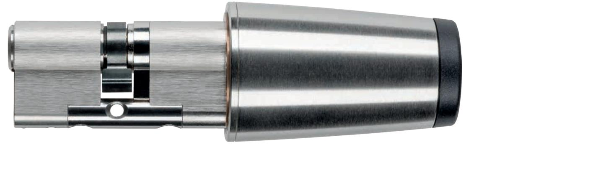
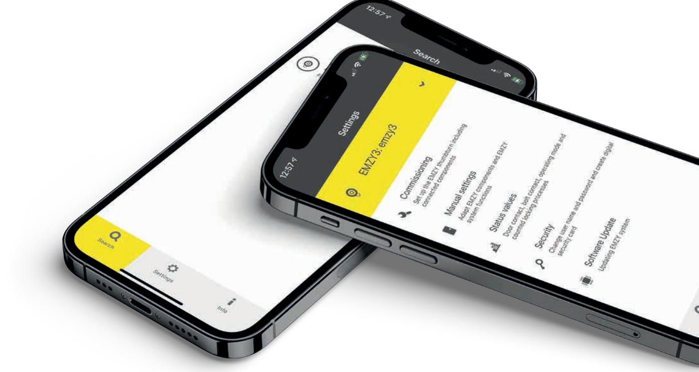

# **EMZY** Systemhandbok

## **Tryck**

Produktkod I.TD.HDB.EMZY.EBT.SDE | 22R1

Version EMZY EBT 1.0 Utgåva: 01/2022 SE Bruksanvisning

**Utgivare** EVVA Sicherheitstechnologie GmbH

**Ansvarig** EVVA Sicherheitstechnologie GmbH

När en ny handbok ges ut upphör den här utgåvan att gälla.

Den aktuella utgåvan finns för nedladdning på EVVA:s webbsida:

https://www.evva.com/at-de/service/downloads/

Alla rättigheter förbehålls Utan skriftligt tillstånd från utgivaren får denna handbok eller delar av den inte reproduceras eller bearbetas i någon form eller på något sätt, med hjälp av elektroniska, mekaniska eller kemiska metoder.

Vi ansvarar inte för fel av teknisk eller tryckteknisk natur eller för följderna av dessa. Informationen i denna handbok kontrolleras och uppdateras kontunierligt.

Alla varumärken och äganderätter erkänns, ändringar i form av tekniska uppdateringar kan göras utan föregående meddelande.

| 1 |       | Einleitung  3                      |  |
|---|-------|------------------------------------|--|
|   | 1.1   | Allgemeine rechtliche Hinweise  3  |  |
|   | 1.2   | EVVA-Support 4                     |  |
|   | 1.3   | Zeichenerklärung  4                |  |
| 2 |       | Hardware und Montage 6             |  |
|   | 2.1   | Motorknauf 6                       |  |
|   | 1.1.1 | Motorknauf-Mechanik  6             |  |
|   | 1.1.2 | Motorknauf-Elektronik  7           |  |
|   | 1.1.3 | Motorknauf-Firmware  8             |  |
|   | 2.2   | I/O-Box  9                         |  |
|   | 2.2.1 | I/O-Box-Mechanik  9                |  |
|   | 2.2.2 | I/O-Box Elektronik und Firmware  9 |  |
|   | 2.3   | Zubehör  10                        |  |
|   | 2.4   | Anschlusspläne  10                 |  |
| 3 |       | EMZY App  10                       |  |
|   | 3.1   | Aufbau der App 11                  |  |
|   | 3.2   | Suchen  11                         |  |
|   | 3.3   | Einstellungen 11                   |  |
|   |       |                                    |  |

### **1 Inledning**

Denna systemhandbok innehåller information om EMZY-produkten och kompletterande tillbehör.

De produkter/system som beskrivs i systemhandboken får endast användas av personer som är kvalificerade för respektive uppgift. Kvalificerad personal kan med sin kunskap känna igen risker och undvika eventuella faror vid hantering av dessa produkter/system.

### **1.1 Allmän rättslig information**

EVVA tecknar avtal om användning av EMZY på grundval av EVVA:s allmänna affärsvillkor samt EVVA:s allmänna licensvillkor för produktens programvara.

Du hittar EVVA:s allmänna affärsvillkor och allmänna licensvillkor här:

**https://www.evva.com/at-de/impressum**

Informationen ovan ska enligt produkttillverkarens definierade ansvar i produktansvarslagen beaktas och vidarebefordras till operatören och användaren. Om detta inte efterlevs fritas EVVA från ansvar.

Felaktig användning, reparationer eller ändringar som inte godkänts av EVVA och felaktig service kan leda till funktionsstörningar och måste därför undvikas. Ändringar som inte uttryckligen godkänts av EVVA leder till att ansvars- och garantianspråk och andra separat avtalade garantianspråk upphör att gälla.

Håll systemkomponenterna utom räckhåll för små barn och husdjur. Kvävningsrisk på grund av smådelar som kan sväljas.

För **arkitekter och rådgivande institutioner** tillhandahåller EVVA all nödvändig produktinformation så att de kan uppfylla sina informations- och instruktionsplikter enligt produktansvarslagen.

Återförsäljare och installatörer måste beakta all information i EVVA:s dokumentation och vid behov vidarebefordra den till sina kunder.

### **1.2 EVVA-support**

EMZY är en sofistikerad och testad produkt för automatisk dörrkontroll gällande låst eller olåst dörr. Kontakta din EVVA-partner direkt om du behöver ytterligare hjälp.

Listan över certifierade EVVA-partner hittar du här:

**https://www.evva.com/at-de/haendlersuche/**

Allmän information om EMZY finns här:

**https://www.evva.com/emzy/**

### **1.3 Teckenförklaring**

Följande symboler används i systemhandboken för att underlätta förståelsen:

| Symbol | Betydelse                                                                           |
|--------|-------------------------------------------------------------------------------------|
|        | Varning, risk för materiella skador om gällande försiktighetsåtgärder inte följs |
|        | Anmärkningar och information                                                        |
|        | Tips och rekommendationer                                                           |
|        | Felmeddelanden                                                                      |
|        | Alternativ                                                                          |

| Vänster                           |
|-----------------------------------|
| Steg i instruktioner för åtgärder |

### **2 Hårdvara och montering**

### **2.1 Motorvred**

Det kompletta motorvredet består av motorväxelenheten, styrelektroniken och kompleterande mekaniska komponenter.

### **1.1.1 Motorvredsmekanism**

EMZY EBT är ett eldrivet motorvred. Motorvredsmekaniken och alla mekaniska komponenter uppfyller kraven för elektrisk låsning och upplåsning och tillhörande extrafunktioner, till exempel manuell nödöppning.

### **Motorvredet har följande funktioner**

- x Automatisk aktivering av motorvredet för låst eller olåst dörr
- x Nödöppning utifrån med en mekanisk cylinder, vid tex. strömavbrott.
- x Nödöppning inifrån när som helst genom manuell vridning av motorvredet, tex. vid strömavbrott
- x Möjlighet att mekaniskt avlägsna motorvredets hölje för demontering och underhåll av motorknappen

### **Mekanisk kompatibilitet med följande EVVA vredcylindrar**

- x MCS
- x 3KS
- x 3KS+
- x 4KS
- x ICS
- x EPS
- x Akura44 (under utveckling)

Vid beställning av en EMZY-cylinder används komponenter av andra material i den mekaniska adaptern/cylindern för att produktens livslängd ska kunna säkerställas pga. starkare krafter och torsionsmoment.

Om en standard vredcylinder används förkortas cylinderns livslängd kraftigt och det kan uppstå brott på komponenterna.

För att en lång livslängd (>300 000 cykler) ska kunna garanteras rekommenderar vi att man endast använder avsedda adapters/cylindrar eller bygger om befintliga cylindrar med för EMZY avsedda komponenter.

#### **Mekaniska egenskaper**

- x 0nWW/lQJGPPRFKGLDPHWHUPP
- x Måtten uppfyller kraven för manuell aktivering för nödöppning.
- x 'RUQPnWWPPYLGVWDQGDUGLVHUDGG|UUPRQWHULQJHQOLJWg1250%',1
- x Stöder kugghjul med 10 kuggar och 18 kuggar samt dubbla låsklackar
- x Stöder vredcylindrar med SOS-funktion för att användarsäkerheten ska kunna garanteras vid manuell nyckelöppning från utsidan och samtidigt motoröppning
- x Montering i enkeldörrar och pardörrar av trä, plast eller metall är möjlig.
- x Stöder lås med 360 graders vridning eller mer
- x Oberoende av beslag
- x Kompatibel med Europaprofil i PZ-hålning (DIN 18252, EN 1303), profil RP22, Skandinavisk Ovalprofil och Australien Ovalprofil.
- x Skyddad konstruktion med metallhölje och formsprutad LED-/knapp
- x 9DULDEHO MXVWHULQJDYPHOODQUXPPHWPHOODQ YUHG RFKEHVODJ WLOO 1 mm om cylindern VWLFNHUXWPPIUnQEHVODJHW
- x Drifttemperatur: -20 °C till +70 °C vid 20–80 % relativ luftfuktighet, icke-kondenserande
- x Lagringstemperatur: -40°C till +90 °C;
- x IP-klass: IP54
- x 9ULGPRPHQW1PSnOnVNROYHQDGDSWLYWMXVWHUEDU
- x gSSQLQgshastighet: < 1,5 s/låsvarv
- x gSSQLQJVF\NOHU 000 (en cykel består av 2 varv öppning och stängning)

### **1.1.2 Motorvredselektronik**

Motorvredselektroniken och alla elektroniska komponenter uppfyller kraven för elektrisk låsning och upplåsning. Samt tillhörande extrafunktioner, som styrning av kommunikationsgränssnitt, strömförsörjning och den integrerade vredknappen med den optiska dörrstatusindikeringen.

### **EMZY-elektroniken har följande funktioner**

- x Drift med nödströmsförsörjning är möjlig.
- x Konfigurations-, statusindikerings- och firmware-uppdatering via BLE-gränssnitt och app, öppning via integrerad vredknapp eller extern dörrknapp eller andra signalgivare, dörrstatus indikeras optiskt på vredet och kan ses från några meter på vredknappen, RGB-LED används.
- x Möjlighet att avaktivera den optiska dörrstatusindikeringen.

#### **Egenskaper**

- x Tidsinställningar bibehålls i högst 2 minuter vid strömavbrott.
- x Annan minnesinformation lagras i högst 10 år vid strömavbrott.
- x Drifttemperatur: -20 °C till +70 °C vid 20–80 % relativ luftfuktighet, ickekondenserande.
- x Lagringstemperatur: -40 °C till +90 °C;

### **Gränssnitt**

Ingång till strömförsörjning med en anslutningskabel från nätdelen (antingen direkt eller via den tillvalda I/O-boxen).

- x Potentialfria ingångar för valfri anslutning av regelkontakt, dörrkontakt och dörrknapp.
- x RS485-protokoll för trådbundet gränssnitt för anslutning av en valfri I/O-box via två anslutningskablar. Två av de ovan beskrivna ingångarna används för RS485. Dessa konfigureras vid grundprogrammeringen.
- x BLE-gränssnitt för konfiguration via mobil enhet, som förberedelse för framtida trådlös anslutning av en I/O-box (tillval).
- x Vredknapp med detektering av manuell manövrering.
- x Aktivering av motorvredet med den optiska vredknappen.
- x Motorvredselektroniken är fixerad inuti vredshuset.

### **1.1.3 Programvara för motorvred (firmware)**

Programvaran för motorvredet omfattar alla firmwarebaserade komponenter som uppfyller kraven för elektrisk låsning och upplåsning samt tillhörande extrafunktioner som konfiguration, självinlärningsfunktion samt driftlägesomkoppling.

#### **Firmware-funktioner**

- x Konfiguration, statusförfrågan och FW-uppdatering sker via ett BLE-gränssnitt.
- x Den kompleterande I/O-boxen konfigureras och uppdateras med motorvredet. gYHUI|ULQJDYNRQILJXUDWLRQVILOHURFKILUPZDUHYLD56-buss.
- x Programvaran i motorvredet anpassas automatiskt till monteringssituationen när driftsättningen startas via BLE-gränssnittet.
- x Driftlägesomkoppling kan aktiveras med vredknappen (> 5 sek.) och den senaste omkopplingen gäller alltid oavsett källa.
- x Möjlighet att avaktivera vredknappen för att förhindra manuell öppning.
- x Automatisk detektering om kabelansluten RS485-anslutning är aktiv eller om dörrknapp och/eller dörrkontakt resp. regelkontakt är anslutna direkt via potentialfri ingång på motorvredet.

Se bruksanvisningen för information om användning och underhåll. Du hittar den i produktförpackningen eller på EMZY-webbplatsen - nedladdningar:

**https://www.evva.com/emzy/**

### **2.2 I/O-box**

### **2.2.1 I/O-Box Funktioner**

I/O-boxens kappsling rymmer I/O-box-elektroniken och skyddar den mot miljöpåverkan. Det finns 6 kabelanslutningar med kabelavlastning som är utformade med PG-skruvanslutningar. Montering sker på en DIN-skena.

- x I/O-box-elektroniken är fixerad i I/O-boxens kappsling.
- x Anslutningskablar som krävs för strömförsörjning och kommunikation med andra systemkomponenter ansluts till I/O-boxen via dragavlastande kabelingångar.
- x I/O-boxen monteras fast på vägg eller på DIN-skena.

### **Egenskaper**

- x Drifttemperatur: -20 °C till +70 °C vid 20–80 % relativ luftfuktighet, icke-kondenserande
- x Lagringstemperatur: -40°C till +90 °C;
- x IP-klass: ingen

### **2.2.2 I/O-box elektronik och firmware**

Möjliggör anslutning av diverse externafunktioner som dörrknappar, dörrkontakt, regelkontakt och externa styr- och signalgränssnitt. Dessutom strömförsörjer den motorvredet via en ansluten nätadapter och anslutningskabel.

### **Funktioner**

- x EMZY kan aktiveras av externasystem med identifieringsmöjligheter via en potentialfri ingång.:
	- o Xesar väggläsare (anslutning till Xesar kontrollbox [Online/Offline])
	- o AirKey väggläsare (anslutning till AirKey-kontrollbox)
	- o Andra RFID-väggläsare
	- o Pinkodsknappsats
	- o Biometriska läsenheter som fingerprint, handvensskanning, ögonskanning och fler
- x Elektromekaniska dörröppnare.
- x Anslutning till externa system via potentialfria utgångar som vidarebefordrar dörrstatusen (öppen, stängd, låst, larm).
- x Potentialfri utgång för dörrstatus (låst, olåst) till tex. en extern styrcentral.
- x ,QJnQJI|UGULIWOlJHgSSHQ/nVW

### **Egenskaper och specifikationer för I/O-box-elektronik**

- x Gränssnitt för anslutning av motovredet via 4 anslutningar (+/-/RS485)
- x För detta kan den specificerade 5-poliga kabeln (E.ZU.EMZY.EVKA4) användas, varvid endast 4 ledare (+/-/RS485) används i detta fall.

- x Alternativt kan anslutningen mellan I/O-boxen och plintkortet för RS485 ske med en tvinnad parkabel eller Cat5e-kabel samt via en nätdelsanslutningskabel på 2 x 1,5 mm2, speciellt om längre kabellängder (över 4 m) ska uppnås.
- x Fem potentialfria ingångar för aktivering via externa identifieringsmöjligheter, dörrknapp eller via fjärrkontroll resp. för anslutning av regelkontakt eller driftslägesbrytare.
- x Potentialfria utgångar för styrning av extern utrustning som integreringar av externa styrcentralen eller dörröppnare.
- x Relä med 30 V/1 A
- x 1 relä med 240 V/6 A
- x Driftspänningen ansluts från ett nätagregat med en kabel.
- x I/O-box-elektroniken är fixerad i I/O-boxens kappsling.

#### **Egenskaper**

- x Passar i en standardbox på 10 × 10 cm
- x Bestyckad med instickbara och polvändningssäkra skruvplintar s.k. Phönixstickkontakter lika som i AirKey-kontrollboxen.
- x .DEODUPHGHQGLDPHWHUSnPPðNDQDQVOXWDV
- x Förberedd för: definierade gränssnitt (kommunikation och elektronik) för senare integration av passagesystem via kommunikationsmoduler.
- x Drifttemperatur: -20 °C till +70 °C vid 20–80 % relativ luftfuktighet, ickekondenserande.
- x Lagringstemperatur: -40 °C till +90 °C;

### **2.3 Tillbehör**

Den kompletta listan över rekommenderade EMZY-tillbehör och deras specifikationer hittar du i EVVA:s datablad eller i prislistan:

**https://www.evva.com/emzy/**

### **2.4 Kopplingsscheman**

Alla olika kopplingsscheman med olika kabellängder samt anslutning till Xesar och AirKey finns på EMZY-webbplatsen - nedladdningar:

**https://www.evva.com/emzy/**

### **3 EMZY-appen**

EMZY-appen är endast avsedd för konfiguration och underhåll av motorvredet och I/O-boxen. Appen kan laddas ner via Google Playstore för Android-smarthpones eller Apple Appstore för iPhones.

Konfigurationer och firmwareuppdateringar fungerar även utan aktiv internetanslutning.

### **3.1 Appens uppbyggnad**

EMZY-appen har 3 huvudmenypunkter:

- x Sök
- x Inställningar
- x Info

### **3.2 Sök**

Här visas alla EMZYs inom räckvidd automatiskt. Under "Ny sökning" kan man dessutom uppdatera sökningen.

När man klickar på EMZY öppnas fönstret för lösenordet. Lösenordet och QR-koden finns på det medföljande EMZY-lösenordskortet.

### **3.3 Inställningar**

Under Inställningar hittar du driftsättning, manuella inställningar, statusvisning, säkerhetsinställningar och firmware-uppdatering.

### **Driftsättning**

Med programeringen tar man EMZY och dess komponenter i drift. Du vägleds steg för steg genom processen.

Innan programeringen startas måste dörrparametrarna fastställas. Låskolvsretur, regelkopplingskontakt och ingångsinställningar, för öppningsknapp eller driftlägesbrytare.

På I/O-boxen kan upp till 5 olika öppningsknappar eller driftlägesbrytare anslutas.

Dessutom kan ingångarna testas i förväg.

En steg-för-steg-guide med skärmdumpar finns på EMZY-webbsidan nedladdningar:

**https://www.evva.com/emzy/**

### **Manuella inställningar**

Olika inställningar och konfugirationer görs här samt man kan lagra programeringsparrametrarna för överföring till andra EMZY-vred.

#### **Motorvredsparametrar**

Här kan signalintensiteten ställas in samt aktiveras eller avaktiveras.

Möjlig att ställa i permanent öppen sk. Office Mode.

### **Ingångar motorvred**

Precis som vid programeringen kan ingångar konfigureras här i efterhand. Den integrerade vredknappen kan avaktiveras eller användas som intelligent vredknapp. Då fungerar knappen som driftlägesbrytare och växlar läge efter den inställda tiden.

### **Ingångar I/O-box**

På samma sätt som vid driftsättning/programering kan I/O-boxens olika ingångar programeras och uppdateras här.

### **Utgångar I/O-box**

Inställning av larmfunktion till externa system för upp till tre utgångar.

### **Larmtillstånd Office Mode**

Inställning av larmtillstånd, med avseende på manipulering eller dörr öppen.

### **Larmtillstånd Locked Mode (standard)**

Inställning av larmtillstånd, med avseende på manipulering eller dörr öppen.

### **Tidsparametrar**

Inställning av tidsparametrar för automatiska funktioner.

#### **Status**

Under Status visas inställningar, EMZY-status, logg och larmtillstånd.

#### **Säkerhet**

Funktion: EMZY-namnet och lösenordet kan ändras. Funktion: EMZY kan återställas till fabriksläge.

#### **Programuppdatering**

Under Programuppdatering uppdateras den fasta programvaran i EMZY-vredet och I/O-boxen (firmware).

### **3.4 Info**

Under Info finns följande stycken:

#### **Dokument**

Handbok, manualen Komma igång, olika kopplingsscheman och monteringsanvisningar.

#### **Diagnos**

Avläsning av loggfil, händelser, fel och varningar. Diagnosen erbjuder även en nedladdningsmöjlighet för överföring av uppgifterna till EVVA-supporten.

#### **Dataskyddsbestämmelser**

Direkt åtkomst till dataskyddsbestämmelserna.

#### **Licenser**

En lista över alla licensavtal och licenser som används.

### **ALLMÄNNA VILLKOR**

Direkt åtkomst till juridisk information och allmänna villkor.

### **Programinfo**

Visar en lista över all programinfo som används.

### **App-version**

Aktuell appversion för enheten.