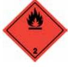

# SÄKERHETSDATABLAD BODYGUARD KNOCK OUT

I enlighet med Förordning (EG) Nr 1907/2006, Bilaga II, ändrad genom Förordning (EG) Nr 453/2010

| AVSNITT 1: Namnet på ämnet/blandningen och bolaget/företaget                                              |                                                                                                                                                                                                                                                                                                                                                                                            |  |  |  |
|-----------------------------------------------------------------------------------------------------------|--------------------------------------------------------------------------------------------------------------------------------------------------------------------------------------------------------------------------------------------------------------------------------------------------------------------------------------------------------------------------------------------|--|--|--|
| 1.1. Produktbeteckning                                                                                    |                                                                                                                                                                                                                                                                                                                                                                                            |  |  |  |
| Produktnamn                                                                                               | BODYGUARD KNOCK OUT                                                                                                                                                                                                                                                                                                                                                                        |  |  |  |
| Produktnummer                                                                                             | 29801                                                                                                                                                                                                                                                                                                                                                                                      |  |  |  |
| 1.2. Relevanta identifierade användningar av ämnet eller blandningen och användningar som det avråds från |                                                                                                                                                                                                                                                                                                                                                                                            |  |  |  |
| Identifierade användningar                                                                                | Försvarsspray                                                                                                                                                                                                                                                                                                                                                                              |  |  |  |
| 1.3. Närmare upplysningar om den som tillhandahåller säkerhetsdatablad                                    |                                                                                                                                                                                                                                                                                                                                                                                            |  |  |  |
| Leverantör                                                                                                | BODYGUARD SÄKERHETSPRODUKTER SVERIGE AB Norden 561 252 79 Helsingborg Sweden +46 424002030 info@bodyguard.se                                                                                                                                                                                                                                                                |  |  |  |
| 1.4. Telefonnummer för nödsituationer                                                                     |                                                                                                                                                                                                                                                                                                                                                                                            |  |  |  |
| Nationellt telefonnummer för nödsituationer                                                            | Giftinformationen 010-456 67 00. Vid akuta fall, ring 112, begär giftinformation.                                                                                                                                                                                                                                                                                                          |  |  |  |
| AVSNITT 2: Farliga egenskaper                                                                             |                                                                                                                                                                                                                                                                                                                                                                                            |  |  |  |
| 2.1. Klassificering av ämnet eller blandningen Klassificering (EC 1272/2008)                           |                                                                                                                                                                                                                                                                                                                                                                                            |  |  |  |
| Fysikaliska faror                                                                                         | Aerosol 1 - H222, H229                                                                                                                                                                                                                                                                                                                                                                     |  |  |  |
| Hälsofaror                                                                                                | Ej Klassificerad                                                                                                                                                                                                                                                                                                                                                                           |  |  |  |
| Miljöfaror                                                                                                | Ej Klassificerad                                                                                                                                                                                                                                                                                                                                                                           |  |  |  |
| 2.2. Märkningsuppgifter Piktogram                                                                      |                                                                                                                                                                                                                                                                                                                                                                                            |  |  |  |
| Signalord                                                                                                 | Fara                                                                                                                                                                                                                                                                                                                                                                                       |  |  |  |
| Faroangivelser                                                                                            | H222 Extremt brandfarlig aerosol. H229 Tryckbehållare: Kan sprängas vid uppvärmning.                                                                                                                                                                                                                                                                                                    |  |  |  |
| Skyddsangivelser                                                                                          | P210 Får inte utsättas för värme, heta ytor, gnistor, öppna lågor och andra antändningskällor. Rökning förbjuden. P211 Spreja inte över öppen låga eller andra antändningskällor. P251 Får inte punkteras eller brännas, gäller även tömd behållare. P410+P412 Skyddas från solljus. Får inte utsättas för temperaturer över 50°C/122°F. P102 Förvaras oåtkomligt för barn. |  |  |  |
| 2.3. Andra faror                                                                                          |                                                                                                                                                                                                                                                                                                                                                                                            |  |  |  |

Produkten innehåller inte något ämne som är klassificerat som PBT eller vPvB. Innehåller: Isobutan. Produkten är en försvarsspray vars egenskaper är att vara tillfälligt irriterande och orsaka obehag för luftrör och slemhinnor.

| AVSNITT 3: Sammansättning/information om beståndsdelar                                |                      |                                                 |
|---------------------------------------------------------------------------------------|----------------------|-------------------------------------------------|
| 3.2. Blandningar                                                                      |                      |                                                 |
| ETANOL                                                                                |                      | 25-35%                                          |
| CAS-nummer: 64-17-5                                                                   | EG-nummer: 200-578-6 | REACH-registreringsnummer: 01-                  |
|                                                                                       |                      | 2119457610-43                                   |
| Klassificering                                                                        |                      |                                                 |
| Flam. Liq. 2 - H225                                                                   |                      |                                                 |
| Eye Irrit. 2 - H319                                                                   |                      |                                                 |
| BUTAN                                                                                 |                      | 10-15%                                          |
| CAS-nummer: 106-97-8                                                                  | EG-nummer: 203-448-7 | REACH-registreringsnummer: 01-                  |
|                                                                                       |                      | 2119474691-32                                   |
| Klassificering                                                                        |                      |                                                 |
| Flam. Gas 1 - H220                                                                    |                      |                                                 |
| Press. Gas, Compressed - H280                                                         |                      |                                                 |
| PROPAN                                                                                |                      | 10-15%                                          |
|                                                                                       |                      |                                                 |
| CAS-nummer: 74-98-6                                                                   | EG-nummer: 200-827-9 | REACH-registreringsnummer: 01- 2119486944-21 |
| Klassificering                                                                        |                      |                                                 |
| Flam. Gas 1 - H220                                                                    |                      |                                                 |
| Press. Gas, Compressed - H280                                                         |                      |                                                 |
|                                                                                       |                      |                                                 |
| (-)-Menthol                                                                           |                      | 5-7.49%                                         |
| CAS-nummer: 2216-51-5                                                                 | EG-nummer: 218-690-9 |                                                 |
| Klassificering                                                                        |                      |                                                 |
| Skin Irrit. 2 - H315                                                                  |                      |                                                 |
|                                                                                       |                      |                                                 |
| 2-PROPENOIC ACID, 2-METHYL-, POLYMERS WITH                                            |                      | 1-1.99%                                         |
| ACRYLIC ACID, ME ACRYLATE AND POLYETHYLENE GLYCOL METHACRYLATE C18-22-ALKYL ETHERS |                      |                                                 |
| CAS-nummer: 247041-55-0                                                               |                      |                                                 |
|                                                                                       |                      |                                                 |
| Klassificering Skin Irrit. 2 - H315                                                |                      |                                                 |
| Eye Irrit. 2 - H319                                                                   |                      |                                                 |

### PENTAN 0.1-0.99%

CAS-nummer: 109-66-0 EG-nummer: 203-692-4 REACH-registreringsnummer: 01- 2119459286-30-0000

### Klassificering

Flam. Liq. 2 - H225 STOT SE 3 - H336 Asp. Tox. 1 - H304 Aquatic Chronic 2 - H411

Alla faroangivelser anges i klartext i avsnitt 16.

AVSNITT 4: Åtgärder vid första hjälpen

| 4.1. Beskrivning av åtgärder vid första hjälpen                                               |                                                                                                                            |  |  |
|-----------------------------------------------------------------------------------------------|----------------------------------------------------------------------------------------------------------------------------|--|--|
| Generell information                                                                          | Sök läkarhjälp om besvär kvarstår.                                                                                         |  |  |
| Inandning                                                                                     | Flytta den skadade personen till frisk luft och håll denne varm och i stillhet i en position som underlättar andningen. |  |  |
| Förtäring                                                                                     | Drick ett par glas vatten eller mjölk. Framkalla inte kräkning.                                                            |  |  |
| Hudkontakt                                                                                    | Tvätta huden noggrant med tvål och vatten.                                                                                 |  |  |
| Kontakt med ögonen                                                                            | Skölj med vatten. Sök läkarhjälp om besvär kvarstår.                                                                       |  |  |
|                                                                                               | 4.2. De viktigaste symptomen och effekterna, både akuta och fördröjda                                                      |  |  |
| Generell information                                                                          | Lösningsmedelsmissbruk kan leda till dödsfall.                                                                             |  |  |
| Inandning                                                                                     | Ångor kan orsaka huvudvärk, trötthet, yrsel och illamående.                                                                |  |  |
| Förtäring                                                                                     | Kan orsaka illamående, huvudvärk, yrsel och förgiftning.                                                                   |  |  |
| Hudkontakt                                                                                    | Kan orsaka hudbesvär om kontakten är upprepad eller långvarig.                                                             |  |  |
| Kontakt med ögonen                                                                            | Kan orsaka tillfällig ögonirritation.                                                                                      |  |  |
| 4.3. Angivande av omedelbar medicinsk behandling och särskild behandling som eventuellt krävs |                                                                                                                            |  |  |
| Anmärkningar för läkaren                                                                      | Inga specifika rekommendationer.                                                                                           |  |  |
| AVSNITT 5: Brandbekämpningsåtgärder                                                           |                                                                                                                            |  |  |
| 5.1. Släckmedel                                                                               |                                                                                                                            |  |  |
| Lämpliga släckmedel                                                                           | Släck med skum, koldioxid eller pulver.                                                                                    |  |  |
| 5.2. Särskilda faror som ämnet eller blandningen kan medföra                                  |                                                                                                                            |  |  |
| Särskilda faror                                                                               | Behållare kan brisera eller explodera vid upphettning, beroende på häftig tryckstegring. Extremt brandfarligt.          |  |  |
| 5.3. Råd till brandbekämpningspersonal                                                        |                                                                                                                            |  |  |
| Skyddsåtgärder vid brandbekämpning                                                         | Behållare i närheten av brand ska flyttas eller kylas med vatten.                                                          |  |  |
| Särskild skyddsutrustning för brandbekämpningspersonal                                     | Använd kemskyddsdräkt. Använd andningsapparat med lufttillförsel (SCBA) och lämpliga skyddskläder.                      |  |  |
| AVSNITT 6: Åtgärder vid oavsiktliga utsläpp                                                   |                                                                                                                            |  |  |
| 6.1. Personliga skyddsåtgärder, skyddsutrustning och åtgärder vid nödsituationer              |                                                                                                                            |  |  |

| Personliga skyddsåtgärder                               | För personligt skydd, se Avsnitt 8.                                                                                                             |  |
|---------------------------------------------------------|-------------------------------------------------------------------------------------------------------------------------------------------------|--|
| 6.2. Miljöskyddsåtgärder                                |                                                                                                                                                 |  |
| Miljöskyddsåtgärder                                     | Undvik att spill eller avrinningsvatten kommer ned i avlopp, avloppssystem eller vattendrag.                                                    |  |
| 6.3. Metoder och material för inneslutning och sanering |                                                                                                                                                 |  |
| Metoder för sanering                                    | Stora spill: Valla in och absorbera spill med sand, jord eller annat icke brännbart material. Små spill: Torka bort med papper eller textil. |  |
| 6.4. Hänvisning till andra avsnitt                      |                                                                                                                                                 |  |
| Hänvisning till andra avsnitt                           | För personligt skydd, se Avsnitt 8. Angående avfallshantering, se punkt 13.                                                                     |  |
| AVSNITT 7: Hantering och lagring                        |                                                                                                                                                 |  |
|                                                         |                                                                                                                                                 |  |
| 7.1. Skyddsåtgärder för säker hantering                 |                                                                                                                                                 |  |
| Skyddsåtgärder vid användning                        | Får inte utsättas för värme, gnistor och öppen låga. Skyddas mot direkt solljus. Ät inte, drick inte eller rök inte under hanteringen.       |  |
|                                                         | 7.2. Förhållanden för säker lagring, inklusive eventuell oförenlighet                                                                           |  |
| Skyddsåtgärder vid lagring                              | Aerosolburkar: Får inte utsättas för direkt solljus eller temperaturer över 50°C. Förpackningen förvaras torrt.                              |  |
| 7.3. Specifik slutanvändning                            |                                                                                                                                                 |  |
| Specifik slutanvändning                                 | De identifierade användningarna för produkten finns beskrivna i Avsnitt 1.2.                                                                    |  |

### 8.1. Kontrollparametrar

### Gränsvärden för exponering på arbetsplatsen

Produkten innehåller följande ämnen på listan med hygieniska gränsvärden, Arbetsmiljöverkets föreskrifter om hygieniska gränsvärden och allmänna råd om tillämpningen av föreskrifterna (AFS 2015:7):

### ETANOL

Nivågränsvärde (8 timmar, NGV): AFS 500 ppm 1000 mg/m³ Korttidsvärde (15 minuter, KTV): AFS 1000 ppm 1900 mg/m³

### BUTAN

Nivågränsvärde (8 timmar, NGV): Ingen standard. Ingen standard. Korttidsvärde (15 minuter, KTV): Ingen standard. Ingen standard.

### PROPAN

Korttidsvärde (15 minuter, KTV): Ingen standard.

### PENTAN

Nivågränsvärde (8 timmar, NGV): AFS 600 ppm 1800 mg/m³ Korttidsvärde (15 minuter, KTV): AFS 750 ppm 2000 mg/m³ AFS = Arbetsmiljöverkets Författningssamling.

### PENTAN (CAS: 109-66-0)

PNEC - vatten; 0,027 mg/l

8.2. Begränsning av exponeringen

#### Skyddsutrustning

| Lämpliga tekniska kontrollåtgärder | All hantering ska bara ske i välventilerade utrymmen.                                                                       |
|---------------------------------------|-----------------------------------------------------------------------------------------------------------------------------|
| Ögonskydd/ansiktsskydd                | Ögonskydd som uppfyller en godkänd standard ska användas om en riskbedömning indikerar att kontakt med ögonen är möjlig. |

Handskydd Handskydd krävs inte.

Annat skydd för hud och kropp Använd lämplig skyddsutrustning vid långvarig exponering och/eller hög koncentration av ångor, sprej eller dimma.

Hygienåtgärder Tvätta huden efter varje skift, före måltid, rökning och toalettbesök. Andningsskydd Ingen särskild rekommendation angiven men skyddsfilter kan behövas mot organiska ångor

### AVSNITT 9: Fysikaliska och kemiska egenskaper

#### 9.1. Information om grundläggande fysikaliska och kemiska egenskaper

eller damm.

| Utseende                                                 | Aerosol.                                 |
|----------------------------------------------------------|------------------------------------------|
| Färg                                                     | Rödaktig.                                |
| Lukt                                                     | Alkoholliknande.                         |
| Lukttröskel                                              | Ej fastställt.                           |
| pH                                                       | Ej fastställt.                           |
| Smältpunkt                                               | Ej fastställt.                           |
| Initial kokpunkt och kokpunktsintervall               | Ej fastställt.                           |
| Flampunkt                                                | Tekniskt omöjligt att ta fram uppgifter. |
| Avdunstningshastighet                                    | Ej fastställt.                           |
| Avdunstningsfaktor                                       | Ej fastställt.                           |
| Brandfarlighet (fast form, gas)                          | Ej fastställt.                           |
| Övre/undre brännbarhetsgräns eller explosionsgräns | Ej fastställt.                           |
| Annan brandfarlighet                                     | Ej fastställt.                           |
| Ångtryck                                                 | Ej fastställt.                           |
| Ångdensitet                                              | Ej fastställt.                           |
| Relativ densitet                                         | Ej fastställt.                           |
| Bulkdensitet                                             | Ej fastställt.                           |
| Löslighet                                                | Löslig i vatten.                         |
| Fördelningskoefficient                                   | Ej fastställt.                           |
| Självantändningstemperatur                               | Ej fastställt.                           |

| Sönderfallstemperatur                                   | Ej fastställt.                                                                                                                                   |  |  |  |
|---------------------------------------------------------|--------------------------------------------------------------------------------------------------------------------------------------------------|--|--|--|
| Viskositet                                              | Ej fastställt.                                                                                                                                   |  |  |  |
| Explosiva egenskaper                                    | Ej fastställt.                                                                                                                                   |  |  |  |
| Explosiv under inverkan av låga                      | Ja                                                                                                                                               |  |  |  |
| Oxiderande egenskaper                                   | Ej fastställt.                                                                                                                                   |  |  |  |
| 9.2. Annan information                                  |                                                                                                                                                  |  |  |  |
| Annan information                                       | Inte relevant.                                                                                                                                   |  |  |  |
| Brytningsindex                                          | Ej fastställt.                                                                                                                                   |  |  |  |
| Partikelstorlek                                         | Ej fastställt.                                                                                                                                   |  |  |  |
| Molekylvikt                                             | Ej fastställt.                                                                                                                                   |  |  |  |
| Flyktighet                                              | Mycket flyktig.                                                                                                                                  |  |  |  |
| Mättnadskoncentration                                   | Ej fastställt.                                                                                                                                   |  |  |  |
| Kritisk temperatur                                      | Ej fastställt.                                                                                                                                   |  |  |  |
| Flyktig organisk förening                               | Ingen information krävs.                                                                                                                         |  |  |  |
| AVSNITT 10: Stabilitet och reaktivitet                  |                                                                                                                                                  |  |  |  |
| 10.1. Reaktivitet                                       |                                                                                                                                                  |  |  |  |
| Reaktivitet                                             | Det finns inga kända reaktivitetsdata associerade med produkten.                                                                                 |  |  |  |
| 10.2. Kemisk stabilitet                                 |                                                                                                                                                  |  |  |  |
| Stabilitet                                              | Stabil vid normal omgivningstemperatur och avsedd användning.                                                                                    |  |  |  |
| 10.3. Risken för farliga reaktioner                     |                                                                                                                                                  |  |  |  |
| Risken för farliga reaktioner                           | Okänd.                                                                                                                                           |  |  |  |
| 10.4. Förhållanden som ska undvikas                     |                                                                                                                                                  |  |  |  |
| Förhållanden som ska undvikas                        | Undvik värme, lågor och andra antändningskällor.                                                                                                 |  |  |  |
| 10.5. Oförenliga material                               |                                                                                                                                                  |  |  |  |
| Material som ska undvikas                               | Det är inte troligt att något specifikt material eller grupp av material kommer att reagera med produkten så att en farlig situation uppstår. |  |  |  |
| 10.6. Farliga sönderdelningsprodukter                   |                                                                                                                                                  |  |  |  |
| Farliga sönderdelningsprodukter                      | Okänd.                                                                                                                                           |  |  |  |
| AVSNITT 11: Toxikologisk information                    |                                                                                                                                                  |  |  |  |
| 11.1. Information om de toxikologiska effekterna        |                                                                                                                                                  |  |  |  |
| Toxikologiska effekter                                  | Ingen data finns tillgänglig för produkten som sådan.                                                                                            |  |  |  |
| Akut toxicitet - oral Anmärkningar (oralt LD₅₀)      | Kriterierna för klassificering kan på grundval av tillgängliga data inte anses vara uppfyllda.                                                   |  |  |  |
| Akut toxicitet - dermalt Anmärkningar (dermalt LD₅₀) | Kriterierna för klassificering kan på grundval av tillgängliga data inte anses vara uppfyllda.                                                   |  |  |  |

| Akut toxicitet - inandning Anmärkningar (inandning LC₅₀) | Kriterierna för klassificering kan på grundval av tillgängliga data inte anses vara uppfyllda.                                                                                                                                                               |  |  |
|----------------------------------------------------------------|--------------------------------------------------------------------------------------------------------------------------------------------------------------------------------------------------------------------------------------------------------------|--|--|
| Frätande/irriterande på huden Frätande/irriterande på huden | Kriterierna för klassificering kan på grundval av tillgängliga data inte anses vara uppfyllda.                                                                                                                                                               |  |  |
| Allvarlig ögonskada/ögonirritation                             |                                                                                                                                                                                                                                                              |  |  |
| Allvarlig ögonskada/ögonirritation                          | Kriterierna för klassificering kan på grundval av tillgängliga data inte anses vara uppfyllda.                                                                                                                                                               |  |  |
| Luftvägssensibilisering Luftvägssensibilisering             | Kriterierna för klassificering kan på grundval av tillgängliga data inte anses vara uppfyllda.                                                                                                                                                               |  |  |
| Hudsensibilisering Hudsensibilisering                       | Kriterierna för klassificering kan på grundval av tillgängliga data inte anses vara uppfyllda.                                                                                                                                                               |  |  |
| Mutagenitet i könsceller                                       |                                                                                                                                                                                                                                                              |  |  |
| Genotoxicitet - in vitro                                       | Innehåller inga ämnen som är känt mutagena.                                                                                                                                                                                                                  |  |  |
| Cancerogenitet Cancerogenitet                               | Innehåller inte något ämne som är känt cancerframkallande.                                                                                                                                                                                                   |  |  |
| Reproduktionstoxicitet                                         |                                                                                                                                                                                                                                                              |  |  |
| Reproduktionstoxicitet - fertilitet                         | Innehåller inget ämne som är känt reproduktionstoxiskt.                                                                                                                                                                                                      |  |  |
| Specifik organtoxicitet – enstaka exponering                   |                                                                                                                                                                                                                                                              |  |  |
| STOT - enstaka exponering                                      | Kriterierna för klassificering kan på grundval av tillgängliga data inte anses vara uppfyllda.                                                                                                                                                               |  |  |
| Specifik organtoxicitet – upprepad exponering                  |                                                                                                                                                                                                                                                              |  |  |
| STOT - upprepad exponering                                     | Kriterierna för klassificering kan på grundval av tillgängliga data inte anses vara uppfyllda.                                                                                                                                                               |  |  |
| Fara vid aspiration Fara vid aspiration                     | Inte relevant.                                                                                                                                                                                                                                               |  |  |
| Generell information                                           | Långvarig och upprepad kontakt med lösningsmedel över en lång period kan leda till bestående hjärtbesvär. Försvarsspray, vars egenskaper är att tillfälligt irritera och orsaka obehag i luftrör och slemhinnor.                                       |  |  |
| Inandning                                                      | Ångor kan ha en narkotisk effekt. Symptom efter överexponering kan inkludera följande: Huvudvärk. Trötthet. Yrsel. Illamående, kräkning. Kan orsaka luftvägsirritation.                                                                                   |  |  |
| Förtäring                                                      | Kan orsaka irritation. Symptom efter överexponering kan inkludera följande: Magsmärta. Illamående, kräkning. Diarré.                                                                                                                                      |  |  |
| Hudkontakt                                                     | Kan orsaka hudbesvär om kontakten är upprepad eller långvarig.                                                                                                                                                                                               |  |  |
| Kontakt med ögonen                                             | Kan orsaka tillfällig ögonirritation.                                                                                                                                                                                                                        |  |  |
| Akuta och kroniska hälsofaror                                  | Långvarig och upprepad kontakt med lösningsmedel över en lång period kan leda till bestående hjärtbesvär. Långvarig eller upprepad exponering för ångor i höga koncentrationer kan orsaka följande negativa effekter: Illamående, kräkning. Huvudvärk. |  |  |

#### Toxikologisk information om beståndsdelar

### ETANOL

### Akut toxicitet - oral

| Akut toxicitet oral (LD₅₀ mg/kg)                   | 7 060,0           |
|-------------------------------------------------------|-------------------|
| Djurslag                                              | Råtta             |
| Akut toxicitet - dermalt                              |                   |
| Akut toxicitet dermalt (LD₅₀ mg/kg)                | 20 000,0          |
| Djurslag                                              | Kanin             |
| Akut toxicitet - inandning                            |                   |
| Akut toxicitet inandning (LC₅₀ ångor mg/l)         | 124,7             |
| Djurslag                                              | Råtta             |
| ATE inandning (ångor mg/l)                         | 124,7             |
| Akut toxicitet - oral                                 |                   |
| Anmärkningar (oralt LD₅₀)                             | Inte tillämpligt. |
| Akut toxicitet - dermalt                              |                   |
|                                                       |                   |
| Anmärkningar (dermalt LD₅₀)                        | Inte tillämpligt. |
| Akut toxicitet - inandning                            |                   |
| Akut toxicitet inandning (LC₅₀ ångor mg/l)         | 20,0              |
| Anmärkningar (inandning LC₅₀)                      |                   |
| Akut toxicitet - oral                                 |                   |
| Anmärkningar (oralt LD₅₀) Akut toxicitet - dermalt | Inte tillämpligt. |

PROPAN

BUTAN

| Anmärkningar (oralt LD₅₀)                     | Inte tillämpligt. |  |
|-----------------------------------------------|-------------------|--|
| Akut toxicitet - dermalt                      |                   |  |
| Anmärkningar (dermalt LD₅₀)                | Inte tillämpligt. |  |
| Akut toxicitet - inandning                    |                   |  |
| Akut toxicitet inandning (LC₅₀ ångor mg/l) | 20,0              |  |
| Anmärkningar (inandning LC₅₀)              |                   |  |

### PENTAN

Akut toxicitet - oral Akut toxicitet oral (LD₅₀ mg/kg) 400,0

|                              | Djurslag                                                                     | Råtta                                                               |
|------------------------------|------------------------------------------------------------------------------|---------------------------------------------------------------------|
|                              | Akut toxicitet - dermalt                                                     |                                                                     |
|                              | Akut toxicitet dermalt (LD₅₀ mg/kg)                                       | 3 000,0                                                             |
|                              | Djurslag                                                                     | Kanin                                                               |
|                              | Akut toxicitet - inandning                                                   |                                                                     |
|                              | Akut toxicitet inandning (LC₅₀ ångor mg/l)                                | 364,0                                                               |
|                              | Djurslag                                                                     | Råtta                                                               |
|                              | ATE inandning (ångor mg/l)                                                | 364,0                                                               |
|                              | AVSNITT 12: Ekologisk information                                            |                                                                     |
| Ekotoxicitet                 |                                                                              | Det finns inga ekotoxicitetsdata för produkten.                     |
| 12.1. Toxicitet Toxicitet |                                                                              | Det finns inga data om produkten som sådan.                         |
|                              | Ekologisk information om beståndsdelar                                       |                                                                     |
|                              |                                                                              | ETANOL                                                              |
|                              |                                                                              |                                                                     |
|                              | Akut toxicitet - fisk                                                        | LC50, 96 timmar: ~ 13500 mg/l, Pimephales promelas (Knölskallelöja) |
|                              | Akut toxicitet - vattenlevande ryggradslösa djur                       | EC₅₀, 48 timmar: ~ 5400 mg/l, Daphnia magna                         |
|                              | Akut toxicitet - vattenväxter IC₅₀, 72 timmar: > 10.9 mg/l, Saltvattensalger |                                                                     |
|                              |                                                                              | BUTAN                                                               |
|                              | Akut toxicitet - fisk                                                        | Mycket flyktig. LC50, 96 timmar: 24.11 mg/l,                     |
|                              | Akut toxicitet - vattenlevande ryggradslösa djur                       | Mycket flyktig. EC₅₀, 48 timmar: 14.22 mg/l, Daphnia magna       |
|                              |                                                                              | PROPAN                                                              |
|                              | Akut toxicitet - vattenlevande ryggradslösa djur                       | Mycket flyktig. EC₅₀, 48 timmar: 27.14 mg/l,                     |
|                              | Akut toxicitet - vattenväxter , : ,                                          |                                                                     |
|                              |                                                                              | PENTAN                                                              |
|                              | Akut toxicitet - fisk                                                        | LC50, 96 timmar: 4,26 mg/l, Onchorhynchus mykiss (Regnbågsöring)    |

|                          | Akut toxicitet - vattenlevande ryggradslösa djur | EC₅₀, 48 timmar: 2,7-9,1 mg/l, Daphnia magna                                        |
|--------------------------|--------------------------------------------------------|-------------------------------------------------------------------------------------|
|                          |                                                        | Akut toxicitet - vattenväxter IC₅₀, 72 timmar: 7,51 mg/l, Selenastrum capricornutum |
|                          | 12.2. Persistens och nedbrytbarhet                     |                                                                                     |
|                          | Persistens och nedbrytbarhet                           | Det finns inga data gällande nedbrytbarheten av produkten.                          |
|                          | Ekologisk information om beståndsdelar                 |                                                                                     |
|                          |                                                        | BUTAN                                                                               |
|                          | Persistens och nedbrytbarhet                        | Produkten är biologiskt lättnedbrytbar.                                             |
|                          |                                                        | PROPAN                                                                              |
|                          | Persistens och nedbrytbarhet                        | Produkten är biologiskt lättnedbrytbar.                                             |
|                          | Biologisk nedbrytning                                  | Vatten - :                                                                          |
|                          | 12.3. Bioackumuleringsförmåga                          |                                                                                     |
|                          | Bioackumuleringsförmåga                                | Inga data tillgängliga om bioackumulering.                                          |
| Fördelningskoefficient   | Ej fastställt.                                         |                                                                                     |
|                          | Ekologisk information om beståndsdelar                 |                                                                                     |
|                          |                                                        | ETANOL                                                                              |
|                          | Bioackumuleringsförmåga                                | BCF: ~ 0.66,                                                                        |
|                          | Fördelningskoefficient                                 | log Pow: ~ -0.32                                                                    |
|                          |                                                        | BUTAN                                                                               |
|                          | Bioackumuleringsförmåga                                | Produkten är inte bioackumulerande.                                                 |
|                          |                                                        | PROPAN                                                                              |
|                          | Bioackumuleringsförmåga                                | Produkten är inte bioackumulerande.                                                 |
|                          | Fördelningskoefficient                                 | :                                                                                   |
|                          |                                                        | PENTAN                                                                              |
|                          | Bioackumuleringsförmåga                                | BCF: 171,                                                                           |
|                          | Fördelningskoefficient                                 | log Pow: 3,4                                                                        |
| 12.4. Rörligheten i jord |                                                        |                                                                                     |
| Rörlighet                |                                                        | Ingen information tillgänglig                                                       |
|                          | Ekologisk information om beståndsdelar                 |                                                                                     |
|                          |                                                        | BUTAN                                                                               |

| Rörlighet                                   | Produkten innehåller flyktiga organiska föreningar (VOCs) som lätt kan avdunsta från alla ytor.                                                                                                                                                                                                                                   |
|---------------------------------------------|--------------------------------------------------------------------------------------------------------------------------------------------------------------------------------------------------------------------------------------------------------------------------------------------------------------------------------------|
|                                             | PROPAN                                                                                                                                                                                                                                                                                                                               |
| Rörlighet                                   | Produkten innehåller flyktiga organiska föreningar (VOCs) som lätt kan avdunsta från alla ytor.                                                                                                                                                                                                                                   |
| 12.5. Resultat av PBT- och vPvB-bedömningen |                                                                                                                                                                                                                                                                                                                                      |
| Resultat av PBT- och vPvB bedömningen    | Produkten innehåller inte något ämne som är klassificerat som PBT eller vPvB.                                                                                                                                                                                                                                                        |
| 12.6. Andra skadliga effekter               |                                                                                                                                                                                                                                                                                                                                      |
| Andra skadliga effekter                     | Ingen information krävs.                                                                                                                                                                                                                                                                                                             |
| AVSNITT 13: Avfallshantering                |                                                                                                                                                                                                                                                                                                                                      |
| 13.1. Avfallsbehandlingsmetoder             |                                                                                                                                                                                                                                                                                                                                      |
| Generell information                        | Tillverkaren av denna produkt uppfyller kraven om producentansvar enligt miljöbalken och dess förordning om producentansvar (SFS 2014:1073) genom att betala förpackningsavgift för omhändertagande och återvinning av förpackningsavfallet.                                                                                   |
| Avfallshanteringsmetoder                    | Plastlock och ventilknapp sorteras som hårdplast. Pystomma aerosoler sorteras som metallavfall. Ej tömda aerosolburkar sorteras som FARLIGT AVFALL och skall tas om hand om enligt Avfallsförordningen (SFS 2011:927). Kontakta kommunens miljöförvaltning för lokala bestämmelser.                                         |
| Avfallsslag                                 | Ej tömda förpackningar: Avfallskod 14 06 03* Tomma förpackningar: Avfallskod 15 01 04                                                                                                                                                                                                                                             |
| AVSNITT 14: Transportinformation            |                                                                                                                                                                                                                                                                                                                                      |
| Generell                                    | Aerosoler får transporteras på väg (ADR) som begränsad mängd ( 1L ) om varje kolli väger högst 30 kg i kartong eller 20 kg på brickor med sträck- eller krympfilm. Varje kolli skall märkas med en kvadrat, ställt på ett hörn (diamantformad), den övre och undre delen skall vara svart, med en sidlängd av minst 100 mm. |
| 14.1. UN-nummer                             |                                                                                                                                                                                                                                                                                                                                      |
| UN Nr. (ADR/RID)                            | 1950                                                                                                                                                                                                                                                                                                                                 |
| UN Nr. (IMDG)                               | 1950                                                                                                                                                                                                                                                                                                                                 |
| UN Nr. (ICAO)                               | 1950                                                                                                                                                                                                                                                                                                                                 |
| UN Nr. (ADN)                                | 1950                                                                                                                                                                                                                                                                                                                                 |
| 14.2. Officiell transportbenämning          |                                                                                                                                                                                                                                                                                                                                      |
| Officiell transportbenämning (ADR/RID)   | AEROSOLS                                                                                                                                                                                                                                                                                                                             |
| Officiell transportbenämning (IMDG)      | AEROSOLS                                                                                                                                                                                                                                                                                                                             |
| Officiell transportbenämning (ICAO)      | AEROSOLS                                                                                                                                                                                                                                                                                                                             |
| Officiell transportbenämning (ADN)       | AEROSOLS                                                                                                                                                                                                                                                                                                                             |
|                                             |                                                                                                                                                                                                                                                                                                                                      |

### 14.3. Faroklass för transport

| ADR/RID klass              | 2.1 |
|----------------------------|-----|
| ADR/RID klassificeringskod | 5F  |
| ADR/RID etikett            | 2.1 |
| IMDG klass                 | 2.1 |
| ICAO klass/riskgrupp       | 2.1 |
| ADN klass                  | 2.1 |

### Transportetiketter

### 14.4. Förpackningsgrupp

Inte tillämpligt.

### 14.5. Miljöfaror

### Miljöfarligt ämne/vattenförorenande ämne Nej.

### 14.6. Särskilda skyddsåtgärder

| EmS                   | F-D, S-U |
|-----------------------|----------|
| ADR transportkategori | 2        |
| Tunnelrestriktionskod | (D)      |

### 14.7. Bulktransport enligt bilaga II till MARPOL 73/78 och IBC-koden

#### Bulktransport enligt bilaga II till MARPOL 73/78 och IBCkoden Inte relevant.

### AVSNITT 15: Gällande föreskrifter

### 15.1. Föreskrifter/lagstiftning om ämnet eller blandningen när det gäller säkerhet, hälsa och miljö

| Nationella föreskrifter | Myndigheten för samhällsskydd och beredskaps föreskrifter om aerosolbehållare: MSBFS 2014:1 AFS 2015:7 Arbetsmiljöverkets författningssamling om Hygieniska Gränsvärden                                                                                                                                                                                            |
|-------------------------|--------------------------------------------------------------------------------------------------------------------------------------------------------------------------------------------------------------------------------------------------------------------------------------------------------------------------------------------------------------------------|
| EU-förordning           | Europaparlamentets och Rådets Förordning (EG) nr 1907/2006 av den 18 december 2006 om registrering, utvärdering, godkännande och begränsning av kemikalier (REACH) (med ändringar). Europaparlamentets och Rådets Förordning (EG) nr 1272/2008 av den 16 december 2008 om klassificering, märkning och förpackning av ämnen och blandningar (med ändringar). |

### 15.2. Kemikaliesäkerhetsbedömning

Ingen kemikaliesäkerhetsbedömning har genomförts.

### AVSNITT 16: Annan information

Generell information Genomgång av säkerhetsdatablad med personal som skall hantera produkten rekommenderas.

| Revisionskommentarer      | OBSERVERA: Streck i marginalen indikerar betydande ändringar jämfört med den tidigare utgåvan.                                                                                                                                                                                                                                                                                                                                                                                                          |
|---------------------------|------------------------------------------------------------------------------------------------------------------------------------------------------------------------------------------------------------------------------------------------------------------------------------------------------------------------------------------------------------------------------------------------------------------------------------------------------------------------------------------------------------|
| Utgiven av                | Mikaelsson                                                                                                                                                                                                                                                                                                                                                                                                                                                                                                 |
| Revisionsdatum            | 2016-12-12                                                                                                                                                                                                                                                                                                                                                                                                                                                                                                 |
| Revision                  | 3                                                                                                                                                                                                                                                                                                                                                                                                                                                                                                          |
| Ersätter datum            | 2016-04-13                                                                                                                                                                                                                                                                                                                                                                                                                                                                                                 |
| SDS nummer                | 20478                                                                                                                                                                                                                                                                                                                                                                                                                                                                                                      |
| Faroangivelser i fulltext | H220 Extremt brandfarlig gas. H222 Extremt brandfarlig aerosol. H225 Mycket brandfarlig vätska och ånga. H229 Tryckbehållare: Kan sprängas vid uppvärmning. H280 Innehåller gas under tryck. Kan explodera vid uppvärmning. H304 Kan vara dödligt vid förtäring om det kommer ner i luftvägarna. H315 Irriterar huden. H319 Orsakar allvarlig ögonirritation. H336 Kan göra att man blir dåsig eller omtöcknad. H411 Giftigt för vattenlevande organismer med långtidseffekter. |

Denna information gäller endast det specifika materialet och är möjligen inte relevant för sådant material som används i kombination med andra material eller i annan process. Denna information är, enligt företagets kunskap och övertygelse, korrekt och pålitlig vid angivet datum. Ingen garanti, försäkran eller framställning görs emellertid för dess korrekthet, pålitlighet eller fullständighet. Det är användarens ansvar att försäkra sig om användbarheten av sådan information för det egna särskilda användningsområdet.