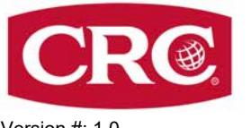
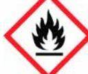
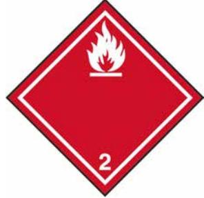

Version #: 1,0 Utgivningsdatum: 16-November-2022 Revisionsdatum: 16-November-2022

# **AVSNITT 1: Namnet på ämnet/blandningen och bolaget/företaget**

| 1.1. Produktbeteckning Blandningens handelsnamn eller beteckning |                                         | RUST OFF                                                                                                                               |  |  |
|------------------------------------------------------------------------|-----------------------------------------|----------------------------------------------------------------------------------------------------------------------------------------|--|--|
|                                                                        | Registreringsnummer                     | -                                                                                                                                      |  |  |
| Synonymer                                                              |                                         | Inga.                                                                                                                                  |  |  |
| Produktkod                                                             |                                         | BDS002134AE                                                                                                                            |  |  |
| Identifierade användningar Användningar som det avråds från      |                                         | 1.2. Relevanta identifierade användningar av ämnet eller blandningen och användningar som det avråds från Smörjmedel Inte kända. |  |  |
| 1.3. Närmare upplysningar om den som tillhandahåller säkerhetsdatablad |                                         |                                                                                                                                        |  |  |
|                                                                        | Företagsnamn                            | CRC Industries Europe bv                                                                                                               |  |  |
| Adress                                                                 |                                         | Touwslagerstraat 1                                                                                                                     |  |  |
|                                                                        |                                         | 9240 Zele                                                                                                                              |  |  |
|                                                                        |                                         | Belgien                                                                                                                                |  |  |
|                                                                        | Telefonnummer                           | +32(0)52/45.60.11                                                                                                                      |  |  |
| Fax e-mail                                                          |                                         | +32(0)52/45.00.34                                                                                                                      |  |  |
|                                                                        |                                         | hse@crcind.com                                                                                                                         |  |  |
|                                                                        | Websida                                 | www.crcind.com                                                                                                                         |  |  |
| 1.4. Telefonnummer för nödsituationer                               |                                         | Tel.: +32(0)52/45.60.11 (kontorstid: 9-17h CET)                                                                                        |  |  |
|                                                                        | Nationella Giftinformationscentralen | 112- och fråga efter Giftinformation (Tillgänglig 24 timmar per dag.)                                                                  |  |  |

## **AVSNITT 2: Farliga egenskaper**

## **2.1. Klassificering av ämnet eller blandningen**

Blandningens fysikaliska faror och dess faror för människors hälsa och för miljön har bedömts och/eller blandningen har testats för dessa faror och klassificeringen är följande.

## **Klassificering enligt förordningen (EG) nr 1272/2008 med ändringar**

Aerosoler Kategori 2 **Fysikaliska faror**

H223 - Brandfarlig aerosol. H229 - Tryckbehållare: Kan sprängas vid uppvärmning.

## **2.2. Märkningsuppgifter**

**Etiketten i enlighet med förordning (EG) nr 1272/2008 med ändringar**

| Signalord                        | Varning                                                               |
|----------------------------------|-----------------------------------------------------------------------|
| Faroangivelser                   |                                                                       |
| H223 H229                     | Brandfarlig aerosol. Tryckbehållare: Kan sprängas vid uppvärmning. |
| Skyddsangivelser Förebyggande |                                                                       |

P102 Förvaras oåtkomligt för barn.

| P210                                   | Får inte utsättas för värme, heta ytor, gnistor, öppen låga eller andra antändningskällor. Rökning förbjuden.                                                                                                                                                                                                                                        |  |  |  |
|----------------------------------------|---------------------------------------------------------------------------------------------------------------------------------------------------------------------------------------------------------------------------------------------------------------------------------------------------------------------------------------------------------|--|--|--|
| P211                                   | Spreja inte över öppen låga eller andra antändningskällor. Får inte punkteras eller brännas, gäller även tömd behållare.                                                                                                                                                                                                                             |  |  |  |
| P251                                   |                                                                                                                                                                                                                                                                                                                                                         |  |  |  |
| Åtgärder                               | Ej tilldelat.                                                                                                                                                                                                                                                                                                                                           |  |  |  |
| Lagring                                |                                                                                                                                                                                                                                                                                                                                                         |  |  |  |
| P410 + P412                            | Skyddas från solljus. Får inte utsättas för temperaturer över 50 °C/122 °F.                                                                                                                                                                                                                                                                             |  |  |  |
| Avfall                                 | Ej tilldelat.                                                                                                                                                                                                                                                                                                                                           |  |  |  |
| Kompletterande märkningsinformation | EUH066 - Upprepad kontakt kan ge torr hud eller hudsprickor.                                                                                                                                                                                                                                                                                            |  |  |  |
| 2.3. Andra faror                       | Denna blandning innehåller inte ämnen som bedöms vara vPvB-/PBT-ämnen enligt förordning (EG) nr 1907/2006, bilaga XIII. Blandningen innehåller inga ämnen som finns med i förteckningen som upprättats i enlighet med REACH Artikel 59(1) därför att de skulle ha hormonstörande egenskaper vid en koncentration på 0,1 viktprocent eller mer. |  |  |  |

## **AVSNITT 3: Sammansättning/information om beståndsdelar**

#### **3.2. Blandningar**

#### **Allmän Information**

| Kemiskt namn                                                              | %                 | CAS-nummer / EG-nummer | REACH-registreringsnu mmer | Index nr | Anmärkningar |
|---------------------------------------------------------------------------|-------------------|---------------------------|-------------------------------|----------|--------------|
| Kolväten , C11-C14, n-alkaner , isoalkaner , cykliska , < 2% aromatics | 50 - 75           | - 926-141-6            | 01-2119456620-43              | -        |              |
| Klassificering:                                                           | Asp. Tox. 1;H304  |                           |                               |          |              |
| Kompletterande faroangivelse(r):                                       | EUH066            |                           |                               |          |              |
| Koldioxid                                                                 | 1 - 5             | 124-38-9 204-696-9     | -                             | -        | #            |
| Klassificering:                                                           | Press. Gas;H280   |                           |                               |          |              |
| Sulfonsyror, petroleum-, natriumsalter                                    | 1 - 5             | 68608-26-4 271-781-5   | 01-2119527859-22              | -        |              |
| Klassificering:                                                           | Eye Irrit. 2;H319 |                           |                               |          |              |

#### **Lista över förkortningar och symboler som kan användas ovan**

ATE: Acute toxicity estimate (uppskattning av akut toxicitet).

M: M-faktor

vPvB: mycket långlivad och mycket bioackumulerande ämne.

PBT: långlivad, bioackumulerande och toxisk ämne.

För detta ämne har fastställts Unionens gränsvärde(n) för exponering på arbetsplatsen.

Alla halter är angivna i viktprocent förutom i det fallet att beståndsdelen är en gas. Gaskoncentrationer är angivna i volymprocent.

**Kommentarer om** Alla H-angivelsernas fullständiga text finns i avsnitt 16. **sammansättning**

| AVSNITT 4: Åtgärder vid första hjälpen                                                                 |                                                                                                                           |  |  |  |  |
|--------------------------------------------------------------------------------------------------------|---------------------------------------------------------------------------------------------------------------------------|--|--|--|--|
| Allmän Information                                                                                     | Se till att medicinsk personal är medveten om de material (er) som berörs och att de vidtar nödvändiga skyddsåtgärder. |  |  |  |  |
| 4.1. Beskrivning av åtgärder vid första hjälpen                                                        |                                                                                                                           |  |  |  |  |
| Inandning                                                                                              | Om symptom utvecklas flytta den skadade ut i friska luften. Kontakta läkare om symtomen kvarstår.                      |  |  |  |  |
| Hudkontakt                                                                                             | Tvätta bort med tvål och vatten. Kontakta läkare om irritation utvecklas och består.                                      |  |  |  |  |
| Ögonkontakt                                                                                            | Spola med vatten. Kontakta läkare om irritation utvecklas och består.                                                     |  |  |  |  |
| Förtäring                                                                                              | Vid osannolik händelse av förtäring kontakta en läkare eller förgiftningsavdelning.                                       |  |  |  |  |
| 4.2. De viktigaste symptomen och effekterna, både akuta och fördröjda                            | Exponering kan orsaka tillfällig irritation, rodnad eller obehag.                                                         |  |  |  |  |
| 4.3. Angivande av omedelbar medicinsk behandling och särskild behandling som eventuellt krävs | Behandla enligt symptom.                                                                                                  |  |  |  |  |
| AVSNITT 5: Brandbekämpningsåtgärder                                                                    |                                                                                                                           |  |  |  |  |

**Allmänna brandfaror** Brandfarlig aerosol.

|  |  | 5.1. Släckmedel |
|--|--|-----------------|

**Lämpliga släckmedel** Vattendimma. Skum. Torrt kemikaliepulver. Koldioxid (CO2).

**Olämpliga släckmedel** Vid brandsläckning får vattenstråle inte användas - branden sprids därigenom.

Innehåll under tryck. Trycksatt behållare kan explodera när de utsätts för värme eller flammor. Vid brand kan hälsoskadliga gaser bildas. **5.2. Särskilda faror som ämnet eller blandningen kan medföra**

### **5.3. Råd till brandbekämpningspersonal**

| Särskild skyddsutrustning för brandbekämpningsperson al | Brandmän måste använda gängse skyddsutrustning inklusive brandhindrande rock, hjälm med ansiktsskydd, handskar, gummistövlar och, i slutna utrymmen, sluten andningsapparat.                                                                                                 |
|------------------------------------------------------------------|---------------------------------------------------------------------------------------------------------------------------------------------------------------------------------------------------------------------------------------------------------------------------------|
| Speciella förfaranden vid brandbekämpning                     | Flytta behållare från brandområdet om detta kan ske utan risk. Behållare skall kylas med vatten för att förhindra att ångtryck bildas. Använd obemannad slang eller fjärrspridare vid stor brand i lagerområde. Om detta är omöjligt, retirera och låt branden brinna ut. |
| Särskilda åtgärder                                               | Tillämpa gängse rutiner för brandbekämpning och betänk riskerna med övriga inblandade material. I händelse av brand och/eller explosion andas inte in rök.                                                                                                                   |

# **AVSNITT 6: Åtgärder vid oavsiktliga utsläpp**

|                                                            | 6.1. Personliga skyddsåtgärder, skyddsutrustning och åtgärder vid nödsituationer                                                                                                                                                                                                                                                                                                                                                                                                                                                            |  |  |
|------------------------------------------------------------|---------------------------------------------------------------------------------------------------------------------------------------------------------------------------------------------------------------------------------------------------------------------------------------------------------------------------------------------------------------------------------------------------------------------------------------------------------------------------------------------------------------------------------------------|--|--|
| För annan personal än räddningspersonal                 | Rör inte skadade kärl eller materialspill utan lämpliga skyddskläder.                                                                                                                                                                                                                                                                                                                                                                                                                                                                       |  |  |
| För räddningspersonal                                      | Håll obehörig personal på avstånd Ventilera slutna utrymmen före tillträde. Lokala myndigheter skall underrättas om betydande spill ej kan begränsas. Information om personligt skydd finns i säkerhetsdatabladets avsnitt 8.                                                                                                                                                                                                                                                                                                         |  |  |
| 6.2. Miljöskyddsåtgärder                                   | Undvik utsläpp i avlopp, vattendrag eller på marken och i vattenmiljö.                                                                                                                                                                                                                                                                                                                                                                                                                                                                      |  |  |
| 6.3. Metoder och material för inneslutning och sanering | Stoppa läckan om detta kan ske utan risk. Flytta cylindern till ett säkert och öppet område om läckan inte går att reparera. Avlägsna alla antändningskällor (ingen rökning, inga bloss, gnistor eller lågor i omedelbar närhet). Låt inte brännbart material (trä, papper, olja etc.) komma i kontakt med spill av materialet. Produkten är inte blandbar med vatten och sprids på vattenytan. Absorbera i vermikulit, torr sand eller jord och placera i kärl. När materialet samlats upp skall området spolas med vatten. |  |  |
|                                                            | Små spill: Torka upp med absorberande material (t.ex. trasa, skinn). Rengör ytan grundligt för att avlägsna kontaminering från utsläppsrester.                                                                                                                                                                                                                                                                                                                                                                                           |  |  |
| 6.4. Hänvisning till andra avsnitt                      | Information om personligt skydd finns i säkerhetsdatabladets avsnitt 8. Information om sophantering finns i säkerhetsdatabladets avsnitt 13.                                                                                                                                                                                                                                                                                                                                                                                             |  |  |

## **AVSNITT 7: Hantering och lagring**

| 7.1 Skyddsåtgärder för säker hantering                                   | Tryckbehållare: Får inte punkteras eller brännas, gäller även tömd behållare. Använd inte om sprayknappen saknas eller är defekt. Spruta inte mot en öppen låga eller annat glödande material. Rök inte under användning eller förrän det besprutade ytan är helt torrt. Ingen skärning, svetsning, lödning, borrning eller slipning och behållare får inte utsättas för värme, lågor, gnistor eller andra antändningskällor. All utrustning som används vid hantering av produkten måste vara jordad. Återanvänd inte tömd behållare. Undvik långvarig exponering. Sörj för god ventilation. Använd lämplig personlig skyddsutrustning. Följ god kemikaliehygien. |
|-----------------------------------------------------------------------------|--------------------------------------------------------------------------------------------------------------------------------------------------------------------------------------------------------------------------------------------------------------------------------------------------------------------------------------------------------------------------------------------------------------------------------------------------------------------------------------------------------------------------------------------------------------------------------------------------------------------------------------------------------------------------------------|
| 7.2. Förhållanden för säker lagring, inklusive eventuell oförenlighet | Tryckbehållare får ej utsättas för temperaturer över 50 °C. Gäller även tömd behållare. Får inte punkteras, brännas eller krossas. Hanteras eller förvaras inte i närheten en öppen låga, värme eller andra antändningskällor. Detta material kan ackumulera statiska laddningar som kan ge upphov till gnistor och bli en antändningskälla. Förvaras inte i närheten av oförenliga material (se säkerhetsdatabladets avsnitt 10). Förvaringsklass (TRGS 510): 2B (Aerosolbehållare och tändare)                                                                                                                                                                      |
| 7.3. Specifik slutanvändning                                                | Följ industrisektorns anvisningar om bästa tillvägagångssätt.                                                                                                                                                                                                                                                                                                                                                                                                                                                                                                                                                                                                                        |

# **AVSNITT 8: Begränsning av exponeringen/personligt skydd**

## **8.1. Kontrollparametrar**

## **Gränsvärden för exponering på arbetsplatsen**

| Sverige                                                      |     |                                                                                                   |
|--------------------------------------------------------------|-----|---------------------------------------------------------------------------------------------------|
| Komponenter                                                  | Typ | Värde                                                                                             |
| Mineralolja (Isoelektrisk punkt 346 DMSO extract < 3%) | KTV | 3 mg/m3                                                                                           |
|                                                              | NGV | 1 mg/m3                                                                                           |
|                                                              |     | Sverige. Hygieniska gränsvärden. Arbetsmiljömyndigheten (AV), hygieniska gränsvärden (AFS 2015:7) |
| Komponenter                                                  | Typ | Värde                                                                                             |
| Koldioxid (CAS 124-38-9)                                     | KTV | 18000 mg/m3                                                                                       |
|                                                              |     | 10000 ppm                                                                                         |

| Komponenter                                               | Typ                                                                                                                                                                                                                                                                                                                                                                                               | Sverige. Hygieniska gränsvärden. Arbetsmiljömyndigheten (AV), hygieniska gränsvärden (AFS 2015:7) Värde                                                                                       |  |  |
|-----------------------------------------------------------|---------------------------------------------------------------------------------------------------------------------------------------------------------------------------------------------------------------------------------------------------------------------------------------------------------------------------------------------------------------------------------------------------|--------------------------------------------------------------------------------------------------------------------------------------------------------------------------------------------------|--|--|
|                                                           | NGV                                                                                                                                                                                                                                                                                                                                                                                               | 9000 mg/m3                                                                                                                                                                                       |  |  |
|                                                           |                                                                                                                                                                                                                                                                                                                                                                                                   | 5000 ppm                                                                                                                                                                                         |  |  |
| Komponenter                                               | Typ                                                                                                                                                                                                                                                                                                                                                                                               | EU. Indikativa exponeringsgränsvärden i direktiv 91/322/EEG, 2000/39/EG, 2006/15/EG, 2009/161/EU, 2017/164/EU Värde                                                                           |  |  |
| Koldioxid (CAS 124-38-9)                                  | NGV                                                                                                                                                                                                                                                                                                                                                                                               | 9000 mg/m3                                                                                                                                                                                       |  |  |
|                                                           |                                                                                                                                                                                                                                                                                                                                                                                                   | 5000 ppm                                                                                                                                                                                         |  |  |
| Biologiska gränsvärden                                    | Inga biologiska exponeringsgränser upptäckts för beståndsdelarna.                                                                                                                                                                                                                                                                                                                                 |                                                                                                                                                                                                  |  |  |
| Rekommenderade övervakningsförfaranden                 | Följ normala uppföljningsprocedurer.                                                                                                                                                                                                                                                                                                                                                              |                                                                                                                                                                                                  |  |  |
| Härledda nolleffektnivåer (DNEL)                       | Inte tillgänglig.                                                                                                                                                                                                                                                                                                                                                                                 |                                                                                                                                                                                                  |  |  |
| Uppskattade nolleffektkoncentrationer (PNEC-värden) | Inte tillgänglig.                                                                                                                                                                                                                                                                                                                                                                                 |                                                                                                                                                                                                  |  |  |
| 8.2. Begränsning av exponeringen                          |                                                                                                                                                                                                                                                                                                                                                                                                   |                                                                                                                                                                                                  |  |  |
| Lämpliga tekniska kontrollåtgärder                     | Se till att det finns en bra allmän ventilation. Ventilationen skall anpassas efter förhållandena. Om tillämpligt, använd inkapsling av processer, punktutsugning eller andra tekniska försiktighetsåtgärder för att hålla nivåerna i luften under de rekommenderade exponeringsgränserna. Om exponeringsgränserna inte har fastställts, håll luftburna nivåer på en acceptabel nivå. |                                                                                                                                                                                                  |  |  |
|                                                           | Individuella skyddsåtgärder, t.ex. personlig skyddsutrustning                                                                                                                                                                                                                                                                                                                                     |                                                                                                                                                                                                  |  |  |
| Allmän Information                                        | Använd föreskriven personlig skyddsutrustning. Välj personlig skyddsutrustning i enlighet med gällande CEN-standarder och i samarbete med leverantören av personlig skyddsutrustning.                                                                                                                                                                                                          |                                                                                                                                                                                                  |  |  |
| Ögonskydd/ansiktsskydd                                    | 166.                                                                                                                                                                                                                                                                                                                                                                                              | Använd skyddsglasögon med sidoskydd. Använd ögonskydd som är i överensstämmelse med EN                                                                                                           |  |  |
| Hudskydd                                                  |                                                                                                                                                                                                                                                                                                                                                                                                   |                                                                                                                                                                                                  |  |  |
| - Handskydd                                               | längre än genombrottstiden ska handskarna bytas efter halva tiden.                                                                                                                                                                                                                                                                                                                                | Vid hantering av produkten Använd handskar som skyddar mot kemikalier (standard EN 374). Handskens genombrottstid ska vara längre än produktens totala användningstid. Om arbetet varar       |  |  |
|                                                           | Lämpligast är nitrilhandskar.                                                                                                                                                                                                                                                                                                                                                                     |                                                                                                                                                                                                  |  |  |
| - Annat skydd                                             | Inte tillgänglig.                                                                                                                                                                                                                                                                                                                                                                                 |                                                                                                                                                                                                  |  |  |
| Andingsskydd                                              | organiska ångor. (Filter typ A)                                                                                                                                                                                                                                                                                                                                                                   | Använd lämpligt andningsskydd vid otillräcklig ventilation. Andningsapparat med filter mot                                                                                                       |  |  |
| Termisk fara                                              | Använd lämpliga skyddskläder som skyddar mot hetta.                                                                                                                                                                                                                                                                                                                                               |                                                                                                                                                                                                  |  |  |
| Hygieniska åtgärder                                       | arbetskläderna för att avlägsna föroreningar.                                                                                                                                                                                                                                                                                                                                                     | Rök inte under hanteringen. Iakttag alltid god personlig hygien. Exempelvis bör man tvätta sig efter hantering av materialet och innan man äter, dricker och/eller röker. Tvätta rutinmässigt |  |  |
| Begränsning av miljöexponeringen                       | kraven i miljöskyddslagstiftningen. Rökskrubbrar, filter eller tekniska modifikationer av                                                                                                                                                                                                                                                                                                         | Utsläpp från ventilation eller arbetsutrustning ska kontrolleras för att säkerställa att de uppfyller                                                                                            |  |  |

#### **9.1. Information om grundläggande fysikaliska och kemiska egenskaper**

| Aggregationstillstånd                                     | Flytande.                        |
|-----------------------------------------------------------|----------------------------------|
| Form                                                      | Aerosol.                         |
| Färg                                                      | Svart.                           |
| Lukt                                                      | Karakteristisk lukt.             |
| Smältpunkt/fryspunkt                                      | -56,6 °C (-69,9 °F) uppskattad   |
| Kokpunkt eller initial kokpunkt och kokpunktsintervall | Inte tillgänglig.                |
| Brandfarlighet                                            | Inte tillgänglig.                |
| Flampunkt                                                 | 75,0 °C (167,0 °F) Sluten bägare |
| Självantändningstemperatur                                | > 200 °C (> 392 °F)              |
| Sönderfallstemperatur                                     | Inte tillgänglig.                |
| pH-värde                                                  | Inte tillämplig.                 |
|                                                           |                                  |

| Kinematisk viskositet                                    | Inte tillgänglig.                                  |
|----------------------------------------------------------|----------------------------------------------------|
| Löslighet i vatten                                       |                                                    |
| Löslighet (vatten)                                       | Olösligt i vatten                                  |
| Fördelningskoefficient (n-oktanol/vatten) (log-värde) | Inte tillgänglig.                                  |
| Ångtryck                                                 | Inte tillgänglig.                                  |
| Densitet och/eller relativ densitet                      |                                                    |
| Relativ densitet                                         | 0,82 g/cm3 vid 20 °C                               |
| Ångdensitet                                              | Inte tillgänglig.                                  |
| Partikelegenskaper                                       | Inte tillgänglig.                                  |
| 9.2. Annan information                                   |                                                    |
| 9.2.1. Information om faroklasser för fysisk fara     | Ingen relevant ytterligare information tillgänglig |
| 9.2.2. Andra säkerhetskarakteristika                     |                                                    |

| Aerosolspray i slutet utrymme          |                   |
|----------------------------------------|-------------------|
| Deflagrationsdensitet                  | > 440 s/m³        |
| Aerosolsprayens antändningsavstånd  | < 60 cm           |
| Avdunstningshastighet                  | Inte tillgänglig. |
| Värmevärde                             | 39,7 kJ/g         |
| VOC (Flyktiga organiska föreningar) | 590 g/l           |

# **AVSNITT 10: Stabilitet och reaktivitet**

| 10.1. Reaktivitet                        | Produkten är stabil och icke-reaktiv under normala användnings-, förvarings- och transportförhållanden |
|------------------------------------------|-----------------------------------------------------------------------------------------------------------|
| 10.2. Kemisk stabilitet                  | Materialet är stabilt under normala betingelser.                                                          |
| 10.3. Risken för farliga reaktioner   | Inga farliga reaktioner kända under normala användningsförhållanden.                                      |
| 10.4. Förhållanden som ska undvikas   | Undvik höga temperaturer.                                                                                 |
| 10.5. Oförenliga material                | Starka oxidationsmedel.                                                                                   |
| 10.6. Farliga sönderdelningsprodukter | Koloxider.                                                                                                |

## **AVSNITT 11: Toxikologisk information**

| Allmän Information                               | Exponering för ämnet eller blandningen under arbetet kan ha skadliga effekter.                               |              |  |  |
|--------------------------------------------------|--------------------------------------------------------------------------------------------------------------|--------------|--|--|
| Information om sannolika exponeringsvägar        |                                                                                                              |              |  |  |
| Inandning                                        | Långvarig inandning kan vara skadligt.                                                                       |              |  |  |
| Hudkontakt                                       | Tillgängliga data tyder på att klassificeringskriterierna inte uppfylls.                                     |              |  |  |
| Ögonkontakt                                      | Tillgängliga data tyder på att klassificeringskriterierna inte uppfylls.                                     |              |  |  |
| Förtäring                                        | Kan ge illamående vid förtäring. Förtäring är sannolikt inte en primär väg för yrkeshygienisk exponering. |              |  |  |
| Symptom                                          | Exponering kan orsaka tillfällig irritation, rodnad eller obehag.                                            |              |  |  |
| 11.1. Information om de toxikologiska effekterna |                                                                                                              |              |  |  |
| Akut toxicitet                                   | Tillgängliga data tyder på att klassificeringskriterierna inte uppfylls.                                     |              |  |  |
| Komponenter                                      | Art                                                                                                          | Testresultat |  |  |

|                               | Kolväten , C11-C14, n-alkaner , isoalkaner , cykliska , < 2% aromatics   |                   |
|-------------------------------|--------------------------------------------------------------------------|-------------------|
| Akut                          |                                                                          |                   |
| Dermal                        |                                                                          |                   |
| LD50                          | Kanin                                                                    | > 5000 mg/kg      |
| Inandning                     |                                                                          |                   |
| LC50                          | Råtta                                                                    | > 5000 mg/m3, 8 h |
| Oral                          |                                                                          |                   |
| LD50                          | Råtta                                                                    | > 5000 mg/kg      |
| Frätande/irriterande på huden | Tillgängliga data tyder på att klassificeringskriterierna inte uppfylls. |                   |

| Allvarlig ögonskada/ögonirritation                                  |                                                                                                                                                                                                                                                                                                |                                                         | Tillgängliga data tyder på att klassificeringskriterierna inte uppfylls.                                                                                                                          |  |
|------------------------------------------------------------------------|------------------------------------------------------------------------------------------------------------------------------------------------------------------------------------------------------------------------------------------------------------------------------------------------|---------------------------------------------------------|---------------------------------------------------------------------------------------------------------------------------------------------------------------------------------------------------|--|
| Luftvägssensibilisering                                                | Tillgängliga data tyder på att klassificeringskriterierna inte uppfylls.                                                                                                                                                                                                                       |                                                         |                                                                                                                                                                                                   |  |
| Hudsensibilisering                                                     | Tillgängliga data tyder på att klassificeringskriterierna inte uppfylls.                                                                                                                                                                                                                       |                                                         |                                                                                                                                                                                                   |  |
| Mutagenitet i könsceller                                               | Tillgängliga data tyder på att klassificeringskriterierna inte uppfylls.                                                                                                                                                                                                                       |                                                         |                                                                                                                                                                                                   |  |
| Cancerogenitet                                                         |                                                                                                                                                                                                                                                                                                |                                                         | Tillgängliga data tyder på att klassificeringskriterierna inte uppfylls.                                                                                                                          |  |
| Reproduktionstoxicitet                                                 |                                                                                                                                                                                                                                                                                                |                                                         | Tillgängliga data tyder på att klassificeringskriterierna inte uppfylls.                                                                                                                          |  |
| Specifik organtoxicitet –                                              |                                                                                                                                                                                                                                                                                                |                                                         | Tillgängliga data tyder på att klassificeringskriterierna inte uppfylls.                                                                                                                          |  |
| enstaka exponering                                                     |                                                                                                                                                                                                                                                                                                |                                                         |                                                                                                                                                                                                   |  |
| Specifik organtoxicitet – upprepad exponering                       | Tillgängliga data tyder på att klassificeringskriterierna inte uppfylls.                                                                                                                                                                                                                       |                                                         |                                                                                                                                                                                                   |  |
| Fara vid aspiration                                                    |                                                                                                                                                                                                                                                                                                | Mindre sannolik pga. produktens form.                   |                                                                                                                                                                                                   |  |
| Information om ämnen respektive blandningar                         | Inte tillgänglig.                                                                                                                                                                                                                                                                              |                                                         |                                                                                                                                                                                                   |  |
| 11.2. Information om andra faror                                       |                                                                                                                                                                                                                                                                                                |                                                         |                                                                                                                                                                                                   |  |
| Hormonstörande egenskaper                                           |                                                                                                                                                                                                                                                                                                | 2018/605, vid en koncentration på 0,1 vikt-% eller mer. | Denna blandning innehåller inga ämnen som har hormonstörande egenskaper för människans hälsa enligt de kriterier som ställts i förordningar (EG) nr 1907/2006, (EU) nr 2017/2100 och (EU)      |  |
| Annan information                                                      | Inte tillgänglig.                                                                                                                                                                                                                                                                              |                                                         |                                                                                                                                                                                                   |  |
| AVSNITT 12: Ekologisk information                                      |                                                                                                                                                                                                                                                                                                |                                                         |                                                                                                                                                                                                   |  |
| 12.1. Toxicitet                                                        |                                                                                                                                                                                                                                                                                                |                                                         | Produkten har inte klassificerats som miljöfarlig. Detta utesluter emellertid inte den möjligheten att stora eller upprepade utsläpp kan ha skadliga effekter på miljön.                       |  |
| Komponenter                                                            |                                                                                                                                                                                                                                                                                                | Art                                                     | Testresultat                                                                                                                                                                                      |  |
| Kolväten , C11-C14, n-alkaner , isoalkaner , cykliska , < 2% aromatics |                                                                                                                                                                                                                                                                                                |                                                         |                                                                                                                                                                                                   |  |
| Akvatisk                                                               |                                                                                                                                                                                                                                                                                                |                                                         |                                                                                                                                                                                                   |  |
| Akut                                                                   |                                                                                                                                                                                                                                                                                                |                                                         |                                                                                                                                                                                                   |  |
| Fisk                                                                   | LC50                                                                                                                                                                                                                                                                                           | Regnbågslax                                             | 1000 mg/l, 96 h                                                                                                                                                                                   |  |
| Kräftdjur                                                              | EC50                                                                                                                                                                                                                                                                                           | Daphnia                                                 | 1000 mg/l, 48 h                                                                                                                                                                                   |  |
| 12.2. Persistens och nedbrytbarhet                                  |                                                                                                                                                                                                                                                                                                |                                                         | Ingen information finns tillgänglig om nedbrytbarheten hos någon beståndsdel av detta ämne.                                                                                                       |  |
| 12.3. Bioackumuleringsförmåga                                       |                                                                                                                                                                                                                                                                                                |                                                         |                                                                                                                                                                                                   |  |
| Fördelningskoefficient n-oktanol/vatten (log Kow)                   | Inte tillgänglig.                                                                                                                                                                                                                                                                              |                                                         |                                                                                                                                                                                                   |  |
| Biokoncentrationsfaktor (BCF)                                          | Inte tillgänglig.                                                                                                                                                                                                                                                                              |                                                         |                                                                                                                                                                                                   |  |
| 12.4 Rörlighet i jord                                                  | Ingen information tillgänglig.                                                                                                                                                                                                                                                                 |                                                         |                                                                                                                                                                                                   |  |
| 12.5. Resultat av PBT- och vPvB-bedömningen                         |                                                                                                                                                                                                                                                                                                | (EG) nr 1907/2006, bilaga XIII.                         | Denna blandning innehåller inte ämnen som bedöms vara vPvB-/PBT-ämnen enligt förordning                                                                                                           |  |
| 12.6. Hormonstörande egenskaper                                     |                                                                                                                                                                                                                                                                                                | en koncentration på 0,1 vikt-% eller mer.               | Denna blandning innehåller inga ämnen som har hormonstörande egenskaper förr miljön enligt de kriterier som ställts i förordningar (EG) nr 1907/2006, (EU) nr 2017/2100 och (EU) 2018/605, vid |  |
| 12.7. Andra skadliga effekter                                          | ozonbildning. GWP: 0                                                                                                                                                                                                                                                                        |                                                         | Produkten innehåller lättflyktiga organiska föreningar som kan medverka till fotokemisk                                                                                                           |  |
| AVSNITT 13: Avfallshantering                                           |                                                                                                                                                                                                                                                                                                |                                                         |                                                                                                                                                                                                   |  |
| 13.1. Avfallsbehandlingsmetoder                                        |                                                                                                                                                                                                                                                                                                |                                                         |                                                                                                                                                                                                   |  |
| Restavfall                                                             | avfallshantering).                                                                                                                                                                                                                                                                             |                                                         | Avfallshantera enligt lokala föreskrifter. Tomma behållare eller innerhöljer kan innehålla produktrester. Produkt och förpackning skall oskadliggöras på säkert sätt (se: Anvisningar för      |  |
| Förorenade förpackningar                                               | Eftersom tömda behållare kan innehålla produktrester, bör man följa varningarna på etiketten också efter att en behållare har blivit tömd. Tomma behållare skall lämnas till godkänd avfallshanteringsanläggning för återanvändning eller kvittblivning. Återanvänd inte tömd behållare. |                                                         |                                                                                                                                                                                                   |  |
| EU:s avfallshanteringskod                                              | Avfallskoden skall tilldelas efter diskussion med användaren, producenten och avfallsmottagarföretaget.                                                                                                                                                                                     |                                                         |                                                                                                                                                                                                   |  |

Samla upp och återvinn eller deponera i slutna behållare på godkänd plats. Innehåll under tryck. Får inte punkteras, brännas eller krossas. Innehållet/behållaren lämnas till hantering i enlighet med lokala/regionala/nationella/internationella föreskrifter. **Avfallshanteringsmetoder / information Särskilda säkerhetsåtgärder** Bortskaffas i enlighet med gällande föreskrifter.

Materialnamn: RUST OFF - Manufacturers SDS SWEDEN

BDS002134AE Version #: 1,0 Revisionsdatum: 16-November-2022 Utgivningsdatum: 16-November-2022 6 / 9

# **AVSNITT 14: Transportinformation**

**ADR 14.1. UN-nummer** UN1950 **14.2. Officiell** AEROSOLER **transportbenämning Klass** 2.1 **14.3. Faroklass för transport Sekundärfara** Ej tilldelat. **Label(s)** 2.1 **Faronr. (ADR)** Ej tilldelat. **Tunnelrestriktionskod** D **ADR / RID -** 5F **Klassificeringskod: 14.4. Förpackningsgrupp** Ej tilldelat. **14.5. Miljöfaror** Nej. **14.6. Särskilda** Läs säkerhetsinstruktioner, säkerhetsdatablad och nödåtgärder före hantering. **skyddsåtgärder IATA 14.1. UN-nummer** UN1950 **14.2. Officiell** AEROSOLER **transportbenämning Klass** 2.1 **14.3. Faroklass för transport Sekundärfara** Ej tilldelat. **14.4. Förpackningsgrupp** Ej tilldelat. **14.5. Miljöfaror** Nej. **ERG-kod** 10L **14.6. Särskilda** Läs säkerhetsinstruktioner, säkerhetsdatablad och nödåtgärder före hantering. **skyddsåtgärder Passagerar- och** Tillåtet med begränsningar. **fraktflygplan Annan information Endast lastflyg** Tillåtet med begränsningar. **IMDG 14.1. UN-nummer** UN1950 **14.2. Officiell** AEROSOLER **transportbenämning Klass** 2.1 **14.3. Faroklass för transport Sekundärfara** Ej tilldelat. **14.4. Förpackningsgrupp** Ej tilldelat. **Vattenförorenande** Nej. **14.5. Miljöfaror EmS** F-D, S-U **14.6. Särskilda** Läs säkerhetsinstruktioner, säkerhetsdatablad och nödåtgärder före hantering. **skyddsåtgärder 14.7. Bulktransport till sjöss** Ej etablerat. **enligt IMO:s instrument ADR; IATA; IMDG**

# **AVSNITT 15: Gällande föreskrifter**

**15.1. Föreskrifter/lagstiftning om ämnet eller blandningen när det gäller säkerhet, hälsa och miljö EU-förordningar**

**Förordning (EG) nr 1005/2009 om ämnen som bryter ned ozonskiktet, bilagor I och II med ändringar** Ej listad.

**Förordning (EU) 2019/1021 om långlivade organiska föroreningar (omarbetning), med ändringar** Ej listad.

**Förordning (EU) nr 649/2012 om export och import av farliga kemikalier, Bilaga I, del 1 med ändringar** Ej listad.

**Förordning (EU) nr 649/2012 om export och import av farliga kemikalier, Bilaga I, del 2 med ändringar** Ej listad.

**Förordning (EU) nr 649/2012 om export och import av farliga kemikalier, Bilaga I, del 3 med ändringar** Ej listad.

**Förordning (EU) nr 649/2012 om export och import av farliga kemikalier, Bilaga V med ändringar** Ej listad.

**Förordning (EG) nr 166/2006 Bilaga II Register över utsläpp och överföringar av föroreningar med ändringar** Koldioxid (CAS 124-38-9)

**Förordning (EG) nr 1907/2006, REACH Artikel 59(10) Förteckning över kandidater i den form som den för tillfället är publicerad av ECHA**

Ej listad.

### **Godkännanden**

**Förordning (EG) nr 1907/2006 REACH Bilaga XIV Ämne för vilket det krävs tillstånd och ändringarna i den** Ej listad.

### **Begränsningar av användning**

**Förordning (EG) nr 1907/2006, REACH Bilaga XVII Begränsning av utsläppande på marknaden och användning av vissa farliga ämnen i ändrad form**

Ej listad.

**Direktiv 2004/37/EG: om skydd för arbetstagare mot risker vid exponering för carcinogener eller mutagena ämnen i arbetet, med ändringar**

Ej listad.

#### **Andra EU-förordningar**

**Direktiv 2012/18/EU om åtgärder för att förebygga och begränsa faran för allvarliga olyckshändelser där farliga ämnen ingår med ändringar**

Ej listad.

| Övriga bestämmelser     | Denna produkt är klassificerad och märkt enligt förordningen (EG) 1272/2008 (CLP-förordningen) med ändringar. Detta säkerhetsdatablad är i enlighet med bestämmelse nr 1907/2006 (EG) med ändringar.                                                                                                                                                                                                                                                                                                                                                                                                                                                                                                                                                                                                                                                                                                                                                                                                                                                                                                                                                                                                                                                                                                                                                                                                                                                                                                                                                                                                                                                                                                                                                                                                     |
|-------------------------|----------------------------------------------------------------------------------------------------------------------------------------------------------------------------------------------------------------------------------------------------------------------------------------------------------------------------------------------------------------------------------------------------------------------------------------------------------------------------------------------------------------------------------------------------------------------------------------------------------------------------------------------------------------------------------------------------------------------------------------------------------------------------------------------------------------------------------------------------------------------------------------------------------------------------------------------------------------------------------------------------------------------------------------------------------------------------------------------------------------------------------------------------------------------------------------------------------------------------------------------------------------------------------------------------------------------------------------------------------------------------------------------------------------------------------------------------------------------------------------------------------------------------------------------------------------------------------------------------------------------------------------------------------------------------------------------------------------------------------------------------------------------------------------------------------------|
| Nationella föreskrifter | Detta säkerhetsdatablad är i enlighet med följande lagar, bestämmelser och standarder: Detta säkerhetsdatablad är i enlighet med följande lagar, föreskrifter och standarder: Lag om packning och packningsavfall av den 13 juni, 2013 Hälsoministerns förordning av den 11 juni 2012 om kategorierna av farliga ämnen och farliga preparat vilkas förpackningar skall vara försedda med barnsäkra förslutningar och en taktil varning om fara HÄLSOMINISTERNS FÖRORDNING av den 2 februari 2011 angående tester och mätningar av faktorer som är skadliga för hälsan i arbetsmiljöer Förordning utgiven av Ministeriet för arbetsmarknads- och socialpolitik (Ministry of Labor and Social Policy) den 6 juni 2014. angående högsta tillåtna koncentrationer och intensiteter av skadliga faktorer i arbetsmiljön (Journal of Laws 2014, item. 817) Förordning om kemikaliesäkerhet på arbetsplatser, gemensamt dekret nr 25/2000 (Bilaga 2): Tillåtna gränsvärden för indextal för biologisk exponering (effekt) Förordning nr 25/2000. (IX. 30.) Hälsoministerns och social- och familjeministerns EüM-SzCsM om kemikaliesäkerhet på arbetsplatsen Lag nr 93 om arbetarsäkerhet (1993.évi XCIII.) i ändrad form Regeringens direktiv nr 220 av 2004 (VII. 21.) om regler för skydd av ytvattenkvaliteten Regeringens förordning nr 98/2001 (VI. 15.) om villkoren för verksamhet som har att göra med farligt avfall, samt Miljödepartementets förordning nr 16/2001 (VII. 18.) om avfallsregistret. Lag nr XXV från 2000 om kemikaliesäkerhet och den relevanta förordningen nr 44/2000. (XII.27.) [Hälsodepartementets] EüM Följ nationell lagstiftning för arbete med kemiska agenser i enlighet med direktiv 98/24/EG, med ändringar. |

**15.2.** Ingen bedömning om den kemiska säkerheten har utförts.

**Kemikaliesäkerhetsbedömning**

# **AVSNITT 16: Annan information**

## **Lista över förkortningar**

ADN: Det europeiska avtalet om internationell transport av farligt gods på inre vattenvägar. ADR: Det europeiska avtalet om internationell transport av farligt gods på väg. ADR: Det europeiska avtalet om internationell transport av farligt gods på väg.

|                                                                                              | ATE: Akut uppskattad toxicitet enligt förordning (EG) nr 1272/2008 (CLP). CAS: Chemical Abstract Service (kemiska abstracts). Tak: Korttidsexponering, övre gränsvärde. CEN: Europeiska standardiseringskommittén. CLP: Klassificering, märkning och förpackning. Förordning (EG) ne 1272/2008 om klassificering, märkning och förpackning av ämnen och blandningar. GWP: Global uppvärmningspotential. IATA: International Air Transport Association (Internationell organisation för lufttransport). IBC-kod: Den internationella koden för konstruktion och utrustning av fartyg som transporterar farliga kemikalier i bulk. IMDG: Internationella bestämmelser för transport av farligt gods. MAK: Maximale Arbeitsplatzkonzentration - DFG (Threshold limit values Germany (Gränsvärden, Tyskland)). MARPOL: Internationella konventionen till förhindrande av förorening från fartyg. PBT: Persistent, bioackumulerande och toxisk. REACH: Registrering, utvärdering och godkännande av kemikalier (Förordning (EG) nr 1907/2006 om registrering, utvärdering, godkännande och begränsning av kemikalier). RID: Règlement International concernant le transport de marchandises dangereuses par chemin de fer (Regulations concerning the international carriage of dangerous goods by rail (Internationellt regelverk för transport av farligt gods med järnväg)). RID: Internationella bestämmelser om internationell transport av farligt gods med järnväg. STEL: Kortvarig exponeringsgräns. TLV: Threshold Limit Value (Gränsvärde). TWA: Time Weighted Average (medelvärde viktat för tid). VOC: Volatile organic compounds (Organiska ämnen som lätt kan förångas). vPvB: mycket persistent och mycket bioackumulerande. |
|----------------------------------------------------------------------------------------------|-------------------------------------------------------------------------------------------------------------------------------------------------------------------------------------------------------------------------------------------------------------------------------------------------------------------------------------------------------------------------------------------------------------------------------------------------------------------------------------------------------------------------------------------------------------------------------------------------------------------------------------------------------------------------------------------------------------------------------------------------------------------------------------------------------------------------------------------------------------------------------------------------------------------------------------------------------------------------------------------------------------------------------------------------------------------------------------------------------------------------------------------------------------------------------------------------------------------------------------------------------------------------------------------------------------------------------------------------------------------------------------------------------------------------------------------------------------------------------------------------------------------------------------------------------------------------------------------------------------------------------------------------------------------------------------------------------------------------------------------------------------------------------------------------------------------|
|                                                                                              | STEL: Short-term Exposure Limit (Korttidsvärde för exponeringar).                                                                                                                                                                                                                                                                                                                                                                                                                                                                                                                                                                                                                                                                                                                                                                                                                                                                                                                                                                                                                                                                                                                                                                                                                                                                                                                                                                                                                                                                                                                                                                                                                                                                                                                                                 |
| Hänvisningar                                                                                 | Inte tillgänglig.                                                                                                                                                                                                                                                                                                                                                                                                                                                                                                                                                                                                                                                                                                                                                                                                                                                                                                                                                                                                                                                                                                                                                                                                                                                                                                                                                                                                                                                                                                                                                                                                                                                                                                                                                                                                 |
| Information om bedömningsmetod som leder till klassificering av blandningen         | Klassificeringen för hälso- och miljöfaror har härletts med en kombination av beräkningsmetoder och testdata, om sådana finns.                                                                                                                                                                                                                                                                                                                                                                                                                                                                                                                                                                                                                                                                                                                                                                                                                                                                                                                                                                                                                                                                                                                                                                                                                                                                                                                                                                                                                                                                                                                                                                                                                                                                                 |
| Den fullständiga ordalydelsen av alla H-angivelser som inte har angetts fullständigt i |                                                                                                                                                                                                                                                                                                                                                                                                                                                                                                                                                                                                                                                                                                                                                                                                                                                                                                                                                                                                                                                                                                                                                                                                                                                                                                                                                                                                                                                                                                                                                                                                                                                                                                                                                                                                                   |
| avsnitten 2-15                                                                               | H280 Innehåller gas under tryck. Kan explodera vid uppvärmning. H304 Kan vara dödligt vid förtäring om det kommer ner i luftvägarna. H319 Orsakar allvarlig ögonirritation. EUH066 Upprepad kontakt kan ge torr hud eller hudsprickor.                                                                                                                                                                                                                                                                                                                                                                                                                                                                                                                                                                                                                                                                                                                                                                                                                                                                                                                                                                                                                                                                                                                                                                                                                                                                                                                                                                                                                                                                                                                                                                   |
| Revisionsinformation                                                                         | Inga.                                                                                                                                                                                                                                                                                                                                                                                                                                                                                                                                                                                                                                                                                                                                                                                                                                                                                                                                                                                                                                                                                                                                                                                                                                                                                                                                                                                                                                                                                                                                                                                                                                                                                                                                                                                                             |
| Utbildningsinformation                                                                       | Iakttag utbildningsanvisningarna vid hantering av detta material.                                                                                                                                                                                                                                                                                                                                                                                                                                                                                                                                                                                                                                                                                                                                                                                                                                                                                                                                                                                                                                                                                                                                                                                                                                                                                                                                                                                                                                                                                                                                                                                                                                                                                                                                                 |
| Friskrivningsklausul                                                                         | CRC Industries Europe bvba kan inte förutse alla förhållanden under vilka denna information och dess produkt, eller andra tillverkares produkter i kombination med dess produkt, kan användas. Användaren ansvarar för att se till att säkra förhållanden råder för hantering, förvaring och deponering av produkten, samt är ansvarsskyldig för förlust, personskada, materiell skada eller kostnader till följd av felaktig användning. Informationsbladen har skrivits i enlighet med den bästa kunskap och erfarenhet som i dagsläget finns tillgänglig. Ingen del av dessa dokument får kopieras, oavsett metod, utan skriftligt tillstånd från CRC. Undantag från detta gäller för varje                                                                                                                                                                                                                                                                                                                                                                                                                                                                                                                                                                                                                                                                                                                                                                                                                                                                                                                                                                                                                                                                                                  |

åtgärd, med ärligt uppsåt, för att studera, forska i samt bedöma risker som berör hälsa, säkerhet

och miljö.