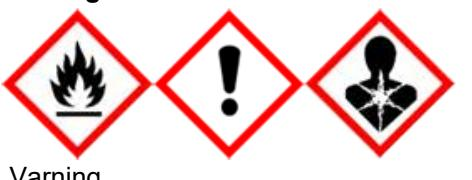
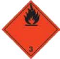

# SÄKERHETSDATABLAD

Enligt 453/2010 och 1272/2008

(Alla hänvisningar till EU-förordningar och direktiv är förkortade till endast nummerbeteckningen)

Utfärdat 2015-08-14

# AVSNITT 1: NAMNET PÅ ÄMNET/BLANDNINGEN OCH BOLAGET/FÖRETAGET

# **1.1 Produktbeteckning**

- 
# **Handelsnamn NORDIC COAT AK 70**

Leverantörens produktnummer 120300, 120301, 120370, 120371, 121003, 121100, 121112, 121126, 121140, 125002, 125015, 126100

**1.2 Relevanta identifierade användningar av ämnet eller blandningen och användningar som det avråds från**

> Box 7033 79107 FALUN

**Identifierade användningar** Färger och lacker

**1.3 Närmare upplysningar om den som tillhandahåller säkerhetsdatablad Företag** AB RÖA

**Telefon** +46(0)23705 350

**E-post** roa@rotmotaverken.se

# **1.4 Telefonnummer för nödsituationer**

I nödläge kontakta Giftinformationscentralen, larmnr 112 Giftinformationscentralen (Sverige) icke-akut: Tel 08-33 12 31; http://www.giftinformationscentralen.se

# AVSNITT 2: FARLIGA EGENSKAPER

# **2.1 Klassificering av ämnet eller blandningen**

# **Klassificering enligt 1272/2008**

Brandfarliga vätskor (Kategori 3) Akut toxicitet (Kategori 4 hud) Akut toxicitet (Kategori 4 damm) Akut toxicitet (Kategori 4 ångor) Irriterande på huden (Kategori 2) Specifik organtoxicitet - upprepad exponering (Kategori 2)

### **2.2 Märkningsuppgifter**

# **Märkningsuppgifter enligt 1272/2008**

Faropiktogram



| Signalord        | Varning                                                     |
|------------------|-------------------------------------------------------------|
| Faroangivelser   |                                                             |
| H226             | Brandfarlig vätska och ånga                                 |
| H312             | Skadligt vid hudkontakt                                     |
| H315             | Irriterar huden                                             |
| H332             | Skadligt vid inandning                                      |
| H373             | Kan orsaka organskador genom lång eller upprepad exponering |
| EUH208           | Innehåller 2-BUTANONOXIM. Kan orsaka en allergisk reaktion  |
| Skyddsangivelser |                                                             |

| P210      | Får inte utsättas för värme, heta ytor, gnistor, öppen låga eller andra antändningskällor. |  |  |
|-----------|--------------------------------------------------------------------------------------------|--|--|
|           | Rökning förbjuden                                                                          |  |  |
| P261      | Undvik att andas in gaser, ångor eller sprej                                               |  |  |
| P280      | Använd skyddskläder och skyddshandskar                                                     |  |  |
| P312      | Vid obehag, kontakta läkare                                                                |  |  |
| P332+P313 | Vid hudirritation: Sök läkarhjälp                                                          |  |  |
| P501      | Innehållet och behållaren lämnas till auktoriserad avfallshanteringsanläggning             |  |  |
|           |                                                                                            |  |  |

# **2.3 Andra faror**

Ej relevant.

# AVSNITT 3: SAMMANSÄTTNING/INFORMATION OM BESTÅNDSDELAR

Denna produkt består av en homogen vätskeblandning.

#### **3.2 Blandningar**

Observera att tabellen visar kända faror för ingredienserna i ren form. Farorna minskas eller elimineras när de blandas eller späds ut, se Avsnitt 16d.

| Beståndsdel       |                            | Klassificering                                                    | Koncentration |  |
|-------------------|----------------------------|-------------------------------------------------------------------|---------------|--|
| XYLEN             |                            |                                                                   |               |  |
| CAS nr            | 1330-20-7                  | Flam Liq 3, Acute Tox 4dermal, Acute Tox 4vapour, Skin Irrit 2;   | 30 - 50%      |  |
| EG nr<br>Index nr | 215-535-7<br>601-022-00-9  | H226, H312, H332, H315                                            |               |  |
|                   |                            |                                                                   |               |  |
|                   | ETYLBENSEN                 |                                                                   |               |  |
| CAS nr            | 100-41-4                   | Flam Liq 2, Acute Tox 4vapour, STOT RE 2, Asp Tox 1; H225,        | 10 - 15%      |  |
| EG nr             | 202-849-4                  | H332, H373, H304                                                  |               |  |
| Index nr          | 601-023-00-4               |                                                                   |               |  |
|                   | 1-METOXY-2-PROPANOL        |                                                                   |               |  |
| CAS nr            | 107-98-2                   | Flam Liq 3, STOT SE 3drow; H226, H336                             | 1 - 5%        |  |
| EG nr             | 203-539-1                  |                                                                   |               |  |
| Index nr          | 603-064-00-3               |                                                                   |               |  |
| 2-BUTANONOXIM     |                            |                                                                   |               |  |
| CAS nr            | 96-29-7                    | Acute Tox 4dermal, Eye Dam 1, Skin Sens 1, Carc 2; H312, H318,    | < 1%          |  |
| EG nr             | 202-496-6                  | H317, H351                                                        |               |  |
| Index nr          | 616-014-00-0               |                                                                   |               |  |
|                   | ETYLENGLYKOLMONOBUTYLETER  |                                                                   |               |  |
| CAS nr            | 111-76-2                   | Acute Tox 4dermal, Acute Tox 4oral, Acute Tox 4vapour, Skin Irrit | < 0,1%        |  |
| EG nr             | 203-905-0                  | 2, Eye Irrit 2; H312, H302, H332, H315, H319                      |               |  |
| Index nr          | 603-014-00-0               |                                                                   |               |  |
|                   |                            |                                                                   |               |  |
|                   | 2-METOXI-1-METYLETYLACETAT |                                                                   |               |  |
| CAS nr            | 108-65-6                   | Flam Liq 3; H226                                                  | < 0,1%        |  |
| EG nr             | 203-603-9                  |                                                                   |               |  |
| Index nr          | 607-195-00-7               |                                                                   |               |  |

Förklaringar till ingrediensernas klassificering och märkning ges i Avsnitt 16e. Officiella förkortningar är skrivna med normal stil. Med kursiv stil anges specifikationer och/eller kompletteringar som använts vid beräkning av blandningens klassifikation, se Avsnitt 16b.

Innehåller även icke märkningspliktig(a) komponent(er).

# AVSNITT 4: ÅTGÄRDER VID FÖRSTA HJÄLPEN

### **4.1 Beskrivning av åtgärder vid första hjälpen**

### **Generellt**

Försök aldrig ge medvetslös person vätska eller annat via munnen.

Vid minsta tvekan eller om symptom kvarstår, sök läkare.

### **Vid inandning**

Låt den skadade vila på varm plats med frisk luft. Kvarstår symptom uppsök läkare.

#### **Vid kontakt med ögonen**

Spola ögonen med rikliga mängder vatten. Om symptom kvarstår, sök läkare.

#### **Vid hudkontakt**

Normal tvättning av huden anses som tillräckligt; Om symptom ändå uppkommer, kontakta läkare. Tag av förorenade kläder.

#### **Vid förtäring**

Skölj först munnen noggrant med mycket vatten och SPOTTA UT sköljvattnet. Drick sedan minst en halv liter vatten och kontakta läkare. Framkalla EJ KRÄKNING.

# **4.2 De viktigaste symptomen och effekterna, både akuta och fördröjda**

Uppgifter om specifika symptom saknas.

- **4.3 Angivande av omedelbar medicinsk behandling och särskild behandling som eventuellt krävs** Symptomatisk behandling.
Vid kontakt med läkare, se till att ha detta säkerhetsdatablad till hands.

# AVSNITT 5: BRANDBEKÄMPNINGSÅTGÄRDER

### **5.1 Släckmedel**

Släckes med medel avsett för omgivande brand.

- **5.2 Särskilda faror som ämnet eller blandningen kan medföra** Avger brännbara ångor som kan bilda explosiv blandning med luft.
### **5.3 Råd till brandbekämpningspersonal**

Vid brand använd friskluftsmask.

Kyl slutna behållare som exponerats för brand med vatten.

Skyddsåtgärder vidtas med hänsyn till övrigt material på brandplatsen.

# AVSNITT 6: ÅTGÄRDER VID OAVSIKTLIGA UTSLÄPP

# **6.1 Personliga skyddsåtgärder, skyddsutrustning och åtgärder vid nödsituationer**

Sörj för god ventilation.

Inandas ej ångorna och undvik kontakt med hud, ögon och kläder vid sanering.

Använd rekommenderad skyddsutrustning, se avsnitt 8.

Håll obehöriga och oskyddade personer på säkert avstånd.

Stäng av utrustning med öppen låga, glöd eller annan hetta.

#### **6.2 Miljöskyddsåtgärder**

Förhindra utsläpp till avlopp, mark eller vattendrag.

Kontakta berörda myndigheter vid oavsiktliga utsläpp.

### **6.3 Metoder och material för inneslutning och sanering**

Sug upp vätskan i inert absorptionsmedel t ex vermikulit, samla ihop materialet och skicka det för avfallshantering.

### **6.4 Hänvisning till andra avsnitt**

Se avsnitt 8 och 13 för personlig skyddsutrustning och avfallshantering.

# AVSNITT 7: HANTERING OCH LAGRING

# **7.1 Skyddsåtgärder för säker hantering**

Inandas ej ångorna och undvik kontakt med hud, ögon och kläder.

Ta av arbetskläder och skyddsutrustning innan måltid.

Håll denna produkt avskild från matvaror och utom räckhåll för barn och husdjur.

Ät, drick och rök inte i lokal där denna produkt hanteras.

Tvätta händerna efter hantering av produkten.

Öppen eld, heta föremål, gnistbildning eller andra antändningskällor får inte förekomma i lokal där denna produkt hanteras.

Vidta åtgärder mot statisk elektricitet.

### **7.2 Förhållanden för säker lagring, inklusive eventuell oförenlighet**

Lagras ej över normal rumstemperatur.

Hanteras i lokal med god ventilation.

Förvaras i väl ventilerat utrymme, ej över ögonhöjd.

Nöddusch och ögonspolning skall finnas på arbetsplatsen.

Skyddas mot värme och solljus.

Förvaras endast i originalförpackningen.

# **7.3 Specifik slutanvändning**

Ej relevant.

# AVSNITT 8: BEGRÄNSNING AV EXPONERINGEN/PERSONLIGT SKYDD

# **8.1 Kontrollparametrar**

**8.1.1 Nationella gränsvärden AFS 2011:18, Sverige**

- **XYLEN**
**Nivågränsvärde 50 ppm / 221 mg/m3 Korttidsgränsvärde 100 ppm / 442 mg/m3 Anm. H ETYLBENSEN**

**Nivågränsvärde 50 ppm / 200 mg/m3 Korttidsgränsvärde 100 ppm / 450 mg/m3 1-METOXY-2-PROPANOL**

**Nivågränsvärde 50 ppm / 190 mg/m3 Korttidsgränsvärde 75 ppm / 300 mg/m3 Anm. H ETYLENGLYKOLMONOBUTYLETER**

**Nivågränsvärde 10 ppm / 50 mg/m3 Korttidsgränsvärde 20 ppm / 100 mg/m3 Anm. H 2-METOXI-1-METYLETYLACETAT**

#### **Nivågränsvärde 50 ppm / 250 mg/m3 Korttidsgränsvärde 75 ppm / 400 mg/m3 Anm. H**  Övriga ingredienser (se Avsnitt 3) saknar hygieniska gränsvärden.

### **8.2 Begränsning av exponeringen**

För förebyggande av risker i arbetet enligt EU-direktiv 89/391 , 98/24 och 2004/37 samt nationell arbetsmiljölagstiftning måste hänsyn tas både till de fysikaliska farorna och de allmänna hälsofarorna samt att denna produkt innehåller cancerframkallande och/eller mutagent ämne, se Avsnitt 2, 3, 10 och 11. Ögonskydd bör användas vid risk för direktkontakt eller stänk.

Använd skyddshandskar av butylgummi, Viton eller fluorgummi, eller rådfråga arbetsmedicinsk expert för alternativt material. Visa detta säkerhetsdatablad.

Arbete utan skyddshandskar bör endast förekomma vid hantering av mycket små mängder.

Välj mekanisk slitstyrka med hänsyn till arbetsuppgiftens art enligt märkning med vidstående piktogram med fyra siffror som visar motstånd mot nötning, skäreffekter, rivning och punktering där 1 är sämst och 4 eller 5

# är bäst.

Använd lämpligt andningsskydd vid otillräcklig ventilation.

# AVSNITT 9: FYSIKALISKA OCH KEMISKA EGENSKAPER

### **9.1 Information om grundläggande fysikaliska och kemiska egenskaper**

| a) Utseende                        | Form: vätska                         |
|------------------------------------|--------------------------------------|
|                                    | Färg: Enligt produktbeteckning       |
| b) Lukt                            | Karaktäristisk                       |
| c) Lukttröskel                     | Ej tillämpligt                       |
| d) pH-värde                        | Ej tillämpligt                       |
| e) Smältpunkt/fryspunkt            | Ej tillämpligt                       |
| f) Initial kokpunkt och            | 136 °C vid atmosfärtryck (101325 Pa) |
| kokpunktsintervall                 |                                      |
| g) Flampunkt                       | 31 °C                                |
| h) Avdunstningshastighet           | Ej tillämpligt                       |
| i) Brandfarlighet (fast form, gas) | Ej tillämpligt                       |
|                                    |                                      |

| j) Övre/undre brännbarhetsgräns eller | Nedre explosionsgräns 1.1% |
|---------------------------------------|----------------------------|
| explosionsgräns                       | Övre explosionsgräns 7%    |

| k) Ångtryck                   | 0,67kPa        |
|-------------------------------|----------------|
| l) Ångdensitet                | Ej tillämpligt |
| m) Relativ densitet           | 1,09 kg/L      |
| n) Löslighet                  | Ej tillämpligt |
| o) Fördelningskoefficient:    | Ej tillämpligt |
| n-oktanol/vatten              |                |
| p) Självantändningstemperatur | Ej tillämpligt |
| q) Sönderfallstemperatur      | Ej tillämpligt |
| r) Viskositet                 | Ej tillämpligt |
| s) Explosiva egenskaper       | Ej tillämpligt |

- t) Oxiderande egenskaper Ej tillämpligt
- 
- **9.2 Annan information**

Inga uppgifter tillgängliga

# AVSNITT 10: STABILITET OCH REAKTIVITET

### **10.1 Reaktivitet**

Produkten innehåller inga ämnen som kan ge upphov till farliga reaktioner under normala hanterings- och användningsförhållanden.

#### **10.2 Kemisk stabilitet**

Produkten är stabil under normala lagrings- och användningsbetingelser.

#### **10.3 Risken för farliga reaktioner**

Inga farliga reaktioner kända under normala användningsförhållanden.

#### **10.4 Förhållanden som ska undvikas**

Undvik uppvärmning, gnistor och öppna lågor.

### **10.5 Oförenliga material**

Inga kända.

### **10.6 Farliga sönderdelningsprodukter**

Inga vid normala förhållanden.

# AVSNITT 11: TOXIKOLOGISK INFORMATION

### **11.1 Information om de toxikologiska effekterna**

### **Allmän eller ospecifik toxicitet**

Uppgifter om möjliga hälsofarliga effekter är baserade på erfarenheter och / eller toxikologiska egenskaper hos flera komponenter i produkten.

#### **Akuta effekter**

Ej klassat som akut-giftigt ämne.

#### **Hälsoskadlighet**

Hälsoskadlighet hos denna produkt är inte känd och kan därför inte uteslutas.

#### **Toxicitet vid upprepad dosering**

Ingen information finns tillgänglig.

#### **Cancerframkallande egenskaper**

Såvitt vi vet har inga cancerframkallande effekter rapporterats för denna produkt.

#### **CMR-effekter**

Ingen information finns tillgänglig.

#### **Sensibilisering**

Ingen information finns tillgänglig.

```
Frätande och irriterande effekter
   Kan ge upphov till hudirritation.
Synergism och antagonism
   Ingen information finns tillgänglig.
Påverkan på omdömet och andra psykiska effekter
   Såvitt vi vet påverkar denna produkt inte omdömet i avsedd användning.
Påverkan på människans mikroflora
   Ingen information finns tillgänglig.
Relevanta toxikologiska egenskaper
   XYLEN
   LD50 kanin (Dermalt) 24h ~ 4500 mg/kg
   LC50 råtta (Inhalation) 4h = 5000 ppmV
   LD50 råtta (Oralt) 24h = 4300 mg/kg
   ETYLBENSEN
   LD50 råtta (Oralt) 24h = 3500 mg/kg 
   1-METOXY-2-PROPANOL
   LD50 kanin (Dermalt) 24h > 5000 mg/kg
   LC50 råtta (Inhalation) 4h > 6 mg/L 
   LD50 råtta (Oralt) 24h = 5660 mg/kg
   ETYLENGLYKOLMONOBUTYLETER
   LD50 kanin (Dermalt) 24h = 220 mg/kg
   LC50 råtta (Inhalation) 4h = 2,211 mg/L
   LD50 råtta (Oralt) 24h = 470 mg/kg
   LC50 råtta (Inhalation) 7h = 700 ppmV
```
# AVSNITT 12: EKOLOGISK INFORMATION

# **12.1 Toxicitet**

# **XYLEN**

LC50 Hinnkräfta (Daphnia magna) 48h = 3,6 mg/L

# **ETYLENGLYKOLMONOBUTYLETER**

LC50 elritsa (Pimephales promelas) 96h = 1900 mg/L LC50 Id (Leuciscus idus) 96h = 1600 mg/L LC50 solabborre (Lepomis macrochirus) 48h = 820 mg/L LC50 guldfisk (Carassius auratus) 96h = 1700 mg/L Förhindra utsläpp i mark, vatten och avlopp.

# **12.2 Persistens och nedbrytbarhet**

Uppgift om persistens och nedbrytbarhet saknas.

# **12.3 Bioackumuleringsförmåga**

Uppgift om bioackumulering saknas.

# **12.4 Rörlighet i jord**

Uppgift om rörlighet i naturen saknas.

- **12.5 Resultat av PBT- och vPvB-bedömningen** Ingen kemikaliesäkerhetsrapport har utförts.
# **12.6 Andra skadliga effekter**

Ej angivet

# AVSNITT 13: AVFALLSHANTERING

# **13.1 Avfallsbehandlingsmetoder**

# **Avfallshantering för produkten**

Produkten är brandfarlig och avfallet ska därför, om det ej behandlats så att denna risk elimineras, betraktas som farligt avfall.

Förpackningar som inte är helt tömda kan innehålla rester av farliga ämnen och ska därför omhändertas

som farligt avfall enligt ovan. Förpackningar som är helt tömda kan lämnas för materialåtervinning. Beakta lokala föreskrifter.

# **Återvinning av produkten**

Ej angivet

# **Transport av avfallet**

Klass J(1) - Ämnen klassade hälsoskadliga eller irriterande.

# AVSNITT 14: TRANSPORTINFORMATION

Där ej annat angivits gäller informationen för samtliga transportslag enligt FN:s modellregelverk, dvs ADR (väg), RID (järnväg), ADN (inre vattenvägar), IMDG (sjötransport) och ICAO (IATA) (flygtransport).

### **14.1 UN-nummer**

1263

# **14.2 Officiell transportbenämning**

- FÄRG
# **14.3 Faroklass för transport**

# **Klass**

3: Brandfarliga vätskor

# **Klassificeringskod (ADR/RID)**

F1: Brandfarliga vätskor med flampunkt högst 60 °C

# **Sekundärfara (IMDG)**

**Etiketter**



# **14.4 Förpackningsgrupp**

Förpackningsgrupp: III

### **14.5 Miljöfaror**

Ej tillämpligt

### **14.6 Särskilda försiktighetsåtgärder**

**Tunnelrestriktioner**

Tunnelkategori: D/E.

# **14.7 Bulktransport enligt bilaga II till MARPOL 73/78 och IBC-koden**

Ej tillämpligt

# **14.8 Övrig transportinformation**

Transportkategori: 3; Högsta totalmängd per transportenhet 1000 kg eller liter.

# AVSNITT 15: GÄLLANDE FÖRESKRIFTER

# **15.1 Föreskrifter/lagstiftning om ämnet eller blandningen när det gäller säkerhet, hälsa och miljö** VOC-halt: 47-50%

# **15.2 Kemikaliesäkerhetsbedömning**

Bedömning och kemikaliesäkerhetsrapport enligt 1907/2006 Bilaga I har ännu ej utförts.

# AVSNITT 16: ANNAN INFORMATION

# **16a. Upplysningar om vilka förändringar som har gjorts av den föregående versionen**

**Revisioner av detta dokument**

Detta är första versionen.

### **16b. Förklaring till förkortningarna i säkerhetsdatabladet**

# **Fulltext för koder för faroklass och kategori nämnda i Avsnitt 3**

Flam Liq 3 Brandfarliga vätskor (Kategori 3) Acute Tox 4dermal Akut toxicitet (Kategori 4 hud)

| Acute Tox 4vapour       | Akut toxicitet (Kategori 4 ångor)                                       |
|-------------------------|-------------------------------------------------------------------------|
| Skin Irrit 2            | Irriterande på huden (Kategori 2)                                       |
| Flam Liq 2              | Brandfarliga vätskor (Kategori 2)                                       |
| STOT RE 2               | Specifik organtoxicitet - upprepad exponering (Kategori 2)              |
| Asp Tox 1               | Aspirationstoxicitet (Kategori 1)                                       |
| STOT SE 3drow           | Specifik organtoxicitet - enstaka exponering (Kategori 3, narkosverkan) |
| Eye Dam 1               | Irreversibla effekter på ögat (Kategori 1)                              |
| Skin Sens 1             | Kan orsaka en allergisk hudreaktion (Kategori 1)                        |
| Carc 2                  | Misstänks kunna orsaka cancer (Kategori 2)                              |
| No phys haz             | Ej åsatt fysikalisk fara                                                |
| Acute Tox 4oral         | Akut toxicitet (Kategori 4 oral)                                        |
| Eye Irrit 2             | Irriterar ögonen (Kategori 2)                                           |
| No environmental hazard | Ej klassat som miljöfarligt                                             |

# **Utförlig definition av farorna nämnda i Avsnitt 2**

# **Flam Liq 3**

Flampunkt >= 23 °C och <= 60 °C; Brandfarlig vätska kategori 3

### **Acute Tox 4dermal**

ATE (acute toxicity estimate - uppskattad akut toxicitet) 1000-2000 mg/kg

### **Acute Tox 4dust**

ATE (acute toxicity estimate - uppskattad akut toxicitet) 1-5 mg/kg

### **Acute Tox 4vapour**

ATE (acute toxicity estimate - uppskattad akut toxicitet) 10-20 mg/kg

### **Skin Irrit 2**

En eller flera kriterier 1-3 för hudirritation föreligger

#### **STOT RE 2**

Ämnen som på grundval av belägg från djurförsök kan antas vara skadliga för människors hälsa efter upprepad exponering.

 Ämnen ska klassificeras i kategori 2 avseende specifik organtoxicitet (upprepad exponering) på grundval av observationer från lämpliga djurförsök där signifikanta toxiska effekter av betydelse för människors hälsa uppkommit vid generellt sett måttlig exponering. I undantagsfall kan även humandata användas som belägg för att placera ett ämne i kategori 2

### **Förklaringar till förkortningar i Avsnitt 14**

- ADR Europeiska överenskommelsen om internationell transport av farligt gods på väg
- RID Reglementet för internationell transport av farligt gods på järnväg
- ADN Europeiska överenskommelsen om internationell transport av farligt gods på inre vattenvägar
- IMDG IMDG-koden (International Maritime Dangerous Goods Code)
- ICAO International Civil Aviation Organization, den internationella organisationen för civil luftfart (ICAO, 999 University Street, Montreal, Quebec H3C 5H7, Canada)
- IATA Internationella lufttransportföreningen

Tunnelrestriktionskod: D/E; Transport i bulk eller tank: Passage förbjuden genom tunnlar av kategori D och E, Annan transport: Passage förbjuden genom tunnlar av kategori E.

Transportkategori: 3; Högsta totalmängd per transportenhet 1000 kg eller liter.

### **16c. Hänvisningar till viktig litteratur och datakällor**

### **Datakällor**

Primärdata för beräkningen av farorna har i första hand hämtats från den officiella europeiska klassifikationslistan, 1272/2008 Bilaga I , uppdaterad till 2015-09-08.

Där sådana uppgifter saknas har i andra hand använts den dokumentation som ligger till grund för den officiella klassificeringen, t ex IUCLID (International Uniform Chemical Information Database). I tredje hand har använts information från ansedda internationella kemikalieföretag, och i fjärde från övrig tillgänglig information, t ex från andra leverantörers säkerhetsdatablad eller från ideella organisationer, varvid en expertbedömning skett av källans trovärdighet. Om, trots detta, tillförlitlig information inte hittats, så har farorna bedömts av expertis på grundval av kända faror från liknande ämnen, varvid principerna i 1907/2006 och 1272/2008 har följts.

### **Fulltext för författningar nämnda i detta säkerhetsdatablad**

| 453/2010  | KOMMISSIONENS FÖRORDNING (EU) nr 453/2010 av den 20 maj 2010 om ändring av               |
|-----------|------------------------------------------------------------------------------------------|
|           | Europaparlamentets och rådets förordning (EG) nr 1907/2006 om registrering, utvärdering, |
|           | godkännande och begränsning av kemikalier (REACH)                                        |
| 1272/2008 | EUROPAPARLAMENTETS OCH RÅDETS FÖRORDNING (EG) nr 1272/2008 av den 16                     |
|           | december 2008 om klassificering, märkning och förpackning av ämnen och blandningar,      |
|           | ändring och upphävande av direktiven 67/548/EEG och 1999/45/EG samt ändring av           |
|           | förordning (EG) nr 1907/2006                                                             |
|           | AFS 2011:18 Arbetsmiljöverkets föreskrifter och allmänna råd om hygieniska gränsvärden   |
| 89/391    | RÅDETS DIREKTIV (89/391/EEG) av den 12 juni 1989 om åtgärder för att främja              |
|           | förbättringar av arbetstagarnas säkerhet och hälsa i arbetet                             |
| 98/24     | RÅDETS DIREKTIV 98/24/EG av den 7 april 1998 om skydd av arbetstagares hälsa och         |
|           | säkerhet mot risker som har samband med kemiska agenser i arbetet (fjortonde             |
|           | särdirektivet enligt artikel 16.1 i direktiv 89/391/EEG)                                 |
| 2004/37   | EUROPAPARLAMENTETS OCH RÅDETS DIREKTIV 2004/37/EG av den 29 april 2004 om                |
|           | skydd för arbetstagare mot risker vid exponering för carcinogener eller mutagena ämnen i |
|           | arbetet (sjätte särdirektivet enligt artikel 16.1 i rådets direktiv 89/391/EEG)          |
| 1907/2006 | EUROPAPARLAMENTETS OCH RÅDETS FÖRORDNING (EG) nr 1907/2006 av den 18                     |
|           | december 2006 om registrering, utvärdering, godkännande och begränsning av kemikalier    |
|           | (Reach), inrättande av en europeisk kemikaliemyndighet, ändring av direktiv 1999/45/EG   |
|           | och upphävande av rådets förordning (EEG) nr 793/93 och kommissionens förordning (EG)    |
|           | nr 1488/94 samt rådets direktiv 76/769/EEG och kommissionens direktiv 91/155/EEG,        |
|           | 93/67/EEG, 93/105/EG och 2000/21/EG Bilaga I                                             |

# **16d. Metoder för att utvärdera information som avses 1272/2008 Artikel 9 som användes för klassificeringen**

Beräkningen av farorna med denna blandning har gjorts som en sammanvägd bedömning med hjälp av en expertbedömning i enlighet med 1272/2008 Bilaga I, där all tillgänglig information som kan ha betydelse för att fastställa farorna med blandningen vägs samman, och i enlighet med 1907/2006 Bilaga XI.

### **16e. En förteckning över relevanta faroangivelser och skyddsangivelser**

### **Fulltext för faroangivelser enligt GHS/CLP nämnda i Avsnitt 3**

- H226 Brandfarlig vätska och ånga
- H312 Skadligt vid hudkontakt
- H332 Skadligt vid inandning
- H315 Irriterar huden
- H225 Mycket brandfarlig vätska och ånga
- H373 Kan orsaka organskador genom lång eller upprepad exponering
- H304 Kan vara dödligt vid förtäring om det kommer ner i luftvägarna
- H336 Kan göra att man blir dåsig eller omtöcknad
- H318 Orsakar allvarliga ögonskador
- H317 Kan orsaka allergisk hudreaktion
- H351 Misstänks kunna orsaka cancer
- H302 Skadligt vid förtäring
- H319 Orsakar allvarlig ögonirritation

### **16f. Råd om lämplig utbildning för anställda för att skydda människors hälsa och miljön**

#### **Övrig relevant information**

### **Produktfakta som inte nämns på annat ställe i detta dokument**

60-130 s DIN4 mm

### **Uppgifter om detta dokument**

Detta säkerhetsdatablad har genererats av programmet KemRisk®, KemRisk Sweden AB, Teknikringen 10, SE-583 30 Linköping, Sverige.