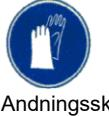
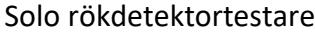

Solo rökdetektortestare

# **SÄKERHETSDATABLAD**

**SDS0098SV**

ENLIGT EG-REGLERNA 1907/2006 (REACH) & 2015/830

# **AVSNITT 1: NAMNET PÅ ÄMNET/BLANDNINGEN OCH BOLAGET/FÖRETAGET**

| 1.1        | Produktbeteckning                                                 |                                                                                                      |
|------------|-------------------------------------------------------------------|------------------------------------------------------------------------------------------------------|
|            | Handelsnamn                                                       | Solo rökdetektortestare.                                                                             |
|            | Handelsnamn                                                       | Solo A10-XXX, Solo A10s -XXX (XXX betyder kundvariant).                                           |
|            | CAS Nr.                                                           | Blandning.                                                                                           |
|            | EINECS Nr.                                                        | Blandning.                                                                                           |
|            | REACH Registreringsnummer                                         | Ej fastslagen.                                                                                       |
| 1.2        |                                                                   | Relevanta identifierade användningar av ämnet eller blandningen och användningar som det avråds från |
|            | Identifierad Användning                                           | Röksimulering.                                                                                       |
|            | Användningar Som Avråds                                           | Ej känd.                                                                                             |
| 1.3        | Närmare upplysningar om den som tillhandahåller säkerhetsdatablad |                                                                                                      |
|            | Identifiering av Företaget                                        | Detectortesters (No Climb Products Ltd)                                                              |
|            |                                                                   | Edison House                                                                                         |
|            |                                                                   | 163 Dixons Hill Road                                                                                 |
|            |                                                                   | Welham Green                                                                                         |
|            |                                                                   | Hertfordshire AL9 7JE.                                                                               |
|            |                                                                   | Storbritannien                                                                                       |
|            | Telefon                                                           | +44 (0) 1707 282760                                                                                  |
|            | Fax                                                               | +44 (0) 1707 282777                                                                                  |
|            | E-post (kompetent person)                                         | SDS@detectortesters.com                                                                              |
| 1.4        | Telefonnummer för nödsituationer                                  |                                                                                                      |
|            | Nödtelefonnummer                                                  | +44 (0) 1707 282760                                                                                  |
|            |                                                                   |                                                                                                      |
| AVSNITT 2: | FARLIGA EGENSKAPER                                                |                                                                                                      |
| 2.1        | Klassificering av ämnet eller blandningen                         |                                                                                                      |
|            | Förordning (EC) No. 1272/2008 (CLP)                               | Aerosol 3; Tryckbehållare: Kan sprängas vid uppvärmning.                                             |
| 2.2        | Märkningsuppgifter                                                | Enligt förordning (EC) No. 1272/2008 (CLP)                                                           |
|            | Faropiktogram                                                     |                                                                                                      |
|            |                                                                   |                                                                                                      |
|            |                                                                   |                                                                                                      |
|            |                                                                   |                                                                                                      |
|            |                                                                   |                                                                                                      |
|            |                                                                   |                                                                                                      |
|            |                                                                   |                                                                                                      |
|            |                                                                   | GHS07                                                                                                |
|            | Signalord                                                         | Varning.                                                                                             |
|            | Faroangivelser                                                    | H229: Tryckbehållare: Kan sprängas vid uppvärmning.                                                  |
|            | Skyddsangivelser                                                  | P210: Får inte utsättas för värme, heta ytor, gnistor, öppen låga eller andra                        |
|            |                                                                   | antändningskällor. Rökning förbjuden                                                                 |
|            |                                                                   | P251: Får inte punkteras eller brännas, gäller även tömd behållare.                                  |
|            |                                                                   | P410+P412: Skyddas från solljus. Får inte utsättas för temperaturer över 50 °C.                      |
| 2.3        | Ytterligare information                                           | Viktprocent av innehållet är brandfarligt: 9.1%                                                      |
|            |                                                                   | Förvaras oåtkomligt för barn.                                                                        |
| 2.4        | Andra faror                                                       | Höga halter: Kan göra att man blir dåsig och omtöcknad.                                              |
|            |                                                                   |                                                                                                      |

# **AVSNITT 3: SAMMANSÄTTNING/INFORMATION OM BESTÅNDSDELAR**

Levererad produkt: Aerosol**.**

**3.1 Blandningar**

| EG Klassificeringsnummer No. 1272/2008 |        |            |           |                     |                            |
|----------------------------------------|--------|------------|-----------|---------------------|----------------------------|
| Farliga Beståndsdelar                  | Vikt % | CAS Nr.    | EG Nr.    | REACH               | Faropiktogram och          |
|                                        |        |            |           | Registreringsnummer | Faroangivelser             |
| 1,3,3,3-tetrafluorpropen               | 85-95  | 29118-24-9 | 212-377-0 | Ej fastslagen.      | GHS04, Press. Gas: H280    |
| Etanol                                 | 1-10   | 67-63-0    | 200-661-7 | Ej fastslagen.      | GHS02, Flam. Liq. 2; H225, |

**3.2 Ytterligare information**

Se avsnitt 16 för fullständig ordalydelse av H/P-uttalanden.

# **AVSNITT 4: ÅTGÄRDER VID FÖRSTA HJÄLPEN**

- **4.1 Beskrivning av åtgärder vid första hjälpen**
Inandning Vid andningsbesvär, flytta personen till frisk luft och se till att han eller hon vilar i en ställning som underlättar andningen. Kontakta läkare om symptom kvarstår.

# Solo rökdetektortestare

Hudkontakt Tvätta huden med tvål och vatten. Kontakt med Ögonen Spola ögonen med vatten i minst 15 minuter medan de är

- **4.2 De viktigaste symptomen och effekterna, både akuta och fördröjda**
- **4.3 Angivande av omedelbar medicinsk behandling och särskild behandling som eventuellt krävs**

# **AVSNITT 5: BRANDBEKÄMPNINGSÅTGÄRDER**

Tryckbehållare: Kan sprängas vid uppvärmning.

öppna. Om ögonirritation kvarstår, sök läkarvård/råd. Förtäring Ej sannolik exponeringsväg. Ej förväntad.

> Krävs sannolikt ej, men vid behov ges symptomatisk behandling.

| 5.1 | Släckmedel                                      |                                                                                  |
|-----|-------------------------------------------------|----------------------------------------------------------------------------------|
|     | Lämpliga Släckmedel                             | Släck med koldioxid, pulversläckare, skum eller spridd vattenstråle.             |
|     | Olämpliga släckmedel                            | Ej känd.                                                                         |
| 5.2 | Särskilda faror som ämnet eller blandningen kan | Upphettning av behållare kan medföra tryckstegring och risk för sprängning. Kan  |
|     | medföra                                         | sönderdelas vid brand under avgivande av giftig rök.: vätefluorid.               |
| 5.3 | Råd till brandbekämpningspersonal               | Brandmän bör bära fullständiga skyddskläder inklusive sluten andningsapparat.    |
|     |                                                 | Om det kan ske utan risk bör behållare flyttas från brandområdet eftersom de kan |
|     |                                                 | sprängas om de utsätts för brand.                                                |

# **AVSNITT 6: ÅTGÄRDER VID OAVSIKTLIGA UTSLÄPP**

Produkten är en aerosol. Det är osannolikt att spill- eller läckagerisk kommer att uppstå. Vid bristning bör utsläppt innehåll samlas upp på samma sätt som annat lösningsmedelsspill.

| 6.1                                 | Personliga skyddsåtgärder, skyddsutrustning och åtgärder vid nödsituationer | Sörj för god ventilation. Undvik att inandas ånga i höga koncentrationer.                                                                                                                                                     |  |  |
|-------------------------------------|--------------------------------------------------------------------------------|-------------------------------------------------------------------------------------------------------------------------------------------------------------------------------------------------------------------------------|--|--|
| 6.2                                 | Miljöskyddsåtgärder                                                            | Släpp inte stora mängder i ytvatten eller i avlopp.                                                                                                                                                                           |  |  |
| 6.3                                 | Metoder och material för inneslutning och sanering                          | Samla in mekaniskt och avfallshantera enligt avsnitt 13. Absorbera spill på sand, jord eller annat lämpligt absorberande material. Behållarna får inte punkteras eller förstöras genom förbränning även om de är tomma. |  |  |
| 6.4                                 | Hänvisning till andra avsnitt                                                  | Se Även Avsnitt: 8, 13.                                                                                                                                                                                                       |  |  |
| AVSNITT 7: HANTERING OCH LAGRING |                                                                                |                                                                                                                                                                                                                               |  |  |

| 7.1                                                                     | Försiktighetsmått för säker hantering | Får inte utsättas för värme, heta ytor, gnistor, öppen låga eller andra antändningskällor. Rökning förbjuden. Får ej punkteras eller brännas. Gäller även |
|-------------------------------------------------------------------------|---------------------------------------|--------------------------------------------------------------------------------------------------------------------------------------------------------------|
|                                                                         |                                       | tömd behållare.                                                                                                                                              |
| 7.2 Förhållanden för säker lagring, inklusive eventuell oförenlighet |                                       |                                                                                                                                                              |
|                                                                         | Lagringstemperatur                    | Omgivande. Skyddas från solljus. Får inte utsättas för temperaturer över 50 °C.                                                                              |
|                                                                         | Lagringstid                           | Stabil under normala förhållanden.                                                                                                                           |
|                                                                         | Oförenliga material                   | Ej känd.                                                                                                                                                     |
| 7.3                                                                     | Specifik slutanvändning               | Röksimulering.                                                                                                                                               |

# **AVSNITT 8: BEGRÄNSNING AV EXPONERINGEN/PERSONLIGT SKYDD**

#### **8.1 Kontrollparametrar**

- **8.1.1 Hygieniska gränsvärden**

|                                | ÄMNET.                      | CAS Nr. | NGV (8h ppm) | NGV (8h mg/m³) | KTV (ppm) | KTV (mg/m³) | Anm                                          |
|--------------------------------|-----------------------------|---------|-----------------|-------------------|--------------|----------------|----------------------------------------------|
| Etanol                         |                             | 64-17-5 | 1000            | 1920              | -            | -              | HG: Hygieniskt Gränsvärde (WEL: UK HSE EH40) |
|                                | Propane-1,2-diol            | 57-55-6 |                 | 10                | -            | -              | HG: Hygieniskt Gränsvärde (WEL: UK HSE EH40) |
| 8.1.2 Biologiskt gränsvärde |                             |         |                 | Ej fastställd.    |              |                |                                              |
| 8.1.3                          | PNECs och DNELs             |         |                 | Ej fastställd.    |              |                |                                              |
| 8.2                            | Begränsning av exponeringen |         |                 |                   |              |                |                                              |

- 
- **8.2.1 Lämpliga tekniska kontrollåtgärder** Sörj för tillräcklig ventilation.

**8.2.2 Personlig skyddsutrustning**

Termisk fara Icke tillämplig.

**8.2.3 Begränsning Av Miljöexponeringen** Undvik utsläpp till miljön.

Ögonskydd/ansiktsskydd Om ögonkontakt är sannolik: Använd ögonskydd (skyddsglasögon, mask eller säkerhetsglasögon).

Hudskydd (Handskydd/ Annatskydd) Använd lämpliga handskar om långvarig kontakt med hud kan förväntas. Skyddshandskar: Nitrilgummi, NBR.

Andningsskydd Ingen andningsskydds-utrustning krävs normalt. Hantering av större mängder: Använd lämpligt andningsskydd vid otillräcklig ventilation. En ändamålsenlig mask med filter av typ A (EN14387 eller EN405) kan vara lämplig.

## **AVSNITT 9: FYSIKALISKA OCH KEMISKA EGENSKAPER**

| 9.1          | Information om grundläggande fysikaliska och         |                                                                                        |
|--------------|------------------------------------------------------|----------------------------------------------------------------------------------------|
|              | kemiska egenskaper                                   |                                                                                        |
|              | Utseende                                             | Aerosol.                                                                               |
|              | Färg.                                                | Färglös.                                                                               |
|              | Lukt                                                 | Utpräglat.                                                                             |
|              | Mejne Vrednosti Vonja (ppm)                          | Ej bestämt.                                                                            |
|              | pH (Värde)                                           | Ej bestämt.                                                                            |
|              | Smältpunkt (°C) / Fryspunkt (°C)                     | Ej bestämt.                                                                            |
|              | Initial kokpunkt och kokpunktsintervallKokpunkt (°C) | -19°C.                                                                                 |
|              | Flampunkt (°C)                                       | >55°C.                                                                                 |
|              |                                                      |                                                                                        |
|              | Avdunstningshastighet                                | Icke tillämplig.                                                                       |
|              | Brandfarlighet (fast form, gas)                      | Ej brandfarlig; testad enligt 2008/47/EG Bilaga 1.9.1(iii)                             |
|              | Övre/undre brännbarhetsgräns eller explosionsgräns   | Ej bestämt.                                                                            |
|              | Ångtryck                                             | 4192hPa @ 20°C                                                                         |
|              | Ångdensitet                                          | Ej bestämt.                                                                            |
|              | Relativ densitet                                     | Ej bestämt.                                                                            |
|              | Densitet                                             | 1.08g/cm³                                                                              |
|              | Löslighet                                            | Ej blandbart eller delvis blandbart med vatten.                                        |
|              | Fördelningskoefficient (n-Oktanol/vatten)            | Ej bestämt.                                                                            |
|              | Självantändningstemperatur (°C)                      | Produkten är inte självantändande.                                                     |
|              | Antändningstemperatur                                | 368°C                                                                                  |
|              | Sönderdelningstemperatur (°C)                        | Ej bestämt.                                                                            |
|              | Dynamisk viskositet                                  | Ej bestämt.                                                                            |
|              | Specifik Vikt                                        | Ej bestämt.                                                                            |
|              | Explosiva egenskaper                                 | Ej explosiv.                                                                           |
|              | Oxiderande egenskaper                                | Ej oxiderarande.                                                                       |
| 9.2          | Annan information                                    |                                                                                        |
|              | Organiska lösningsmedel - Innehåll                   | 9.9%                                                                                   |
|              |                                                      |                                                                                        |
|              | AVSNITT 10: STABILITET OCH REAKTIVITET            |                                                                                        |
|              |                                                      |                                                                                        |
| 10.1         | Reaktivitet                                          | Stabil under normala förhållanden.                                                     |
| 10.2 10.3 | Kemisk stabilitet Risken för farliga reaktioner   | Stabil under normala förhållanden.                                                     |
|              |                                                      |                                                                                        |
|              |                                                      | Inga farliga reaktioner är kända om det används för sitt avsedda ändamål.              |
| 10.4         | Förhållanden som ska undvikas                        | Värme och direkt solljus.                                                              |
| 10.5         | Oförenliga material                                  | Ej förväntad.                                                                          |
| 10.6         | Farliga sönderdelningsprodukter                      | Inga riskfyllda sönderdelningsprodukter kända.                                         |
|              |                                                      |                                                                                        |
|              | AVSNITT 11: TOXIKOLOGISK INFORMATION              |                                                                                        |
| 11.1         | Information om de toxikologiska effekterna           |                                                                                        |
|              | 11.1.1 Blandningar                                   |                                                                                        |
|              | Akut toxicitet                                       | Låg akut giftighet.                                                                    |
|              | Irritation                                           | Ej irriterande.                                                                        |
|              | Frätande effekt                                      | Ej klassificerad.                                                                      |
|              |                                                      |                                                                                        |
|              | Sensibilisering                                      | Är inte hudsensibiliserande.                                                           |
|              | Toxicitet vid upprepad dosering                      | Ej förväntad.                                                                          |
|              | Cancerogenitet                                       | Inget belägg för karcinogenicitet.                                                     |
|              | Mutagenitet                                          | Det finns inget bevis för mutagen potential.                                           |
|              | Reproduktionstoxicitet                               | Ej förväntad.                                                                          |
| 11.2         | Annan information                                    | Ingen.                                                                                 |
|              | AVSNITT 12: EKOLOGISK INFORMATION                 |                                                                                        |
|              |                                                      |                                                                                        |
| 12.1         | Toxicitet                                            | Låg giftighet för vattenorganismer.                                                    |
| 12.2         | Persistens och nedbrytbarhet                         | Information saknas.                                                                    |
| 12.3         | Bioackumuleringsförmåga                              | Information saknas                                                                     |
| 12.4         | Rörligheten i jord                                   | Information saknas.                                                                    |
| 12.5         | Resultat av PBT- och vPvB-bedömningen                | Ej klassificerad som PBT eller vPvB.                                                   |
| 12.6         | Andra skadliga effekter                              | Ingen.                                                                                 |
|              | AVSNITT 13: AVFALLSHANTERING                      |                                                                                        |
|              |                                                      |                                                                                        |
| 13.1         | Avfallsbehandlingsmetoder                            | Återvinn bara helt tömt emballage. Behållarna får inte punkteras eller förstöras       |
|              |                                                      | genom förbränning även om de är tomma. Ej tömd aerosol: Kasta avfallet i en            |
|              |                                                      | godkänd avfallshanterings-anläggning. Får EJ föras till avfallsupplag.                 |
| 13.2         | Ytterligare information                              | Kvittblivning skall ske i enlighet med lokala, statliga eller nationella föreskrifter. |

|      | AVSNITT 14: TRANSPORTINFORMATION                                                           |                                         |
|------|-----------------------------------------------------------------------------------------------|-----------------------------------------|
| 14.1 | UN-nummer                                                                                     | Mi                                      |
|      | ADR, IMDG, IATA                                                                               | UN 1950.                                |
| 14.2 | Officiell transportbenämning                                                                  |                                         |
|      | ADR                                                                                           | 1950 AEROSOLER                          |
|      | IMDG                                                                                          | AEROSOLER                               |
|      | IATA                                                                                          | AEROSOLER, Ej brandfarlig.              |
| 14.3 | Faroklass för transport                                                                       |                                         |
|      | ADR                                                                                           |                                         |
|      | Klass / Klassificering                                                                        | 2 5A Gaser.                             |
|      | Etikett                                                                                       | 2.2                                     |
|      | IMDG, IATA                                                                                    |                                         |
|      | Klass / Avdelning                                                                             | 2.2                                     |
|      | Etikett                                                                                       | 2.2                                     |
| 14.4 | Förpackningsgrupp                                                                             |                                         |
|      | ADR, IMDG, IATA                                                                               | Ingen.                                  |
| 14.5 | Miljöfaror                                                                                    |                                         |
|      | Marin förorening                                                                              | Ingen.                                  |
| 14.6 | Särskilda försiktighetsåtgärder Kemler Code                                                | Varning: Gaser -                     |
|      | IMDG EMS                                                                                      | F-D, S-U                                |
| 14.7 | Bulktransport enligt bilaga II till MARPOL 73/78 och                                          |                                         |
|      | IBC-koden                                                                                     | Icke tillämplig.                        |
| 14.8 | Ytterligare information                                                                       |                                         |
|      | ADR                                                                                           |                                         |
|      | Begränsad mängd (Limited Quantity, LQ)                                                        | 1L                                      |
|      |                                                                                               |                                         |
|      |                                                                                               |                                         |
|      |                                                                                               |                                         |
|      |                                                                                               |                                         |
|      | ADR Transport Kategori                                                                        | 3                                       |
|      | Tunnel restriktionskod                                                                        | Ej tillämplig i begränsade kvantiteter. |
|      | IMDG                                                                                          |                                         |
|      | Begränsad mängd (Limited Quantity, LQ)                                                        | 1L                                      |
|      |                                                                                               |                                         |
|      |                                                                                               |                                         |
|      |                                                                                               |                                         |
|      |                                                                                               |                                         |
|      |                                                                                               |                                         |
|      | IATA                                                                                          |                                         |
|      | Begränsad mängd (Limited Quantity, LQ)                                                        | 1L                                      |
|      |                                                                                               |                                         |
|      |                                                                                               |                                         |
|      |                                                                                               |                                         |
|      |                                                                                               |                                         |
|      |                                                                                               |                                         |
|      | FN:s "Modellreglering"                                                                        | UN 1950, AEROSOLER                      |
|      | AVSNITT 15: GÄLLANDE FÖRESKRIFTER                                                          |                                         |
|      |                                                                                               |                                         |
| 15.1 | Föreskrifter/lagstiftning om ämnet eller blandningen när det gäller säkerhet, hälsa och miljö |                                         |

#### **15.1.1 EU-regler**

| Auktorisering och/eller Restriktioner för Användning                                |
|-------------------------------------------------------------------------------------|
|                                                                                     |
| Kandidatförteckningen för tillstånd för ämnen som inger mycket stora betänkligheter |
| REACH: BILAGA XVII restricciones a la fabricación, comercialización y uso de        |
| determinadas sustancias, preparados y artículos peligrosos                          |
| REACH: BILAGA XIV förteckning över ämnen för vilka det krävs tillstånd              |
| Löpande handlingsplan för gemenskapen (CoRAP)                                       |
|                                                                                     |

#### **15.1.2 Nationella föreskrifter**

Tekniska instruktioner (luft)

| 15.2 | VOC-CH VOC-EU Danska MAL-kod Kemikaliesäkerhetsbedömning | 9.49% 102.5g/l 0-1 Saknas. |         |
|------|-------------------------------------------------------------------|-------------------------------------|---------|
|      | Tekniska instruktioner (luft)                                     | NK                                  | 5 - <10 |

Class Share in %

Ej angiven. Ej angiven. Ej angiven. Ej angiven. Ej känd.

## **AVSNITT 16: ANNAN INFORMATION**

**Under följande rubriker finns ändringar eller nya uppgifter:** 1-16.

#### **Beteckningar och förkortningar**

| LTEL         | Nivågränsvärde                                                                |
|--------------|-------------------------------------------------------------------------------|
| STEL         | Korttidsvärde                                                                 |
| DNEL         | Erhöll ingen effekt nivå                                                      |
| PNEC         | Förutsade ingen effektkoncentration                                           |
| PBT          | Långlivad, Bioackumulativ och Giftigt                                         |
| vPvB         | mycket Långlivad och mycket Bioackumulativ                                    |
| VOC          | Lättflyktiga organiska sammansättningar                                       |
| MAL-kod      | Bestämmelser om märkning angående inandningsrisker, Danmark                   |
| ADR          | Europeiskt avtal rörande internationella vägtransporter av farligt gods       |
| IMDG         | Internationell maritim kod för farligt gods                                   |
| IATA         | International Air Transport Association (Internationella flygfraktsförbundet) |
| Aerosol 3    | Aerosol Kategori 3                                                            |
| Flam. Liq. 2 | Brandfarlig vätska Kategori 2                                                 |

### **Faroangivelser**

| H225 | Mycket brandfarlig vätska och ånga.                        |
|------|------------------------------------------------------------|
| H229 | Tryckbehållare: Kan sprängas vid uppvärmning.              |
| H280 | Innehåller gas under tryck. Kan explodera vid uppvärmning. |
| H335 | Kan orsaka irritation i luftvägarna.                       |

#### **Förbehåll**

Informationen lämnas utifrån den kunskap som No Climb Products Ltd. och dess rådgivare har och lämnas i god tro, men vi kan inte garantera dess exakthet, tillförlitlighet eller fullständighet och friskriver oss därför från allt ansvar för förlust eller skada som uppstår på grund av användningen av dessa uppgifter. Eftersom användningsförhållandena ligger utanför Bolagets och dess rådgivares kontroll friskriver vi oss från allt ansvar för förlust eller skada när produkten används för andra ändamål än de avsedda.

#### **Bilagan till det utvidgade säkerhetsdatabladet (eSDS)**

Information saknas.