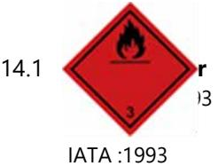

**___________________________________________________________________________** *[EG 1907/2006 (REACH) med senare ändringar]*

| Datum för utfärdande: | 27.04.2020 |
|-----------------------|------------|
| Version:              | 1.0/SV.    |

| 1   | AVSNITT 1: Namnet på ämnet/blandningen och bolaget/företaget                                                                                                                                                                                                                                                                                                                |
|-----|-----------------------------------------------------------------------------------------------------------------------------------------------------------------------------------------------------------------------------------------------------------------------------------------------------------------------------------------------------------------------------|
| 1.1 | Produktbeteckning : ITSEPTIC Flytande medel för rengöring och desinfektion av ytor Artikelnummer: FR0117_SE (Tura Item no. 843151)                                                                                                                                                                                                                                       |
| 1.2 | Relevanta identifierade användningar av ämnet eller blandningen och användningar som det avråds från Det kan tillämpas som: Flytande medel för rengöring och desinfektion av ytor.                                                                                                                                                                                    |
|     | SU21 Konsumentanvändning Privata hushåll (= allmänheten = konsumenter) SU22 Professionell användning Allmänt tillgängligt (administration, utbildning, underhållning, service, hantverkare) Det rekommenderas inte att tillämpa: inte bestämt.                                                                                                                        |
| 1.3 | Närmare upplysningar om den som tillhandahåller säkerhetsdatablad Leverantör: Tura Scandinavia AB Adress: Energigatan 15B, 434 37 Kungsbacka Sweden Telefon: 0300-568900 www.turascandinavia.com                                                                                                                                                       |
| 1.4 | e-postadress för en behörig person som ansvarar för säkerhetsdatabladet: e-mail: info@turascandinavia.com Telefonnummer för nödsituationer Giftinformationscentralen: 010-456 6700 Vid akut förgiftning ring 112                                                                                                                                                   |
| 2   | AVSNITT 2: Farliga egenskaper                                                                                                                                                                                                                                                                                                                                               |
| 2.1 | Klassificering av ämnet eller blandningen Klassificering enligt förordning (EG) nr 1272/2008 Fysikaliska faror Brandfarliga vätskor, farokategori 2 [Flam. Liq. 2] Mycket brandfarlig vätska och ånga (H225) Hälsofaror: Allvarlig ögonskada eller ögonirritation, farokategori 2 [Eye Irrit. 2] Orsakar allvarlig ögonirritation(H319) Miljöfaror: |
| 2.2 | Ej Klassificerad Märkningsuppgifter Märkning enligt förordning (EG) nr 1272/2008Ämnet är klassificerat och märkt enligt CLP-förordningen. Faropiktogram och signalord                                                                                                                                                                                              |
|     | GHS02 GHS07 Fara Uttryck som anger faroslag H225 Mycket brandfarlig vätska och ånga H319 Orsakar allvarlig ögonirritation Uttryck som anger försiktighetsåtgärder                                                                                                                                                                                         |
|     | S i d a 1 / 9                                                                                                                                                                                                                                                                                                                                                               |

**___________________________________________________________________________** *[EG 1907/2006 (REACH) med senare ändringar]*

| Datum för utfärdande: | 27.04.2020 |
|-----------------------|------------|
| Version:              | 1.0/SV.    |

#### Förebyggande

P102 Förvaras oåtkomligt för barn.

P210 Får inte utsättas för värme, heta ytor, gnistor, öppen låga eller andra antändningskällor. Rökning förbjuden. Åtgärder:

P305 +P351 +P338 IF IN EYES: VID KONTAKT MED ÖGONEN: Skölj försiktigt med vatten i flera minuter. Ta ur eventuella kontaktlinser om det går lätt. Fortsätt att skölja

P337+P313 Vid bestående ögonirritation: Sök läkarhjälp.

- Avfall:
P501 Innehållet/behållaren lämnas till korrekt märkta avfallsbehållare, i enlighet med nationella föreskrifter.

Märkning i enlighet med Europaparlamentets och rådets förordning (Eu) nr 528/2012 av den 22 maj 2012 om tillgänglighet på marknaden och användning av biocidprodukter: Verksamt ämne: etanol - 70g/100g

### 2.3 **Andra faror**

Produkten innehåller inga ingredienser som uppfyller kriterierna för PBT eller vPvB i enlighet med bilaga XIII till REACH-förordningen.

## **3 AVSNITT 3: Sammansättning/information om beståndsdelar**

### 3.1 **Ämnen**

- Gäller ej.
### 3.2 **Blandningar:**

| CAS-nr. EG-nr Index nr Registreringsnummer: | Kemiskt namn   | Koncen tration sinterv all%: | Klassificering No. 1272/2008        |                                      |                              |
|------------------------------------------------------|----------------|---------------------------------------|-------------------------------------|--------------------------------------|------------------------------|
|                                                      |                |                                       | Piktogram, signalordsk od(er) | Faroklass och farokategorikod(er) | Faroangi velse kod(er) |
| CAS-nr.:64-17-5                                      | Etanol [1]     | 70                                    | GHS02                               | Flam. Liq. 2                         | H225                         |
| EG-nr: 200-578-6                                     |                |                                       | GHS07                               | Eye Irrit. 2                         | H319                         |
| Index nr: 603-002-00-5                               |                |                                       | Dgr                                 |                                      |                              |
| Registreringsnummer:01-2119457610-43-xxxx            |                |                                       |                                     |                                      |                              |
| CAS-nr. 67-63-0                                      | 2-Propanol [1] | ≤10                                   | GHS02                               | Flam. Liq. 2                         | H225                         |
| EG-nr: 200-661-7                                     |                |                                       | GHS07                               | Eye Irrit. 2                         | H319                         |
| Index nr: 603-117-00-0                               |                |                                       | Wng                                 | STOT SE 3                            | H336                         |
| Registreringsnummer: 01-2119457558-25-xxxx           |                |                                       |                                     |                                      |                              |

Den fullständiga texten för H-fraser finns i avsnitt 16 i kortet.

1Ett ämne för vilket det finns nationalgränsvärden för exponering på arbetsplatsen.

## **4 AVSNITT 4: Åtgärder vid första hjälpen**

### 4.1 **Beskrivning av åtgärder vid första hjälpen**

| Vid hudkontakt:         | produkt för användning på huden Om ingen irritation sker rekommenderas det att                                       |
|-------------------------|-------------------------------------------------------------------------------------------------------------------------|
|                         | använda tvål. Om alarmerande symtom uppstår, kontakta läkare                                                            |
| Vid kontakt med ögonen: | om alarmerande symtom uppstår, kontakta ögonläkare. Skydda det icke-irriterade ögat,                                    |
|                         | avlägsna kontaktlinser. Spola noggrant med vatten i minst 10-15 minuter. Undvik stark                                   |
|                         | vattenström - risk för skador på hornhinnan.                                                                            |
| Vid förtäring:          | framkalla inte kräkning. Kontakta läkare och visa denna förpackning eller etiketten. Vid                                |
|                         | plötsliga kräkningar ska man förhindra att kräkningar kommer in i luftvägarna. Ge aldrig                                |
|                         | något via munnen till en medvetslös person.                                                                             |
|                         | Vid olycksfall via inandning: flytta den drabbade till frisk luft och låt vila. Om alarmerande symtom uppstår, kontakta |
|                         | läkare.                                                                                                                 |
|                         |                                                                                                                         |

### 4.2 **De viktigaste symptomen och effekterna, både akuta och fördröjda**

De viktigaste symptomen och effekterna beskrivs i avsnitt 2 och/eller i avsnitt 11.

**___________________________________________________________________________** *[EG 1907/2006 (REACH) med senare ändringar]*

| Datum för utfärdande: | 27.04.2020 |
|-----------------------|------------|
| Version:              | 1.0/SV.    |

- 4.3 **Angivande av omedelbar medicinsk behandling och särskild behandling som eventuellt krävs** Läkare beslutar om nödåtgärder efter en noggrann bedömning av den skadades tillstånd.
### **5 AVSNITT 5: Brandbekämpningsåtgärder**

#### 5.1 **Släckmedel**

Lämpliga släckmedel: vattendimma, pulver, alkoholresistent skum, koldioxid. Olämpliga släckmedel: vattenstråle - risk för spridning av brand.

### 5.2 **Särskilda faror som ämnet eller blandningen kan medföra**

Vid förbränning kan skadliga gaser bildas som innehåller bl.a. koloxider.Undvik inandning av förbränningsprodukter som kan utgöra en hälsorisk.

#### 5.3 **Råd till brandbekämpningspersonal**

Mycket brandfarlig vätska och ånga

Mycket brandfarlig vätska och ånga. Typisk personlig skyddsutrustning vid brand. Stanna inte i riskzonen utan lämpliga kläder motståndskraftiga mot kemikalier och en andningsskyddsutrustning som har en oberoende luftcirkulation. Behållare utsatta för eld eller hög temperatur ska kylas ner med vattenstråle från ett säkert avstånd. Håll ett säkert avstånd Låt inte släckningsvatten komma in i avlopp, ytvatten och grundvatten. Samla släckmedel som har använts.

## **6 AVSNITT 6: Åtgärder vid oavsiktliga utsläpp**

#### 6.1 **Personliga skyddsåtgärder, skyddsutrustning och åtgärder vid nödsituationer**

#### For non-emergency personnel

Begränsa tillgång av utomstående till olycksområdet tills lämpliga rengöringsåtgärder är slut. Se till att borttagning av skadan och dess konsekvenser endast utföras av utbildad personal. Undvik förorening av ögonen och huden. Sörj för god ventilation. Inandas inte ångor. Använd personlig skyddsutrustning

#### 6.2 **Miljöskyddsåtgärder**

I händelse av ett utsläpp av större produktmängder vidta åtgärder för att förhindra spridning av produkten i miljön. Meddela räddningstjänsten vid större utsläpp.

#### 6.3 **Metoder och material för inneslutning och sanering**

Samla ihop ämnet med obrännbara absorberande material (t.ex. sand, jord, universalbindemedel, sågspån, kiseldioxid, vermikulit osv.) och placera i märkta behållare. Samlade material ska behandlas som avfall. Ventilera det drabbade området.

#### 6.4 **Hänvisning till andra avsnitt**

Kassering av produkten - se avsnitt 13. Personlig skyddsutrustning - se avsnitt 8.

## **7 AVSNITT 7: Hantering och lagring**

### 7.1 **Skyddsåtgärder för säker hantering**

Arbeta i enlighet med hälso-och säkerhetsregler. Ät inte, drick inte och rök inte när du använder produkten. Undvik kontakt med ögonen. Inandas inte ångor. Garantera lämplig ventilation. Tvätta händerna noggrant före rasten och efter arbetet. Vidta åtgärder mot statisk elektricitet. Faran för att halka på ytan täckt med produkten. Ta bort tändkälla, släck brand, meddela rökförbud.

### 7.2 **Förhållanden för säker lagring, inklusive eventuell oförenlighet**

Förvaras endast i original och tätt förseglade behållare, i en torr, sval och välventilerad plats. Förvaras åtskilt från livsmedel, foder. lerad plats. Säkerställ ventilation med skydd mot explosionsfaror. Förvara inte tillsammans med oförenliga material (avsnitt 10.5). Förvaras åtskilt från värme och antändningskällor. Skydda från direkt solljus.

### 7.3 **Specifik slutanvändning**

Ingen information om andra användningsområden än som anges i i avsnitt 1.2.

**___________________________________________________________________________** *[EG 1907/2006 (REACH) med senare ändringar]*

| Datum för utfärdande: | 27.04.2020 |
|-----------------------|------------|
| Version:              | 1.0/SV.    |

## **8 AVSNITT 8: Begränsning av exponeringen/personligt skydd**

### 8.1 **Kontrollparametrar**

Förordningen från minister för arbets- och socialpolitik av den 12 juni 2018 om maximala godkända koncentrationer och intensitet av hälsofaktorer i arbetsmiljön (Dz. U. 2018 poz.1286)

| PL: Isopropanol [67-63-0] |            |  |
|---------------------------|------------|--|
| NDS                       | 900 mg/m3  |  |
| NDSCh                     | 1200 mg/m3 |  |
| PL: Etanol [64-17-5]      |            |  |
| NDS                       | 1900 mg/m3 |  |

Rättslig grund: Hygieniska gränsvärden Arbetsmiljöverkets föreskrifter och allmänna råd om hygieniska gränsvärden; Elanders Sverige AB, 2011

| Ämne        | CAS-nr  | År   | Nivågränsvärde (NGV) |       | Korttidsgränsvärde |       |
|-------------|---------|------|-------------------------|-------|--------------------|-------|
|             |         |      |                         |       | (KGV)              |       |
|             |         |      | ppm                     | mg/m3 | ppm                | mg/m3 |
| Isopropanol | 67-63-0 | 1989 | 150                     | 350   | 250                | 600   |
| Etanol      | 64-17-5 | 1993 | 500                     | 1000  | 1000               | 1900  |

## **DNEL/ PNEC**

| Etanol (64-17-5)                                            |                      |  |
|-------------------------------------------------------------|----------------------|--|
| Härledd nolleffektnivå (DNEL)                               |                      |  |
| Arbetare DNEL kortsiktigt (akut) Lokala effecter inhalation | 1900 mg/m³           |  |
| Arbete DNEL, långtids Systemeffekter dermal                 | 343 mg/kg Kroppsvikt |  |
| Arbete DNEL, långtids Systemeffekter inhalation             | 206 mg/m³            |  |
| Konsument DNEL, långvarig Systemeffekter peroral            | 87 mg/kg Kroppsvikt  |  |
| Uppskattad nolleffektkoncentration (PNEC)                   |                      |  |
| PNEC Sötvatten                                              | 0,96 mg/l            |  |
| PNEC Havsvatten                                             | 0,76 mg/l            |  |
| PNEC Jord                                                   | 0,63 mg/kg           |  |
| PNEC periodiska utsläpp till vattenområden                  | 2,9 mg/l             |  |

Rekommenderade övervakningsförfaranden

Man ska tillämpa övervakningsförfaranden för kontroll av koncentrationer av farliga komponenter och kontrollförfaranden för kontroll av luftrenhet på arbetsplatsen - så länge de är tillgängliga och rimliga i en given arbetsplats - i enlighet med relevanta nationella eller europeiska standarder, med hänsyn till de förhållanden som råder på exponeringsplatsen och en lämplig mätmetod anpassad till arbetsförhållanden

## 8.2 **Begränsning av exponeringen**

- 8.2.1 Lämpliga tekniska kontrollåtgärder Iaktta allmänna principer för hälsa och säkerhet. Ät inte, drick inte eller rök inte under hanteringen. Undvik förorening av ögonen Garantera lämplig allmänventilation . Ögondusch ska installeras i närheten av arbetsplatsen
- 8.2.2 Individuella skyddsåtgärder, t.ex. personlig skyddsutrustning

**___________________________________________________________________________** *[EG 1907/2006 (REACH) med senare ändringar]*

| Datum för utfärdande: | 27.04.2020 |
|-----------------------|------------|
| Version:              | 1.0/SV.    |

| Hudskydd;      | Produkten är avsedd att användas för rengöring av hud. I regel krävs inget skydd under normala användningsbetingelser.                                                                                                                                                                                                                                                                                                                                                                                                                  |
|----------------|--------------------------------------------------------------------------------------------------------------------------------------------------------------------------------------------------------------------------------------------------------------------------------------------------------------------------------------------------------------------------------------------------------------------------------------------------------------------------------------------------------------------------------------------|
|                | Kemiskt resistenta, ogenomträngbara skyddshandskar som överensstämmer med en                                                                                                                                                                                                                                                                                                                                                                                                                                                               |
|                | godkänd standard skall alltid användas när kemiska produkter hanteras om en                                                                                                                                                                                                                                                                                                                                                                                                                                                                |
|                | riskbedömning visar att detta är nödvändigt. Vid användning av skyddshandskar i kontakt med kemiska produkter måste man komma ihåg att                                                                                                                                                                                                                                                                                                                                                                                                  |
|                | den angivna prestandan och motsvarande genombrottstiderna är inte lika med den verkliga tiden av skyddet på en given arbetsplats, eftersom detta skydd påverkas av många faktorer såsom temperatur, påverkan av andra ämnen, etc. Det rekommenderas att byta handskar omedelbart om det finns några tecken på slitage, skada eller någon förändring i utseende (färg, elasticitet, form). Följ tillverkarens instruktioner, inte bara när det gäller användning av handskar, utan också rengöring, underhåll och förvaring. |
| Ögonskydd:     | Använd skyddsglasögon vid risken för förorening av ögon.                                                                                                                                                                                                                                                                                                                                                                                                                                                                                   |
| Andningsskydd: | När det gäller normal och avsedd användning, är det inte nödvändigt.                                                                                                                                                                                                                                                                                                                                                                                                                                                                       |
|                | Arbetsgivare är skyldig att säkerställa skyddsåtgärder som lämpar sig för en given verksamhetstyp och som uppfyller alla kvalitetskrav, inklusive deras underhåll och rengöring.                                                                                                                                                                                                                                                                                                                                                     |
|                |                                                                                                                                                                                                                                                                                                                                                                                                                                                                                                                                            |

### 8.2.3 Begränsning av miljöexponeringen

Begränsning av miljöexponeringen

Undvik utsläpp i miljön, inte heller ut i avloppen. Det bör kontrolleras utsläpp från ventilationen eller utrustningen på arbetsplatsen för att säkerställa att de uppfyller kraven i miljölagar

## **9 AVSNITT 9: Fysikaliska och kemiska egenskaper**

#### 9.1 **Information om grundläggande fysikaliska och kemiska egenskaper**

| Utseende:                                           |            | vätska                    |
|-----------------------------------------------------|------------|---------------------------|
| Färg:                                               |            | färglös                   |
| Lukt:                                               |            | utmärkande, alkoholhaltig |
| Lukttröskel:                                        |            | ej bestämt                |
| pH                                                  |            | ej bestämt                |
| Smältpunkt/fryspunkt:                               |            | ej bestämt                |
| Initial kokpunkt och kokpunktsintervall:            |            | ej bestämt                |
| Flampunkt:                                          |            | ≥20oC                     |
| Avdunstningshastighet:                              |            | ej bestämt                |
| Brandfarlighet (fast form, gas):                    |            | gäller ej                 |
| Övre/undre brännbarhetsgräns eller explosionsgräns: |            | ej bestämt                |
| Ångtryck:                                           |            | gäller ej                 |
| Ångdensitet:                                        |            | ej bestämt                |
| Densitet:                                           |            | 0,8-0,85 g/cm3            |
| Löslighet.:                                         |            | löser sig i vatten        |
| Fördelningskoefficient: n-oktanol/vatten.:          | ej bestämt |                           |
| Självantändningstemperatur:                         | ej bestämt |                           |
| Sönderfallstemperatur:                              | ej bestämt |                           |
| Dynamisk viskositet:                                | ej bestämt |                           |
| Explosiva egenskaper:                               | gäller ej  |                           |
| Oxiderande egenskaper:                              | gäller ej  |                           |

#### 9.2 **Övrig information**

Inga ytterligare undersökningsresultat

**___________________________________________________________________________** *[EG 1907/2006 (REACH) med senare ändringar]*

| Datum för utfärdande: | 27.04.2020 |
|-----------------------|------------|
| Version:              | 1.0/SV.    |

| 10.1 | Reaktivitet                                                                                                                 |
|------|-----------------------------------------------------------------------------------------------------------------------------|
|      |                                                                                                                             |
|      | Reaktiv produkt, Se avsnitt 10.3-20.5.                                                                                      |
| 10.2 | Kemisk stabilitet                                                                                                           |
|      | Vid rätt användning och lagring, är produkten stabil.                                                                       |
| 10.3 | Risken för farliga reaktioner                                                                                               |
|      | Är inte kända                                                                                                               |
| 10.4 | Förhållanden som ska undvikas                                                                                               |
|      | Undvik direkt Solljus, värmekällor, antändningskällor.                                                                      |
|      | Incompatible materials                                                                                                      |
|      | Starkt oxiderande ämnen                                                                                                     |
|      | Farliga sönderdelningsprodukter                                                                                             |
|      | Under de rekommenderade lagringsförhållandena samt arbetet finns inga farliga nedbrytningsbara produkter.                   |
|      | AVSNITT 11: Toxikologisk information                                                                                        |
|      |                                                                                                                             |
|      | Information om de toxikologiska effekterna                                                                                  |
|      | Komponenter                                                                                                                 |
|      | Etanol [CAS 64-17-5]                                                                                                        |
|      | LD50 (oral) 10.470 mg / kg kroppsvikt                                                                                       |
|      | LD50 (hud) 15800 mg / kg kroppsvikt                                                                                         |
|      | LC50 (inandning) 30 000 mg / m3                                                                                             |
|      | LD50 (hud, kanin): 13 900 mg / kg                                                                                           |
|      | LD50 (oral, råtta): 5,840 mg / kg                                                                                           |
|      | LC50 (inandning, råtta): 25 000 mg / m3                                                                                     |
|      | Akut toxicitet.                                                                                                             |
|      | Baserat på tillgänglig data, är klassificeringskriterierna inte uppfyllda.                                                  |
|      | Frätande/irriterande på huden.                                                                                              |
|      | Baserat på tillgänglig data, är klassificeringskriterierna inte uppfyllda. Allvarlig ögonskada/ögonirritation.           |
|      | Orsakar allvarlig ögonirritation.                                                                                           |
|      | Luftvägs-/hudsensibilisering.                                                                                               |
|      | Baserat på tillgänglig data, är klassificeringskriterierna inte uppfyllda.                                                  |
|      | Mutagenitet i könsceller.                                                                                                   |
|      | Baserat på tillgänglig data, är klassificeringskriterierna inte uppfyllda.                                                  |
|      | Cancerogenitet.                                                                                                             |
|      | Baserat på tillgänglig data, är klassificeringskriterierna inte uppfyllda.                                                  |
|      | Reproduktionstoxicitet.                                                                                                     |
|      | Baserat på tillgänglig data, är klassificeringskriterierna inte uppfyllda.                                                  |
|      | Specifik organtoxicitet – enstaka exponering. Baserat på tillgänglig data, är klassificeringskriterierna inte uppfyllda. |
|      | Specifik organtoxicitet – upprepad exponering.                                                                              |
|      | Baserat på tillgänglig data, är klassificeringskriterierna inte uppfyllda.                                                  |
|      | Fara vid aspiration.                                                                                                        |
|      | Baserat på tillgänglig data, är klassificeringskriterierna inte uppfyllda                                                   |
|      | ANNAN INFORMATION                                                                                                           |
|      | I kontakt med huden: kan orsaka rodnad, torr hud, sprickor, avfettning.                                                  |
|      | Vid ögonkontakt: kan orsaka tårflöde, rodnad, irritation                                                                 |
|      | 10.5 10.6 11 11.1                                                                                                  |

**___________________________________________________________________________** *[EG 1907/2006 (REACH) med senare ändringar]*

| Datum för utfärdande: | 27.04.2020 |
|-----------------------|------------|
| Version:              | 1.0/SV.    |

### **12 AVSNITT 12: Ekologisk information**

### 12.1 **Toxicitet**

## **Komponenter**

Etanol [CAS 64-17-5] Toxicitet för fisk: LC50 11200 mg / L / 24h / Oncorhynchus mykiss Toxicitet för daphnia: EC50 5012 mg / L / 48hC / Ceriodaphnia dubia EC50 857 mg / L / 48 h / Artemia saltlösning Toxicitet för alger: EC50 275 mg / L / 72h / Chlorella vulgaris **Produkt** 

Produkten är inte klassificerad som miljöfarlig

## 12.2 **Persistens och nedbrytbarhet**

Etanol är snabbt biologiskt nedbrytbar 70%

- 12.3 **Bioackumuleringsförmåga**
#### Ingen data 12.4 **Rörlighet i jord**

Rörlighet av ämnena i blandningen beror på deras hydrofila och hydrofoba egenskaper samt abiotiska och biotiska faktorer i marken, inklusive dess struktur, klimatförhållanden, säsong och marklevande organismer

#### 12.5 **Resultat av PBT- och vPvB-bedömningen**

Produkten innehåller inga ingredienser som uppfyller kriterierna för PBT eller vPvB i enlighet med bilaga XIII till REACH-förordningen

### 12.6 **Andra skadliga effekter**

Blandningen är inte klassificerad som farlig för ozonskiktet. Risken för andra negativa effekter som enskilda komponenter i blandningen kan ha på miljön (t.ex. risk för hormonstörande verkan, påverkan på den globala uppvärmningen).

## **13 AVSNITT 13: Avfallshantering**

### 13.1 **Avfallsbehandlingsmetoder**

Rekommendationer angående blandningen: förvara inte med kommunalt avfall. Kvarstoden lagras i sina ursprungliga behållare. Töm ej i avloppet. Avfallskod ska anges på platsen där avfall uppstår. Avfall skall klassificeras som farligt avfall.

Rekommendationer angående förpackningsavfall: återvinning / återanvändning / kassering av förpackningsavfall genomförs i enlighet med gällande föreskrifter. Endast helt tömda förpackningar kan vara föremål för återvinning. Gemenskapslagstiftningen: Europaparlamentets och Rådets direktiv: 2008/98/EG och 94/62/EG.

## **14 AVSNITT 14: Transportinformation**

### 14.2 **Officiell transportbenämning** ADR/RID: BRANDFARLIG VÄTSKA, N.O.S. [Etanol] IMGD: F BRANDFARLIG VÄTSKA, N.O.S. [Etanol] IATA: BRANDFARLIG VÄTSKA, N.O.S. [Etanol]

**___________________________________________________________________________** *[EG 1907/2006 (REACH) med senare ändringar]*

|      | Datum för utfärdande:                                          | 27.04.2020 |
|------|----------------------------------------------------------------|------------|
|      | Version:                                                       | 1.0/SV.    |
| 14.3 | Faroklass för transport                                        |            |
|      | ADR/IMGD/IATA: 3                                            |            |
| 14.4 | Förpackningsgrupp                                              |            |
|      | ADR/IMGD/IATA: II                                           |            |
| 14.5 | Miljöfaror                                                     |            |
|      | Produkten är inte klassificerad som farlig under transport     |            |
| 14.6 | Special precautions for user                                   |            |
|      | ADR                                                            |            |
|      | Tunnelrestriktionskod: D/E                                  |            |
| 14.7 | Bulktransport enligt bilaga II till Marpol 73/78 och IBC-koden |            |

Gäller ej

### **15 AVSNITT 15: Gällande föreskrifter**

## 15.1 **Föreskrifter/lagstiftning om ämnet eller blandningen när det gäller säkerhet, hälsa och miljö** Other legislation:

- 1. Europaparlamentets och rådets förordning (EG) nr **1907/2006** av den 18 december 2006 om registrering, utvärdering, godkännande och begränsning av kemikalier (Reach), inrättande av en europeisk kemikaliemyndighet, ändring av direktiv 1999/45/EG och upphävande av rådets förordning (EEG) nr 793/93 och kommissionens förordning (EG) nr 1488/94 samt rådets direktiv 76/769/EEG och kommissionens direktiv 91/155/EEG, 93/67/EEG, 93/105/EG och 2000/21/EG.
- 2. Europaparlamentets och rådets förordning (EG) nr **1272/2008** av den 16 december 2008 om klassificering, märkning och förpackning av ämnen och blandningar, ändring och upphävande av direktiven 67/548/EEG och 1999/45/EG samt ändring av förordning (EG) nr 1907/2006 (Text av betydelse för EES).
- 3. Kommissionens förordning (EG) nr **790/2009** av den 10 augusti 2009 om ändring, för anpassning till den tekniska och vetenskapliga utvecklingen, av Europaparlamentets och rådets förordning (EG) nr 1272/2008 om klassificering, märkning och förpackning av ämnen och blandningar (Text av betydelse för EES
- 4. Kommissionens förordning (EU) nr **2015/830** av den 28 maj 2015 om ändring av Europaparlamentets och rådets förordning (EG) nr 1907/2006 om registrering, utvärdering, godkännande och begränsning av kemikalier (REACH) (Text av betydelse för EES).
- 5. Europaparlamentets och rådets direktiv 2008/98/EG av den 19 november 2008 om avfall och om upphävande av vissa direktiv (Text av betydelse för EES)
- 6. Europaparlamentets och rådets direktiv **94/62/EG a**v den 20 december 1994 om förpackningar och förpackningsavfall

### 15.2 **Kemikaliesäkerhetsbedömning**

Det finns inget krav att genomföra en kemikaliesäkerhetsbedömning för blandningen

## **16 AVSNITT 16: Övrig information**

Hänvisningar till viktig litteratur och datakällor

Bladet utvecklades enligt vad datablad för enskilda komponenter utvisar, bibliografiska data, databaser online (t.ex. ECHA, TOXNET, COSING) samt enligt en rik kunskap och erfarenhet, inklusive gällande lagaregler.

### Ytterligare information

Klassificering är baserad på forskningsresultat och data om farliga ämnen enligt beräkningsmetoden baserad på riktlinjerna i förordning 1272/2008 / EG (med senare ändringar).

Säkerhetsdatabladet utfärdat av: **Feed Reach Consulting** Małgorzata Krenke

Ovanstående uppgifter är baserade på aktuella tillgängliga produktdata och tillverkarens erfarenhet och kunskap inom detta område. De utgör inte en kvalitativ beskrivning av produkten eller ett garanti på vissa produktegenskaper.

**___________________________________________________________________________** *[EG 1907/2006 (REACH) med senare ändringar]*

| Datum för utfärdande: | 27.04.2020 |
|-----------------------|------------|
| Version:              | 1.0/SV.    |

Uppgifterna ska användas som stöd vid en säker transport, lagring och användning av produkten. Användaren fritas inte från sitt ansvar för missbruk av ovanstående uppgifterna och efterlevnad av alla rättsliga normer som gäller på detta område

#### **Fullständig ordalydelse av H-fraset i avsnitt 16 i säkerhetsdatabladet**

| H225 | Mycket brandfarlig vätska och ånga           |
|------|----------------------------------------------|
| H319 | Orsakar allvarlig ögonirritation.            |
| H336 | Kan göra att man blir dåsig eller omtöcknad. |

#### **Förkortningar och akronymer**

Flam. Liq. 3 Brandfarliga vätskor kategori 3 Eye Irrit. 2 Ögonirritation kategori 2 STOT SE 3 Specifik organtoxicitet – enstaka exponering kategori 3 LD50 medianletaldos EC50 effektiv mediankoncentration PBT Ämnen som är långlivade, bioackumulerande och toxiska vPvB Mycket långlivade och mycket bioackumulerande.

#### **Utbildning och kurser**

Före arbetet med produkten bör användaren läsa hälso-och säkerhetsregler för hantering av kemikalier, i synnerhet genomgå en lämplig utbildning för en viss tjänst. Personer ansvariga för transport av farligt material, ska i enlighet med ADR avtal genomgå en lämplig kurs för sina arbetsuppgifter (allmänkurs, utbildning för en viss tjänst och säkerhetsutbildning).