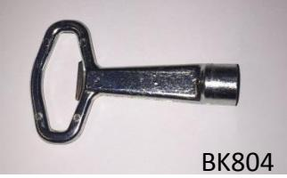
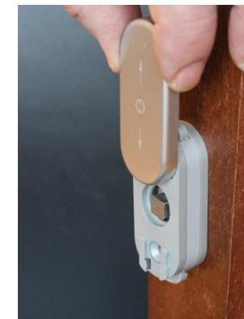
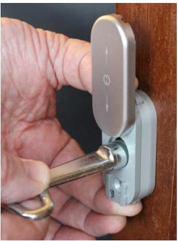
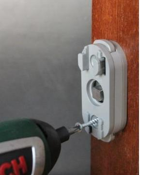
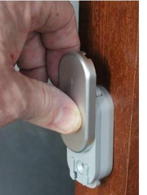
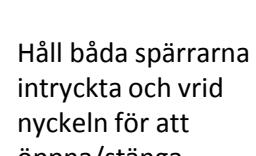

# **Säkerhetsanordning BK805**

#### **Användning**

Säkerhetsanordning BK805 används istället för handtag på inåtgående fönster/fönsterdörr med spanjolett, där barnsäkerhet eller skydd mot otillåten öppning önskas. T.ex. i trapphus, korridorer, sjukhus, förskolor etc.

### **Egenskaper**

BK805 har Kisi 2:s funktion (typgodkänd som barnskyddande spärranordning, SITAC 0252/07) och manövreras med fyrkantnyckel. Levereras med 7 eller 8 mm fyrkantsprint, längd 70 mm.

### **Material**

Zamak och nylon samt täckbricka av aluminium

**Ytbehandling**  Aluminium, silver F1 eller vitlackad

**Tillbehör**  Fyrkantnyckel BK804

## **Montering och användning**

Skruva fast spärrhuset med fyrkantsprinten på bågen Placera täckbrickan i rätt läge och tryck fast

Skjut täckbrickan uppåt

Håll båda spärrarna intryckta och vrid nyckeln för att öppna/stänga

BK805

**Beslagskonsult AB**  Uggledalsvägen 45, S-427 40 Billdal Tel. +46 (0) 31 91 40 30, Fax. +46 (0) 31 91 40 31 E-mail:info@beslagskonsult.se, www.beslagskonsult.se SE-banken, Göteborg, Konto nr.: 5016-10 099 56, Bankgiro: 5744-1511, Postgiro: 24 41 47-5, Org. Nr.: 556407-9506

