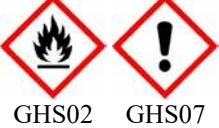

*Datum för utskriften: 28.05.2015 Versionsnummer 3 Omarbetad: 28.05.2015*

** AVSNITT 1: Namnet på ämnet/blandningen och bolaget/företaget*

*· 1.1 Produktbeteckning*

*· Handelsnamn: Interflon Fin Super (aerosol)*

- *· 1.2 Relevanta identifierade användningar av ämnet eller blandningen och användningar som det avråds från*
*Ingen ytterligare relevant information finns till förfogande.*

- *· Ämnets användning / tillredningen Smörjmedel/ smörjämnen*
- *· 1.3 Närmare upplysningar om den som tillhandahåller säkerhetsdatablad*

*· Tillverkare/leverantör: Interflon b.v. P.O. Box 1070 NL-4700 BB Roosendaal The Netherlands Tel: +31(0)165.55.39.11 Email: service@interflon.com www.interflon.com*

*Interflon Sweden AB Steningevägen 3 120 39 Arsta Sweden Tel: (46) 720 480 644*

*· Område där upplysningar kan inhämtas: Product safety department · 1.4 Telefonnummer för nödsituationer: Giftinformationscentralen: 112 – begär Giftinformation*

- *Tel: +31 (0)165 55 39 11 (Monday to Friday from 8:30am to 17:00pm)*
# ** AVSNITT 2: Farliga egenskaper*

# *· 2.1 Klassificering av ämnet eller blandningen · Klassificering enligt förordning (EG) nr 1272/2008 Flam. Aerosol 1 H222-H229 Extremt brandfarlig aerosol. Tryckbehållare: Kan sprängas vid uppvärmning. Eye Irrit. 2 H319 Orsakar allvarlig ögonirritation. Asp. Tox. 1 H304 Kan vara dödligt vid förtäring om det kommer ner i luftvägarna.*

*· 2.2 Märkningsuppgifter*

*· Märkning enligt förordning (EG) nr 1272/2008*

*Produkten är klassificerad och märkt enligt CLP-förordningen.*

*· Farosymboler*

*· Signalord Fara*

*· Riskbestämmande komponenter för etikettering:*

*Hydrocarbons, C11-C14, n-alkanes, isoalkanes, cyclics, < 2% aromatics (Nota P, -R45, <0,1% benzene) Hydrocarbons, C10-C13, n-alkanes, isoalkanes, cyclics, < 2% aromatics (Nota P, -R45, <0,1% benzene) White mineral oil (petroleum)*

*· Faroangivelser*

40.1.3

*H222-H229 Extremt brandfarlig aerosol. Tryckbehållare: Kan sprängas vid uppvärmning. H319 Orsakar allvarlig ögonirritation.*

(Fortsättning på sida 2)

SE

SE

# *Säkerhetsdatablad Enligt 1907/2006/EG, Artikel 31*

### *Handelsnamn: Interflon Fin Super (aerosol)*

(Fortsättning från sida 1)

*· Skyddsangivelser P210 Får inte utsättas för värme, heta ytor, gnistor, öppen låga eller andra antändningskällor. Rökning förbjuden.*

*P251 Får inte punkteras eller brännas, gäller även tömd behållare.*

*P211 Spreja inte över öppen låga eller andra antändningskällor.*

*P280 Använd skyddshandskar / ögonskydd / ansiktsskydd.*

*P333+P313 Vid hudirritation eller utslag: Sök läkarhjälp.*

*P337+P313 Vid bestående ögonirritation: Sök läkarhjälp.*

*P410+P412 Skyddas från solljus. Får inte utsättas för temperaturer över 50 °C/122 °F.*

#### *· Ytterligare uppgifter:*

*EUH066 Upprepad kontakt kan ge torr hud eller hudsprickor.*

*Tryckbehållare. Får ej utsättas för direkt solljus och temperaturer över + 50°C. Får ej punkteras eller brännas. Gäller även tömd behållare.*

*Spraya inte mot öppen låga eller glödande material. Förvaras åtskilt från antändningskällor - Rök inte.*

- *· 2.3 Andra faror*
### *· Resultat av PBT- och vPvB-bedömningen*

*· PBT: Ämnet uppfyller inte kriterierna för PBT enligt förordningen (EG) nr 1907/2006, bilaga XIII.*

*· vPvB: Ämnet uppfyller inte kriterierna för vPvB enligt förordningen (EG) nr 1907/2006, bilaga XIII.*

## ** AVSNITT 3: Sammansättning/information om beståndsdelar*

#### *· 3.2 Blandningar*

#### *· Beskrivning:*

40.1.3

*Blandning av mineral- och vegetabilska oljor, lösningsmedel, tillsatser och Teflon®. Drivmedel; propan, butan och butan.*

| · Farliga ingredienser:   |                                                                                     |                          |
|---------------------------|-------------------------------------------------------------------------------------|--------------------------|
| EG-nummer: 926-141-6      | Hydrocarbons, C11-C14, n-alkanes, isoalkanes, cyclics, < 2%                         | 25-50%                   |
| Reg.nr.: 01-2119456620-43 | aromatics (Nota P, -R45, <0,1% benzene)                                             |                          |
|                           | Asp. Tox. 1, H304                                                                   |                          |
| CAS: 106-97-8             | butan (Nota K, <0,1% 1,3-butadien)                                                  | 10-25%                   |
| EINECS: 203-448-7         | Flam. Gas 1, H220; Press. Gas C, H280                                               |                          |
| CAS: 74-98-6              | propan                                                                              | 10-25%                   |
| EINECS: 200-827-9         | Flam. Gas 1, H220; Press. Gas C, H280                                               |                          |
| Reg.nr.: 01-2119486944-21 |                                                                                     |                          |
| EG-nummer: 918-481-9      | Hydrocarbons, C10-C13, n-alkanes, isoalkanes, cyclics, < 2%                         | 10-25%                   |
| Reg.nr.: 01-2119457273-39 | aromatics (Nota P, -R45, <0,1% benzene)                                             |                          |
|                           | Asp. Tox. 1, H304                                                                   |                          |
| CAS: 8042-47-5            | White mineral oil (petroleum)                                                       | 10-25%                   |
| EINECS: 232-455-8         | Asp. Tox. 1, H304                                                                   |                          |
| Reg.nr.: 01-2119487078-27 |                                                                                     |                          |
| CAS: 75-28-5              | isobutan (Nota K, <0,1% 1,3-butadien)                                               | 2,5-10%                  |
| EINECS: 200-857-2         | Flam. Gas 1, H220; Press. Gas C, H280                                               |                          |
| CAS: 110-25-8             | (Z)-N-methyl-N-(1-oxo-9-octadecenyl)glycine                                         | 2,5% ≤                |
| EINECS: 203-749-3         | Eye Dam. 1, H318; Aquatic Acute 1, H400; Acute Tox. 4, H332; Skin                   |                          |
| Reg.nr.: 01-2119488991-20 | Irrit. 2, H315                                                                      |                          |
| CAS: 61790-85-0           | Amines, N-tallow alkyltrimethylenedi-, ethoxylated                                  | 2,5% ≤                |
| NLP: 500-149-6            | Skin Corr. 1B, H314; Aquatic Acute 1, H400; Acute Tox. 4, H302                      |                          |
| CAS: 9046-09-7            | Polyethylene glycol mono tributylphenyl ether                                       | 2,5% ≤                |
|                           | Aquatic Chronic 2, H411; Skin Irrit. 2, H315; Eye Irrit. 2, H319                    |                          |
|                           | Long-chain alkenyl amine                                                            | 2,5% ≤                |
|                           | Skin Corr. 1A, H314; Eye Dam. 1, H318; Aquatic Acute 1, H400; Acute Tox. 4, H302 |                          |
|                           |                                                                                     | (Fortsättning på sida 3) |

*Datum för utskriften: 28.05.2015 Versionsnummer 3 Omarbetad: 28.05.2015*

## *Handelsnamn: Interflon Fin Super (aerosol)*

(Fortsättning från sida 2)

*· SVHC Produkten innehåller inte "särskilt farliga" (SVHC) som är mycket farliga för människors hälsa eller miljön. (SVHC <0,1% (g/g) Förordning (EG) nr 1907/2006 (REACH), artikel 57).*

#### *· Ytterligare hänvisningar:*

*Notera; EC nummer som börjar på "9" i EC kolumnen ovan är provisoriska nummer ifrån ECHA i avvaktan på en officiell publicering i "EC Inventory Number" för ämnen. Se avsnitt 16 för information om CAS nummer.*

*De angivna farohänvisningarnas ordalydelse framgår av kapitel 16.*

## ** AVSNITT 4: Åtgärder vid första hjälpen*

- *· 4.1 Beskrivning av åtgärder vid första hjälpen*
- *· Vid inandning: Tillförsel av friskluft, vid besvär kontakta läkare.*
- *· Vid kontakt med huden: I allmänhet har produkten ingen retande effekt på huden.*
- *· Vid kontakt med ögonen:*

*Skölj ögonen öppna i flera minuter under rinnande vatten. Vid ihållande besvär kontakta läkare.*

- *· Vid förtäring: Vid ihållande besvär kontakta läkare.*
- *· 4.2 De viktigaste symptomen och effekterna, både akuta och fördröjda*
- *Ingen ytterligare relevant information finns till förfogande.*
- *· 4.3 Angivande av omedelbar medicinsk behandling och särskild behandling som eventuellt krävs*

*Ingen ytterligare relevant information finns till förfogande.*

## ** AVSNITT 5: Brandbekämpningsåtgärder*

#### *· 5.1 Släckmedel*

- *· Lämpliga släckningsmedel:*
- *Anpassa brandbekämpningsåtgärderna till omgivningen.*

*CO2, sand, släckningspulver, vattendimma.*

*Skum*

40.1.3

- *· Släckningsmedel som är olämpliga av säkerhetsskäl: Vatten med full stråle*
- *· 5.2 Särskilda faror som ämnet eller blandningen kan medföra Vid uppvärmning eller brand - möjlig bildning av giftiga gaser. Kolmonoxid (CO)*

*Vätefluorid och fluor sammansättningar.*

- *· 5.3 Råd till brandbekämpningspersonal*
- *· Speciell skyddsutrustning:*

*Bär andningsskyddsapparat som är oberoende av omgivningsluften.*

*Använd personlig skyddsutrustning.*

# ** AVSNITT 6: Åtgärder vid oavsiktliga utsläpp*

*· 6.1 Personliga skyddsåtgärder, skyddsutrustning och åtgärder vid nödsituationer Bär skyddsutrustning. Håll oskyddade personer på avstånd. Särskild risk för halka pga utrinnande/utspilld produkt. · 6.2 Miljöskyddsåtgärder: Hindra den från att tränga ner i avloppsnätet/ytvatten/grundvatten. · 6.3 Metoder och material för inneslutning och sanering: Skaffa bort förorenat material som avfall enligt punkt 13. Se till att ventilationen är tillräcklig. Ta bort översjutande med alkaliska tvättmedel. · 6.4 Hänvisning till andra avsnitt Informationer beträffande säker hantering se kapitel 7. Informationer beträffande den personliga skyddsutrustningen se kapitel 8.*

*Datum för utskriften: 28.05.2015 Versionsnummer 3 Omarbetad: 28.05.2015*

*Datum för utskriften: 28.05.2015 Versionsnummer 3 Omarbetad: 28.05.2015*

(Fortsättning från sida 3)

#### *Handelsnamn: Interflon Fin Super (aerosol)*

*Informationer beträffande avfallshantering se kapitel 13.*

## ** AVSNITT 7: Hantering och lagring*

- *· 7.1 Försiktighetsmått för säker hantering Sörj för god ventilation / utsug på arbetsplatsen. · Hänvisningar beträffande brand- och explosionsskydd:*
- *Spraya inte i lågor eller på glödande föremål.*
- *Håll borta tändkällor rök ej.*

*Obs: Behållaren står under tryck. Skydda mot solstrålning och temperaturer över 50 °C. Får ej öppnas våldsamt eller förbrännas efter användning.*

*· 7.2 Förhållanden för säker lagring, inklusive eventuell oförenlighet*

*· Lagring:*

- *· Krav på lagerutrymmen och behållare:*
*Lagras svalt.*

*Myndigheternas föreskrifter beträffande lagring av tryckgasförpackningar skall iakttas.*

*· Hänvisningar beträffande sammanlagring: Erfordras ej.*

*· Ytterligare uppgifter till lagringsvillkoren:*

*Skydda mot värme och direkt solstrålning.*

*Förvaras på kall och torr plats.*

*· 7.3 Specifik slutanvändning Ingen ytterligare relevant information finns till förfogande.*

## ** AVSNITT 8: Begränsning av exponeringen/personligt skydd*

*· Ytterligare hänvisningar beträffande utformning av tekniska anläggningar: Inga vidare uppgifter, se punkt 7.*

*· 8.1 Kontrollparametrar*

- *· Ämnen med yrkashygieniska gränsvärden som bör övervakas:*
*Produkten innehåller inga relevanta mängder av ämnen med arbetsplatsrelaterade gränsvärden som skall övervakas.*

*· Ytterligare hänvisningar: Som basis tjänade de vid utarbetningen gällande listorna.*

- *· 8.2 Begränsning av exponeringen*
- *· Personlig skyddsutrustning:*
- *· Allmänna skydds- och hygienåtgärder:*
- *Sedvanliga försiktighetsåtgärder vid hantering av kemikalier skall iakttas.*

*Undvik kontakt med livsmedel, drycker och fodermedel.*

*Nedsmutsade, indränkta klädesplagg skall omedelbart tas av.*

*Undvik kontakt med ögonen och huden.*

*Gaser/ångor/aerosoler skall ej andas in.*

*Tvätta händerna inför raster och vid arbetets slut.*

- *Ät, drick, rök och snusa ej vid arbetet.*
#### *· Andningsskydd:*

*Inandas inte ångor eller dimmor. Ventilation eller utsugning.*

*Vid otillräcklig ventilation andningsskydd.*

*· Handskydd:*

40.1.3

*Vid långvarig eller upprepad hudkontakt använd skyddshandskar.*

*Inga rekommendationer kan ges beträffande handskmaterialet för produkten / tillredningen / kemikalieblandningen då inga tester genomfördes.*

*Val av handskmaterial under iakttagande av penetrationstider, permeationskvoter och degradation.*

*Datum för utskriften: 28.05.2015 Versionsnummer 3 Omarbetad: 28.05.2015*

*Handelsnamn: Interflon Fin Super (aerosol)*

(Fortsättning från sida 4)

#### *· Handskmaterial*

*Val av lämpliga handskar är inte enbart beroende av materialet utan även av andra kvalitetskriterier och är olika från tillverkare till tillverkare. Då produkten är en tillredning av flera substanser, kan handskmaterialets beständighet inte förutses och måste därför kontrolleras före användningen. Baserad på praktiska erfarenheter ger hanskar av nitril tillräklig skydd. Handsktjocklek: 0,13 mm*

*Genombrottstid: > 15 minuter*

*· Handskmaterialets penetreringstid Penetrationstider bestäms inte med EN 374 del 3.*

*· Ögonskydd:*

40.1.3

*Tättslutande skyddsglasögon (EN166)*

*· Kroppsskydd: Arbetsskyddsdräkt (EN340)*

# ** AVSNITT 9: Fysikaliska och kemiska egenskaper*

| · Allmänna uppgifter                                | · 9.1 Information om grundläggande fysikaliska och kemiska egenskaper                                   |
|-----------------------------------------------------|---------------------------------------------------------------------------------------------------------|
| · Utseende:                                         |                                                                                                         |
| Form:                                               | Aerosol                                                                                                 |
| Färg:                                               | Gulbrun                                                                                                 |
| · Lukt:                                             | Oljigt                                                                                                  |
| · Lukttröskel:                                      | Ej bestämd.                                                                                             |
| · pH-värde:                                         | Ej användbar.                                                                                           |
| · Tillståndsändring Smältpunkt/smältområde:      | Ej användbar.                                                                                           |
| Kokpunkt / kokområde:                               | < 0 °C                                                                                                  |
| · Flampunkt:                                        | < -60 °C                                                                                                |
| · Lättantändlighet (fast, gasformig): Brandfarligt. |                                                                                                         |
| · Tändtemperatur:                                   | Ej bestämd.                                                                                             |
| · Upplösningstemperatur:                            | Ej bestämd.                                                                                             |
| · Självantändbarhet:                                | Produkten är ej självantändande.                                                                        |
| · Explosionsfara:                                   | Produkten är ej explosionsfarlig, men bildning av explosionsfarliga ånga/luft-blandningar är möjlig. |
| · Explosionsgränser:                                |                                                                                                         |
| Nedre:                                              | 0,6 Vol %                                                                                               |
| Övre:                                               | 10,0 Vol %                                                                                              |
| · Ångtryck vid 20 °C:                               | 4200 hPa                                                                                                |
| · Densitet vid 20 °C:                               | 0,71 g/cm³                                                                                              |
| · Relativ densitet                                  | Ej bestämd.                                                                                             |
| · Ångdensitet vid 20 °C                             | 1,6 - 2,0 g/cm³                                                                                         |
| · Förångningshastighet                              | Ej användbar.                                                                                           |
|                                                     | (Fortsättning på sida 6)                                                                                |
|                                                     | SE                                                                                                      |

*Datum för utskriften: 28.05.2015 Versionsnummer 3 Omarbetad: 28.05.2015*

## *Handelsnamn: Interflon Fin Super (aerosol)*

|                                            | (Fortsättning från sida 5)                                    |
|--------------------------------------------|---------------------------------------------------------------|
| · Löslighet i / blandbarhet med vatten: | Ej resp. föga blandbar.                                       |
| · Viskositet:                              |                                                               |
| Dynamisk:                                  | Ej bestämd.                                                   |
| Kinematisk:                                | Ej bestämd.                                                   |
| · 9.2 Annan information                    | Ingen ytterligare relevant information finns till förfogande. |
|                                            |                                                               |

# ** AVSNITT 10: Stabilitet och reaktivitet*

- *· 10.1 Reaktivitet*
### *· 10.2 Kemisk stabilitet*

- *· Termiskt sönderdelning / förhållanden som bör undvikas:*
- *För att undgå termisk upplösning skall överhettning undvikas.*
- *Konditioner att undvika: solsken, temperaturer över 50ºC, öppen eld, trasiga behållare.*
- *· 10.3 Risken för farliga reaktioner Inga farliga reaktioner kända.*
- *· 10.4 Förhållanden som ska undvikas Ingen ytterligare relevant information finns till förfogande.*
- *· 10.5 Oförenliga material: Starkt oxiderande.*
- *· 10.6 Farliga sönderdelningsprodukter:*

*Kemisk monoxide och delvis förbrända carbohydrat kan förångas genom termisk upplösning. Fluorföreningen kan frigöras från 400 grader C.*

# ** AVSNITT 11: Toxikologisk information*

- *· 11.1 Information om de toxikologiska effekterna*
- *· Akut toxicitet: Ingen ytterligare relevant information finns till förfogande.*

*· Klassificeringsrelevanta LD/LC50-värden:*

*Hydrocarbons, C11-C14, n-alkanes, isoalkanes, cyclics, < 2% aromatics (Nota P, -R45, <0,1% benzene)*

*Oral LD50 >5000 mg/kg (rat)*

*Dermal LD50 >5000 mg/kg (rabbit)*

*Hydrocarbons, C10-C13, n-alkanes, isoalkanes, cyclics, < 2% aromatics (Nota P, -R45, <0,1% benzene)*

## *Oral LD50 >5000 mg/kg (rat)*

*Dermal LD50 >5000 mg/kg (rabbit)*

- *· Primär retningseffekt:*
*· på huden: Ingen retande effekt.*

*· på ögat: Orsakar allvarlig ögonirritation.*

- *· Sensibilisering: Ingen sensibiliserande effekt känd.*
- *· Subakut till kronisk toxicitet: Ingen ytterligare relevant information finns till förfogande.*

*· Ytterligare toxikologiska hänvisningar:*

*Med hänsyn till beräkningsförfarandet av EG's Allmänna klassificeringsriktlinjer för tillredningar i den slutgiltiga versionen uppvisar produkten följande risker:*

*Ångorna kan förorsaka influensaliknande feber specielt vid rökning.*

*· CMR-effekter (cancerframkallande, mutagena och reproduktionstoxiska egenskaper)*

*Produkten uppfyller inte kriterierna för CMR (cancerframkallande, mutagena, reproduktionstoxiska effekter).*

# *AVSNITT 12: Ekologisk information*

- *· 12.1 Toxicitet*
40.1.3

- *· Akvatisk toxicitet: Ingen ytterligare relevant information finns till förfogande.*
*· 12.2 Persistens och nedbrytbarhet Ingen ytterligare relevant information finns till förfogande.*

(Fortsättning på sida 7)

SE

# *Säkerhetsdatablad Enligt 1907/2006/EG, Artikel 31*

#### *Handelsnamn: Interflon Fin Super (aerosol)*

- (Fortsättning från sida 6) *· 12.3 Bioackumuleringsförmåga Ingen ytterligare relevant information finns till förfogande.*
- *· 12.4 Rörligheten i jord Ingen ytterligare relevant information finns till förfogande.*
- *· Ytterligare ekologiska hänvisningar:*

*· Allmänna hänvisningar:*

*Låt ej tränga ner i grundvatten, vattendrag eller i avloppsnätet i outspätt tillstånd resp. i större mängder.*

- *· 12.5 Resultat av PBT- och vPvB-bedömningen*
- *· PBT: Ämnet uppfyller inte kriterierna för PBT enligt förordningen (EG) nr 1907/2006, bilaga XIII.*
- *· vPvB: Ämnet uppfyller inte kriterierna för vPvB enligt förordningen (EG) nr 1907/2006, bilaga XIII.*
- *· 12.6 Andra skadliga effekter Ingen ytterligare relevant information finns till förfogande.*

** AVSNITT 13: Avfallshantering*

- *· 13.1 Avfallsbehandlingsmetoder*
*· Rekommendation: Får ej skaffas bort ihop med hushållsavfall. Låt ej komma in i avloppsnäteten.*

#### *· Europeinska avfallskatalogen*

*13 02 05* Mineralbaserade icke-klorerade motor-, transmissions- och smörjoljor*

*16 05 04* Gaser i tryckbehållare (även haloner) som innehåller farliga ämnen*

*15 01 04 Metallförpackningar*

*· Ej rengjorda förpackningar:*

#### *· Rekommendation:*

40.1.3

*Innehållet / behållaren avfallshanteras enligt lokala / regionala / nationella / internationella föreskrifter.*

| · 14.1 FN-nummer · ADR, IMDG, IATA | UN1950              |  |
|---------------------------------------|---------------------|--|
| · 14.2 Officiell transportbenämning   |                     |  |
| · ADR                                 | 1950 AEROSOLER      |  |
| · IMDG                                | AEROSOLS            |  |
| · IATA                                | AEROSOLS, flammable |  |
| · 14.3 Faroklass för transport        |                     |  |
| · ADR                                 |                     |  |
| · Klass · Etikett                  | 2 5F Gaser 2.1   |  |
|                                       |                     |  |
| · IMDG, IATA                          |                     |  |
| · Class                               | 2.1                 |  |
| · Label                               | 2.1                 |  |
| · 14.4 Förpackningsgrupp              |                     |  |
| · ADR, IMDG, IATA                     | Bortfaller          |  |

*Datum för utskriften: 28.05.2015 Versionsnummer 3 Omarbetad: 28.05.2015*

*Datum för utskriften: 28.05.2015 Versionsnummer 3 Omarbetad: 28.05.2015*

#### *Handelsnamn: Interflon Fin Super (aerosol)*

|                                                   | (Fortsättning från sida 7) |
|---------------------------------------------------|----------------------------|
| · 14.5 Miljöfaror:                                |                            |
| · Marine pollutant:                               | Nej                        |
| · 14.6 Särskilda försiktighetsåtgärder            | Varning: Gaser             |
| · Kemler-tal:                                     | -                          |
| · EMS-nummer:                                     | F-D,S-U                    |
| · 14.7 Bulktransport enligt bilaga II till MARPOL |                            |
| 73/78 och IBC-koden                               | Ej användbar.              |
| · Transport / ytterligare uppgifter:              |                            |
| · ADR                                             |                            |
| · Begränsade mängder (LQ)                         | 1L                         |
| · Transportkategori                               | 2                          |
| · Tunnelrestriktionskod                           | D                          |
| · UN "Model Regulation":                          | UN1950, AEROSOLER, 2.1     |

# ** AVSNITT 15: Gällande föreskrifter*

*· 15.1 Föreskrifter/lagstiftning om ämnet eller blandningen när det gäller säkerhet, hälsa och miljö*

*· Nationella föreskrifter:*

*· Vattenförorening - riskklass: WGK 1 (Självklassificering): liten risk för vattenförorening.*

- *· 15.2 Kemikaliesäkerhetsbedömning: En kemikaliesäkerhetsbedömning har ej gjorts.*
## ** AVSNITT 16: Annan information*

*Uppgifterna stödjer sig på våra aktuella kunskaper. De representerar emellertid ingen som helst garanti beträffande produktegenskaper och utgör ingen grund för ett avtalat rättsförhållande.*

*Följande ämne(n) i denna produkt har ett CAS identifieringsnummer som används för de länder som inte ligger under REACH.*

*Hydrocarbons, C10-C13, n-alkanes, isoalkanes, cyclics, < 2% aromatics: CAS 64742-48-9 Hydrocarbons, C11-C14, n-alkanes, isoalkanes, cyclics, < 2% aromatics: CAS 64742-47-8*

#### *· Relevanta fraser*

*H220 Extremt brandfarlig gas. H280 Innehåller gas under tryck. Kan explodera vid uppvärmning. H302 Skadligt vid förtäring. H304 Kan vara dödligt vid förtäring om det kommer ner i luftvägarna. H314 Orsakar allvarliga frätskador på hud och ögon. H315 Irriterar huden. H318 Orsakar allvarliga ögonskador. H319 Orsakar allvarlig ögonirritation. H332 Skadligt vid inandning. H400 Mycket giftigt för vattenlevande organismer. H411 Giftigt för vattenlevande organismer med långtidseffekter. · Område som utfärdar datainstruktionsblad: Product safety department. · Tilltalspartner:*

*Head Laboratory Email: service@interflon.com*

40.1.3

*· Förkortningar och akronymer: ADR: Accord européen sur le transport des marchandises dangereuses par Route (European Agreement concerning the International Carriage of Dangerous Goods by Road)*

(Fortsättning på sida 9)

SE

40.1.3

*Datum för utskriften: 28.05.2015 Versionsnummer 3 Omarbetad: 28.05.2015*

# *Säkerhetsdatablad Enligt 1907/2006/EG, Artikel 31*

#### *Handelsnamn: Interflon Fin Super (aerosol)*

(Fortsättning från sida 8) *IMDG: International Maritime Code for Dangerous Goods IATA: International Air Transport Association GHS: Globally Harmonised System of Classification and Labelling of Chemicals EINECS: European Inventory of Existing Commercial Chemical Substances ELINCS: European List of Notified Chemical Substances CAS: Chemical Abstracts Service (division of the American Chemical Society) LC50: Lethal concentration, 50 percent LD50: Lethal dose, 50 percent PBT: Persistent, Bioaccumulative and Toxic SVHC: Substances of Very High Concern vPvB: very Persistent and very Bioaccumulative Flam. Gas 1: Flammable gases, Hazard Category 1 Flam. Aerosol 1: Flammable aerosols, Hazard Category 1 Press. Gas C: Gases under pressure: Compressed gas Acute Tox. 4: Acute toxicity, Hazard Category 4 Skin Corr. 1A: Skin corrosion/irritation, Hazard Category 1A Skin Corr. 1B: Skin corrosion/irritation, Hazard Category 1B Skin Irrit. 2: Skin corrosion/irritation, Hazard Category 2 Eye Dam. 1: Serious eye damage/eye irritation, Hazard Category 1 Eye Irrit. 2: Serious eye damage/eye irritation, Hazard Category 2 Asp. Tox. 1: Aspiration hazard, Hazard Category 1 Aquatic Acute 1: Hazardous to the aquatic environment - AcuteHazard, Category 1 Aquatic Chronic 2: Hazardous to the aquatic environment - Chronic Hazard, Category 2 · * Data ändrade gentemot föregående version*  SE