3.4 Byte av kretskortsenheter

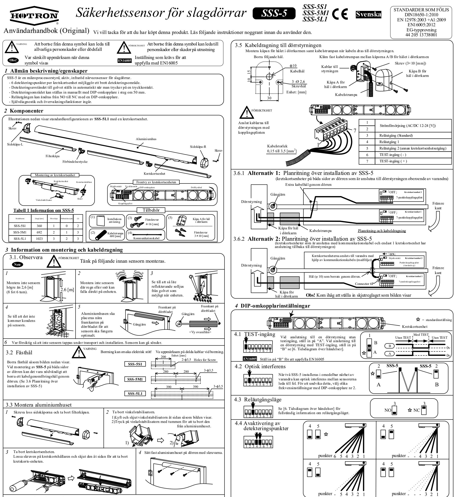

#### *5* **Inställning av detekteringsvinkel**

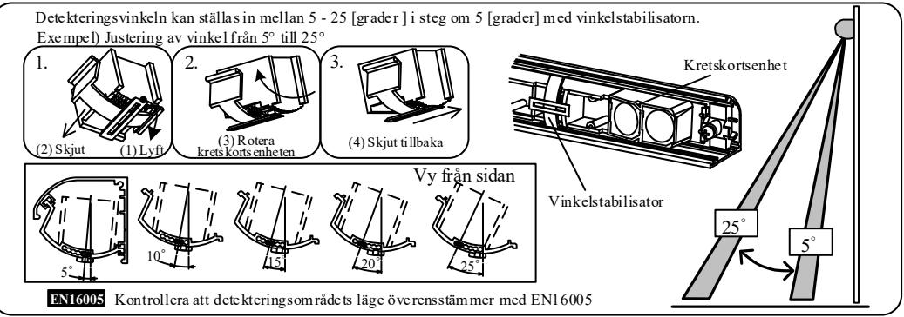

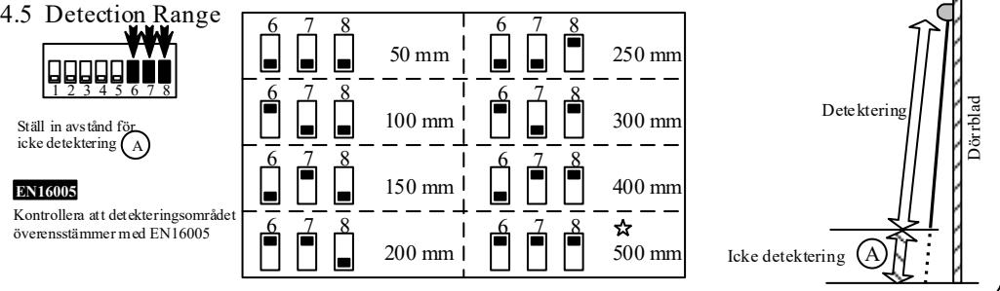

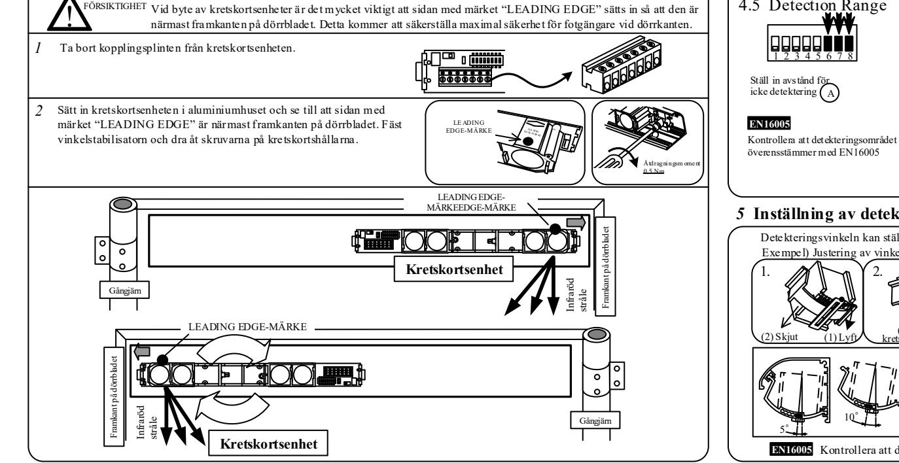

MP-10193-D '19.11

<Friskrivning> Tillverkaren kan inte hållas ansvarig för nedanstående.

- 1. Feltolkning av installationsanvisningarna, felaktig anslutning, vårdslöshet, modifiering av sensorn och felaktig installation.
- 2. Skador som orsakats av olämplig transport.
- 3. Olyckor eller skador som orsakats av brand, föroreningar, onormal spänning, jordbävning, åska, vind, översvämningar och force majeure.
- 4. Förluster av företagsvinster, affärsavbrott, affärsinformationsförluster och andra ekonomiska förluster som orsakats av användning av sensorn eller av att det är något fel på sensorn.
- 5. Kompensationsersättning kan aldrig överstiga försäljningspriset.

## *14* **Mått**

### *6* **Tidsdiagram över händelser**

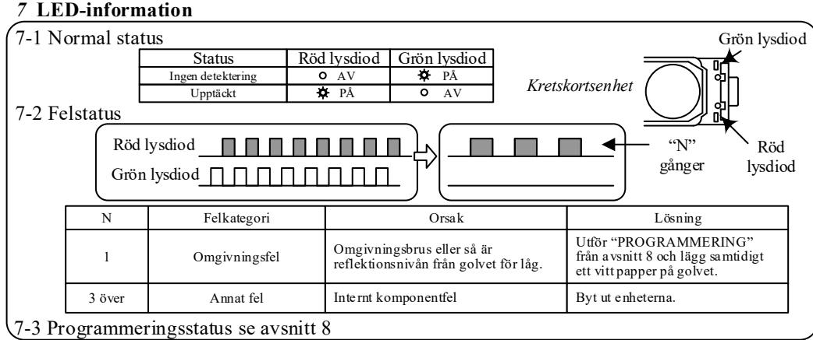

## *12* **Avslutande kontroll av detekteringsområde**

Efter att filterkåpan är monterad, kontrollera att detekteringsområdet är som förväntat och överensstämmer med lokala föreskrifter.

#### *13* **Tekniska data**

| MODELL                                                                     | Säkerhetssensor för slagdörrar  SSS-5                                                      |                                |                                                                                                  |  |  |  |
|----------------------------------------------------------------------------|--------------------------------------------------------------------------------------------|--------------------------------|--------------------------------------------------------------------------------------------------|--|--|--|
| TEKNIK                                                                     | KOMPLETT STATIONÄR DETEKTERING med PSD-AVSTÅNDSMÄTNING                                     |                                |                                                                                                  |  |  |  |
| STRÖMFÖRSÖRJNING                                                           | AC/DC – [V] ±10 %                                                                          | INSTÄLLNING AV STRÅLVINKELN | 5, 10, 15, 20, 25 [grader]                                                                       |  |  |  |
|                                                                            |                                                                                            | RESPONSTID                     | MINDRE ÄN 100 [ms]                                                                               |  |  |  |
| STRÖMFÖRBRUKNING                                                           | 95 [mA] @ DC 12 [V] 55 [mA] @ DC 24 [V] 1,7 [VA] @ AC 12 [V] 2,3 [VA] @ AC 24 [V] | DIP                            | TESTINGÅNG: 1 [BIT] OPTISK INTEFERENS: 1 [BIT] RELÄUTGÅNGSLÄGE: 1 [BIT] AVAKTIVERING AV |  |  |  |
| OPTORELÄ 1A (INGEN POL) RELÄUTGÅNG DC 50 [V] 0,1 [A] (MOTSTÅNDSLAST) |                                                                                            | OMKOPPLARFUNKTIONER            | DETEKTERINGSPUNKTER: 2 [BIT] DETEKTERINGSOMRÅDE: 3 [BIT]                                      |  |  |  |
| TESTINGÅNG                                                                 | 6 [mA] max vid 24 [VDC]                                                                    | DRIFTTEMPERATUR                | - – [°C]                                                                                      |  |  |  |
| MONTERINGSHÖJD                                                             | 2,6 [m] max                                                                                |                                | SSS-5S1: 350 [g] CIRKA                                                                           |  |  |  |
| DETEKTERINGSOMRÅDE                                                         | 0-2,55 [m] max                                                                             | VIKT                           | SSS-5M1: 540 [g] CIRKA SSS-5L1: 760 [g] CIRKA                                                 |  |  |  |

#### *8* **Programmering**

## **9 Detekteringsområde**

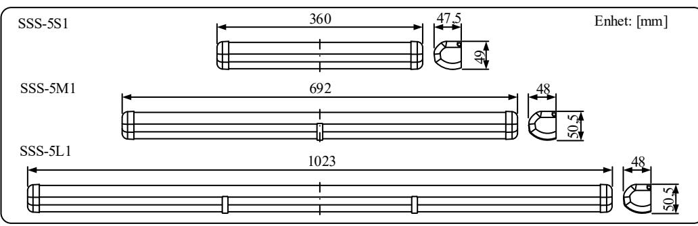

### *10* **Kontroll av detekteringsområdet utan filterkåpa**

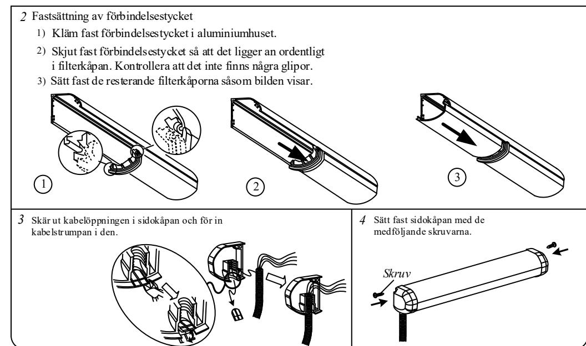

Kontrollera detekteringsområdet utan monterad filterkåpa. Sätt ett testföremål i detekteringsområdet för att kontrollera detekteringsmönstret och andra DIPomkopplarinställningar. Tester i enlighet med lokala standarder bör genomföras.

#### **Stäng av strömmen efter kontrollen.**

| へ    |  |
|------|--|
| ←    |  |
|      |  |
| OF O |  |

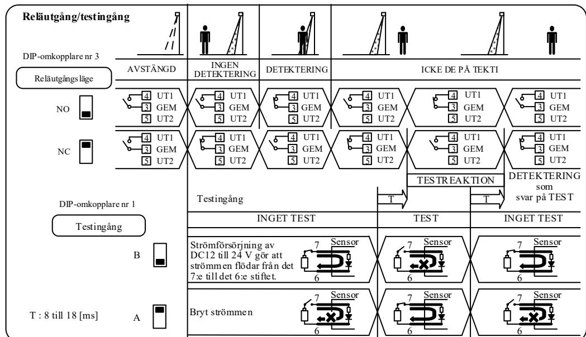

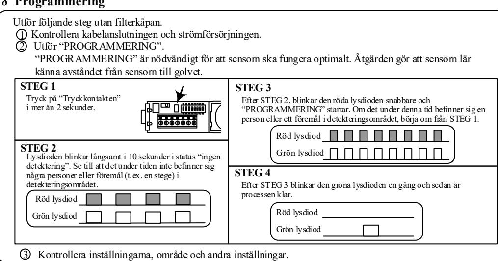

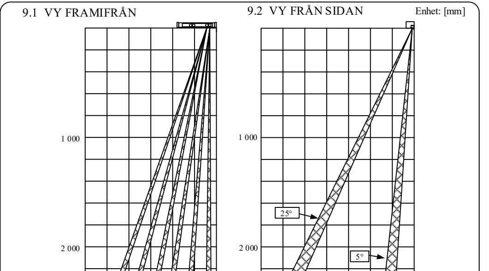

Gå till avsnitt 11 när testet är slutfört för att montera filterkåpan och sidokåporna. Om ett fel uppstår, kontrollera inställningarna som gjordes i avsnitt 3 igen. **EN16005** Kontrollera att detekteringsområdets läge överensstämmer med EN16005

| Identifikationsnummer: 0044                                                                                                                                                             |                                                                                                                  |                                                                       |                                  |
|-----------------------------------------------------------------------------------------------------------------------------------------------------------------------------------------|------------------------------------------------------------------------------------------------------------------|-----------------------------------------------------------------------|----------------------------------|
| Sammanställare av teknisk dokumentation (Europeiska gemenskapen) David Morgan/Hotron Ireland Ltd. 26 Dublin Street, Carlow, Irland Ph: +353 5991 40345 Fax: +353 5991 40543 | Plats för försäkran (Tillverkare) Honda Electron Co., Ltd. 1-23-19 Asahi-Cho,Machida-City, Tokyo, Japan | Försäkran gjord av Teruya Morimoto Chef för kvalitetssäkring | Datum 30 September 2015 |

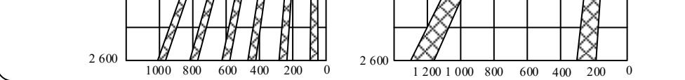

| Produktbeskrivning: SSS-5 Säkerhetssensor för slagdörrar. Komplett stationär detektering med PSD-avståndsmätning. |                                                                                                                                  |                                                                         |                                                                            |  |  |  |
|-------------------------------------------------------------------------------------------------------------------------|----------------------------------------------------------------------------------------------------------------------------------|-------------------------------------------------------------------------|----------------------------------------------------------------------------|--|--|--|
| Directives Fulfilled:                                                                                                   |                                                                                                                                  |                                                                         |                                                                            |  |  |  |
| DIREKTIV 2006/42/EC                                                                                                     | Maskindirektivet                                                                                                                 |                                                                         |                                                                            |  |  |  |
| DIN 18650-1:2010                                                                                                        | Motordrivna dörrar för persontrafik del 1: Produktkrav. Kapitel 5.7.4                                                            |                                                                         |                                                                            |  |  |  |
| EN12978:2003 +A1:2009                                                                                                   | Portar - Säkerhetsanordningar för maskindrivna portar - Krav och provningsmetoder.                                               |                                                                         |                                                                            |  |  |  |
| EN62061:2005                                                                                                            | Maskinsäkerhet - Funktionssäkerhet hos elektriska, elektroniska och programmerbara elektroniska säkerhetskritiska styrsystem. |                                                                         |                                                                            |  |  |  |
|                                                                                                                         | EN ISO 13849-1:2008 /AC:2009 Maskinsäkerhet - Säkerhetsrelaterade delar av styrsystem.                                           |                                                                         |                                                                            |  |  |  |
| EN 16005:2012                                                                                                           | Maskindrivna dörrar för persontrafik - Säkerhet vid användande - Krav och provningsmetoder.                                      |                                                                         |                                                                            |  |  |  |
| Kapitel 4.6.8 EG-typprovning nr 44 205 13738001                                                                         |                                                                                                                                  |                                                                         |                                                                            |  |  |  |
| Ovan nämnda EG-typdirektiv är certifierade av: TUV NORD CERT GmbH Langemarckstr.20 45141 Essen Tyskland           |                                                                                                                                  | Harmoniserade standarder som används: EN ISO 13849-1:2008/AC:2009 | Andra tekniska standarder som används: DIN 18650-1:2005 EN16005:2012 |  |  |  |

### *15. EG-FÖRSÄKRAN OM ÖVERENSSTÄMMELSE*

**EN16005** Kontrollera att detekteringsområdets läge överensstämmer med EN16005

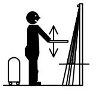

URL: http://www.hotron.com

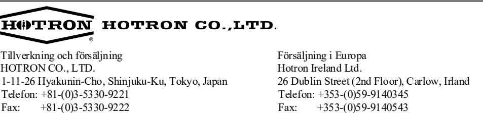

URL: http://www.hotron.com

# **11 Byte av filterkåpa och sidkåpa**

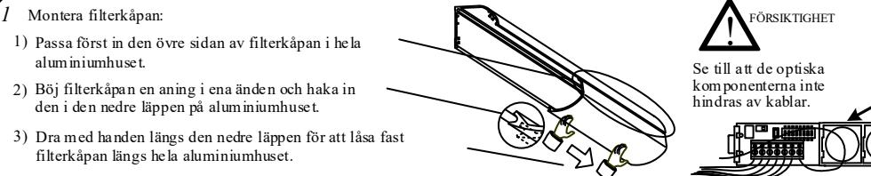

Montera filterkåpan:

- 1) Passa först in den övre sidan av filterkåpan i hela aluminiumhuset.
- Böj filterkåpan en aning i ena änden och haka in den i den nedre läppen på aluminiumhuset. 2)
- 3) Dra med handen längs den nedre läppen för att låsa fast filterkåpan längs hela aluminiumhuset.