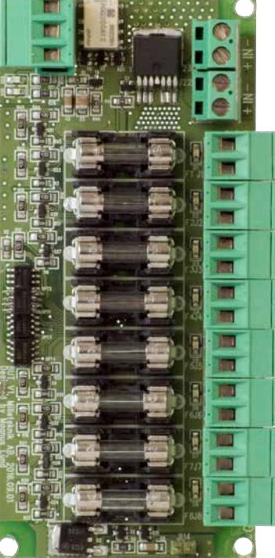

## T-8UT L

8 st 2-poligt avsäkrade ugångar. 1 st Larmutgång för utlöst lastsäkring. Levereras löst.

## Produktinformation

| Inställd tillåtna Lägsta/högsta systemspänning       | Nej     |
|------------------------------------------------------|---------|
| Inställd tillåtna lägsta/högsta lastström            | Nej     |
| Inställd tillåtna lägsta/högsta omgivningstemperatur | Nej     |
| Jordfel                                              | Nej     |
| Utlöst lastsäkring                                   | Nej     |
| Systemets aktuella spänning, min, max, medel         | Nej     |
| Systemets aktuella ström, min, max, medel            | Nej     |
| Systemets aktuella temperatur, min, max, medel       | Nej     |
| Systemets aktuella reservdriftstid                   | Nej     |
| Åskskydd / Överspänningsskydd                        | Nej     |
| 4 st avsäkrade utgångar                              | Ja      |
| 10 st avsäkrade utgångar                             | Ja      |
| Avsäkrade utgångar via C5A automatsäkringar          | Nej     |
| Avsäkrade utgångar via C10A automatsäkringar         | Nej     |
| 4 st avsäkrade/övervakade utgångar för larmdon       | Nej     |
| Spänningsomvandlare 24V till 12V/1A                  | Nej     |
| Spänningsomvandlare 24V till 12V/5A                  | Nej     |
| Ursprungsland                                        | Sweden  |
| Modulplats                                           | A       |
| Vikt (Kg)                                            | 0,2     |
| E-nummer                                             | 5213244 |

