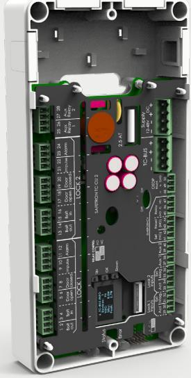
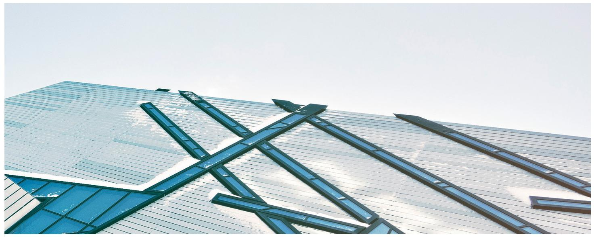
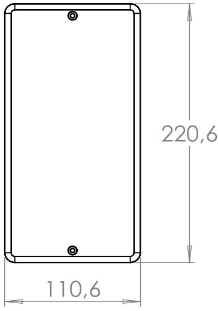
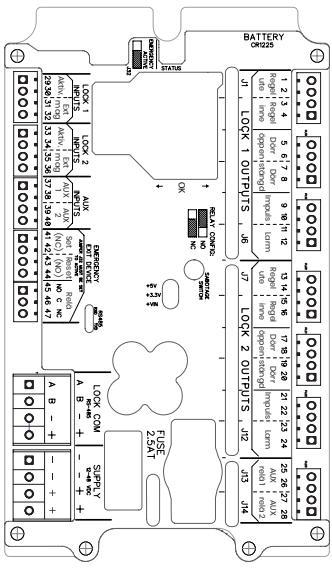

# **Nästa generationens styrenhet för motorlås i 6000-serien**

Styrenhet TC CU2 har marknadens bredaste användningsområde i en och samma styrenhet.

Nytt för TC CU2 är att två motorlås kan anslutas utan någon begränsning i signalutbyte, detta innebär att TC CU2 e!ektivt är två styrenheter i en. Nytt är också möjligheten att programmera AUX reläer för önskad funktion.

# **RS-485 BUS**

Styrenhet TC CU2 använder en 128-bitars kryptering för högsta säkerhet och tillåter kabellängder upp till 100 meter mellan motorlås och styrenhet. Detta innebär att styrenheten kan installeras i skyddade miljöer såsom elcentraler eller serverrum. Anslutningen sker via RS-485 genom protokollet OSDP.

### **Plug-and-play**

Styrenhet TC CU2 har automatisk avscanning vilket gör installationen plug-andplay. Ingen initiering krävs utan ihopparning mellan enheter sker automatiskt e"er 12h, då sätts också installationsdatum digitalt i enheterna från vilket garantitid börjar gälla.

### **Serieanslutning**

Möjlighet till att ansluta två motorlås till en TC CU2 finns. Använd två motorlås i samma eller i separata dörrar. Dedikerade reläavsnitt för lås 1 respektive lås 2. Vid installation av två motorlås ges möjlighet till samma signalutbyte.

# **Servicemodul**

Genom den navigeringsbara displayen når man servicemodulen där man ställer serviceintervall genom antal cykler och/eller datum. Indikation ges genom aktivering av larmrelä vid uppnått serviceintervall.

# SAFETRON TC CU2

#### **Navigerbar display**

TC CU2 är försedd med en navigeringsbar display där konfiguration, adressering samt informationshämtning sker. Installationen blir lättöverskådlig och värdefull tid sparas.

## **Egenskaper**

- 10-48 VDC
- RS-485 BUS teknik
- Programmeringsbara AUX-reläer (t.ex. dörrautomatikstyrning)
- Seriekoppling, upp till två motorlås mot TC CU2
- Automatisk initiering av enheter
- Varje reläutgång kan individuellt ställas NO eller NC via kortslutningsbygel
- Lysdiod på varje enskild reläutgång för indikering av aktivering
- Händelselogg
- Felkodshantering via display
- Servicemodul
- Klarar långa kabellängder, upp till 100 meter mellan låshus och styrenhet
- Låg strömförbrukning (>1W vid standby)
- Ihop med motorlås ur 6000 serien uppfylls SSF-3522 låsklass 3, 4 och 5

# **Tekniska data**

- Multispänning 10-48 VDC
- Strömförbrukning: 30mA @ 24VDC
- Arbetstemperatur -20°C till +40°C

| BENÄMNING       | PASSAR                 | ART NR    | E-NUMMER |
|-----------------|------------------------|-----------|----------|
| SAFETRON TC CU2 | Motorlås i 6000-serien | 202144727 | 5867682  |