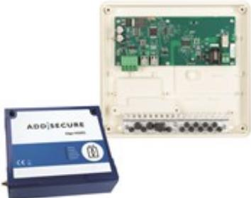

## TEL-50 GEN2 INTERCOM

Artikelnummer: 24090020, E-nummer: 5801491

Kommunikationspaket till RCO:s porttelefoner PA-519. Paketet inkluderar 1x TEL-50 GEN2 & 1x ADD Secure Intercom enhet med ett förinstallerat SIM kort vid leverans.

Intercom enheten skall kompletteras med ett abbonnemang som tecknas med ADD Secure.

I takt med att kopparnätet läggs ned har många porttelefonisystem istället kopplats upp mot telenätet via s.k. ATAboxar (Analog Telefoni Adapter). Dessa lösningar är ofta instabila, och de kan behöva omkonfigureras vid t.ex. strömavbrott. Kommunikationspaket PA-519 erbjuder en molnbaserad tjänst med digital kommunikation från porttelefon till den besöktes telefon.

Samtalet går via 4G och erbjuder tvåvägskommunikation av högsta talkvalitet. Terminalen – ansluts till porttelefonisystemet, digitaliserar den analoga talsignalen från porttelefonen och kopplar upp samtalet till ett valfritt fördefinierat telefonnummer via Connect molntjänst. Intercomenheten erbjuder 4 ingångar & 3 utgångar och matas med 10,5 till 28V DC.

| Ingångar:         | 1 ingång (dubbelbalanserad 2,2 Kohm)              |
|-------------------|---------------------------------------------------|
| Utgångar:         | 1 utgång (halvledarrelä, max 120mA)               |
| Kommunikation:    | Lokalbuss RS485, analogtelelinje,analogtljud-PA-X |
| Används för:      | Linjekort för analog till digital teleanslutning  |
| Matningsspänning: | 15-30V DC / 10,5-28V DC                           |
| Strömförbrukning: | Max 84mA / Max 500mA                              |
| Temperaturområde: | +5 till 35°C                                      |
| Mått (BxHxD):     | 200x150x50mm / 150x170x51mm                       |