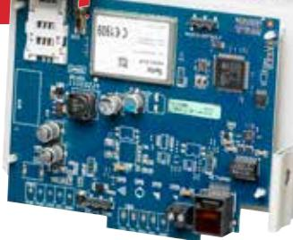

# PowerSeries Neo Internet and HSPA Dual-path Alarm Communicator

# TL2803G

## Features That Make a Difference:

- • Fully redundant Internet and Cellular dual-path alarm communication
- • Integrated call routing
- • Panel remote uploading/downloading support via Cellular and Internet
- • Supervision heartbeats via Cellular or Internet
- • 128-bit AES encryption via Cellular and Internet
- • Full event reporting
- • SIA and Contact ID protocol
- • SIM Card (included)
- • Remote activating and programming through C24 Communications
- • UL standard & encrypted line security
- • ULC passive or active line security levels
- • Active Cellular account is required to use Internet function
- • Antenna Extension Kits available: GS-15ANTQ, GS-25ANTQ, GS-50ANTQ
- • Signal strength and trouble display
- • PC-Link connection
- • Visual verification over Cellular or Internet
- • Communicator can be housed in separate cabinet using PCL-422 Communicator Remote Mounting Module
- • Command and Control via SMS
- • Compatible with HS2016/ HS2032/ HS2064/ HS2128 control panels
- • Compatible with Sur-Gard System I-IP/ II/III/IV/5 monitoring station receivers (System 5 required for Visual Verification)

### PowerSeries Neo is Security Redefined

PowerSeries Neo by DSC redefines intrusion security by combining the flexibility of a modular, hardwired system with the simplicity of a wide range of wireless devices and peripherals, resulting in the most comprehensive hybrid system available in the market today.

This brand new and exceptionally flexible platform leverages the superior capabilities of PowerG – the industry's leading-edge wireless intrusion technology. Innovative alarm verification solutions, together with an exceptionally comprehensive remote service software suite, make PowerSeries Neo the ideal first-class solution for residential and scalable commercial installations.

#### TL2803G Internet and HSPA Dual-path Alarm Communicator

The TL2803G Internet and HSPA Dual-Path Alarm Communicator is a complete, integrated communication solution by DSC, offering the next level in alarm signal delivery.

As traditional phone lines become less common and more users choose VoIP or mobile phones, it is essential to provide alternate methods of alarm communication. DSC's TL2803G Internet and HSPA Dual-Path Alarm Communicator conveniently utilizes the existing Internet connection and the Cellular connection to ensure high speed and reliable alarm communications making it an ideal solution for both residential and small-to-medium business environments.

When connected to a DSC HS2016/ HS2032/ HS2064/ HS2128 control panel, customers have the option to combine alarm reporting paths through Public Switched Telephone Network (PSTN), Internet and Cellular. The addition of Internet with Cellular back-up provides complete security and has the extra benefit of providing the opportunity for increased recurring monthly revenue (RMR) for dealers.

communications

#### False Alarm Reduction

PowerSeries Neo utilizes innovative, regionally compliant alarm verification solutions such as visual verification and sequential detection. PowerSeries Neo offers the TL2803G Internet and HSPA Dual-Path Alarm Communicator as a fundamental tool to deliver visual verification -- helping to reduce the high costs that can be incurred by false alarms and unnecessary site-checks while adding to the security professional's RMR.

#### Fully Redundant Alarm Communication at the Monitoring Station

When the TL2803G is connected to the DSC PowerSeries Neo HS2016/ HS2032/ HS2064/ HS2128 control panel, the alarm signal can be sent to either the primary receiver or to both the primary and backup receivers at the central monitoring station, providing a fully redundant solution.

#### Reduces Need for Dedicated Phone Lines or Concerns Over Internet Reliability

The TL2803G conveniently utilizes the existing Internet connection to reduce the need for dedicated phone lines and/or the impact of phone line interruption. The Cellular backup feature also eliminates any concerns about the disruption of the Internet service or equipment.

#### Control Panel Remote Programming & Management Support Saves Time and Money

The TL2803G offers full data reporting and remote management for installers, saving time and reducing costs. With the use of DSC's DLS5 Downloading Software, you can remotely program and configure the control panel, change user information, retrieve historical records, generate the status reports and maintenance details from a PC via the Internet or Cellular connection.

#### Encryption & Supervision Services Provide High Security & Increased RMR

With 128-bits AES encryption of the alarm signal, central stations, installers and customers can be assured that this is the most secure alarm communicator offered. And with programmable (by seconds) supervision heartbeats, the

communicator's availability is fully monitored. The Cellular back-up communication provides a complete, supervised link to the premises and the added benefit of opening increased revenue streams for dealers.

#### Shorter installation times with PC-Link & easy programming via C24 Communications

The TL2803G connects to the PC-Link connector on the HS2016/ HS2032/ HS2064/ HS2128 control panel, providing the Internet and Cellular connection to transmit events to the central monitoring station. For retrofit installations using the phone line, simply install this communicator to an already existing control panel and the service is instantly upgraded to a triple-path alarm communicator. Remote mounting is available for installations where the panel location does not provide acceptable cellular signal or easy access to an Internet connection.

Activating and initializing the TL2803G is done using the automated telephone activation system, mobile interface or via the C24 Communications website.

#### Compatibility

- Compatible with HS2016/ HS2032/ HS2064/ HS2128 control panels
- Compatible with Sur-Gard System I-IP/II/III/IV/5 monitoring station receivers (SG-System 5 required for Visual Verification)

#### Specifications

| Dimensions         | 5.875" W × 4.5" H (150mm × 115mm)        |
|-----------------------|------------------------------------------|
| Weight                | 0.683 lbs (310 g) (with mounting bracet) |
|                       | Current Draw 120 mA                   |
| Operating Environment |  5° to 40° C (40° to 104° F)          |

#### Approval Listings

FCC/IC, PTCRB, UL/ULC, NIST (AES Encryption Validation), CSFM, AT&T/ Rogers