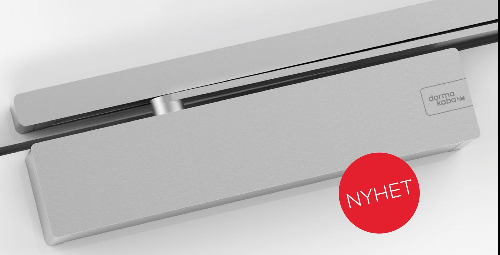
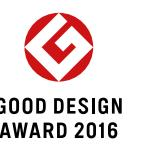
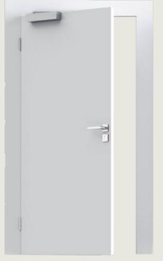
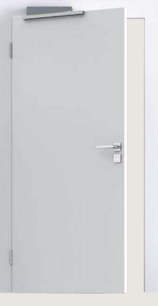
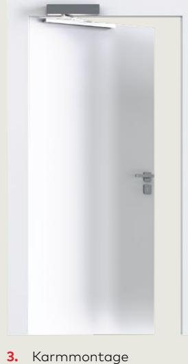
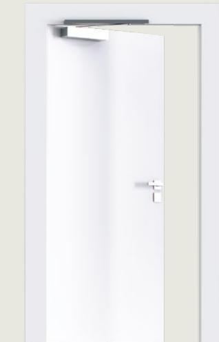
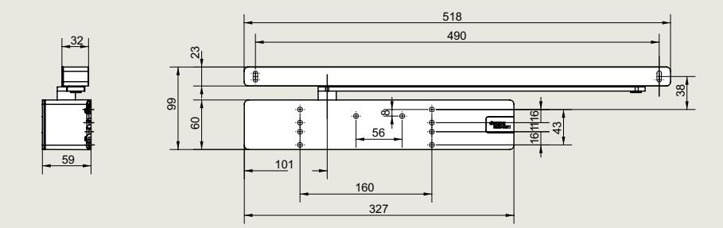
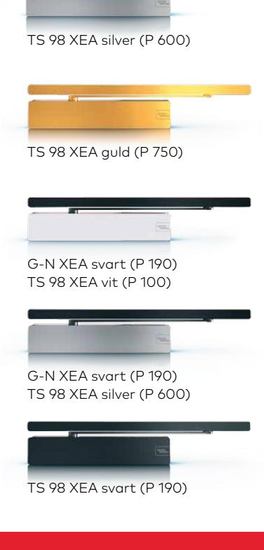

# **TS 98 XEA: license to close**

**Oavsett om TS 98 XEA är installerad i personligt inredda bostadsmiljöer eller moderna arbetsmiljöer, uppfyller den högt ställda krav på kvalitet, komfort och design.**

### **Förenar de bästa egenskaperna**

TS 98 XEA erbjuder optimal användarbekvämlighet för näst intill alla enkeloch dubbelflygliga dörrar, samtidigt som den imponerar med sin nya XEA-design och nya funktioner. Denna mångsidiga stängare kan monteras i

alla fyra installationstyper med samma dörrstängarhus och säkerställer en tyst passering med ett extra stängningsintervall. Den förblir helt opåverkad vid kyliga förhållanden, ner till –40° C.

- Stängningskraft med intervall för dörrbredder upp till 1 400 mm
- SoftFlow: tyst dörrstängning tack vare extra stängningsintervall
- Beprövad EASY OPEN-teknik ger hinderfri passering enligt de tyska industristandarderna (DIN) SPEC 1104 och (DIN) 18040
- En dörrstängare för fyra installationstyper
- Öppningsbroms och fördröjd stängning i alla fyra installationstyperna
- Självstängning från en öppningsvinkel på 180° på gångjärnssidan
- Möjlighet att justera stängningskraften på framsidan med hjälp av en skruvdragare
- Synlig indikator för stängningskraft
- För dörrar som väger upp till 300 kg (gäller inte tillsammans med elektromekanisk uppställningsenhet i glidskenan)

## **En dörrstängare – fyra installationstyper**

- **1.** Dörrbladsmontage på gångjärnssidan
- **2.** Karmmontage på gångjärnssidan

- på anslagssidan

- **4.** Dörrbladsmontage på anslagssidan
### **Val av ytbehandling och kulör**

TS 98 erbjuder en enastående design som verkligen öppnar dörrar. Dörrstängaren är inte bara lämplig som designelement utan kan även enkelt kombineras med andra dormakaba-produkter

i XEA-design. Tack vare ett brett utbud av kulörer och ytbehandlingar har du nu en hel rad av möjligheter och kan vara hur flexibel som helst ur estetisk synpunkt.

| Data och funktioner                                                                                           |            | EN 1–6        |
|---------------------------------------------------------------------------------------------------------------|------------|---------------|
| För dörrar som väger (gäller inte tillsammans med en elektromekanisk uppställningsenhet i glidskenan)      | m 300 kg   | ●             |
| Allmänna dörrar*                                                                                              | m 1 400 mm | ●             |
| Ytterdörrar, öppnas utåt*                                                                                     | m 1 400 mm | ●             |
| Samma design för vänster- och högerhängda dörrar                                                              |            | ●             |
| Stängningskraft justeras steglöst på framsidan med en skruvdragare                                            |            | ●             |
| Stängningshastighet – steglöst justerbar ventil                                                               |            | ●             |
| Soft Flow-teknik – extra stängningsintervall för ljudlös stängning                                            | 15°–0°     |               |
| Tillslag – steglöst justerbar ventil                                                                          |            | ●             |
| Öppningsbromsen (BC) – justerbar ventil                                                                       |            | ●             |
| Fördröjd stängning (DC) – steglöst justerbar ventil                                                           |            | ●             |
| Mekanisk uppställningsenhet (ej för branddörrar eller rökdörrar)                                              |            | ○             |
| Mått i mm                                                                                                     | L/D/H      | 327 / 59 / 60 |
| Enkel dörröppning enligt tysk industristandard (DIN) SPEC 1104; CEN/TR 15894                                  |            | ●             |
| Följer det maximala öppningsvridmomentet enligt tysk industristandard (DIN) 18040 upp till en dörrbredd på |            | 1 250 mm      |
|                                                                                                               |            |               |

Som standard = ● Tillval = ○

* När det gäller mycket höga eller tunga dörrar och dörrar som behöver stå emot trycket från kraftiga vindar bör man antingen välja nästföljande dörrstängarstorlek eller ställa in en högre stängningskraft.

dormakaba Sverige AB F O Petersons gata 28 421 31 Västra Frölunda T: 031-355 20 00 info.se@dormakaba.com www.dormakaba.se