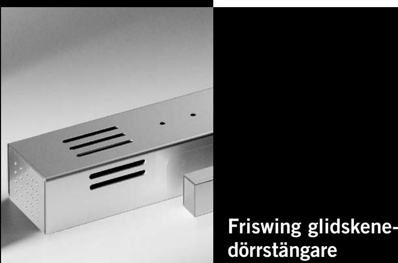

# **TS 99 DORMA**

# **i Contur Design**

**reddot design award winner 2005**

**För arkitekten**

**För användaren**

kontroll.

2 Kompakt konstruktion. 2 För brand- och rökavskiljande dörrar på servicehus, sjukhus och annat boende

2 Dörren frikopplad från dörrstängaren, inget öppningsmotstånd. 2 Enkel, manuell funktions-

### **För brand- och rökavskiljande dörrar.**

DORMA TS 99 FL är en dörrstängare med elektrohydraulisk uppställning med friswingfunktion, som används tillsammans med ett rökdetektorsystem (t ex DORMA RMZ). DORMA TS 99 FLR är en kombinerad dörrstängare med elektrohudraulisk uppställning med friswingfunktion och rökdetektor.

På bägge systemen kan dörrarna manövreras manuellt utan dörrstängarfunktion. Vid larm eller strömbortfall stängs dörren automatiskt via dörrstängaren.

| Fördelar – punkt för punkt |  |
|----------------------------|--|
|                            |  |

### **För fackhandeln**

- 2 Rationell lagerhantering med separata förpackningar för dörrstängare respektive glidskenor.
### **För installatören**

- 2 Snabbt och enkelt montage.
- 2 Tidsbesparande, enkel elanslutning.

### **F Lämplighetsbevis**

### **TS 99 FL**

DORMA TS 99 FL är godkänd av Deutsches Institut für Bautechnik, Berlin, tillsammans med DORMA RMZ och andra rökdetektorsystem.

### **TS 99 FLR**

DORMA TS 99 FLR är godkänd som uppställningsenhet av Deutsches Institut für Bautechnik, Berlin.

### **TS 99 FLR-K**

DORMA TS 99 FLR är godkänd som uppställningsenhet av Deutsches Institut für Bautechnik, Berlin.

| Tekniska data                                              |                                                        | TS 99 FL     | TS 99 FLR                        | TS 99 FLR-K      |
|------------------------------------------------------------|--------------------------------------------------------|-----------------|-------------------------------------|---------------------|
| Stängningskraft                                            | Storlek                                                | EN 4            | EN 4                                | EN 4                |
| Allmänna dörrar                                            | ≤ 1100 mm                                              | 2               | 2                                   | 2                   |
| Brand- och rök avskiljande dörrar enligt EN 1154     | ≤ 1100 mm                                              | 2               | 2                                   | 2                   |
| Samma utförande för både vänster- och högerdörrar       |                                                        | 2               | 2                                   | 2                   |
| Armsystem                                                  | Glidskena                                              | 2               | 2                                   | 2                   |
| Stängningshastigheten steglöst reglerbar via ventil     |                                                        | 2               | 2                                   | 2                   |
| Friswing-funktion                                          |                                                        | 2               | 2                                   | 2                   |
| Vikt i kg                                                  |                                                        | 3,5             | 4,9                                 | 5,1                 |
| Mått i mm (utan Glidskena)                              | Längd Djup Höjd                                  | 371 52 71 | 660 52 71                     | 371 52 71     |
| Dörrstängare certifierad enligt EN 1154                 |                                                        | 2               | 2                                   | 2                   |
| Uppställningsanordning certifierad enligt EN 1155       |                                                        | 2               | 2                                   | 2                   |
| -märkning för byggprodukter                                |                                                        | 2               | 2                                   | 2                   |
| Funktioner                                                 | Rökdetektor Utlösningsanordning Strömförsörjning | – 2 –     | 2 2 2                         | 2 2 2         |
| Rökavkänning                                               | Optisk                                                 | –               | 2                                   | 2                   |
| Anslutning av ytterligare detektorer                    | 2-trådsteknik                                          | – –          | 2 2                              | – 2              |
| Anslutningseffekt för ytterligare detektorer i W (max.) |                                                        | –               | 5,7                                 | 7,8                 |
| LED- meddelanden                                        | Alarm Drift Underhåll                            | – – –     | 2 2 –                         | 2 2 2         |
|                                                            | Nedsmutsning                                           | –               | –                                   | 2                   |
| Driftspänning                                              |                                                        | ± 15 %          | 24 V DC 230 V AC 230 V AC ± 10 % | ± 10 %              |
| Utgångsspänning                                            |                                                        | –               | 24 V DC 24 V DC                     |                     |
| Effektförbrukning i W                                      |                                                        | 2               | 14,6                                | 14,8                |
| Potentialfri växlande kontakt Max. belastning        |                                                        | –               | 24 V AC/DC 2A                 | 24 V AC/DC 2A |
| Återställning                                              | Automatisk omställbar till manuell reset         | – –          | 2 2                              | 2 –              |
| Funktionskontroll                                          |                                                        | –               | 2                                   | –                   |
| Anslutning för extern manuell utlösning                 |                                                        | –               | 2                                   | 2                   |
| Skyddsklass/skyddstyp                                      |                                                        | –               | IP 20                               | IP 20               |

### **DORMA TS 99 FL**

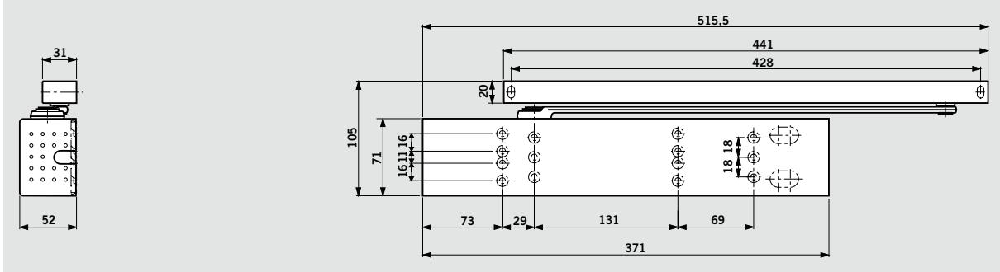

### **DORMA TS 99 FLR**

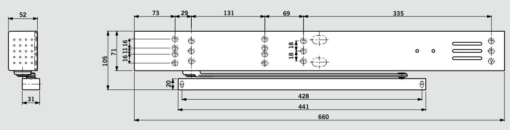

### **DORMA TS 99 FLR-K**

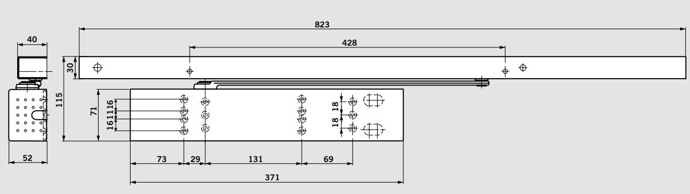

## **Friswingfunktionen**

När dörrbladet öppnas (ca 75°), hålls fjädern kvar i detta läge via den elektrohydrauliska uppställningsanordningen, dörren kan sedan stängas och öppnas fritt tack vare armens friswingfunktion. Vid brandlarm eller strömavbrott stängs dörren automa-

tiskt av dörrstängaren.

Användes för brand- och rökavskiljande dörrar i servicehus, sjukhus och annat boende.

- **1** Friswingområde
- **2** Helt kontrollerad stängning (strömlös)

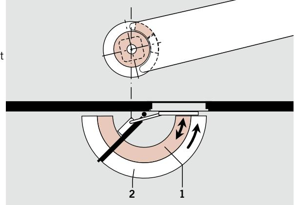

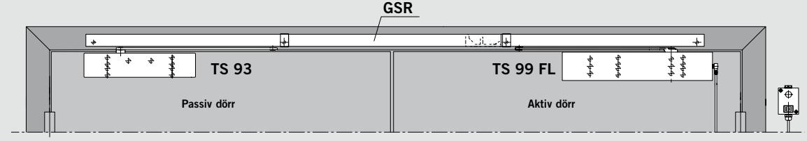

Dörrstängare **DORMA TS 99 FL för standardmontage** (dörrbladsmontering) Exempel: Vänsterdörr, högerdörr spegelvänd

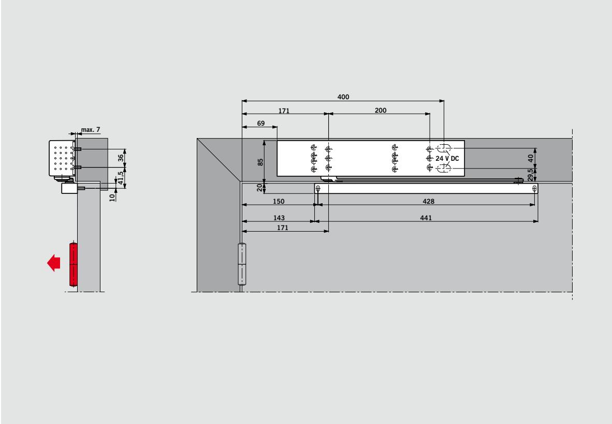

Dörrstängare **DORMA TS 99 FL karmmontage** Exempel: Vänsterdörr, högerdörr spegelvänd

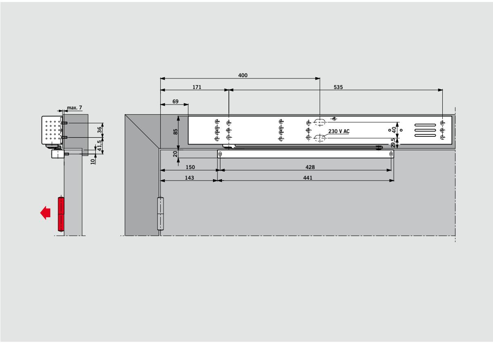

Dörrstängare **DORMA TS 99 FLR Karmmontage, (ej för dörrbladsmontage)** Exempel: Vänsterdörr, högerdörr spegelvänd

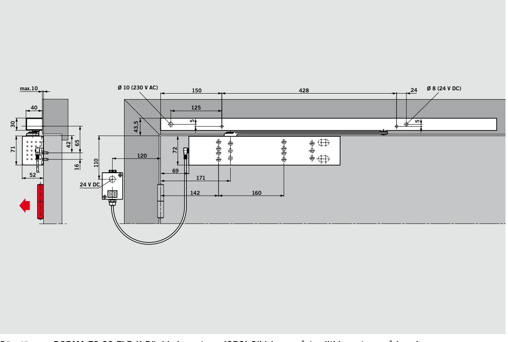

Dörrstängare **DORMA TS 99 FLR-K Dörrbladsmontage, (OBS! Glidskena måste alltid monteras på karm)** Exempel: Vänsterdörr, högerdörr spegelvänd

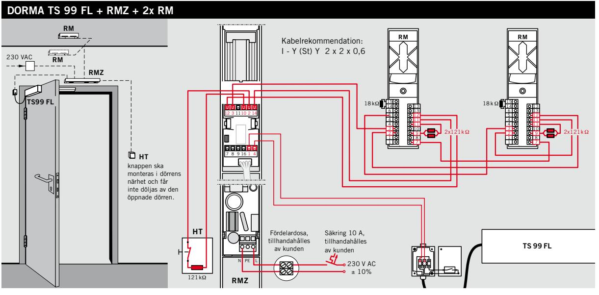

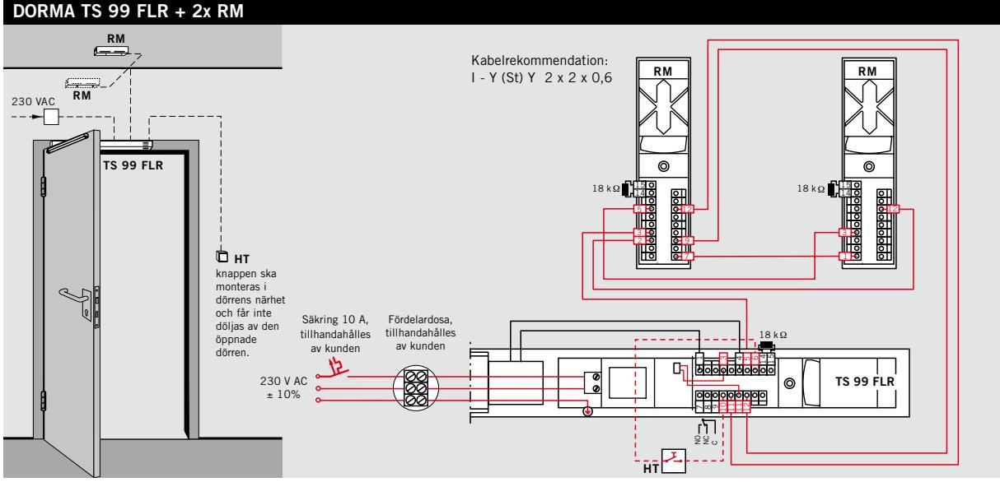

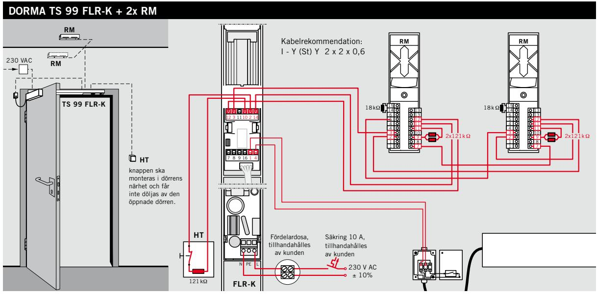

| 41 1 0 1 |
|-------------------|

| Leveransomfång och tillbehör                              |                              |                              |                               |                                            |          |                                    |  |  |
|-----------------------------------------------------------|------------------------------|------------------------------|-------------------------------|--------------------------------------------|----------|------------------------------------|--|--|
|                                                           | Glidskena med friswingarm | Glidskena med friswingarm |                               | RMZ Rökdetektor- Rökdetektor central | RM       | Manuell knapp HT-UP 35901531 |  |  |
|                                                           |                              |                              |                               | 648000xx                                   | 648200xx | HT-AP 35901532                  |  |  |
| Dörrstängare TS 99 FL Dörrbladsmontage Storlek EN 4 | yY 533001xx               |                              |                               | #                                          | #        | #                                  |  |  |
| Dörrstängare TS 99 FL Karmmontage Storlek EN 4      | yY 533101xx               |                              |                               | #                                          | #        | #                                  |  |  |
| Dörrstängare TS 99 FLR Storlek EN 4                    | yY 542701xx               |                              |                               |                                            | #        | #                                  |  |  |
| Dörrstängare TS 99 FLR-K Storlek EN 4                  |                              | yY 542801xx               |                               |                                            | #        | #                                  |  |  |
| yY = Dörrstängare med glidskena komplett               | Färg silver               | xx 01                     | vit (RAL 9016) specialfärg | 11 09                                   |          |                                    |  |  |

### **Beskrivningstext**

**DORMA TS 99 FL**

### **Användningsområde**

Dörrstängare för brand- och rökavskiljande dörrar Endast för montage på gångjärnssidan

### **Funktionsbeskrivning**

Dörrstängare för glidskenesystem med elektrohydraulisk uppställning och

#### **DORMA TS 99 FLR DORMA TS 99 FLR Användningsområde**

**Användningsområde** Dörrstängare för brand- och

Dörrstängare för brand- och rökavskiljande dörrar rökavskiljande dörrar

#### **Funktionsbeskrivning Funktionsbeskrivning**

Dörrstängare för glidskenesystem med elektrohydraulisk uppställning med magnetventil och friswingfunktion och Dörrstängare för glidskenesystem med elektrohydraulisk uppställning med magnetventil och friswingfunktion och

### **DORMA TS 99 FLR/K**

### **Användningsområde**

Dörrstängare för brand- och rökavskiljande dörrar

### **Funktionsbeskrivning**

Dörrstängare för glidskenesystem med elektrohydraulisk uppställning, friswingfunktion, strömförsörjning och rökdetektor

friswingfunktion Dörren kan manövreras manuellt

utan dörrstängarfunktion Vid larm eller strömbortfall stängs dörren automatiskt via dörrstängaren – Standardfärger: silver, vit – Specialfärger: NCS- eller RAL-skalor

#### rökdetektor utan dörrstängarfunktion

rökdetektor

Dörren kan manövreras manuellt utan dörrstängarfunktion Vid larm eller strömbortfall stängs dörren automatiskt via dörrstängaren – Standardfärg: silver Vid larm eller strömbortfall stängs dörren automatiskt via dörrstängaren – Standardfärg: silver – Specialfärger: NCS- eller RAL-skalor

Dörren kan manövreras manuellt

- Specialfärger: NCS- eller – Levereras med:
Dörren kan manövreras manuellt utan dörrstängarfunktion Vid larm eller strömbortfall stängs dörren automatiskt via dörrstängaren

- Standardfärger: silver, vit – Specialfärger: NCS- eller RAL-skalor
glidskena, glidkloss, täckkåpa, karmöverföring, gavlar och monteringsskruvar

– Levereras med: huvudarm,

#### RAL-skalor uppställningsanordning,

huvudarm, glidskena, glidkloss, elektromekanisk

– Levereras med: huvudarm, glidskena, glidkloss, elektromekanisk uppställningsanordning, rökdetektor, nätenhet, täckkåpa, gavlar och monteringsskruvar rökdetektor, nätenhet, täckkåpa, gavlar och monteringsskruvar

– Levereras med: huvudarm, glidskena, glidkloss, elektromekanisk uppställningsanordning, rökdetektor, nätenhet, täckkåpa, gavlar och monteringsskruvar

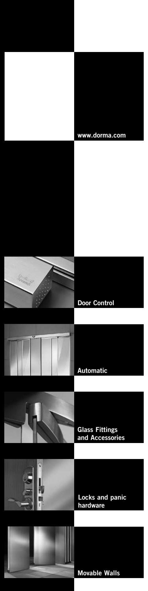

**ScanBalt** DORMA Sverige AB F O Petersons Gata 24 SE-421 31 Västra Frölunda Tel. +46 31 289520 Fax +46 31 281739