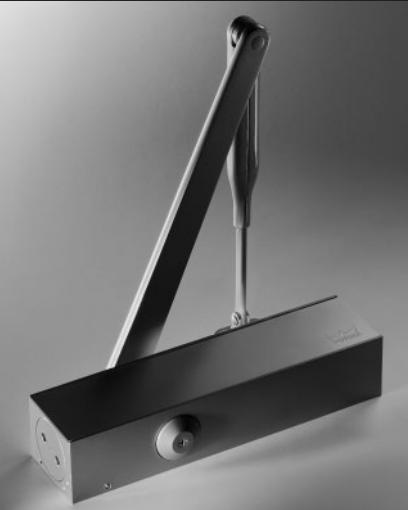

**Komfortdörrstängare**

# **DORMA TS83**

## **Komfortdörrstängare med "tänkande" öppningsbroms –**

**snabbt montage och enklare justering. En dörrstängare för nästan alla dörrstorlekar och tillämpningar.**

DORMA TS 83 har konstruerats med hjälp av många års erfarenhet och uppfyller alla krav på funktion och bekvämlighet. Den kan användas på praktiskt taget alla dörrstorlekar och -utföranden. TS 83 med optimerat korrosionsskydd (AC-utförande) är särskilt lämplig för ytterdörrar. Härtill kommer snabbt och lätt montage och inte minst en mycket hög kvalitet.

Certifierad enligt ISO 9001.

 Kompakt konstruktion och kraftig flatformarm. Stort användningsområde. Lämplig för branddörrar.

**... för planeraren**

**... för användaren** 2 Optimalt skydd för vägg och dörr genom "tänkande" öppningsbroms. 2 Konstant stängningshastighet som knappast påverkas av temperatur-

förändringar.

2 Lättpasserad tack vare hög mekanisk verkningsgrad.

| Data                               |                  |     | TS 83   |
|------------------------------------|------------------|-----|---------|
| Steglöst inställbar                |                  | EN  | EN      |
| stängningskraft                    | Storlek          | 3–6 | 7       |
| Vanliga dörrar1)                   | ≤ 1400 mm        | 2   | –       |
|                                    | ≤ 1600 mm        | –   | 2       |
| Ytterdörrar som öppnas utåt1)      | ≤ 1400 mm        | 2   | –       |
|                                    | ≤ 1600 mm        | –   | 2       |
| Enligt EN 1154                     | ≤ 1400 mm        | 2   | –       |
| för branddörrar1)                  | ≤ 1600 mm        | –   | 2       |
| Samma utförande för både           |                  |     |         |
| vänster- och högerdörrar           |                  | 2   | 2       |
| Armsystem                          | standard         | 2   | 2       |
|                                    | flatform         | 2   | 2       |
|                                    | glidskena        | –   | –       |
| Stängningskraft                    |                  |     |         |
| steglöst inställbar med ställskruv | 2                | –   |         |
| Stängningshastigheten kan          |                  |     |         |
| ställas in steglöst genom två      | 180° – 15°       | 2   | –       |
| inbördes oberoende ventiler        | 15° – 0°         | 2   | –       |
| Stängningshastighet                |                  |     |         |
| steglöst inställbar med ventil     |                  | –   | 2       |
| Steglöst inställbart               |                  |     |         |
| tillslag med arm                   |                  | 2   | 2       |
| Öppningsbroms                      | självjusterande  | 2   | 2       |
|                                    | bortkopplingsbar |     |         |
|                                    | med ventil       | 2   | 2       |
| Stängningsfördröjning              |                  |     |         |
| steglöst inställbar med ventil     |                  | "   | –       |
| Uppställning                       |                  | "   | "       |
| Vikt (kg)                          |                  | 1,7 | 3,3     |
| Mått (mm)                          | längd            |     | 245 293 |
|                                    | djup             | 46  | 47,5    |
|                                    | höjd             | 60  | 60      |
| Testad enligt DIN EN 1154          | 2                | 2   |         |
| -märkning för byggprodukter        | 2                | 2   |         |

2 ja – nej " tillval

1) För särskilt tunga dörrar och för dörrar som måste stänga mot starkt vindtryck rekommenderas nästa stängarstorlek eller att högre stängningskraft inställes.

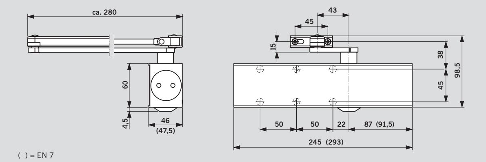

#### **Fördelar – punkt för punkt ...**

- **... för handelen**
- 2 Låga lagerkostnader och litet platsbehov.
- 2 Praktiska lösningar för specialdörrar tack vare rikligt tillbehörssortiment.
- **... för montören**
- 2 Enkelt och snabbt montage.
- 2 "Skräddarsydd" anpassning till olika dörrsituationer med få handgrepp.
- 2 Samma utförande för både vänster- och högerdörrar och för normalt och upp- och nedvänt montage.
- 2 Stängarstorlek EN 3-6 för nästan alla dörrar och behov.
- 2 Optimalt montage tack vare standardiserad hålgrupp.

#### **Standard- och tillvalsfunktioner**

## **Med "tänkande" öppningsbroms – utförande BC/ÖD**

Den integrerade öppningsbromsen är självjusterande, varvid bromskraften fr o m ca 70° öppningsvinkel alltid är direkt proportionell mot dörrens öppningshastighet. Det betyder att öppningsbromsen inte märks vid normal öppning. Vid högre öppningshastighet doseras bromskraften och om dörren öppnas våldsamt – vare sig det är avsiktligt, av misstag

eller en kraftig vindstöt – uppnår bromskraften sitt maximum och skyddar därmed både dörr och vägg mot skador.

**Öppningsbromsen kan stängas av om den ej önskas.**

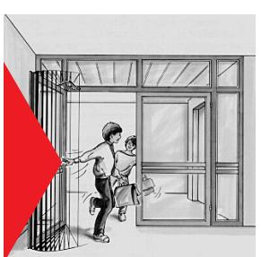

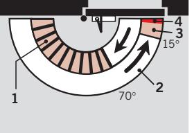

- **1** Självjusterande öppningsbroms
- **2** Steglös inställning av stängningshastigheten mellan 180° – 15°
- **3** Steglös inställning av stängningshastigheten mellan 15° – 0°
- **4** Justerbart tillslag (med arm)

## **Utförande med stängningsfördröjning – utförande BC/ÖD + DC/SV**

Med den inställbara stängningsfördröjningen bromsas stängningshastigheten så, att även handikappade, mödrar med barnvagnar och personer med större föremål lätt kan passera dörren.

Kan även användas för branddörrar.

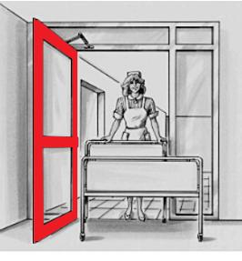

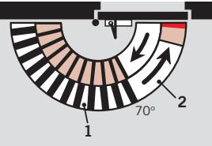

- **1** Inställbar stängningsfördröjning
- **2** Kontrollerad stängning med inställbar hastighet

## **Med uppställning – utförande med spärruppställningsarm**

Dörr med TS 83 och spärruppställningsarm kan ställas upp i valfri vinkel upp till max 150°.

Spärruppställningen kan lätt aktiveras eller avaktiveras genom ett tryck på knappen.

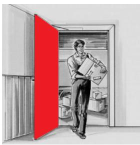

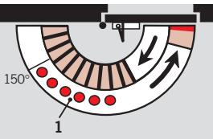

- **1** Uppställningsområde
**Spärruppställningsarmar får ej användas till branddörrar.**

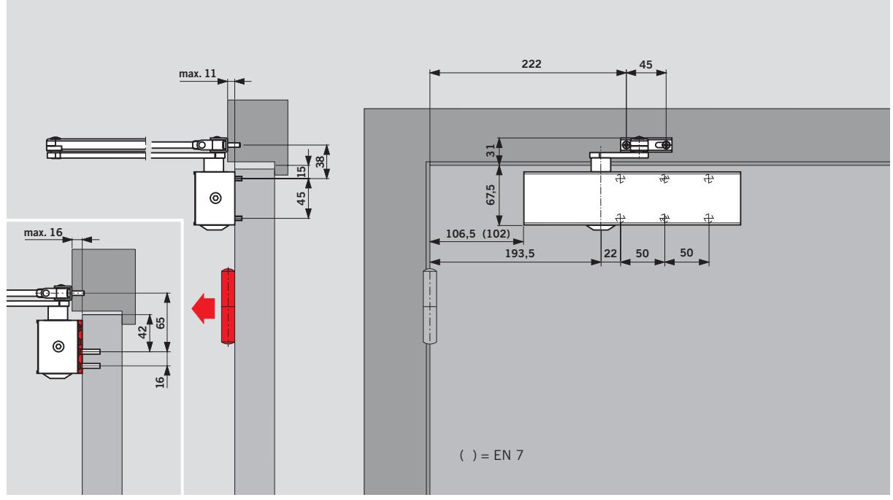

## **Montage på gångjärnssidan med uppställningsarm** Dörrbladsmontage (normalmontage)

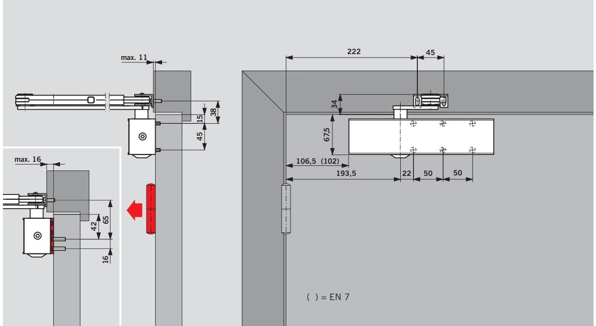

## **Montage på gångjärnssidan** Dörrmontage (normalmontage)

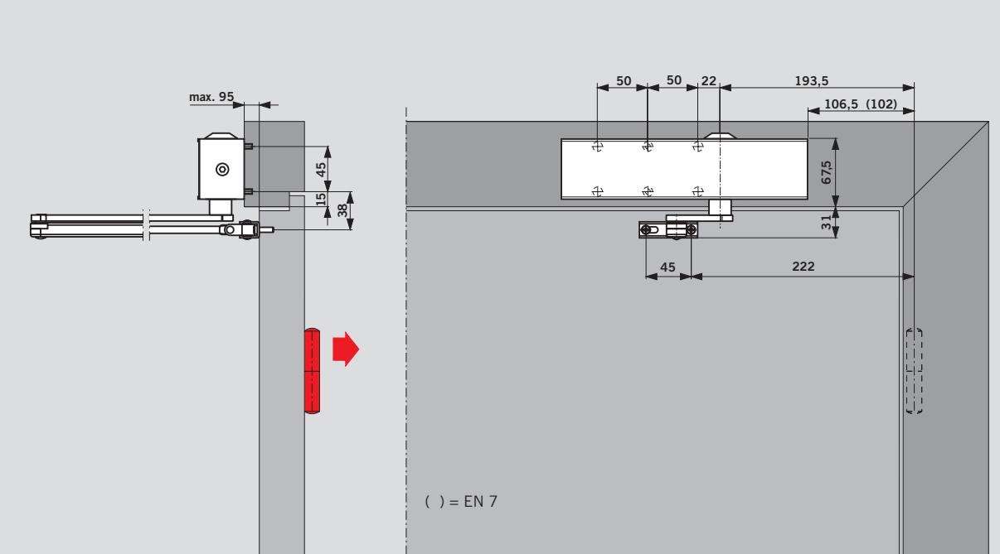

## **Montage på anslagssidan** Karmmontage (upp- och nedvänt montage)

**Vid karmmontage** reagerar

öppningsbromsen beroende på karmdjup och gångjärn först mellan 85° och 90°, medan stängningsfördröjningen upphör tidigare.

#### **Exempel:**

Vänsterhängda dörrar. Vändbar för högerhängda dörrar.

#### **Montageplatta**

Används vid branddörrar eller också som mellanplatta när ett direkt montage av stängaren inte är möjligt.

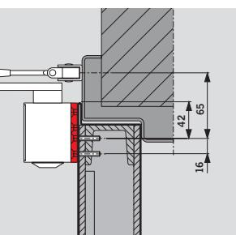

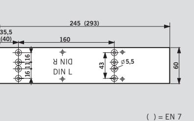

#### **Fästplatta**

För montering av stängararmen på speciellt smala karmöverstycken.

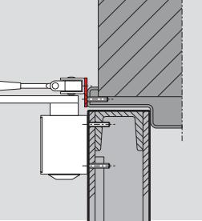

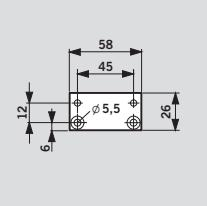

#### **Vinkelkonsol**

För upp- och nedvänt montage i karmöppningen vid utåtgående dörrar med djup karm.

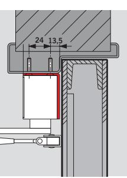

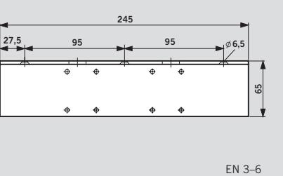

#### **Plankonsol**

Används som montageplatta när stängarhuset inte kan monteras direkt på karm eller dörr**.**

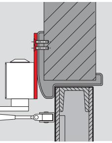

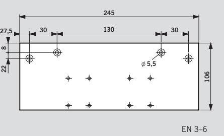

**Karmplatta för parallellarmsmontage**

För parallellarmsmontage på anslagssidan. (Montagemått, se monteringsanvisning).

**Ej godkänd för branddörrar.**

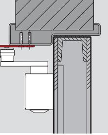

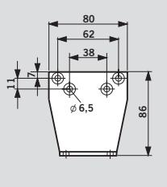

För ökning av avståndet mellan stängarhus och arm (16 mm).

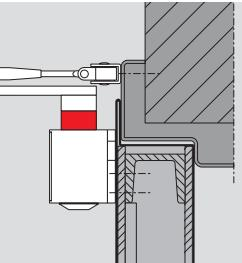

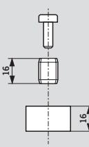

| Leveransomfång och tillbehör                                                                                                         |             |                                                                               |        |                                                                                                             |                              |                                                                                                           |                              |                      |                                                                   |                    |  |
|--------------------------------------------------------------------------------------------------------------------------------------|-------------|-------------------------------------------------------------------------------|--------|-------------------------------------------------------------------------------------------------------------|------------------------------|-----------------------------------------------------------------------------------------------------------|------------------------------|----------------------|-------------------------------------------------------------------|--------------------|--|
| Dörrstängare TS 83                                                                                                                |             | skyddad normalarm (AC)                                                  |        | Normalarm Korrosions- Flatformarm Spärruppställ- Montage- ningsarm med platta frånkopplings- knapp |                              | Fästplatta                                                                                                | Vinkel- konsol            | Plankonsol           | Karmplatta Axelförläng för parallell- ning armsmon- tage | förzinkad 16 mm |  |
|                                                                                                                                      | xX 220023xx |                                                                               |        | xX 830001xx xX 220030xx 830011xx                                                                            | EN 3 – 6 380001xx EN 7 | 830014xx                                                                                                  | EN 3 – 6 380003xx         | EN 3 – 6 380002xx | 280066xx                                                          | 83003705           |  |
| Storlek EN 3 – 6 x380101xx BC/ÖD                                                                                            | X x      |                                                                               | X x | X x                                                                                                      | #                            | #                                                                                                         | #                            | #                    | #                                                                 | #                  |  |
| Storlek EN 3 – 6 BC/ÖD+DC/SV x380201xx                                                                                      | X x      |                                                                               | X x | X x                                                                                                      | #                            | #                                                                                                         | #                            | #                    | #                                                                 | #                  |  |
| Storlek EN 3 – 6 BC/ÖD (AC)                                                                                                 |             | yY 38030301                                                                |        |                                                                                                             | #                            | #                                                                                                         | #                            | #                    | #                                                                 | #                  |  |
| Storlek EN 7 BC/ÖD x830501xx                                                                                                   | X x      |                                                                               | X x | X x                                                                                                      | #                            | #                                                                                                         |                              |                      | #                                                                 | #                  |  |
| Beställningsnummer: x= stängare separat X = armsystem separat yY = stängare med armsystem, komplett # tillbehör |             | färg* xx silver 01 vit (vgl. RAL 9016) 11 specialfärg 09 |        |                                                                                                             |                              | * Korrosionsskyddade stängare och armsystem endast i silver. Axelförlängning endast i silver. |                              |                      |                                                                   |                    |  |
| Beskrivningstext TS 83 EN 3 – 6                                                                                                      |             |                                                                               |        |                                                                                                             |                              |                                                                                                           |                              |                      |                                                                   |                    |  |
| Dörrstängare TS 83 med                                                                                                               |             | Utförande                                                                     |        |                                                                                                             |                              |                                                                                                           | Tillbehör __________________ | Färg                 |                                                                   |                    |  |

ställbar stängningskraft EN 3-6 enl. EN 1154, CE märkt, integrerad självjusterande öppningsbroms, justerbar stängnings-hastighet med två ventiler och justerbart tillslag.

### **Utförande**

- Y med extra inställbar
- stängningsfördröjning
- Y med normalarm Y med flatformarm
- Y korrosionsskyddad (AC)
- Y med spärruppställningsarm
- med frånkopplingsknapp

Y silver Y vit (vgl. RAL 9016) Y specialfärg (RAL _____)

**Fabrikat** DORMA TS 83 b TS83

#### **Beskrivningstext TS 83 EN 7**

- Dörrstängare TS 83 med stängningskraft EN 7enl. EN 1154, CE märkt, integrerad självjusterande öppningsbroms, justerbar stängnings-hastighet och justerbart tillslag.
#### **Utförande** Y med normalarm

- Y med flatformarm
- Y med spärruppställningsarm
	- med frånkopplingsknapp

## **Tillbehör** __________________ **Färg**

Y silver Y vit (vgl. RAL 9016) Y specialfärg (RAL _____)

**Fabrikat** DORMA TS 83 b TS83

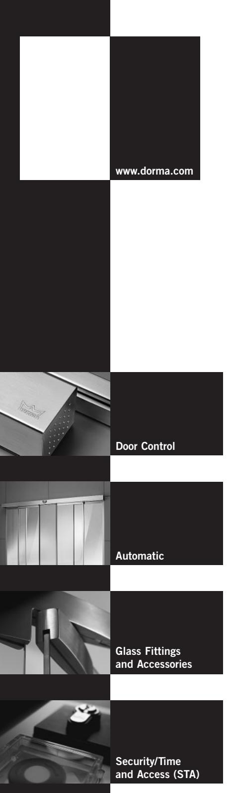

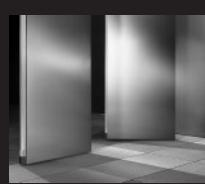

**Movable Walls**

## **Door Control Division worldwide**

#### **Central Europe**

DORMA GmbH + Co. KG Breckerfelder Str. 42–48 D-58256 Ennepetal Tel. +49 2333/793-0 Fax +49 2333/793-495

#### **Australia**

DORMA Door Controls Pty. Ltd. 52 Abbott Road Hallam/Victoria 3803 Australia Tel. +61 3/97 96 35 55 Fax +61 3/97 96 39 55

#### **China**

DORMA Door Controls (Suzhou) Co. Ltd. No. 9, Hong Feng Road Suzhou Singapore Industrial Park Suzhou, 215021 P. R. of China Tel. +86 512/67612481 Fax +86 512/67614582

DORMA Door Controls Pte. Ltd. Room 701, Technology Plaza 651 King's Road North Point Hong Kong Tel. +825/250 34632 Fax +825/288 75370

## **Emerging Markets**

DORMA GmbH + Co. KG Breckerfelder Str. 42–48 D-58256 Ennepetal Tel. +49 23 33/7 93-0 Fax +49 23 33/793-495

DORMA Door Controls (Pty.) Ltd. Kings Court, 4A Mineral Crescent ZA-2000 Crown/Gauteng South Africa Tel. +27 11/8 30 02 80 Fax +27 11/8 30 02 91

**Far East** DORMA Far East Pte. Ltd. No. 31 Gul Lane, Singapore 629425 Tel. +65 6268/7633 Fax +65 6265/7914

**France** DORMA France S.A.S. Europarc 42, rue Eugène Dupuis F-94046 Créteil Tel. +33 1/41 94 24 00 Fax +33 1/41 94 24 01

#### **Gulf**

DORMA Gulf Door Controls FZE Jebel Ali Free Zone, Roundabout 8, Unit VC 02 Dubai, United Arab Emirates Tel. +971 48/83 90 14 Fax +971 48/83 90 15

#### **North America**

DORMA Architectural Hardware DORMA Drive, Drawer AC Reamstown, PA 17567 Tel. +1-800-523-8483 Fax +1-800-274-9724

#### **Scanbalt**

DORMA Sverige AB F O Petersons Gata 24 S-421 31 Västra Frölunda Tel. +46 31/28 95 20 Fax +46 31/28 17 39

#### **South America**

DORMA Sistemas de Controles para Portas Ltda. Av. Piracema, 1400 Centro Empresarial Tambore CEP 06400 Barueri/ São Paulo, Brasil Tel. +55 11/41 91 32 44 Fax +55 11/41 91 21 93

#### **South-East Europe**

DORMA AUSTRIA GmbH Pebering Strass 22 A-5301 Eugendorf Tel. +43 62 25/2 84 88 Fax +43 62 25/2 84 91

#### **South Europe**

DORMA Italiana S.r.l. Via. A. Canova 44/46 I-20035 Lissone (MI) Tel. +39 039/24 40 31 Fax +39 039/24 40 33 10

DORMA Ibérica, S.A. Camino San Martin de la Vega, 4 E-28500 Arganda del Rey (Madrid) Tel. +34 91/8 75 78 50 Fax +34 91/8 75 78 81

#### **UK/Ireland**

DORMA UK Ltd. Door Controls Division Wilbury Way Hitchin Hertfordshire SG4 0AB Tel. +44 14 62/4776 00 Fax +44 14 62/4776 01

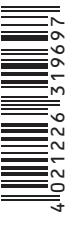